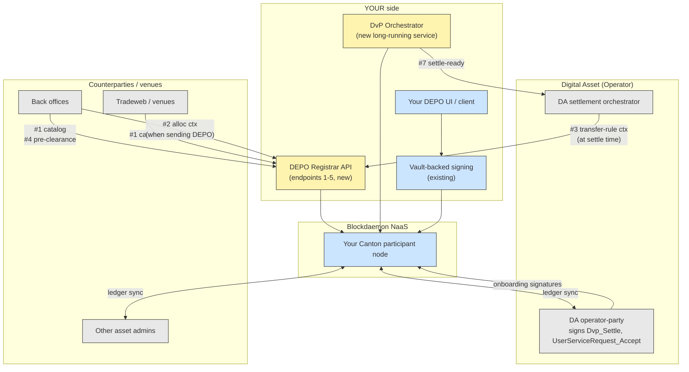
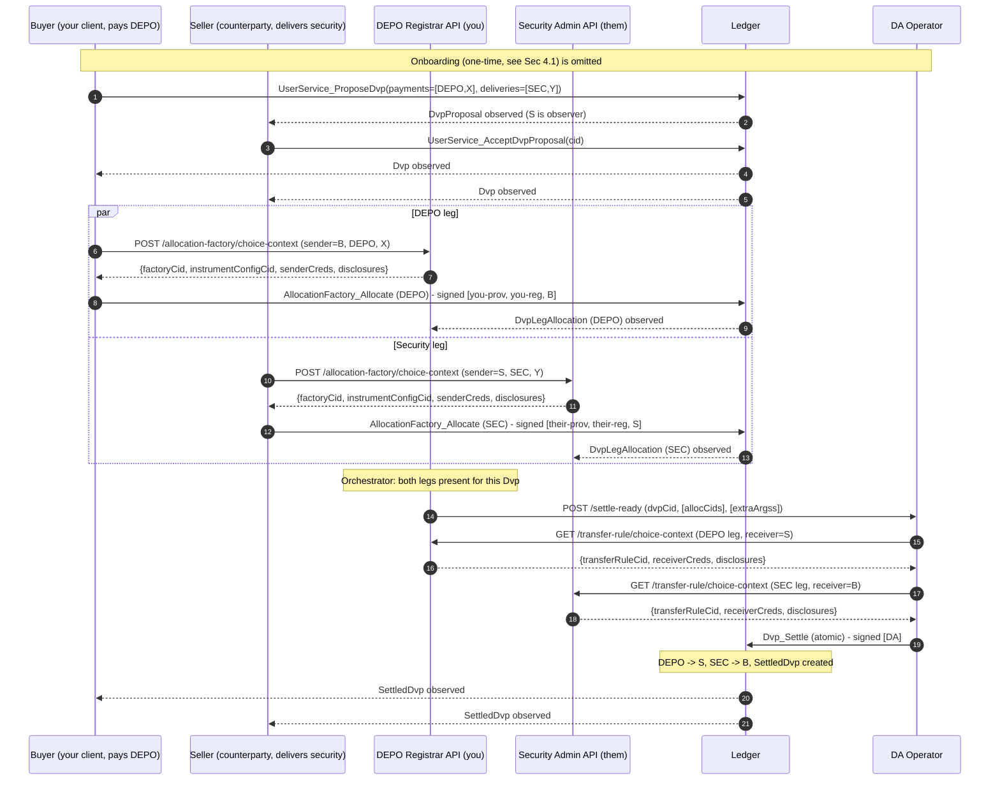
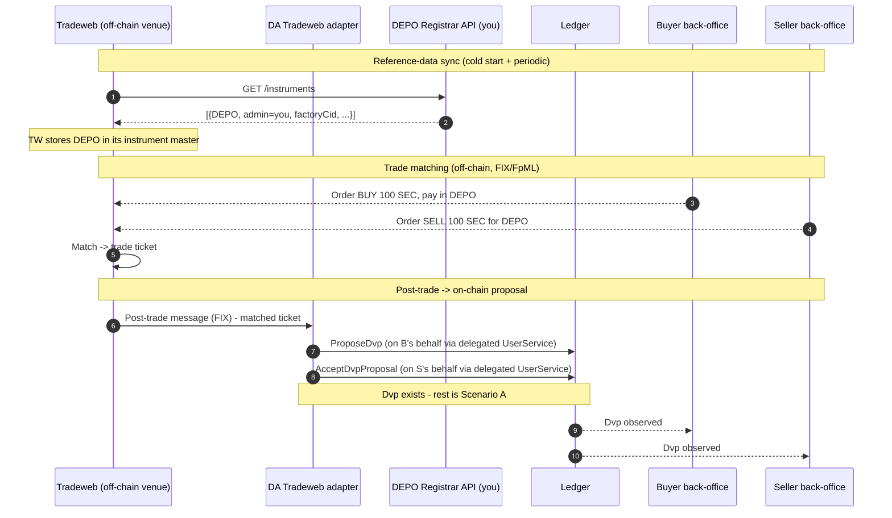
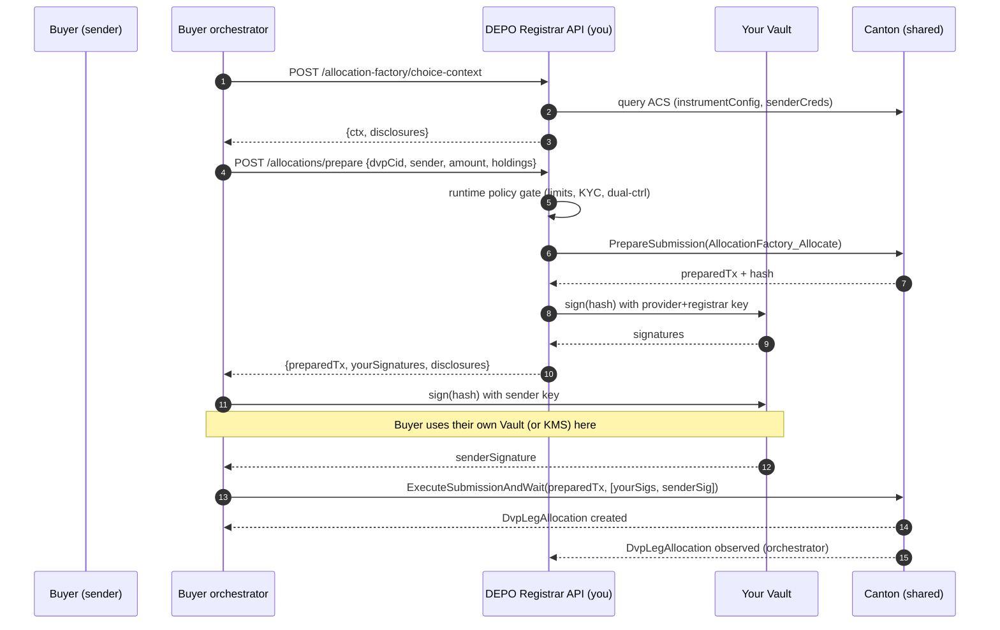
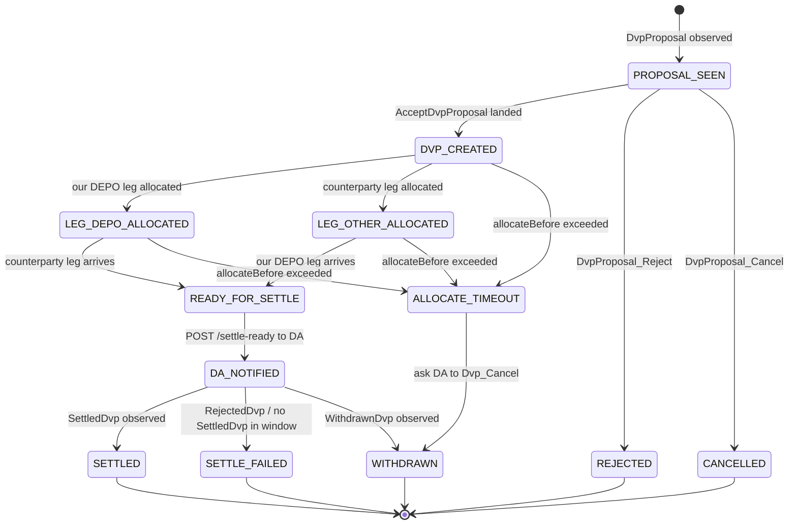

****# DEPO DvP — Build Design

> **Audience.** Two readers. Section 1 (Executive summary) is for leadership and product. Sections 2 onward are the implementation spec for engineering.
>
> **Context.** You operate the DEPO instrument as **provider + registrar** on Digital Asset's Registry Utility, hosted on a Blockdaemon NaaS participant node. The mint / transfer / burn lifecycle is in production. This document defines what you build to enable **Delivery vs Payment (DvP)** settlement, where DEPO appears as a leg of an atomic two-asset swap on DA's Settlement Utility.
>
> **Authority disclaimer.** "Operator" throughout this document means **Digital Asset (DA)** — the party that signs `OperatorConfiguration` on both the Registry and Settlement utilities and controls operator-only choices (`Dvp_Settle`, `UserServiceRequest_Accept`). "Provider" / "Registrar" / "DEPO admin" means **you**. These are never collapsed.
>
> **Source references.** All Daml citations point to canonical source under [extracted-dars/daml-source/](extracted-dars/daml-source/), extracted from `canton-network-utility-dars-0.12.0.tar.gz`.
>
> **Companion walkthrough.** For a step-by-step trace of a cross-entity DEPO transfer — every contract, every CID, every signature — see [DEPO_transfer_walkthrough.md](DEPO_transfer_walkthrough.md). Useful if the "who signs / who calls who" parts of this document feel abstract.

---
****
# Section 1 — Executive summary (for leadership)

## 1.1 What changes for DEPO

Today, DEPO is a **closed-loop** instrument: your client UI calls your service, your service constructs and signs ledger commands, your service holds all the off-chain context. Every participant in a DEPO transaction is somebody you onboarded.

DvP cracks the loop open. Counterparties **you have not onboarded** will name DEPO inside settlement instructions on a utility (DA's Settlement App) that you do not operate. The Daml engine still enforces every credential, every signature, every `holderRequirement` — none of your safety guarantees weaken. But the **integration surface** widens because external parties now construct ledger calls that depend on DEPO-side metadata only you can authoritatively publish.



Yellow = new build. Blue = existing. Grey = external (not yours).

## 1.2 The five integration points

| # | What | Hosted by | Called by | Status today |
|---|---|---|---|---|
| 1 | **Instrument catalog** | You | Counterparty back offices, trading venues (config time) | Internal-only today; needs external HTTPS |
| 2 | **Allocation choice-context** | You | The sender's participant, per DvP leg | Inline in your mint client today; needs external HTTPS |
| 3 | **Transfer-rule choice-context** | You | Same as #2 | Does not exist today |
| 4 | **Credential pre-clearance read** | You | Counterparty back offices, before accepting a proposal | Does not exist today |
| 5 | **Credential issuance request workflow** | You | Prospective DEPO holders | Manual / sales-driven today; DvP requires minutes-scale latency |
| 5b | **Allocation co-signing endpoint** | You | Sender's orchestrator, per allocation | Does not exist today. See §5.7 — required if you want runtime policy gates beyond credential lifecycle |

Plus **one new long-running service**:

| # | What | Hosted by | Purpose |
|---|---|---|---|
| 6 | **DvP orchestrator** | You | Ledger event listener that triggers your side's allocation and hands ready DvPs to DA |

And **one client-side integration** with DA (no service you build, just an HTTP client):

| # | What | Hosted by | Purpose |
|---|---|---|---|
| 7 | **DA settlement handoff** | DA | You POST when a DvP is fully allocated; DA submits `Dvp_Settle` |

## 1.3 Authority split (who signs what)

| Step in a DvP | Signed by | Why |
|---|---|---|
| `UserServiceRequest` on Settlement App | You (one-time onboarding) | `signatory user` ([User.daml:115](extracted-dars/daml-source/utility-settlement-app-v1-1.2.0/utility-settlement-app-v1-1.2.0-f169e1d84c476cb1321eff8ac2aebc9ce1c6b20790db5e788ee4ca87256a0639/Utility/Settlement/App/V1/Service/User.daml#L115)) |
| `UserServiceRequest_Accept` on Settlement App | **DA** | `controller operator` ([User.daml:125](extracted-dars/daml-source/utility-settlement-app-v1-1.2.0/utility-settlement-app-v1-1.2.0-f169e1d84c476cb1321eff8ac2aebc9ce1c6b20790db5e788ee4ca87256a0639/Utility/Settlement/App/V1/Service/User.daml#L125)) |
| `UserService_ProposeDvp` / `_AcceptDvpProposal` | Whichever counterparty acts | `controller user` ([User.daml:43,63](extracted-dars/daml-source/utility-settlement-app-v1-1.2.0/utility-settlement-app-v1-1.2.0-f169e1d84c476cb1321eff8ac2aebc9ce1c6b20790db5e788ee4ca87256a0639/Utility/Settlement/App/V1/Service/User.daml#L43)) |
| `AllocationFactory_Allocate` for DEPO leg | You-as-provider, you-as-registrar, sender | `controller provider, registrar, payload.allocation.transferLeg.sender` ([AllocationFactory.daml:70](extracted-dars/daml-source/utility-registry-app-v0-0.7.0/utility-registry-app-v0-0.7.0-7a75ef6e69f69395a4e60919e228528bb8f3881150ccfde3f31bcc73864b18ab/Utility/Registry/App/V0/Service/AllocationFactory.daml#L70)) |
| `AllocationFactory_Allocate` for counterparty asset leg | Their provider, their registrar, their sender | Same rule, different factory |
| `Dvp_Settle` | **DA** | `controller operator` ([Dvp.daml:81](extracted-dars/daml-source/utility-settlement-app-v1-1.2.0/utility-settlement-app-v1-1.2.0-f169e1d84c476cb1321eff8ac2aebc9ce1c6b20790db5e788ee4ca87256a0639/Utility/Settlement/App/V1/Model/Dvp.daml#L81)) |

**You never call `Dvp_Settle`.** Your orchestrator's job ends at "ready for settlement"; DA's orchestrator picks it up from there.

## 1.4 Effort sizing (rough)

| Workstream | Size | Dependency |
|---|---|---|
| Vetting `utility-settlement-app-v1-1.2.0` on your NaaS node | XS | Blockdaemon + DA approval flow |
| Settlement-App `UserService` onboarding for your party | XS | DA onboarding desk |
| Five HTTPS endpoints (#1-#5) | S each, can share a single service | Auth model + counterparty allowlist |
| DvP orchestrator (#6) | M | Idempotent event handling, retry policy |
| DA handoff client (#7) | XS | DA exposes the URL + auth scheme |
| Operational runbook updates | S | Includes JIT credential issuance policy |

Critical path is DA's onboarding throughput and Blockdaemon's vetting SLA, not your code.

## 1.5 Risks worth flagging

1. **Receiver-credential gate is enforced at settle time, not at proposal time.** A `Dvp` can be proposed and accepted while the receiver of the DEPO leg is uncredentialed; the failure surfaces inside `Dvp_Settle` and rolls back the entire atomic transaction. **Mitigation:** integration point #4 (pre-clearance) plus a credential-issuance SLA.
2. **`settleBefore` is not enforced on-chain.** `executeAllocation` allows late settlement ([Allocation.daml:66-69](extracted-dars/daml-source/utility-registry-v0-0.6.0/utility-registry-v0-0.6.0-a236e8e22a3b5f199e37d5554e82bafd2df688f901de02b00be3964bdfa8c1ab/Utility/Registry/V0/Holding/Allocation.daml#L66-L69)). DA's orchestrator (or your orchestrator before handoff) must enforce hard cutoffs in code.
3. **You depend on DA for two things every DvP:** Settlement-App `UserService` records (one-time per party) and `Dvp_Settle` (every settlement). DA outage = no DvPs. Build retry and queueing accordingly.
4. **Your DEPO endpoints become a public API contract.** Versioning, backwards compatibility, rate limits, and incident communication now matter externally.

---

# Section 2 — Glossary

| Term | Definition |
|---|---|
| **You / DEPO admin** | Your Canton party on the Blockdaemon NaaS node. Plays roles `provider` and `registrar` for DEPO on the Registry Utility. |
| **DA / Operator** | Digital Asset's Canton party. Signs `OperatorConfiguration` on every utility. The only signer of operator-only choices. |
| **Counterparty** | Any other Canton party that ends up in a DvP with one of your DEPO holders. Distinct entity, distinct participant node. |
| **DEPO holder** | A party with a `Credential` signed by you carrying claim `isHolderOf:DEPO`. Required to send OR receive DEPO. |
| **Registry Utility** | DA's utility hosting `InstrumentConfiguration`, `Holding`, `AllocationFactory`, `TransferRule`. Packages: `utility-registry-v0`, `utility-registry-app-v0`, `utility-registry-holding-v0`. |
| **Settlement Utility** | DA's utility hosting `Dvp`, `DvpProposal`, `SettledDvp`. Package: `utility-settlement-app-v1`. Has its own `UserService` and `OperatorConfiguration`. |
| **Credential App** | DA's utility hosting `Credential` issuance. Package: `utility-credential-app-v0`. Source of your existing `UserService`. |
| **DEPO Registrar API** | The HTTPS service you build to expose integration points #1-#5. Single deployable; multiple route prefixes. |
| **DvP Orchestrator** | The long-running service that watches the ledger and drives your side of any DvP touching DEPO. |
| **Choice context** | The `extraArgs.context` `TextMap` that Daml choices read via `getFromContextU`. Carries CIDs the engine needs but cannot derive (instrument config, credentials, transfer rule). |
| **Disclosed contract** | A `createdEventBlob` passed alongside a Ledger API submission to grant the submitter visibility into a contract they are not a stakeholder on. |

---

# Section 3 — Trade scenarios

For each scenario: who proposes, what each side allocates, what your DEPO endpoints serve, and what's distinctive.

## 3.1 Scenario A — Your client pays DEPO

Buyer (your DEPO holder) pays DEPO; seller delivers some security. Most common case.

```
Buyer (DEPO)          Counterparty / Seller        DA              You
─────────────────────────────────────────────────────────────────────
  ProposeDvp ──────────────────►
                       AcceptDvpProposal ──────►
                       (Dvp now exists, signed by DA+buyer+seller)

  Allocate(DEPO) ──► [calls #2/#3] ───────────────────► serves ctx
  └─ signed [you-as-provider, you-as-registrar, buyer]
                       Allocate(security) ──► [calls their #2/#3]
                       └─ signed [their provider/registrar, seller]

  (both DvpLegAllocations now exist)

  Orchestrator (#6) sees both ─────► POST /settle-ready (#7) ──►
                                                          Dvp_Settle
                                                          ──────────►
                                                          (atomic)
```

**Your endpoints called:** #1 at config time, #2 + #3 at allocation time.
**Your credentials issued:** `isHolderOf:DEPO` to the buyer (sender — at onboarding) AND to the seller (receiver — at onboarding or JIT, see #5).

## 3.2 Scenario B — Both counterparties are your DEPO clients

Two of your DEPO holders trade against each other. Cash leg is DEPO; delivery leg is some other asset (or, in unusual netting cases, also DEPO).

Mechanically identical to 3.1 from your perspective. Both buyer and seller have pre-existing `isHolderOf:DEPO` credentials. Your endpoints serve choice-context for the DEPO leg only.

**Distinguishing concern:** your orchestrator's idempotency keys must include `transferLegId` ([Dvp.daml:332](extracted-dars/daml-source/utility-settlement-app-v1-1.2.0/utility-settlement-app-v1-1.2.0-f169e1d84c476cb1321eff8ac2aebc9ce1c6b20790db5e788ee4ca87256a0639/Utility/Settlement/App/V1/Model/Dvp.daml#L332)). If both legs are DEPO, you'll receive two `AllocationFactory_AllocateInternal` events on the same `Dvp` and must not collapse them.

## 3.3 Scenario C — Your client receives DEPO from a new counterparty needing JIT credential

Seller (your client) delivers a security; buyer (NOT yet your client) pays DEPO. The buyer was credentialed on DEPO at some point (because they have DEPO Holdings — only you could have credentialed them), but the *seller's* receipt of DEPO requires the seller hold a `isHolderOf:DEPO` credential.

Hold on — the seller is your client (delivers a security), so they're probably **already a DEPO holder** by virtue of being your client. The genuinely awkward case is:

**3.3a — Counterparty pays DEPO, your client receives a security, your client is not yet a DEPO holder.** Receiver-side check inside `executeAllocation` runs against the **DEPO leg**: it needs the buyer (sender) to be DEPO-credentialed and the seller (receiver) to be DEPO-credentialed. If seller is your client buying a security with no prior DEPO history, **you must issue them the holder credential before `Dvp_Settle` fires.**

**3.3b — Brand-new counterparty wants to enter a DvP paying DEPO.** They are not yet your client at all. They need a DEPO Holding to pay with — which requires a prior mint or transfer-in — which requires an `isHolderOf:DEPO` credential. There is no shortcut: they go through your existing DEPO onboarding before the DvP can begin.

The relevant failure mode for both: **`Dvp` exists, both allocations succeed, `Dvp_Settle` rolls back** because the receiver-side credential check fires only at settlement time. See §1.5 risk 1 and integration point #4.

## 3.4a Scenario A diagram — your client pays DEPO



## 3.4b Scenario C-2 diagram — receiver not yet DEPO-credentialed

Top half: the failure if you skip pre-clearance. Bottom half: the JIT mitigation.

```mermaid
sequenceDiagram
    autonumber
    participant S as Seller (your client, will receive DEPO)
    participant B as Buyer (counterparty, will pay DEPO)
    participant YA as DEPO Registrar API (you)
    participant LDG as Ledger
    participant DA as DA Operator

    Note over S: Seller has no isHolderOf:DEPO credential

    rect rgba(255,0,0,0.06)
    Note over B,DA: WITHOUT pre-clearance (failure path)
    B->>LDG: ProposeDvp(payments=[DEPO,X], deliveries=[SEC,Y])
    S->>LDG: AcceptDvpProposal -> Dvp created
    B->>LDG: Allocate DEPO - succeeds (only sender check runs)
    S->>LDG: Allocate SEC - succeeds
    DA->>LDG: Dvp_Settle
    Note over LDG: validateTransfer: receiver-credentials = []
    Note over LDG: assertFulfillsAllRequirements FAILS for S on DEPO
    LDG-->>DA: ROLLBACK - entire Dvp_Settle reverts
    Note over B,DA: Both allocations stay locked; ops triage starts
    end

    rect rgba(0,180,0,0.06)
    Note over B,DA: WITH pre-clearance (fix)
    B->>YA: GET /credentials/{S}?dvpProposalCid=...
    YA-->>B: {credentialed: false, remediation: POST /credential-requests}
    B->>S: out-of-band - "you need DEPO credential before we propose"
    S->>YA: POST /credential-requests (KYC bundle)
    YA-->>S: {requestId, status: pending_kyc}
    Note over YA: KYC approved
    YA->>LDG: UserService_OfferFreeCredential(holder=S, isHolderOf:DEPO)
    S->>LDG: UserService_AcceptFreeCredentialOffer -> Credential
    YA->>S: webhook: status=accepted, credentialCid=...
    S->>YA: GET /credentials/{S}?... (re-check)
    YA-->>S: {credentialed: true}
    Note over B,DA: Now safe to run Scenario A flow
    end
```

## 3.4c Scenario D diagram — Tradeweb-as-proposer



## 3.5 Scenario D narrative — Tradeweb-as-proposer (Pattern A)

A trading venue (Tradeweb / Bloomberg / similar) matches a trade off-chain and emits a `DvpProposal` on behalf of both counterparties.

```
Tradeweb matches  ──► DA-or-Tradeweb-adapter ──► UserService_ProposeDvp
                                                  (on behalf of buyer)
                      ──► UserService_AcceptDvpProposal
                          (on behalf of seller)
                          (requires both UserServices to have delegated
                           submission authority to the venue, OR the venue
                           runs DA's "venue adapter" tenant integration)
[rest is Scenario A]
```

**Your impact:** zero on-chain. Off-chain, integration point #1 (instrument catalog) becomes the **definitive source** Tradeweb's reference data team syncs against. You may also be asked to provide a streaming update (webhook / Kafka topic) when DEPO metadata changes — versioned, with a deprecation window. Out of scope for v1 of this build but worth keeping the catalog schema versioned from day 1.

---

# Section 4 — On-chain choices you submit (the entire list)

Three Daml choices are net new to your codebase. Everything else is reused from the mint/transfer path.

## 4.1 Submit `UserServiceRequest` on Settlement App (one-time per party)

| | |
|---|---|
| Template | `utility-settlement-app-v1:Utility.Settlement.App.V1.Service.User:UserServiceRequest` |
| Signatory | `user` (you) ([User.daml:115](extracted-dars/daml-source/utility-settlement-app-v1-1.2.0/utility-settlement-app-v1-1.2.0-f169e1d84c476cb1321eff8ac2aebc9ce1c6b20790db5e788ee4ca87256a0639/Utility/Settlement/App/V1/Service/User.daml#L115)) |
| Observer | `operator` (DA) |
| Followed by | DA-side `UserService_OfferFreeCredential` per requirement in Settlement `OperatorConfiguration.userRequirements`, your `UserService_AcceptFreeCredentialOffer` per offer, then DA's `UserServiceRequest_Accept` |
| Reuses | Your existing credential-dance code; only the package id and template name change |

## 4.2 Exercise `UserService_ProposeDvp` (proposer-side)

| | |
|---|---|
| Template | Settlement-App `UserService` (created by 4.1) |
| Choice | `UserService_ProposeDvp` ([User.daml:34-54](extracted-dars/daml-source/utility-settlement-app-v1-1.2.0/utility-settlement-app-v1-1.2.0-f169e1d84c476cb1321eff8ac2aebc9ce1c6b20790db5e788ee4ca87256a0639/Utility/Settlement/App/V1/Service/User.daml#L34)) |
| Controller | `user` |
| Effect | Creates `DvpProposal` |
| `terms` payload | `Terms { id, deliveries: [InstrumentQuantity], payments: [InstrumentQuantity], createdAt, allocateBefore, settleBefore }` ([Dvp.daml:20-34](extracted-dars/daml-source/utility-settlement-app-v1-1.2.0/utility-settlement-app-v1-1.2.0-f169e1d84c476cb1321eff8ac2aebc9ce1c6b20790db5e788ee4ca87256a0639/Utility/Settlement/App/V1/Model/Dvp.daml#L20-L34)) |
| Disclosure needed | None — pure single-party submission |

## 4.3 Exercise `UserService_AcceptDvpProposal` (counterparty-side)

| | |
|---|---|
| Choice | `UserService_AcceptDvpProposal` ([User.daml:56-66](extracted-dars/daml-source/utility-settlement-app-v1-1.2.0/utility-settlement-app-v1-1.2.0-f169e1d84c476cb1321eff8ac2aebc9ce1c6b20790db5e788ee4ca87256a0639/Utility/Settlement/App/V1/Service/User.daml#L56)) |
| Controller | `user` (the counterparty) |
| Effect | Archives `DvpProposal`, creates `Dvp` |
| Disclosure needed | None |

## 4.4 Exercise `AllocationFactory_Allocate` (per leg, sender-side)

This is the only on-chain action with serious mechanical complexity. It maps directly to your existing `mint.js` pattern but adds the `TransferRule` to the disclosure list.

| | |
|---|---|
| Template | `utility-registry-app-v0:Utility.Registry.App.V0.Service.AllocationFactory:AllocationFactory` |
| Choice (interface) | `Splice.Api.Token.AllocationInstructionV1.AllocationFactory_Allocate` — dispatched to `AllocationFactory_AllocateInternal` ([AllocationFactory.daml:63-145](extracted-dars/daml-source/utility-registry-app-v0-0.7.0/utility-registry-app-v0-0.7.0-7a75ef6e69f69395a4e60919e228528bb8f3881150ccfde3f31bcc73864b18ab/Utility/Registry/App/V0/Service/AllocationFactory.daml#L63-L145)) |
| Controllers | `provider, registrar, payload.allocation.transferLeg.sender` ([line 70](extracted-dars/daml-source/utility-registry-app-v0-0.7.0/utility-registry-app-v0-0.7.0-7a75ef6e69f69395a4e60919e228528bb8f3881150ccfde3f31bcc73864b18ab/Utility/Registry/App/V0/Service/AllocationFactory.daml#L70)) |
| `extraArgs.context` keys read | `instrumentConfigurationContextKey`, `senderCredentialsContextKey` ([lines 86-90](extracted-dars/daml-source/utility-registry-app-v0-0.7.0/utility-registry-app-v0-0.7.0-7a75ef6e69f69395a4e60919e228528bb8f3881150ccfde3f31bcc73864b18ab/Utility/Registry/App/V0/Service/AllocationFactory.daml#L86-L90)) |
| `inputHoldingCids` | Sender's unlocked DEPO Holdings totalling ≥ `allocation.transferLeg.amount` |
| Effect | Locks input Holdings; creates `DvpLegAllocation` (impl. `Allocation` interface) signed by `provider, registrar, sender` ([Allocation.daml:29](extracted-dars/daml-source/utility-registry-v0-0.6.0/utility-registry-v0-0.6.0-a236e8e22a3b5f199e37d5554e82bafd2df688f901de02b00be3964bdfa8c1ab/Utility/Registry/V0/Holding/Allocation.daml#L29)); returns leftover change to sender |
| Disclosure needed | `InstrumentConfiguration`, each sender `Credential`, `AllocationFactory` (sender can't see them) |

> **Note on `TransferRule`.** Despite my earlier sloppy phrasing, `AllocationFactory_AllocateInternal` itself does **not** read the `TransferRule` from context — it only reads `instrumentConfiguration` and `senderCredentials`. The `TransferRule` is read later, inside **`TransferRule_ExecuteAllocation`** ([Transfer.daml:85-107](extracted-dars/daml-source/utility-registry-v0-0.6.0/utility-registry-v0-0.6.0-a236e8e22a3b5f199e37d5554e82bafd2df688f901de02b00be3964bdfa8c1ab/Utility/Registry/V0/Rule/Transfer.daml#L85-L107)), invoked by DA's `Dvp_Settle`. That means **DA's choice-context** (not yours) carries the `transferRuleCid` and the receiver-credential CIDs. Your endpoint #3 (`/transfer-rule/choice-context`) exists to **answer DA when DA asks** — DA's orchestrator queries DEPO admin (you) for the transfer rule CID for the DEPO leg before submitting `Dvp_Settle`. This is the cleanest split: sender-side context at allocate time = yours; receiver-side context at settle time = DA's, with help from you.

You **never** submit `Dvp_Settle` ([Dvp.daml:74-103](extracted-dars/daml-source/utility-settlement-app-v1-1.2.0/utility-settlement-app-v1-1.2.0-f169e1d84c476cb1321eff8ac2aebc9ce1c6b20790db5e788ee4ca87256a0639/Utility/Settlement/App/V1/Model/Dvp.daml#L74-L103)).

---

# Section 5 — The DEPO Registrar API (HTTPS service)

One deployable. Express / Fastify / whatever your existing service uses. Suggested base path: `/api/v1/depo/`. All endpoints authenticated (see §7).

## 5.1 Endpoint #1 — Instrument catalog

```
GET /api/v1/depo/instruments
GET /api/v1/depo/instruments/{instrumentId}

Response 200:
{
  "instruments": [{
    "instrumentId": { "admin": "<your-registrar-party>", "id": "DEPO" },
    "allocationFactoryCid": "<cid>",
    "instrumentConfigurationCid": "<cid>",
    "transferRuleCid": "<cid>",
    "holderRequirements": [
      { "issuer": "<your-registrar-party>", "requiredClaims": [["isHolderOf", "DEPO"]] }
    ],
    "issuerRequirements": [
      { "issuer": "<your-registrar-party>", "requiredClaims": [["isIssuerOf", "DEPO"]] }
    ],
    "description": "DEPO bank deposit token",
    "decimals": 10,
    "version": 1,
    "lastUpdated": "<RFC3339>"
  }]
}
```

**Caller:** Counterparty back-office reference-data sync; trading venues at config time.
**Cardinality:** Low frequency (config-time + scheduled refresh).
**Caching:** Cache-friendly. ETag on the full catalog. CIDs change rarely (only on instrument re-configuration).
**Versioning:** Include `version` integer on each instrument; bump on any breaking schema change; maintain prior versions for at least one quarter.

## 5.2 Endpoint #2 — Allocation choice-context

```
POST /api/v1/depo/allocation-factory/choice-context

Request:
{
  "instrumentId": "DEPO",
  "sender": "<party-id-paying-DEPO>",
  "amount": "1000000.0000000000",
  "transferLegId": "<from Dvp.terms>",
  "dvpCid": "<optional, for audit>"
}

Response 200:
{
  "allocationFactoryCid": "<cid>",
  "instrumentConfigurationCid": "<cid>",
  "context": {
    "values": {
      "utility.digitalasset.com/instrument-configuration": {
        "tag": "AV_ContractId", "value": "<cid>"
      },
      "utility.digitalasset.com/sender-credentials": {
        "tag": "AV_List", "value": [
          { "tag": "AV_ContractId", "value": "<credential-cid>" }
        ]
      }
    }
  },
  "disclosedContracts": [
    { "templateId": "...", "contractId": "<cid>", "createdEventBlob": "<base64>", "synchronizerId": "..." }
  ]
}

Response 422:
{ "error": "SENDER_NOT_CREDENTIALED", "details": "..." }
```

**Caller:** Sender's participant before submitting `AllocationFactory_Allocate`. The counterparty's orchestrator if THEIR client is sending DEPO; your orchestrator if YOUR client is sending.
**Cardinality:** One call per DEPO leg per DvP. Synchronous, latency-sensitive (sits in the settlement critical path).
**Implementation:** Run two ACS queries on your participant — `InstrumentConfiguration` by `defaultIdentifier.id`, and `Credential` filtered by `holder = sender AND claims contains (isHolderOf, DEPO)`. Build the disclosure blobs from the returned `createdEventBlob`s.

## 5.3 Endpoint #3 — Transfer-rule choice-context

```
POST /api/v1/depo/transfer-rule/choice-context

Request:
{
  "instrumentId": "DEPO",
  "sender": "<party>",
  "receiver": "<party>",
  "amount": "1000000.0000000000",
  "transferLegId": "<from Dvp.terms>",
  "dvpCid": "<optional>"
}

Response 200:
{
  "transferRuleCid": "<cid>",
  "context": {
    "values": {
      "utility.digitalasset.com/instrument-configuration": { ... },
      "utility.digitalasset.com/sender-credentials": { ... },
      "utility.digitalasset.com/receiver-credentials": {
        "tag": "AV_List", "value": [
          { "tag": "AV_ContractId", "value": "<receiver-credential-cid>" }
        ]
      }
    }
  },
  "disclosedContracts": [...]
}

Response 422:
{ "error": "RECEIVER_NOT_CREDENTIALED", "details": "...", "remediation": "POST /api/v1/depo/credential-requests" }
```

**Caller:** DA's settlement orchestrator before submitting `Dvp_Settle`. (Confirm with DA's onboarding desk that they consume this shape; if their orchestrator pulls choice-context differently, conform to their schema.)
**Cardinality:** One call per DEPO leg per DvP, at settle time.

## 5.4 Endpoint #4 — Credential pre-clearance

```
GET /api/v1/depo/credentials/{partyId}

Response 200 (credentialed):
{
  "partyId": "<party>",
  "credentialed": true,
  "credentialCid": "<cid>",
  "claims": [{ "property": "isHolderOf", "value": "DEPO" }],
  "expiresAt": "<RFC3339-or-null>"
}

Response 200 (not credentialed):
{
  "partyId": "<party>",
  "credentialed": false,
  "remediation": "POST /api/v1/depo/credential-requests"
}
```

**Caller:** Counterparty back office BEFORE submitting `UserService_AcceptDvpProposal`, to fail fast if the receiver is not credentialed. Also called by trading venues during pre-trade eligibility checks.
**Cardinality:** High — one call per side per proposed DvP at minimum.
**Implementation:** Single ACS query — `Credential` filtered by `holder = partyId AND issuer = <your-party> AND claims contains (isHolderOf, DEPO)`. Return the most recent matching credential.
**Privacy:** Returning "true / false" for an arbitrary party id leaks holdership data. Mitigation: scope this endpoint to authenticated counterparties who have a legitimate business relationship with the queried party (proven by an active or proposed DvP CID). Reject queries without a `dvpCid` or `proposalCid` query parameter in production.

## 5.5 Endpoint #5 — Credential issuance request workflow

This is a **state machine**, not a single endpoint. Multiple steps because issuance is on-chain (asynchronous) and KYC is required.

```
POST /api/v1/depo/credential-requests
Request: { partyId, kycBundle, requestedClaims: [["isHolderOf", "DEPO"]], requesterContact }
Response 201: { requestId, status: "pending_kyc" }

GET /api/v1/depo/credential-requests/{requestId}
Response: { requestId, status: "pending_kyc"|"approved"|"offered"|"accepted"|"rejected", ... }

[internal: KYC review process; on approval, your service calls
 UserService_OfferFreeCredential on the credential-app UserService;
 returns the CredentialOffer CID]

WEBHOOK to requesterContact when status changes
```

**Cardinality:** Low frequency (per new counterparty onboarding), but SLA-sensitive — for live DvPs, may need to complete inside `allocateBefore`. Policy decision: do you offer JIT (minutes) onboarding for pre-KYC-cleared institutions? Likely yes for trading venues' members; probably not for cold-start counterparties.
**Implementation:** Your existing onboarding pipeline, fronted by an API. Beyond the scope of "DvP code" but in scope for "DEPO is a settlement asset."

## 5.7 Endpoint #5b — Allocation co-signing (the live-signing question)

### Why this exists

`AllocationFactory_AllocateInternal` requires three controllers: `provider, registrar, payload.allocation.transferLeg.sender` ([AllocationFactory.daml:70](extracted-dars/daml-source/utility-registry-app-v0-0.7.0/utility-registry-app-v0-0.7.0-7a75ef6e69f69395a4e60919e228528bb8f3881150ccfde3f31bcc73864b18ab/Utility/Registry/App/V0/Service/AllocationFactory.daml#L70)). Two of those (`provider, registrar`) are you; the third is the sender. Two architectural patterns can satisfy the multi-controller requirement.

### Pattern X — Credential-delegated authority (no live co-sign)

The sender's `isHolderOf:DEPO` `Credential` is signed by `issuer, holder` ([Credential.daml:69](extracted-dars/daml-source/utility-credential-v0-0.1.0/utility-credential-v0-0.1.0-5a29ead611a0abd5f5b3fc3caf7d0f67c0ff802032ab6d392824aa9060e56d70/Utility/Credential/V0/Credential.daml#L69)). When the allocation choice runs, it exercises `Credential_Get with actor = registrar` ([AllocationFactory.daml:100](extracted-dars/daml-source/utility-registry-app-v0-0.7.0/utility-registry-app-v0-0.7.0-7a75ef6e69f69395a4e60919e228528bb8f3881150ccfde3f31bcc73864b18ab/Utility/Registry/App/V0/Service/AllocationFactory.daml#L100)) inside the same transaction. The credential's signatory set contributes your registrar (and, when your deployment collapses roles, also provider) authority to the enclosing transaction — automatically, without any live signing by your service.

**Result:** the sender's participant alone submits the transaction. Your Vault is never touched per-allocation. Throughput is bounded only by the counterparty side.

**Implication:** every party with a valid DEPO holder credential is implicitly authorized to allocate up to their balance. Revoking that credential is the only way to revoke allocation rights. There's no per-allocation runtime gate.

### Pattern Z — Interactive submission with live co-sign

Your service exposes an endpoint the sender's orchestrator calls per allocation:

```
POST /api/v1/depo/allocations/prepare
Auth: mTLS (sender's party in cert SAN)
Request: {
  dvpCid,
  instrumentId: "DEPO",
  sender,
  receiver,
  amount,
  transferLegId,
  inputHoldingCids: ["<cid>", ...],
  requestedAt: "<RFC3339>"
}

Response 200: {
  preparedTransactionHash,
  preparedTransactionPayload: "<base64>",
  providerSignature: "<base64>",
  registrarSignature: "<base64>",
  disclosedContracts: [...],
  expiresAt: "<RFC3339>"   // prepared txs have a TTL
}

Response 4xx: { error, code, details }
```

Your service:

1. Validates the request against runtime policy (limits, sanctions freshness, time-of-day windows, dual-control over threshold, etc).
2. Builds the `AllocationFactory_Allocate` payload.
3. Calls Canton's `PrepareSubmission` on your participant — returns the prepared transaction.
4. Pulls your Vault key(s) and signs the prepared transaction's hash.
5. Returns the prepared transaction + your partial signature to the caller.

The sender then:

6. Has their own participant sign the same prepared transaction with their party key (their existing Vault flow).
7. Submits `ExecuteSubmissionAndWait` carrying both signature blobs.

The committed transaction has all three controller signatures present in one atomic submission.

**Result:** every allocation goes through your service. Your Vault is in the critical path. You get arbitrary runtime control.

### Choosing between X and Z

| Question | Lean X | Lean Z |
|---|---|---|
| Do you need per-allocation limits or velocity controls? | No | Yes |
| Do you need sanctions/KYC freshness re-checks at allocation time? | No | Yes |
| Do you need dual-control above a dollar threshold? | No | Yes |
| Is settlement latency a hard constraint (sub-second)? | Yes | Maybe — Vault adds latency |
| Is your Vault sized for peak DvP volume? | Doesn't matter | Yes (sizing assumption) |
| Are credentials granular enough to model your authorization policy? | Yes | No |

For a bank running DEPO as a regulated settlement asset, the answer is almost always **Pattern Z**. Credential lifecycle is monthly-quarterly; trading-day controls are sub-daily. They're different time-scales.

Pattern X is a valid v1 choice if your initial counterparties are a small whitelist of institutional clients you trust completely and you can defer policy-engine work. It is **not** a valid forever-choice for a bank.

### What this changes elsewhere in the design

- §1.2 integration-point table: add row #5b (done).
- §6.2 orchestrator state machine: an `ALLOCATE_PREP_REQUESTED` substate may sit between `DVP_CREATED` and `LEG_DEPO_ALLOCATED` for the counterparty's side. This is implementation detail; the diagram remains valid.
- §7.1 auth matrix: #5b is mTLS-authenticated with the sender's party in the certificate SAN, because the request's `sender` field must match the authenticated identity (no spoofing).
- §7.2 rate limiting: #5b shares the 600 req/min budget with #2 since they're paired calls in the critical path.
- §1.4 effort sizing: add **S–M** for the prepare-and-sign endpoint. Reuses your existing interactive-submission code from mint, but multi-signer flow is genuinely new.
- §9 open questions for DA: confirm whether DA's reference clients assume Pattern X or Z. If DA's tooling assumes X, your Pattern Z service interposes itself transparently.

### Mermaid — Pattern Z in detail



## 5.6 Cross-cutting concerns

| Concern | Approach |
|---|---|
| **Auth** | mTLS for trading venues / DA; OAuth2 client-credentials with per-tenant scopes for counterparty back offices. Per-tenant rate limits. |
| **Audit log** | Every endpoint logs `{caller, party-queried, dvpCid?, response}` to your existing audit sink. Retention per regulatory requirement. |
| **Idempotency** | #1 is naturally idempotent (read-only). #2/#3 are idempotent if the underlying ACS state is unchanged; include a `responseHash` in responses so callers can detect stale CIDs from before a contract was archived. |
| **Schema versioning** | All endpoints under `/v1/`; breaking changes go to `/v2/` with `/v1/` maintained for the deprecation window (suggest 6 months). |
| **OpenAPI spec** | Publish at `/api/v1/openapi.json` and as a static artifact. This is what counterparties build clients from. |

---

# Section 6 — The DvP orchestrator (long-running service)

A single Node service (extending your existing client codebase) that watches the JSON Ledger API and drives your side of every DEPO-touching DvP.

## 6.1 Roles it monitors

It subscribes to ledger updates with three logical filters (one connection can carry all three via the JSON Ledger API's `/v2/updates/flats` stream):

| Role | What it watches for | Action |
|---|---|---|
| **DEPO admin** | New `DvpLegAllocation` against your `AllocationFactory` | Log, surface to ops. Eventually trigger DA-handoff (§6.3) once the *partner* leg lands too. |
| **DEPO admin** | New `DvpProposal` / `Dvp` whose `terms.deliveries` or `terms.payments` names DEPO | Track lifecycle for ops dashboards. Optionally JIT-issue receiver credentials per §3.3a / endpoint #5. |
| **Party (your provider party)** | New `DvpProposal` where you are `counterparty` | Trigger your accept/reject policy (if your own party is ever a direct DvP participant — rare; included for completeness). |

## 6.2 State machine per DvP



Persistence: track each Dvp's state by `dvpCid` in your service's database. Idempotency keys are `(dvpCid, transferLegId)` for allocation events and `dvpCid` for terminal states.

## 6.3 DA settlement handoff (integration point #7)

When the orchestrator transitions to `READY_FOR_SETTLE`, it must notify DA. **The wire format is whatever DA exposes — confirm before building.** Likely shapes:

```
POST <DA-URL>/api/v1/settle-ready
Auth: <as agreed with DA>
Body: {
  dvpCid,
  allocationCids: [ "<DEPO-leg>", "<OTHER-leg>" ],
  extraArgss: [
    { context: { values: { /* DEPO receiver-credential ctx */ } } },
    { context: { values: { /* OTHER receiver-credential ctx */ } } }
  ]
}
```

The `extraArgss` are what `Dvp_Settle` passes through to each leg's `Allocation_ExecuteTransfer`. The DEPO-leg `extraArgs` come from your endpoint #3; the other-leg `extraArgs` come from the partner asset's admin's equivalent endpoint.

**Open question for DA:** does DA's orchestrator gather both legs' contexts itself (querying each admin's #3 endpoint), or does the notifier (you) pre-collect them and pass them in? Determine before coding §6.3.

## 6.4 Failure handling

| Failure | Detection | Response |
|---|---|---|
| `Dvp_Settle` rolls back | `RejectedDvp` / no `SettledDvp` within timeout | Log, alert ops, mark Dvp `SETTLE_FAILED`. Investigate via update tree for the rollback reason. Common cause: receiver-credential gate. |
| Allocation reverts | Allocation event never lands within `allocateBefore` | Mark `ALLOCATE_FAILED`. Surface to counterparty's contact via your ops channel. |
| `allocateBefore` passes with one leg missing | Time-based check in orchestrator | Trigger `Dvp_Cancel` request to DA (operator-only choice). |
| `settleBefore` passes (not on-chain enforced) | Time-based check | Same as above. |
| DA unreachable | HTTP error / timeout from §6.3 | Exponential backoff + retry. Persist `READY_FOR_SETTLE` state across restarts. |

---

# Section 7 — Security and operations

## 7.1 Authentication matrix

| Endpoint | Caller | Auth |
|---|---|---|
| #1 Instrument catalog | Counterparties, venues | mTLS or OAuth2 |
| #2 Allocation choice-context | Sender's participant / orchestrator | mTLS (sender's party is in cert SAN) |
| #3 Transfer-rule choice-context | DA's orchestrator | mTLS to DA |
| #4 Credential pre-clearance | Counterparties, venues | mTLS or OAuth2, **plus** valid `dvpCid`/`proposalCid` reference to prevent fishing |
| #5 Credential issuance request | Onboarding portal / venues | OAuth2 (per-tenant client credentials) |
| Outbound to DA (#7) | You → DA | DA-prescribed |

## 7.2 Per-tenant rate limiting

Suggested defaults:
- #1: 60 req/min/tenant
- #2: 600 req/min/tenant (settlement critical path)
- #3: 600 req/min for DA (single trusted caller)
- #4: 1000 req/min/tenant
- #5: 30 req/min/tenant

## 7.3 Observability

Each endpoint emits structured logs and metrics tagged with `{tenant, party, instrumentId, dvpCid?}`:
- p50/p95/p99 latency
- error rate by error code
- `RECEIVER_NOT_CREDENTIALED` / `SENDER_NOT_CREDENTIALED` counters (settlement-failure leading indicators)
- DvP state-transition histogram (orchestrator)

Alerts:
- Endpoint #2/#3 p95 > 500 ms (settlement critical path)
- Orchestrator stuck in `READY_FOR_SETTLE` > 5 min (DA outage suspected)
- `RECEIVER_NOT_CREDENTIALED` rate spike (onboarding pipeline backlog)

## 7.4 Deployment topology

Recommended layout for v1:

```
┌────────────────────────────────────────────────────────────┐
│                Your existing infra                          │
│                                                             │
│  ┌──────────────────────┐    ┌──────────────────────────┐  │
│  │ DEPO Registrar API   │    │  DvP Orchestrator        │  │
│  │ (HTTPS, stateless)   │    │  (long-running, stateful)│  │
│  └──────────────┬───────┘    └────────────┬─────────────┘  │
│                 │ ACS queries              │ updates stream │
│                 └────────────┬─────────────┘                │
│                              ▼                              │
│              ┌────────────────────────────┐                 │
│              │ JSON Ledger API client     │                 │
│              │ (Vault-backed signing)     │                 │
│              └────────────┬───────────────┘                 │
└─────────────────────────────┼──────────────────────────────┘
                              │ gRPC / HTTPS
                              ▼
                ┌─────────────────────────┐
                │ Blockdaemon NaaS        │
                │ Canton participant      │
                └─────────────────────────┘
```

Stateless API service can scale horizontally; orchestrator is singleton (or leader-elected) to avoid duplicate DA notifications.

---

# Section 8 — Build plan and milestones

| Milestone | Deliverables | Exit criteria |
|---|---|---|
| **M0 — Foundations** | Settlement App DAR vetted on NaaS; Settlement `UserService` for your party | `UserService` CID retrievable from your participant; choices callable in sandbox |
| **M1 — Catalog** | Endpoint #1 live with OpenAPI spec | Counterparty can fetch DEPO metadata and store CIDs |
| **M2 — Choice context** | Endpoints #2 + #3 live; happy-path allocation works in sandbox | Test DvP allocates against your factory with served context, no inline disclosure |
| **M3 — Credentials API** | Endpoint #4 live; endpoint #5 wired to existing KYC process | Counterparty can pre-check credentials; new counterparty can request issuance through API |
| **M4 — Orchestrator** | DvP Orchestrator service tracking state for sandbox DvPs | Full lifecycle (propose → settle) reaches `SETTLED` in sandbox without manual steps |
| **M5 — DA handoff** | Integration point #7 wired to DA's settlement endpoint | First sandbox DvP settled via DA, end-to-end |
| **M6 — Hardening** | Auth, rate limiting, monitoring, runbooks | Production readiness review passed |
| **M7 — Pilot** | First production DvP with one counterparty | One successful real settlement |

Dependencies in red on critical path: M0 needs DA + Blockdaemon coordination; M5 needs DA to specify their settlement handoff API.

---

# Section 9 — Open questions for DA / Blockdaemon

Before M0 starts:

1. **DA — Settlement App vetting:** What's your process to authorize vetting of `utility-settlement-app-v1-1.2.0` on a tenant participant? Lead time?
2. **DA — Settlement `OperatorConfiguration`:** What's the exact `userRequirements` list on your current Settlement Utility config? Which credential-issuer party offers them?
3. **DA — Settle-ready notification:** What URL / auth / payload shape does your settlement orchestrator expect from tenants when a DvP is fully allocated?
4. **DA — Receiver-credential context:** Does your orchestrator pull receiver-credential context from each leg's admin (calling our #3), or do you expect the notifier to pre-collect and pass both legs' contexts in?
5. **DA — Tradeweb adapter:** Do you operate a "venue adapter" that emits `DvpProposal`s on behalf of trading venues? If so, what reference-data schema does it expect from instrument admins?
6. **Blockdaemon — Vetting SLA:** What's the lead time and change-window for vetting a new DAR on our participant?
7. **Blockdaemon — Multi-package operations:** Can you list all currently vetted package ids on our participant so we can confirm splice-token-standard packages are present before we file the Settlement App request?

---

# Section 10 — Source references

- Registry App: [extracted-dars/daml-source/utility-registry-app-v0-0.7.0/](extracted-dars/daml-source/utility-registry-app-v0-0.7.0/)
- Registry: [extracted-dars/daml-source/utility-registry-v0-0.6.0/](extracted-dars/daml-source/utility-registry-v0-0.6.0/)
- Settlement App: [extracted-dars/daml-source/utility-settlement-app-v1-1.2.0/](extracted-dars/daml-source/utility-settlement-app-v1-1.2.0/)
- Credential App: [extracted-dars/daml-source/utility-credential-app-v0-0.4.1/](extracted-dars/daml-source/utility-credential-app-v0-0.4.1/)
- Credential: [extracted-dars/daml-source/utility-credential-v0-0.1.0/](extracted-dars/daml-source/utility-credential-v0-0.1.0/)
- Existing client (mint pattern to mirror): [registry-client/src/mint.js](registry-client/src/mint.js)
- Existing ledger client: [registry-client/src/ledger.js](registry-client/src/ledger.js)
- Sibling docs: [DVP_instruction.md](DVP_instruction.md), [detailed_allocation_flow.md](detailed_allocation_flow.md), [onboarding-detailed.md](onboarding-detailed.md), [credential-hierarchy.md](credential-hierarchy.md)
