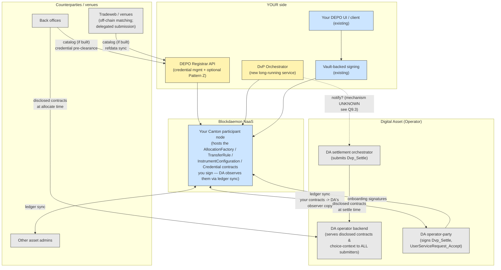
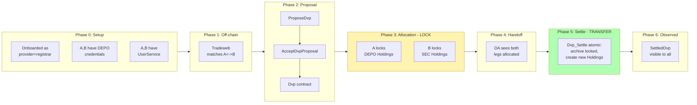
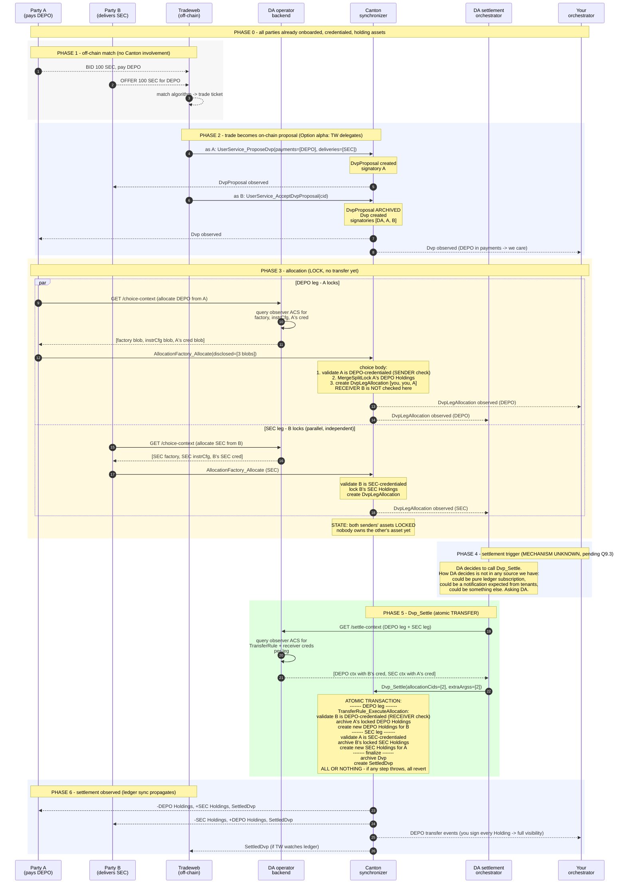
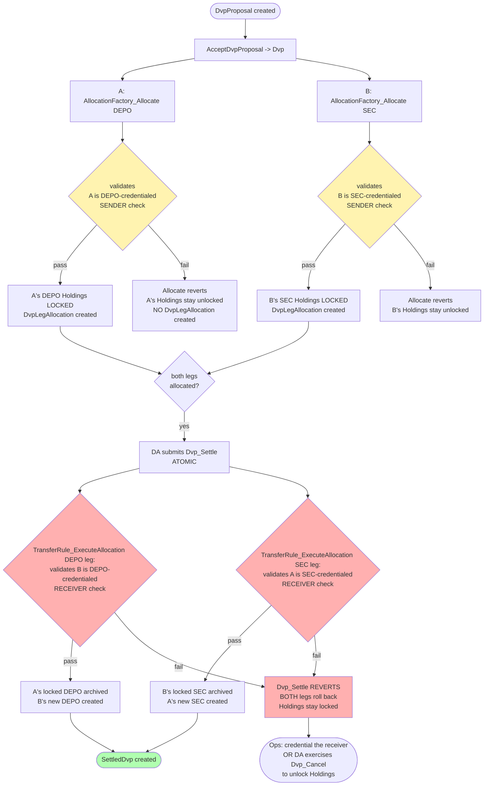
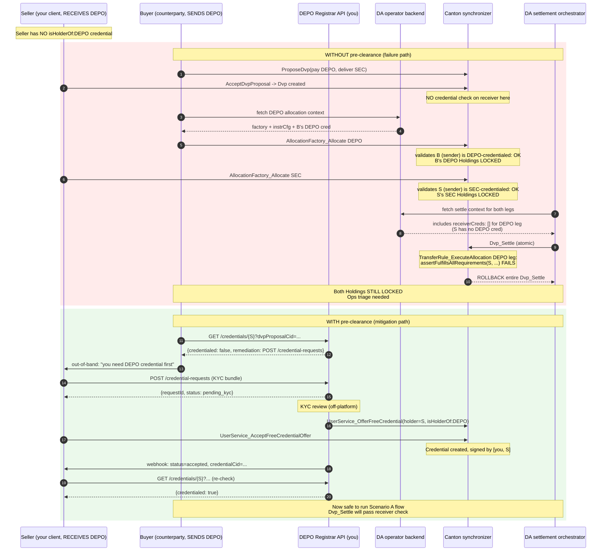
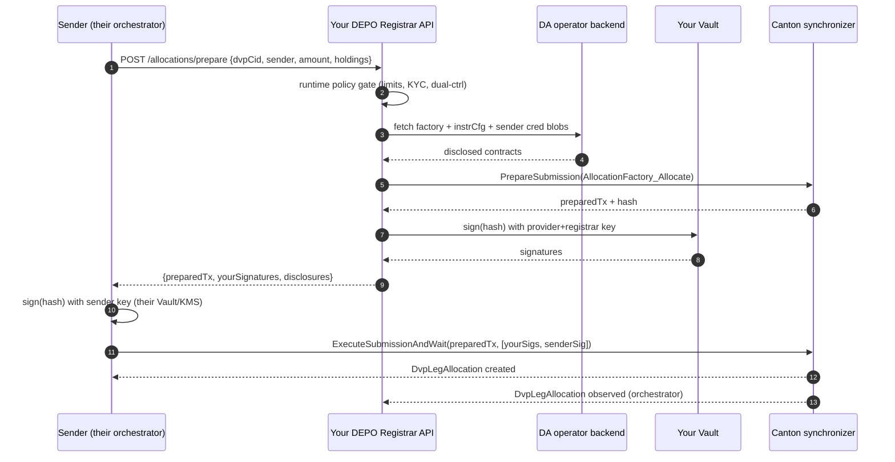
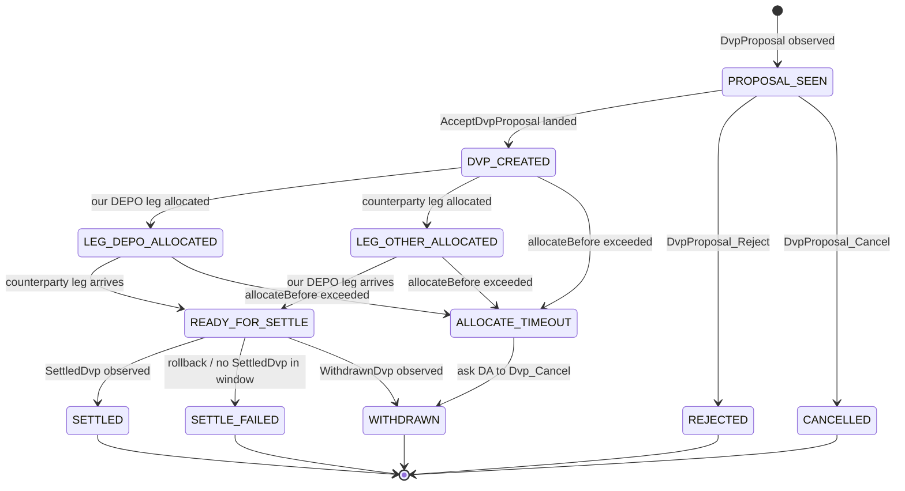

# DEPO DvP — Build Design

> **Audience.** Two readers. Section 1 (Executive summary) is for leadership and product. Sections 2 onward are the implementation spec for engineering.
>
> **Context.** You operate the DEPO instrument as **provider + registrar** on Digital Asset's Registry Utility, hosted on a Blockdaemon NaaS participant node. The mint / transfer / burn lifecycle is in production. This document defines what you build to enable **Delivery vs Payment (DvP)** settlement, where DEPO appears as a leg of an atomic two-asset swap on DA's Settlement Utility.
>
> **Authority disclaimer.** "Operator" throughout this document means **Digital Asset (DA)** — the party that signs `OperatorConfiguration` on both the Registry and Settlement utilities and controls operator-only choices (`Dvp_Settle`, `UserServiceRequest_Accept`). "Provider" / "Registrar" / "DEPO admin" means **you**. These are never collapsed.
>
> **Source references.** All Daml citations point to canonical source under [extracted-dars/daml-source/](extracted-dars/daml-source/), extracted from `canton-network-utility-dars-0.12.0.tar.gz`.
>
> **Open questions blocking M0.** Three architecture questions for DA are unresolved (see §9). This document assumes the most likely answer for each and flags where the assumption is load-bearing.

---

# Section 1 — Executive summary (for leadership)

## 1.1 What changes for DEPO

Today, DEPO is a **closed-loop** instrument: your client UI calls your service, your service constructs and signs ledger commands against your own participant's ACS, every participant in a DEPO transaction is somebody you onboarded.

DvP cracks the loop open. Counterparties **you have not onboarded** will name DEPO inside settlement instructions on a utility (DA's Settlement App) that you do not operate. The Daml engine still enforces every credential, every signature, every `holderRequirement` — no safety guarantees weaken. The widening surface is twofold:

1. External parties now submit ledger calls that need **disclosed contracts only you sign** (`AllocationFactory`, `InstrumentConfiguration`, sender `Credential`). The mechanism that gets them those contracts is **DA's operator backend reading its own observer copy** via ledger sync — not an HTTPS endpoint you host.
2. External parties need **policy data that lives in your systems**, not on-ledger (KYC status, credential issuance lead time). That part is yours to serve.

## 1.2 How `AllocationFactory_Allocate` actually works (source of truth)

The entire design hinges on this one choice. Read this section before the integration-points table.

1. **`AllocationFactory` is shared, not per-instrument.** Template fields are `provider, registrar, operator` only — no instrument id, no contract key ([AllocationFactory.daml:37-47](extracted-dars/daml-source/utility-registry-app-v0-0.7.0/utility-registry-app-v0-0.7.0-7a75ef6e69f69395a4e60919e228528bb8f3881150ccfde3f31bcc73864b18ab/Utility/Registry/App/V0/Service/AllocationFactory.daml#L37-L47)). One factory per `(operator, provider, registrar)` tuple covers every instrument that registrar admins. The factory is signed by `provider + registrar` (you); `operator` (DA) is observer.

2. **DA's operator backend discloses it.** The source comment is explicit ([AllocationFactory.daml:34-36](extracted-dars/daml-source/utility-registry-app-v0-0.7.0/utility-registry-app-v0-0.7.0-7a75ef6e69f69395a4e60919e228528bb8f3881150ccfde3f31bcc73864b18ab/Utility/Registry/App/V0/Service/AllocationFactory.daml#L34-L36)):
   > *"Instances of this template are disclosed via the operator backend."*

3. **The submitter is the sender.** `AllocationFactory_AllocateInternal` has three controllers — `provider, registrar, sender` ([AllocationFactory.daml:70](extracted-dars/daml-source/utility-registry-app-v0-0.7.0/utility-registry-app-v0-0.7.0-7a75ef6e69f69395a4e60919e228528bb8f3881150ccfde3f31bcc73864b18ab/Utility/Registry/App/V0/Service/AllocationFactory.daml#L70)). In Canton any controller can submit; the others' authority is contributed via signatures attached to the prepared transaction. **The sender's participant calls Canton's Ledger API**, not yours.

4. **The submitter needs three disclosed contracts they can't see.** The choice body reads two context keys: `instrumentConfigurationContextKey` and `senderCredentialsContextKey` ([lines 86-90](extracted-dars/daml-source/utility-registry-app-v0-0.7.0/utility-registry-app-v0-0.7.0-7a75ef6e69f69395a4e60919e228528bb8f3881150ccfde3f31bcc73864b18ab/Utility/Registry/App/V0/Service/AllocationFactory.daml#L86-L90)). Plus the factory contract itself. All three are signed by `provider+registrar`; the sender is not a stakeholder, so the sender's participant cannot fetch them by CID. They must arrive as `disclosedContracts` in the submission. DA's backend provides them.

5. **The choice locks; it does not transfer.** The choice body calls `MergeSplitLock` ([lines 104-119](extracted-dars/daml-source/utility-registry-app-v0-0.7.0/utility-registry-app-v0-0.7.0-7a75ef6e69f69395a4e60919e228528bb8f3881150ccfde3f31bcc73864b18ab/Utility/Registry/App/V0/Service/AllocationFactory.daml#L104-L119)) which puts the sender's input `Holding`s into a locked state earmarked for the allocation. Change Holdings (if any) return to the sender unlocked. A `DvpLegAllocation` contract is created ([lines 122-127](extracted-dars/daml-source/utility-registry-app-v0-0.7.0/utility-registry-app-v0-0.7.0-7a75ef6e69f69395a4e60919e228528bb8f3881150ccfde3f31bcc73864b18ab/Utility/Registry/App/V0/Service/AllocationFactory.daml#L122-L127)) as the handle DA will later settle against. **No asset moves yet.**

6. **`TransferRule` is read later, by `Dvp_Settle`, not by `Allocate`.** `TransferRule_ExecuteAllocation` reads three context keys — `instrumentConfiguration`, `senderCredentials`, **`receiverCredentials`** ([Transfer.daml:336-341](extracted-dars/daml-source/utility-registry-v0-0.6.0/utility-registry-v0-0.6.0-a236e8e22a3b5f199e37d5554e82bafd2df688f901de02b00be3964bdfa8c1ab/Utility/Registry/V0/Rule/Transfer.daml#L336-L341)). The submitter of `Dvp_Settle` is DA. The receiver-credential gate fires at settle time, not allocate time. **This is the main DvP failure mode** — proposal and both allocations can succeed while the receiver is uncredentialed; the rollback happens inside `Dvp_Settle`.

7. **Provider+registrar authority arrives via one of two paths.** The sender alone cannot supply your authority. Either:
   - **Pattern X — credential-implicit.** The sender's `Credential` is signed by `[issuer (you), holder]` ([Credential.daml:69](extracted-dars/daml-source/utility-credential-v0-0.1.0/utility-credential-v0-0.1.0-5a29ead611a0abd5f5b3fc3caf7d0f67c0ff802032ab6d392824aa9060e56d70/Utility/Credential/V0/Credential.daml#L69)). Inside the choice body `Credential_Get with actor = registrar` is exercised ([AllocationFactory.daml:100](extracted-dars/daml-source/utility-registry-app-v0-0.7.0/utility-registry-app-v0-0.7.0-7a75ef6e69f69395a4e60919e228528bb8f3881150ccfde3f31bcc73864b18ab/Utility/Registry/App/V0/Service/AllocationFactory.daml#L100)), contributing your authority to the enclosing transaction. The sender's participant submits alone.
   - **Pattern Z — interactive co-sign.** The sender's orchestrator calls a `POST /allocations/prepare` endpoint you host; you run runtime policy gates, your Vault signs the prepared transaction's hash, you return the signature. The sender's participant adds its own signature and submits `ExecuteSubmissionAndWait` with both.

   Pick one per §5.7. They are not mutually exclusive across instruments but should be picked deliberately per use case.

## 1.3 System diagram



Yellow = new build. Blue = existing. Grey = external (not yours).

## 1.4 Integration points (corrected)

The original draft assumed we'd host an HTTPS endpoint for every disclosed-contract handoff. The Daml source makes clear DA's operator backend is the canonical disclosure mechanism. Our job is to keep the underlying contracts current on our participant; DA's backend reads its observer view and serves them to anyone who submits.

| # | What | Hosted by | Called by | Why us / why DA |
|---|---|---|---|---|
| 1 | **Instrument catalog** (off-ledger refdata wrapper) | **You, conditional** | Counterparty back offices, trading venues | On-ledger `InstrumentConfiguration` is served by DA's backend. Build only if DA's backend doesn't expose a refdata API OR if Tradeweb-class consumers need fields that aren't on-ledger (ISIN, CUSIP, settlement convention, contacts, prospectus URL). See §9 question 1. |
| 2 | **Allocation choice-context** | **DA's operator backend** | Sender's participant at allocate time | All four contracts (factory, instrumentConfig, sender credential, plus your factory blob) are operator-observed and disclosed by DA. We supply the data via ledger sync; DA supplies the endpoint. **Pending §9 question 2.** |
| 3 | **`Dvp_Settle` choice-context** | **DA's operator backend** | DA itself, at settle time | Consumer is DA. Routing through us would be a pointless hop. Pending §9 question 2. |
| 4 | **Credential pre-clearance read** | **You** | Counterparty back offices, trading venues, before accepting a proposal | Reads your KYC + on-ledger credential state together. Mixes off-ledger data; not a pure Daml contract; DA's backend won't serve it. |
| 5 | **Credential issuance request workflow** | **You** | Prospective DEPO holders | KYC pipeline + ledger writes. Yours alone. |
| 5b | **Allocation co-signing endpoint** (Pattern Z only) | **You** | Sender's orchestrator, per allocation | Optional. Required only if you choose Pattern Z over Pattern X (see §5.7). |
| 6 | **DvP orchestrator** (service, not endpoint) | **You** | Watches ledger | Tracks DEPO-touching DvPs through their lifecycle. |

> ⚠ **UNKNOWN — does DA require a settlement-trigger notification from tenants?**
> Earlier drafts of this doc listed a `POST /settle-ready` integration point #7. That endpoint was speculative — no source artifact (Daml package, OpenAPI spec, repo doc) we have access to defines it. The Daml model only specifies that `Dvp_Settle` is controlled by DA's operator party; it is silent on what triggers DA to call it. Pure ledger subscription by DA's orchestrator is the simplest implementation consistent with the source, but we have not verified DA's actual approach. See §9 question 3.

**Net change vs original draft:** endpoints #2 and #3 are removed from your build pending DA confirmation. Endpoint #1 is conditional. Integration point #7 is removed entirely (it was a hallucination). Effort drops materially; three must-ask questions for DA now block M0.

## 1.5 How `AllocationFactory` becomes visible to external submitters

**What is verified from source:**

1. **At onboarding:** `RegistrarServiceRequest_Accept` created your `AllocationFactory` and committed it to the shared synchronizer. Your participant signed it; DA's participant got an observer copy via ledger sync (operator is on the `observer` list — [AllocationFactory.daml:47](extracted-dars/daml-source/utility-registry-app-v0-0.7.0/utility-registry-app-v0-0.7.0-7a75ef6e69f69395a4e60919e228528bb8f3881150ccfde3f31bcc73864b18ab/Utility/Registry/App/V0/Service/AllocationFactory.daml#L47)). Same for every `InstrumentConfiguration`, `TransferRule`, `Credential` you sign.

2. **The Daml source comment names DA's operator backend as the disclosure mechanism** — [AllocationFactory.daml:34-36](extracted-dars/daml-source/utility-registry-app-v0-0.7.0/utility-registry-app-v0-0.7.0-7a75ef6e69f69395a4e60919e228528bb8f3881150ccfde3f31bcc73864b18ab/Utility/Registry/App/V0/Service/AllocationFactory.daml#L34-L36):
   > *"Instances of this template are disclosed via the operator backend."*

**What is NOT verified (pending §9):**

- The URL of DA's operator backend
- The wire protocol (HTTP? gRPC?) and auth scheme
- The exact response schema
- Whether the backend exposes a generic "fetch disclosed contracts for choice X with these CIDs" endpoint or a per-choice endpoint
- Whether tenants can or must register their factory contracts with DA via any explicit API call, or whether the observer-via-ledger-sync mechanism is the sum total of registration

**What follows from the source comment, with the inference made explicit:** if disclosure is via DA's backend and the contracts are already on DA's participant via ledger sync, then on the tenant side per-DvP obligation appears to collapse to "don't archive your factory; issue credentials promptly." This conclusion is load-bearing on §9 question 2 being answered as expected.

## 1.6 Authority split (who signs, who submits, who discloses)

Three independent columns. The original draft collapsed "signs" and "submits"; they are separate in Canton.

| Step in a DvP | Signed by (signatory) | Submitted by (Ledger API caller) | Disclosure source for the submitter |
|---|---|---|---|
| `UserServiceRequest` on Settlement App | You (`signatory user`) ([User.daml:115](extracted-dars/daml-source/utility-settlement-app-v1-1.2.0/utility-settlement-app-v1-1.2.0-f169e1d84c476cb1321eff8ac2aebc9ce1c6b20790db5e788ee4ca87256a0639/Utility/Settlement/App/V1/Service/User.daml#L115)) | You (one-time onboarding) | DA backend (Settlement-App `OperatorConfiguration`) |
| `UserServiceRequest_Accept` | DA (`controller operator`) | DA | DA's own ACS |
| `UserService_ProposeDvp` / `_AcceptDvpProposal` | The acting party (`controller user`) ([User.daml:43,63](extracted-dars/daml-source/utility-settlement-app-v1-1.2.0/utility-settlement-app-v1-1.2.0-f169e1d84c476cb1321eff8ac2aebc9ce1c6b20790db5e788ee4ca87256a0639/Utility/Settlement/App/V1/Service/User.daml#L43)) | That party's participant (or delegated submitter — see §3.5 on Tradeweb) | None — their own UserService is on their ACS |
| `AllocationFactory_Allocate` for DEPO leg | You-as-provider, you-as-registrar, **sender** ([AllocationFactory.daml:70](extracted-dars/daml-source/utility-registry-app-v0-0.7.0/utility-registry-app-v0-0.7.0-7a75ef6e69f69395a4e60919e228528bb8f3881150ccfde3f31bcc73864b18ab/Utility/Registry/App/V0/Service/AllocationFactory.daml#L70)) | The **sender's participant** (your authority via Pattern X credential OR Pattern Z co-sign) | **DA's operator backend** discloses `AllocationFactory`, `InstrumentConfiguration`, sender `Credential` |
| `AllocationFactory_Allocate` for counterparty asset leg | Their provider, their registrar, their sender | Their sender's participant | Same DA backend, their contracts |
| `Dvp_Settle` | DA (`controller operator`) ([Dvp.daml:81](extracted-dars/daml-source/utility-settlement-app-v1-1.2.0/utility-settlement-app-v1-1.2.0-f169e1d84c476cb1321eff8ac2aebc9ce1c6b20790db5e788ee4ca87256a0639/Utility/Settlement/App/V1/Model/Dvp.daml#L81)) | DA's settlement orchestrator | DA's own backend reads `TransferRule` + receiver-`Credential` per leg |

**You never call `Dvp_Settle`.** Your orchestrator's job ends at "both legs allocated; ready for settlement"; DA picks it up from there.

**Critical clarification:** you sign the resulting `DvpLegAllocation` contract (because you co-controlled the choice that created it) but you do not call Canton's Ledger API for `Allocate` — the sender does. Provider+registrar signatures attach through Pattern X or Pattern Z (§5.7).

## 1.7 Effort sizing (rough)

| Workstream | Size | Dependency |
|---|---|---|
| Vetting `utility-settlement-app-v1-1.2.0` on your NaaS node | XS | Blockdaemon + DA approval flow |
| Settlement-App `UserService` onboarding for your party | XS | DA onboarding desk |
| Endpoint #1 (instrument catalog) | S, **conditional on §9 Q1** | None |
| Endpoint #4 (credential pre-clearance) | S | KYC data source |
| Endpoint #5 (credential issuance request) | S–M | KYC pipeline integration |
| Endpoint #5b (Pattern Z co-signing) | S–M, **only if Pattern Z chosen** | Reuses interactive-submission code from mint; multi-signer flow is new |
| DvP orchestrator (#6) | M | Idempotent event handling, retry policy |
| Optional DA notification hook | XS, **only if §9 Q3 says one is required** | DA defines the URL + auth + schema |
| Operational runbook updates | S | Includes JIT credential issuance policy |

Critical path is DA's three open questions (§9), DA's onboarding throughput, and Blockdaemon's vetting SLA — not your code.

## 1.8 Risks worth flagging

1. **Receiver-credential gate is enforced at settle time, not at proposal time.** A `Dvp` can be proposed and accepted while the receiver of the DEPO leg is uncredentialed; the failure surfaces inside `Dvp_Settle` and rolls back the entire atomic transaction. **Mitigation:** integration point #4 (pre-clearance) plus a credential-issuance SLA.
2. **`settleBefore` is not enforced on-chain.** `executeAllocation` allows late settlement ([Allocation.daml:66-69](extracted-dars/daml-source/utility-registry-v0-0.6.0/utility-registry-v0-0.6.0-a236e8e22a3b5f199e37d5554e82bafd2df688f901de02b00be3964bdfa8c1ab/Utility/Registry/V0/Holding/Allocation.daml#L66-L69)). DA's orchestrator (or your orchestrator before handoff) must enforce hard cutoffs in code.
3. **You depend on DA for three things every DvP:** Settlement-App `UserService` records (one-time per party), the operator-backend disclosure service (every allocation), and `Dvp_Settle` (every settlement). DA outage = no DvPs. Build retry and queueing accordingly.
4. **Pattern X commits you to credential lifecycle as your only authorization control.** Every holder with a valid credential can allocate up to their balance any time. No per-allocation limits, no velocity gates, no dual-control. If your bank's risk framework requires those, you must pick Pattern Z (§5.7).
5. **Your DEPO endpoints (#1, #4, #5) become a public API contract.** Versioning, backwards compatibility, rate limits, and incident communication matter externally.

---

# Section 2 — Glossary

| Term | Definition |
|---|---|
| **You / DEPO admin** | Your Canton party on the Blockdaemon NaaS node. Plays roles `provider` and `registrar` for DEPO on the Registry Utility. |
| **DA / Operator** | Digital Asset's Canton party. Signs `OperatorConfiguration` on every utility. The only signer of operator-only choices. Runs the operator backend that discloses all observer-visible contracts. |
| **Counterparty** | Any other Canton party that ends up in a DvP with one of your DEPO holders. Distinct entity, distinct participant node. |
| **DEPO holder** | A party with a `Credential` signed by you carrying claim `isHolderOf:DEPO`. Required to send OR receive DEPO. |
| **Registry Utility** | DA's utility hosting `InstrumentConfiguration`, `Holding`, `AllocationFactory`, `TransferRule`. Packages: `utility-registry-v0`, `utility-registry-app-v0`, `utility-registry-holding-v0`. |
| **Settlement Utility** | DA's utility hosting `Dvp`, `DvpProposal`, `SettledDvp`. Package: `utility-settlement-app-v1`. Has its own `UserService` and `OperatorConfiguration`. |
| **Credential App** | DA's utility hosting `Credential` issuance. Package: `utility-credential-app-v0`. Source of your existing `UserService`. |
| **DA operator backend** | The HTTPS service DA runs that exposes disclosed contracts and choice-context to submitters. Named explicitly in the AllocationFactory source comment. Concrete URL/auth/schema TBD (§9). |
| **DEPO Registrar API** | The HTTPS service you build to expose endpoints #1 (conditional), #4, #5, #5b. Single deployable; multiple route prefixes. |
| **DvP Orchestrator** | The long-running service that watches the ledger and drives your side of any DvP touching DEPO. |
| **Choice context** | The `extraArgs.context` `TextMap` that Daml choices read via `getFromContextU`. Carries CIDs the engine needs but cannot derive (instrument config, credentials, transfer rule). |
| **Disclosed contract** | A `createdEventBlob` passed alongside a Ledger API submission to grant the submitter visibility into a contract they are not a stakeholder on. Self-authenticating via synchronizer commitment proof. |
| **Pattern X** | Allocation authority contributed via the sender's `Credential` signatures. Sender submits alone. No per-allocation runtime gate. |
| **Pattern Z** | Allocation authority contributed via interactive co-sign through your `/allocations/prepare` endpoint. Your Vault signs every allocation. Supports runtime policy gates. |

---

# Section 2.5 — The asset instruments (concrete examples)

Two real assets ride through the canonical scenario: **DEPO** (your bank-deposit token) and **SEC** (a security from a separate admin). They are not abstract — each is an on-ledger `InstrumentConfiguration` contract with the schema from [Instrument.daml:18-42](extracted-dars/daml-source/utility-registry-v0-0.6.0/utility-registry-v0-0.6.0-a236e8e22a3b5f199e37d5554e82bafd2df688f901de02b00be3964bdfa8c1ab/Utility/Registry/V0/Configuration/Instrument.daml#L18-L42). Both follow the same template; the values differ.

## DEPO `InstrumentConfiguration` (yours)

```
template InstrumentConfiguration
  with
    operator = DA_OPERATOR
    provider = BANK_PROVIDER       -- you
    registrar = BANK_REGISTRAR     -- you
    defaultIdentifier = InstrumentIdentifier {
      source = BANK_REGISTRAR,
      id = "DEPO"
    }
    additionalIdentifiers = []
    issuerRequirements = [
      PartyCredentialRequirement {
        issuer = BANK_REGISTRAR,
        requiredClaims = [("isIssuerOf", "DEPO")]
      }
    ]
    holderRequirements = [
      PartyCredentialRequirement {
        issuer = BANK_REGISTRAR,
        requiredClaims = [("isHolderOf", "DEPO")]
      }
    ]
    providerAppRewardBeneficiaries = None
  signatory provider, registrar
  observer operator
```

**Meaning:**
- `instrumentId` for any DEPO `Holding` will be `{admin = BANK_REGISTRAR, id = "DEPO"}`. This is the global identifier; party A's DEPO Holdings are tagged with this exact pair, and the `InstrumentConfiguration` is the only contract on the synchronizer with this `id`.
- To **mint or burn** DEPO, the actor must hold a `Credential` signed by `BANK_REGISTRAR` carrying claim `("isIssuerOf", "DEPO")`.
- To **transfer or receive** DEPO, the actor must hold a `Credential` signed by `BANK_REGISTRAR` carrying claim `("isHolderOf", "DEPO")`.
- The contract is signed by you (provider + registrar). DA's operator party is observer — that observer link is what lets DA's backend disclose this contract to external submitters via ledger sync.

## SEC `InstrumentConfiguration` (counterparty admin's)

```
template InstrumentConfiguration
  with
    operator = DA_OPERATOR
    provider = SEC_PROVIDER          -- distinct entity, not you
    registrar = SEC_REGISTRAR        -- distinct entity, not you
    defaultIdentifier = InstrumentIdentifier {
      source = SEC_REGISTRAR,
      id = "SEC-XYZ-2026"            -- e.g. an ISIN-like local id
    }
    additionalIdentifiers = [
      InstrumentIdentifier { source = SEC_REGISTRAR, id = "ISIN-US0378331005" }
    ]
    issuerRequirements = [
      PartyCredentialRequirement {
        issuer = SEC_REGISTRAR,
        requiredClaims = [("isIssuerOf", "SEC-XYZ-2026")]
      }
    ]
    holderRequirements = [
      PartyCredentialRequirement {
        issuer = SEC_REGISTRAR,
        requiredClaims = [("isHolderOf", "SEC-XYZ-2026")]
      }
    ]
    providerAppRewardBeneficiaries = None
  signatory provider, registrar
  observer operator
```

**Meaning:** structurally identical to DEPO, but every party reference flips. The SEC admin (not you) is provider+registrar, signs the contract, owns the credential issuance for `isHolderOf:SEC-XYZ-2026`. DA is observer on this one too — that's how DA's backend can disclose SEC contracts to your client when you receive SEC.

## What this implies for the cross-admin DvP

| Concern | DEPO leg | SEC leg |
|---|---|---|
| Whose `AllocationFactory` does the sender call? | Yours (`(operator, BANK_PROVIDER, BANK_REGISTRAR)`) | SEC admin's (`(operator, SEC_PROVIDER, SEC_REGISTRAR)`) |
| Whose `InstrumentConfiguration` rides in the choice context? | DEPO's, fetched from DA backend | SEC's, fetched from DA backend |
| Whose `Credential` does the choice validate? | DEPO holder credential signed by you | SEC holder credential signed by SEC admin |
| Whose `TransferRule` does `Dvp_Settle` invoke? | Yours | SEC admin's |
| Whose signature is on the resulting `Holding`? | yours + holder | SEC admin's + holder |

Two independent trust chains, both rooted in DA's operator party as the shared observer/settlement authority. **Neither admin sees the other's signing keys, ACS, or credential issuance pipeline — they only see what DA's backend chooses to disclose to them.**

## Parties involved in the canonical scenario

```
DA_OPERATOR             — Digital Asset (operator across both utilities)
BANK_PROVIDER           — you
BANK_REGISTRAR          — you (admin of DEPO)
BANK_ISSUER             — you (holds isIssuerOf:DEPO, receives initial mint)
SEC_PROVIDER            — counterparty asset admin
SEC_REGISTRAR           — counterparty asset admin (admin of SEC-XYZ-2026)
SEC_ISSUER              — counterparty asset admin (holds isIssuerOf:SEC-XYZ-2026)
PARTY_A                 — your client; pays DEPO, receives SEC; holds isHolderOf:DEPO + isHolderOf:SEC-XYZ-2026
PARTY_B                 — counterparty's client; pays SEC, receives DEPO; holds isHolderOf:SEC-XYZ-2026 + isHolderOf:DEPO
TRADEWEB_BOT            — Tradeweb adapter user (Layer-1/2 delegated submission; no on-chain party of its own per §3.3)
```

Note that **PARTY_A needs an `isHolderOf:SEC-XYZ-2026` credential issued by SEC_REGISTRAR**, and **PARTY_B needs an `isHolderOf:DEPO` credential issued by you (BANK_REGISTRAR)**. Cross-issuance is mandatory because each party will *receive* the other's asset.

---

# Section 3 — End-to-end flow (Scenario A: A pays DEPO, B delivers SEC)

This is the canonical trace. Other scenarios (§4.1, §4.2, §4.3) are variants.

## 3.0 Phase map (visual overview)



**Critical distinction visualized:** Phase 3 (yellow) locks assets — sender keeps custody, no transfer. Phase 5 (green) is when ownership actually moves, atomically, both legs at once.

## 3.1 Phase 0 — One-time setup (already done)

| What | Who signs | Where |
|---|---|---|
| You onboarded as DEPO provider+registrar | You + DA | `RegistrarServiceRequest_Accept` created your `AllocationFactory`, `TransferRule`, `InstrumentConfiguration` |
| Party A has DEPO holdings | You + A | `Holding` contracts from prior mints |
| Party A has `isHolderOf:DEPO` `Credential` | You + A | Synced to A's and DA's participants |
| Party B has `isHolderOf:DEPO` `Credential` | You + B | **Critical** — receiver of DEPO; without this, `Dvp_Settle` rolls back |
| Both A and B have Settlement-App `UserService` records | A/B + DA | Lets A and B submit `ProposeDvp`/`AcceptDvpProposal` |
| Counterparty asset SEC similarly bootstrapped on its admin's factory | SEC admin + DA | Symmetric setup |

## 3.2 Phase 1 — Off-chain match (Tradeweb)

Purely off-ledger. No Canton involvement.

1. A submits a bid on Tradeweb: "BUY 100 SEC, pay in DEPO."
2. B submits an offer: "SELL 100 SEC for DEPO."
3. Tradeweb's matching engine pairs them and emits a trade ticket (FIX/FpML) to both back offices and to its on-chain adapter.

At this point nothing exists on any ledger. Tradeweb has decided that A and B agreed on terms.

## 3.3 Phase 2 — Trade ticket becomes a `DvpProposal`

There is **no on-chain "Tradeweb venue" template** in any utility DAR (confirmed by exhaustive search of all extracted packages). Two valid ways for the trade to land on-ledger:

> ⚠ **UNVERIFIED:** Option α assumes Tradeweb integrates with DA via Canton's standard participant-level `actAs` delegation (JWT-based, configured at participant user-management level). This is the only on-source mechanism I can find that would let Tradeweb submit on A's or B's behalf — and it requires no Daml-level changes — but I have not seen documentation of Tradeweb's actual integration pattern with DA. It may use a different mechanism we don't know about. Treat Option α as an architectural possibility, not a confirmed design.

**Option α — Tradeweb-as-submitter (delegated authority).** Tradeweb's adapter runs as a tenant on DA, holding submission authority delegated by A and B (granted out-of-band at venue onboarding; not modeled on-ledger). The adapter submits as A:

```
exercise A.UserService UserService_ProposeDvp with terms = Terms {
  payments  = [InstrumentQuantity {instrument = DEPO@you, amount = 100_000_000}],
  deliveries = [InstrumentQuantity {instrument = SEC@secadmin, amount = 100}],
  allocateBefore, settleBefore, ...
}
```

Creates a `DvpProposal` ([User.daml:34-54](extracted-dars/daml-source/utility-settlement-app-v1-1.2.0/utility-settlement-app-v1-1.2.0-f169e1d84c476cb1321eff8ac2aebc9ce1c6b20790db5e788ee4ca87256a0639/Utility/Settlement/App/V1/Service/User.daml#L34-L54)). The adapter then submits as B:

```
exercise B.UserService UserService_AcceptDvpProposal with cid = <proposalCid>
```

Archives the `DvpProposal`, creates the `Dvp` contract signed by `[operator, B, A]`.

**Option β — Each party submits themselves.** Tradeweb's FIX message tells A's back office "you matched with B for these terms"; A's back office submits `ProposeDvp` from A's participant. Tradeweb forwards the proposal CID to B's back office; B submits `AcceptDvpProposal`. Tradeweb's role is purely off-chain matchmaking + ferrying the CID.

The Daml engine accepts both equally — the choice's controller is `user` and the user authorizes either themselves or their delegate. **Which one Tradeweb actually uses is a venue-integration question, not a DEPO design question.** Your code path is identical from here.

## 3.4 Phase 3 — Each side allocates its leg (parallel)

The `Dvp` now exists and is observable by A, B, and DA. Two independent allocations run in parallel.

**DEPO leg (A is sender).** A's participant fetches three disclosed contracts from DA's operator backend:

- Your `AllocationFactory` (signed by you+DA-observer)
- DEPO `InstrumentConfiguration` (signed by you)
- A's `Credential` for `isHolderOf:DEPO` (signed by you+A — A's participant already has this natively, but it still rides along as a context blob)

A's participant submits:

```
exercise AllocationFactory_Allocate with
  expectedAdmin = you,
  allocation = AllocationSpecification {
    settlement = ReferenceSettlement {executor = DA, dvpCid, transferLegId = "DEPO_leg"},
    transferLeg = TransferLeg {sender = A, receiver = B, instrumentId = DEPO@you, amount = 100_000_000}
  },
  inputHoldingCids = [<A's DEPO holdings totaling >= 100_000_000>],
  extraArgs = ExtraArgs {context = {
    "...instrument-configuration" = AV_ContractId <instrConfigCid>,
    "...sender-credentials"       = AV_List [AV_ContractId <A's credCid>]
  }, meta = TextMap.empty}
```

Provider+registrar authority is contributed via Pattern X or Pattern Z (§5.7). Choice body:

- Validates instrument id matches ([line 95-96](extracted-dars/daml-source/utility-registry-app-v0-0.7.0/utility-registry-app-v0-0.7.0-7a75ef6e69f69395a4e60919e228528bb8f3881150ccfde3f31bcc73864b18ab/Utility/Registry/App/V0/Service/AllocationFactory.daml#L95-L96))
- Validates A's sender credentials satisfy DEPO's `holderRequirements` ([lines 98-102](extracted-dars/daml-source/utility-registry-app-v0-0.7.0/utility-registry-app-v0-0.7.0-7a75ef6e69f69395a4e60919e228528bb8f3881150ccfde3f31bcc73864b18ab/Utility/Registry/App/V0/Service/AllocationFactory.daml#L98-L102))
- Locks A's input Holdings via `MergeSplitLock` ([lines 104-119](extracted-dars/daml-source/utility-registry-app-v0-0.7.0/utility-registry-app-v0-0.7.0-7a75ef6e69f69395a4e60919e228528bb8f3881150ccfde3f31bcc73864b18ab/Utility/Registry/App/V0/Service/AllocationFactory.daml#L104-L119)) (lockers = your registrar; context = allocation handle)
- Creates `DvpLegAllocation` ([lines 122-127](extracted-dars/daml-source/utility-registry-app-v0-0.7.0/utility-registry-app-v0-0.7.0-7a75ef6e69f69395a4e60919e228528bb8f3881150ccfde3f31bcc73864b18ab/Utility/Registry/App/V0/Service/AllocationFactory.daml#L122-L127)) signed by `[you-as-provider, you-as-registrar, A]`
- Returns change Holdings (unlocked) to A

**SEC leg (B is sender).** Symmetric. B's participant calls SEC-admin's factory. Produces a `DvpLegAllocation` signed by `[sec-admin, sec-admin, B]`. B's SEC Holdings get locked.

**No asset has moved yet.** Both senders' assets are merely locked, earmarked for this specific `Dvp`. If the DvP never settles, the locks expire and the Holdings unlock back to their owners.

DA observes both `DvpLegAllocation`s. Your orchestrator observes them too (you're signatory on the DEPO leg; you see the SEC leg via the parent `Dvp` if your party is observer there, otherwise only via DA's notification).

## 3.5 Phase 4 — Settlement handoff (UNKNOWN MECHANISM)

> ⚠ **The trigger mechanism for `Dvp_Settle` is not specified in any source we have access to.**
>
> The Daml model only proves that DA's operator party must submit `Dvp_Settle` ([Dvp.daml:81](extracted-dars/daml-source/utility-settlement-app-v1-1.2.0/utility-settlement-app-v1-1.2.0-f169e1d84c476cb1321eff8ac2aebc9ce1c6b20790db5e788ee4ca87256a0639/Utility/Settlement/App/V1/Model/Dvp.daml#L81)). It does not specify what makes DA decide to submit it. Possibilities consistent with the source include: DA's orchestrator subscribes to the ledger and auto-detects both legs allocated; or DA exposes a notification endpoint and expects tenants to ping it; or some other mechanism not yet documented. The earlier draft of this document named a `POST /settle-ready` endpoint and a three-way `ω/ψ/π` taxonomy — both invented. They have been removed.
>
> **This is §9 question 3.** Until DA answers, our default plan is: build the orchestrator (§6) to detect `READY_FOR_SETTLE` from the ledger, and add an outbound notification step ONLY if DA confirms one is needed.

## 3.6 Phase 5 — DA submits `Dvp_Settle` (atomic)

DA gathers per-leg `extraArgs`:

- **DEPO leg:** `instrumentConfiguration` (DEPO's), `senderCredentials` (A's), **`receiverCredentials` (B's)**.
- **SEC leg:** SEC's `instrumentConfiguration`, B's SEC sender credential, A's SEC receiver credential.

DA's backend has all of these via ledger sync. DA submits ONE transaction:

```
exercise Dvp Dvp_Settle with
  allocationCids = [depo_alloc_cid, sec_alloc_cid],
  extraArgss     = [depo_extra_args, sec_extra_args]
```

Controller: `operator` only. Choice body ([Dvp.daml:97-100](extracted-dars/daml-source/utility-settlement-app-v1-1.2.0/utility-settlement-app-v1-1.2.0-f169e1d84c476cb1321eff8ac2aebc9ce1c6b20790db5e788ee4ca87256a0639/Utility/Settlement/App/V1/Model/Dvp.daml#L97-L100)):

```daml
let executeAllocation (cid, extraArgs) =
  exercise cid $ Api.AllocationV1.Allocation_ExecuteTransfer with extraArgs
mapA_ executeAllocation $ zip allocationCids extraArgss
```

For the DEPO leg, `Allocation_ExecuteTransfer` dispatches to `TransferRule_ExecuteAllocation` ([Transfer.daml:85-107](extracted-dars/daml-source/utility-registry-v0-0.6.0/utility-registry-v0-0.6.0-a236e8e22a3b5f199e37d5554e82bafd2df688f901de02b00be3964bdfa8c1ab/Utility/Registry/V0/Rule/Transfer.daml#L85-L107)):

1. Reads `instrumentConfiguration`, `senderCredentials`, `receiverCredentials` from context.
2. Validates **B holds the required `isHolderOf:DEPO` credential**. ❗ If not, transaction throws; entire `Dvp_Settle` reverts; no asset moves on either leg.
3. Unlocks A's locked DEPO `Holding`s.
4. Archives them.
5. Creates new DEPO `Holding`s for B.

Symmetric for SEC. Both leg executions run within the same transaction — all-or-nothing.

On success, `Dvp_Settle` also creates a `SettledDvp` contract as the audit record.

## 3.7 Phase 6 — Both sides observe settlement

Ledger sync propagates:

- A's participant: old DEPO Holdings archived, new SEC Holdings created. `Dvp` archived, `SettledDvp` observed.
- B's participant: old SEC Holdings archived, new DEPO Holdings created. Same `SettledDvp`.
- Your participant (DEPO admin): A's DEPO Holdings archived, B's DEPO Holdings created. You sign every `Holding` (registrar is co-signatory), so you have full visibility.
- Tradeweb (if it watches the ledger): observes `SettledDvp`, marks trade settled in post-trade records.
- Your orchestrator transitions DvP state to `SETTLED`.

No further round-trip to DA — DA submitted the transaction, so DA's participant got the commit ack from the synchronizer first.

## 3.8 Sequence diagram — Scenario A (full e2e)



**Visual color key:**
- Grey rect = off-chain
- Blue rect = on-chain protocol steps (proposal, handoff, observation)
- Yellow rect = LOCK (Phase 3, allocate) — assets immobilized but still owned by sender
- Green rect = TRANSFER (Phase 5, settle) — atomic ownership change

**Three things this diagram makes explicit that prose doesn't:**

1. **The sender-check vs receiver-check timing.** Sender check fires in Phase 3 (yellow); receiver check fires in Phase 5 (green). They are six steps apart. By the time the receiver check runs, both senders have already locked.
2. **DA's backend is touched twice per DvP** — once by each sender in Phase 3 (allocation choice-context), once by DA itself in Phase 5 (settle choice-context). You're not in the call path for either.
3. **Phase 5 is one atomic transaction**, not a sequence. The bullet list inside the green box all happens in one ledger commit; partial completion is impossible.

---

# Section 4 — Scenario variants

## 4.1 Scenario B — both counterparties are your DEPO clients

Two of your DEPO holders trade against each other. Cash leg is DEPO; delivery leg is some other asset.

Mechanically identical to Scenario A from your perspective. Both have pre-existing `isHolderOf:DEPO` credentials.

**Distinguishing concern:** if both legs are DEPO (rare netting cases), your orchestrator's idempotency keys must include `transferLegId` ([Dvp.daml:332](extracted-dars/daml-source/utility-settlement-app-v1-1.2.0/utility-settlement-app-v1-1.2.0-f169e1d84c476cb1321eff8ac2aebc9ce1c6b20790db5e788ee4ca87256a0639/Utility/Settlement/App/V1/Model/Dvp.daml#L332)). You'll receive two `DvpLegAllocation` events on the same `Dvp` and must not collapse them.

## 4.2 Scenario C — receiver not yet DEPO-credentialed

### Why this is THE production risk

`AllocationFactory_AllocateInternal` validates **only the sender's credentials** — see [AllocationFactory.daml:98-102](extracted-dars/daml-source/utility-registry-app-v0-0.7.0/utility-registry-app-v0-0.7.0-7a75ef6e69f69395a4e60919e228528bb8f3881150ccfde3f31bcc73864b18ab/Utility/Registry/App/V0/Service/AllocationFactory.daml#L98-L102):

```daml
assertFulfillsAllRequirements allocation.transferLeg.sender
  instrumentConfiguration.holderRequirements credentials
```

The receiver is not mentioned. **Design reasoning:** an allocation is a *lock* of the sender's Holdings, not a *transfer*. Ownership hasn't moved yet. Forcing receiver-credential at allocate time would break parallel allocation (each side runs independently without knowing the other's readiness).

The receiver check fires later, inside `TransferRule_ExecuteAllocation` at [Transfer.daml:336-341](extracted-dars/daml-source/utility-registry-v0-0.6.0/utility-registry-v0-0.6.0-a236e8e22a3b5f199e37d5554e82bafd2df688f901de02b00be3964bdfa8c1ab/Utility/Registry/V0/Rule/Transfer.daml#L336-L341), which DA invokes inside `Dvp_Settle`. When the assertion fails:

- `TransferRule_ExecuteAllocation` throws.
- `Allocation_ExecuteTransfer` for that leg reverts.
- `Dvp_Settle` is one atomic transaction → the whole thing rolls back.
- The OTHER leg's transfer also reverts, even though nothing was wrong with it.
- Both senders' Holdings remain locked (`DvpLegAllocation` contracts still exist).
- Ops triage starts. Either someone credentials the receiver and DA retries `Dvp_Settle`, or DA exercises `Dvp_Cancel` to unlock the Holdings back to their owners.

### Where the check fires in the full flow



Yellow = sender check (allocate time). Red = receiver check (settle time, atomic rollback if fails).

### Failure path vs mitigation path (side by side)



### Why pre-clearance matters operationally

The failure path is **not** "Dvp errors immediately and everyone retries." It's "the trade looks complete on every UI for minutes, then atomically reverts at the last step." That's a much worse failure mode because:

1. Both senders see their assets locked → they think the trade is in flight.
2. Tradeweb and back offices see the DvP allocated → they may have already updated downstream positions.
3. The rollback hits when DA tries to settle, often minutes after match.
4. Recovery requires either issuing the missing credential (which takes minutes-to-hours depending on KYC SLA) and getting DA to retry, OR cancelling the DvP (which requires DA's operator-only `Dvp_Cancel`).

**Endpoint #4 (pre-clearance) is the standard mitigation.** It's called before `AcceptDvpProposal` lands, so the failure surfaces before anyone locks anything. Combined with endpoint #5 for JIT issuance, it converts a "trade reverts at the last second" failure into a "trade waits at proposal stage for 5 minutes of KYC processing" delay.

## 4.3 Scenario D — Tradeweb-as-proposer

Already covered in §3.3. Off-chain match, delegated submission, no on-chain venue template. Your impact:

- **Off-chain:** endpoint #1 becomes Tradeweb's refdata source (if built).
- **On-chain:** zero. Your code paths for allocate-and-settle are identical to Scenario A.

The only DEPO-specific concern: keep endpoint #1 schema versioned so Tradeweb's reference data team doesn't break when DEPO metadata changes.

---

# Section 5 — The DEPO Registrar API (HTTPS service)

One deployable. Express / Fastify / whatever your existing service uses. Suggested base path: `/api/v1/depo/`. All endpoints authenticated (§7).

The original draft had endpoints #1-#5 plus #5b. The corrected build is **#4, #5, #5b — plus #1 conditional and #2/#3 dropped to DA.**

## 5.1 Endpoint #1 — Instrument catalog (CONDITIONAL)

**Build only if §9 question 1 confirms DA's backend doesn't already serve this.**

```
GET /api/v1/depo/instruments
GET /api/v1/depo/instruments/{instrumentId}

Response 200:
{
  "instruments": [{
    "instrumentId": { "admin": "<your-registrar-party>", "id": "DEPO" },
    "onLedger": {
      "allocationFactoryCid": "<cid — from DA backend>",
      "instrumentConfigurationCid": "<cid — from DA backend>",
      "transferRuleCid": "<cid — from DA backend>"
    },
    "offLedger": {
      "isin": "<ISIN if applicable>",
      "settlementConvention": "T+0",
      "decimals": 10,
      "description": "DEPO bank deposit token",
      "regulatoryClass": "...",
      "contactEmail": "ops@yourbank.com",
      "prospectusUrl": "https://..."
    },
    "version": 1,
    "lastUpdated": "<RFC3339>"
  }]
}
```

**Caller:** Counterparty back-office reference-data sync; trading venues at config time.
**Cardinality:** Low frequency (config-time + scheduled refresh).
**Caching:** Cache-friendly. ETag on the full catalog.
**Versioning:** Include `version` integer; bump on breaking changes; maintain prior versions ≥ one quarter.

The on-ledger CIDs are duplicates of what DA's backend returns — provided for convenience so Tradeweb-class consumers can do a single refdata sync against you instead of joining DA's catalog with your off-ledger fields.

## 5.2 Endpoints #2 and #3 — REMOVED

These were in the original draft. The Daml source (AllocationFactory.daml line 36 comment) names **DA's operator backend** as the disclosure mechanism. We do not host them. **Pending §9 question 2.**

If question 2 returns "actually each tenant must host its own disclosure proxy," restore these endpoints from the v1 draft in version control.

## 5.3 Endpoint #4 — Credential pre-clearance

```
GET /api/v1/depo/credentials/{partyId}?dvpProposalCid=<cid>

Response 200 (credentialed):
{
  "partyId": "<party>",
  "credentialed": true,
  "credentialCid": "<cid>",
  "claims": [{ "property": "isHolderOf", "value": "DEPO" }],
  "expiresAt": "<RFC3339-or-null>"
}

Response 200 (not credentialed):
{
  "partyId": "<party>",
  "credentialed": false,
  "remediation": "POST /api/v1/depo/credential-requests"
}
```

**Caller:** Counterparty back office BEFORE submitting `UserService_AcceptDvpProposal`, to fail fast if the receiver is not credentialed. Also trading venues during pre-trade eligibility checks.
**Cardinality:** High — one call per side per proposed DvP at minimum.
**Implementation:** Single ACS query — `Credential` filtered by `holder = partyId AND issuer = <your-party> AND claims contains (isHolderOf, DEPO)`. Return the most recent matching credential.
**Privacy:** Returning "true / false" for an arbitrary party id leaks holdership data. **Production must reject queries without a `dvpProposalCid` or `dvpCid` query parameter** that ties the caller to a legitimate business relationship with the queried party. Audit-log every call.

## 5.4 Endpoint #5 — Credential issuance request workflow

A state machine, not a single endpoint. Multiple steps because issuance is on-chain (asynchronous) and KYC is required.

```
POST /api/v1/depo/credential-requests
Request: { partyId, kycBundle, requestedClaims: [["isHolderOf", "DEPO"]], requesterContact }
Response 201: { requestId, status: "pending_kyc" }

GET /api/v1/depo/credential-requests/{requestId}
Response: { requestId, status: "pending_kyc"|"approved"|"offered"|"accepted"|"rejected", ... }

[internal: KYC review; on approval, your service exercises
 UserService_OfferFreeCredential on the credential-app UserService;
 returns the CredentialOffer CID]

WEBHOOK to requesterContact when status changes
```

**Cardinality:** Low frequency (per new counterparty onboarding), but SLA-sensitive — for live DvPs may need to complete inside `allocateBefore`. **Policy decision:** do you offer JIT (minutes) onboarding for pre-KYC-cleared institutions? Likely yes for trading venues' members; probably not for cold-start counterparties.
**Implementation:** Your existing onboarding pipeline fronted by an API. Beyond the scope of "DvP code" but in scope for "DEPO is a settlement asset."

## 5.5 Endpoint #5b — Allocation co-signing (Pattern Z only)

**Build only if Pattern Z is chosen.** See §5.7 for the X-vs-Z decision.

> ⚠ **The endpoint shape below is a sketch, not a copy from any spec.** Canton's `PrepareSubmission` / `ExecuteSubmissionAndWait` API exists ([Canton interactive submission docs](https://docs.daml.com/canton/usermanual/interactive_submission.html) — verify against your installed Canton version) but the wrapper shape your service exposes to senders is your design choice. The exact field names below are illustrative.

```
POST /api/v1/depo/allocations/prepare    # your endpoint, your schema
Auth: mTLS (sender's party in cert SAN)
Request: {
  dvpCid, instrumentId, sender, receiver, amount, transferLegId,
  inputHoldingCids: ["<cid>", ...], requestedAt
}

Response 200: {
  preparedTransactionPayload,   # opaque blob, format defined by Canton PrepareSubmission
  providerSignature,
  registrarSignature,
  disclosedContracts,           # iff your service fetches them on caller's behalf
  expiresAt                     # prepared transactions have a TTL
}
```

Your service (the operational steps, not the wire format):

1. Validates the request against runtime policy (limits, sanctions freshness, time-of-day windows, dual-control over threshold).
2. Fetches disclosed contracts (from wherever DA's backend lives — see §1.5).
3. Builds the `AllocationFactory_Allocate` payload.
4. Calls Canton's `PrepareSubmission` on your participant.
5. Signs the prepared transaction's hash with your Vault key(s).
6. Returns the prepared transaction + your partial signature(s) + disclosures to the caller.

The sender then:

7. Has their own participant sign the same prepared transaction with their party key.
8. Submits `ExecuteSubmissionAndWait` carrying both signature blobs.

The committed transaction has all three controller signatures present in one atomic submission. **Confirm the precise prepared-transaction structure and signature-aggregation rules against your installed Canton version before coding.**

## 5.6 Cross-cutting concerns

| Concern | Approach |
|---|---|
| **Auth** | mTLS for trading venues / DA; OAuth2 client-credentials with per-tenant scopes for counterparty back offices. Per-tenant rate limits. |
| **Audit log** | Every endpoint logs `{caller, party-queried, dvpCid?, response}` to your existing audit sink. Retention per regulatory requirement. |
| **Idempotency** | #1 is read-only. #4 is read-only. #5 uses `requestId`. #5b uses `(dvpCid, transferLegId)` — same key twice = same prepared tx (within TTL). |
| **Schema versioning** | All endpoints under `/v1/`; breaking changes go to `/v2/` with `/v1/` maintained for the deprecation window (suggest 6 months). |
| **OpenAPI spec** | Publish at `/api/v1/openapi.json` and as a static artifact. This is what counterparties build clients from. |

## 5.7 Pattern X vs Pattern Z — which authority model

### Pattern X — Credential-delegated authority (no live co-sign)

The sender's `isHolderOf:DEPO` `Credential` is signed by `[issuer (you), holder]` ([Credential.daml:69](extracted-dars/daml-source/utility-credential-v0-0.1.0/utility-credential-v0-0.1.0-5a29ead611a0abd5f5b3fc3caf7d0f67c0ff802032ab6d392824aa9060e56d70/Utility/Credential/V0/Credential.daml#L69)). When the allocation choice runs, it exercises `Credential_Get with actor = registrar` ([AllocationFactory.daml:100](extracted-dars/daml-source/utility-registry-app-v0-0.7.0/utility-registry-app-v0-0.7.0-7a75ef6e69f69395a4e60919e228528bb8f3881150ccfde3f31bcc73864b18ab/Utility/Registry/App/V0/Service/AllocationFactory.daml#L100)) inside the same transaction. The credential's signatory set contributes your registrar (and provider, when roles collapse) authority to the enclosing transaction — automatically, without any live signing.

**Result:** the sender's participant alone submits. Your Vault is never touched per-allocation. Throughput bounded only by the counterparty side.

**Implication:** every party with a valid DEPO holder credential is implicitly authorized to allocate up to their balance any time. Revoking the credential is the only way to revoke allocation rights. No per-allocation runtime gate.

### Pattern Z — Interactive submission with live co-sign

Endpoint #5b above. Your service interposes per allocation, runs policy checks, signs with your Vault, returns the prepared transaction. Sender adds their signature and submits.

**Result:** every allocation goes through your service. Your Vault is in the critical path. Arbitrary runtime control.

### Choosing

| Question | Lean X | Lean Z |
|---|---|---|
| Do you need per-allocation limits or velocity controls? | No | Yes |
| Do you need sanctions/KYC freshness re-checks at allocation time? | No | Yes |
| Do you need dual-control above a dollar threshold? | No | Yes |
| Is settlement latency a hard constraint (sub-second)? | Yes | Maybe — Vault adds latency |
| Is your Vault sized for peak DvP volume? | Doesn't matter | Yes (sizing assumption) |
| Are credentials granular enough to model your authorization policy? | Yes | No |

For a bank running DEPO as a regulated settlement asset, the answer is almost always **Pattern Z**. Credential lifecycle is monthly-quarterly; trading-day controls are sub-daily. Different time-scales.

Pattern X is a valid v1 choice if your initial counterparties are a small whitelist of institutional clients you trust completely and you can defer policy-engine work. It is **not** a valid forever-choice for a bank.

### Mermaid — Pattern Z in detail



---

# Section 6 — The DvP orchestrator (long-running service)

A Node service (extending your existing client codebase) that watches the JSON Ledger API and drives your side of every DEPO-touching DvP.

## 6.1 What it watches

Subscribes to ledger updates via the JSON Ledger API's `/v2/updates/flats` stream:

| Filter | Watches for | Action |
|---|---|---|
| You as `provider` / `registrar` | New `DvpLegAllocation` against your `AllocationFactory` | Log; track lifecycle; orchestrate settle handoff per §6.3 |
| You as observer on `Dvp` (when DEPO is in `terms.payments` or `terms.deliveries`) | `Dvp` lifecycle events | Track. Optionally JIT-issue receiver credentials per §4.2 / endpoint #5. |
| You as `provider` party | New `DvpProposal` where you are `counterparty` | Trigger your accept/reject policy (rare; only if your own party is a direct DvP participant). |

## 6.2 State machine per DvP



Persistence: track each `Dvp`'s state by `dvpCid` in your service's database. Idempotency keys: `(dvpCid, transferLegId)` for allocation events; `dvpCid` for terminal states.

**Note:** the `READY_FOR_SETTLE -> SETTLED` transition is driven by DA, not you. If §9 Q3 reveals DA requires a notification, an intermediate `DA_NOTIFIED` state sits between `READY_FOR_SETTLE` and `SETTLED`.

## 6.3 Settle handoff (MECHANISM UNKNOWN)

The orchestrator transitions to `READY_FOR_SETTLE` when both legs' `DvpLegAllocation`s are observed. **What happens next is the §9 question 3 unknown.** The orchestrator's design must currently support both possibilities:

- **If DA auto-detects via ledger subscription:** the orchestrator simply waits for the `SettledDvp` event and transitions state. No outbound call required.
- **If DA requires a notification from tenants:** an outbound HTTP call (URL, auth, schema all defined by DA) would be added at the `READY_FOR_SETTLE` transition.

**Implementation guidance:** wire the orchestrator for the auto-detect case first. Add a feature-flagged outbound notifier hook that defaults to off. If DA's answer to §9 Q3 reveals notification is required, configure the hook with the schema DA publishes. Do not implement against my earlier invented `POST /settle-ready` shape — it was speculation.

## 6.4 Failure handling

| Failure | Detection | Response |
|---|---|---|
| `Dvp_Settle` rolls back | `RejectedDvp` / no `SettledDvp` within timeout | Log, alert ops, mark `SETTLE_FAILED`. Investigate via update tree for the rollback reason. Common cause: receiver-credential gate. |
| Allocation reverts | Allocation event never lands within `allocateBefore` | Mark `ALLOCATE_FAILED`. Surface to counterparty contact via ops channel. |
| `allocateBefore` passes with one leg missing | Time-based check in orchestrator | Trigger `Dvp_Cancel` request to DA (operator-only choice). |
| `settleBefore` passes (not on-chain enforced) | Time-based check | Same as above. |
| DA unreachable (only if notification mechanism is required per §9 Q3) | HTTP error / timeout from §6.3 | Exponential backoff + retry. Persist `READY_FOR_SETTLE` state across restarts. |
| DA backend unreachable for disclosed contracts | Sender's allocate fails | Surface to sender. Not your service's problem to fix; DA's SLA matter. |

---

# Section 7 — Security and operations

## 7.1 Authentication matrix

| Endpoint | Caller | Auth |
|---|---|---|
| #1 Instrument catalog (if built) | Counterparties, venues | mTLS or OAuth2 |
| #4 Credential pre-clearance | Counterparties, venues | mTLS or OAuth2, **plus** valid `dvpCid`/`proposalCid` reference to prevent fishing |
| #5 Credential issuance request | Onboarding portal / venues | OAuth2 (per-tenant client credentials) |
| #5b Allocation prepare-and-sign (Pattern Z) | Sender's orchestrator | mTLS (sender's party in cert SAN) |
| Outbound to DA (only if §9 Q3 requires notification) | You → DA | DA-prescribed |

## 7.2 Per-tenant rate limiting

Suggested defaults:
- #1: 60 req/min/tenant
- #4: 1000 req/min/tenant
- #5: 30 req/min/tenant
- #5b: 600 req/min/tenant (settlement critical path; if Pattern Z chosen)

## 7.3 Observability

Each endpoint emits structured logs and metrics tagged with `{tenant, party, instrumentId, dvpCid?}`:
- p50/p95/p99 latency
- error rate by error code
- `RECEIVER_NOT_CREDENTIALED` counter (settlement-failure leading indicator from endpoint #4)
- DvP state-transition histogram (orchestrator)

Alerts:
- Endpoint #5b p95 > 500 ms (settlement critical path)
- Orchestrator stuck in `READY_FOR_SETTLE` > 5 min (DA outage suspected)
- `RECEIVER_NOT_CREDENTIALED` rate spike (onboarding pipeline backlog)

## 7.4 Deployment topology

```
┌────────────────────────────────────────────────────────────┐
│                Your existing infra                          │
│                                                             │
│  ┌──────────────────────┐    ┌──────────────────────────┐  │
│  │ DEPO Registrar API   │    │  DvP Orchestrator        │  │
│  │ (#1, #4, #5, #5b)    │    │  (long-running, stateful)│  │
│  └──────────────┬───────┘    └────────────┬─────────────┘  │
│                 │ ACS queries              │ updates stream │
│                 └────────────┬─────────────┘                │
│                              ▼                              │
│              ┌────────────────────────────┐                 │
│              │ JSON Ledger API client     │                 │
│              │ (Vault-backed signing)     │                 │
│              └────────────┬───────────────┘                 │
└─────────────────────────────┼──────────────────────────────┘
                              │ gRPC / HTTPS
                              ▼
                ┌─────────────────────────┐
                │ Blockdaemon NaaS        │
                │ Canton participant      │
                └─────────────────────────┘
```

Stateless API service can scale horizontally; orchestrator is singleton (or leader-elected) to avoid duplicate DA notifications.

---

# Section 8 — Build plan and milestones

| Milestone | Deliverables | Exit criteria |
|---|---|---|
| **M0 — Foundations & DA questions answered** | Settlement App DAR vetted on NaaS; Settlement `UserService` for your party; §9 questions answered | `UserService` CID retrievable from your participant; DA confirmed on disclosure / catalog / handoff model |
| **M1 — Credentials API** | Endpoints #4 + #5 live, wired to existing KYC | Counterparty can pre-check and request issuance via API |
| **M2 — Catalog (conditional)** | Endpoint #1 live with OpenAPI spec — **only if §9 Q1 says we need it** | Counterparty can fetch DEPO refdata in one call |
| **M3 — Pattern Z (conditional)** | Endpoint #5b live — **only if Pattern Z chosen** | Test DvP allocates against your factory via prepare-and-sign |
| **M4 — Orchestrator** | DvP Orchestrator tracking state for sandbox DvPs | Full lifecycle (propose → settle) reaches `SETTLED` in sandbox without manual steps |
| **M5 — DA handoff** | Either auto-detect confirmed working OR notification hook built to DA's spec | First sandbox DvP settled via DA, end-to-end |
| **M6 — Hardening** | Auth, rate limiting, monitoring, runbooks | Production readiness review passed |
| **M7 — Pilot** | First production DvP with one counterparty | One successful real settlement |

Critical path: M0 needs DA answers + Blockdaemon vetting. Everything else parallelizes.

---

# Section 9 — Open questions for DA / Blockdaemon

**Blocking M0:**

1. **Catalog API.** Does DA's operator backend already expose an instrument-catalog endpoint that returns the `InstrumentConfiguration` payload + disclosure blob? If yes, we don't build endpoint #1. If no, we build #1 as a refdata wrapper. Either way, what off-ledger fields (ISIN, CUSIP, settlement convention, contacts, prospectus URL) does Tradeweb expect that we'd need to layer on top?
2. **Choice-context API.** Confirm DA's operator backend serves `AllocationFactory_Allocate` choice-context (disclosed contracts: factory, instrumentConfig, sender credential) to any submitter. Confirm URL, auth scheme, response shape. Confirm same for `Dvp_Settle` (transferRule, receiver credentials). If DA's actual deployment requires tenants to host their own disclosure proxies, we restore endpoints #2/#3 to the build.
3. **Settlement trigger mechanism.** How does your settlement orchestrator decide when to submit `Dvp_Settle`? Possibilities consistent with the Daml model: (a) pure ledger subscription — your orchestrator observes both `DvpLegAllocation`s and acts autonomously; (b) a notification API tenants must call; (c) tenant polling of a DA status endpoint; (d) something else. **If a notification or polling API is required, please publish its URL, auth scheme, request/response schema.** We will not implement against a guessed shape.

**Pre-pilot:**

4. **Settlement App vetting:** What's the process to authorize vetting of `utility-settlement-app-v1-1.2.0` on a tenant participant? Lead time?
5. **Settlement `OperatorConfiguration`:** What's the exact `userRequirements` list on your current Settlement Utility config? Which credential-issuer party offers them?
6. **Tradeweb adapter:** Do you operate a "venue adapter" that emits `DvpProposal`s on behalf of trading venues (Option α from §3.3)? If so, what reference-data schema does it expect from instrument admins?

**Blockdaemon-specific:**

7. **Vetting SLA:** Lead time and change-window for vetting a new DAR on our participant?
8. **Multi-package operations:** List of currently vetted package ids on our participant so we can confirm splice-token-standard packages are present before filing the Settlement App request.

---

# Section 10 — Source references

- Registry App: [extracted-dars/daml-source/utility-registry-app-v0-0.7.0/](extracted-dars/daml-source/utility-registry-app-v0-0.7.0/)
- Registry: [extracted-dars/daml-source/utility-registry-v0-0.6.0/](extracted-dars/daml-source/utility-registry-v0-0.6.0/)
- Settlement App: [extracted-dars/daml-source/utility-settlement-app-v1-1.2.0/](extracted-dars/daml-source/utility-settlement-app-v1-1.2.0/)
- Credential App: [extracted-dars/daml-source/utility-credential-app-v0-0.4.1/](extracted-dars/daml-source/utility-credential-app-v0-0.4.1/)
- Credential: [extracted-dars/daml-source/utility-credential-v0-0.1.0/](extracted-dars/daml-source/utility-credential-v0-0.1.0/)
- Existing client (mint pattern to mirror): [registry-client/src/mint.js](registry-client/src/mint.js)
- Existing ledger client: [registry-client/src/ledger.js](registry-client/src/ledger.js)
- Sibling docs: [DVP_instruction.md](DVP_instruction.md), [detailed_allocation_flow.md](detailed_allocation_flow.md), [onboarding-detailed.md](onboarding-detailed.md), [credential-hierarchy.md](credential-hierarchy.md)
- Companion walkthrough: [DEPO_transfer_walkthrough.md](DEPO_transfer_walkthrough.md)
