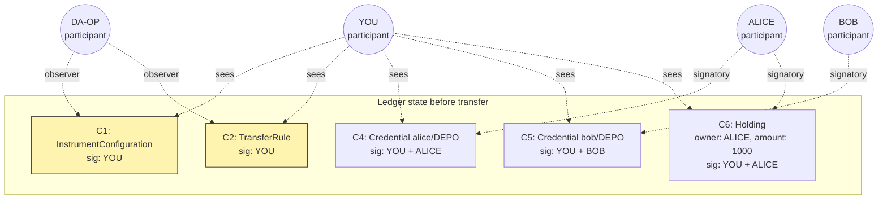
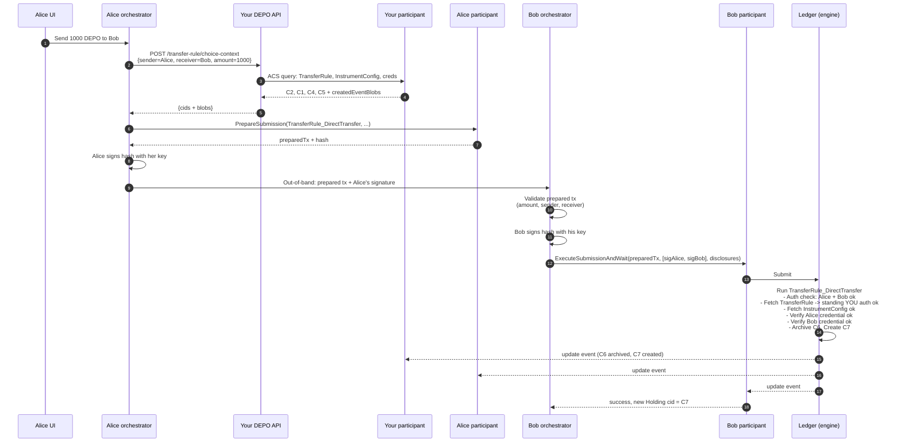
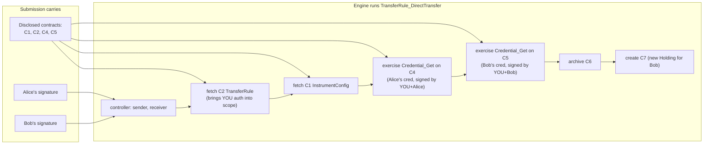

# DEPO cross-entity transfer — full walkthrough

> **Purpose.** End-to-end narration of a single DEPO transfer between two parties hosted on different Canton participants. Walks through every contract, every CID, every signature, every HTTP call. Written to clear up the "who signs / who calls who" confusion that arises once transfers cross participant boundaries.
>
> **Audience.** Anyone building or reviewing the DEPO integration who is unclear on how Daml standing authorization works in practice.
>
> **Companion doc.** [DEPO_dvp_design.md](DEPO_dvp_design.md) — the full DvP build design; this walkthrough is the in-depth explanation of the transfer mechanics that doc assumes.
>
> **Source references.** All Daml citations point to canonical source under [extracted-dars/daml-source/](extracted-dars/daml-source/).

---

## 0. Setup — the parties

| Party | Role | Where hosted |
|---|---|---|
| **DA-OP** | Operator (Digital Asset) | DA's participant |
| **YOU** | Provider + registrar of DEPO (same party in your setup) | Your Blockdaemon NaaS participant |
| **ALICE** | DEPO holder, current owner of the Holding being transferred | Her own participant (could be different bank) |
| **BOB** | DEPO holder, will be the new owner | His own participant (could be different bank) |

What ALICE wants: send 1,000 DEPO to BOB.

---

## 1. What already exists on the ledger before ALICE does anything

These contracts were created earlier and are sitting on the ledger right now. Each row shows who signed it (so you understand what's invisible to whom) and who can see it.

| # | Contract | Signed by | Who can see it on the ledger | Why it exists |
|---|---|---|---|---|
| C1 | `InstrumentConfiguration` for DEPO | YOU | YOU + DA-OP (observer). NOT Alice, NOT Bob. | Declares DEPO exists and what credentials its holders need |
| C2 | `TransferRule` for DEPO | YOU | YOU + DA-OP (observer). NOT Alice, NOT Bob. | Your standing pre-authorization that DEPO can move when sender + receiver agree |
| C3 | `AllocationFactory` for DEPO | YOU | YOU + DA-OP (observer). NOT Alice, NOT Bob. | (For DvP — not used in plain transfer; included for completeness) |
| C4 | `Credential` "Alice isHolderOf DEPO" | YOU + ALICE | YOU + ALICE | Alice's authorization to hold DEPO |
| C5 | `Credential` "Bob isHolderOf DEPO" | YOU + BOB | YOU + BOB | Bob's authorization to hold DEPO |
| C6 | `Holding` of 1,000 DEPO, owner=ALICE | YOU + ALICE | YOU + ALICE | The actual balance Alice owns |

> **Visibility rule.** Daml participants only see contracts whose signatory or observer set includes a party they host. Alice's participant cannot see C1, C2, C3, or C5 by default. Bob's participant cannot see C1, C2, C3, or C4 by default. This is the heart of why your endpoints exist — to disclose these contracts at submission time.

---

## 2. The six stages, narrated

### Stage 1 — Alice decides to send

Alice's user interface (or back office system) tells Alice's orchestrator: "Send 1,000 DEPO to Bob."

At this moment Alice's orchestrator knows:
- Her own party id
- Bob's party id (from her address book / counterparty record)
- Amount: 1,000
- Instrument id: `(admin=YOU, id="DEPO")`
- The Holding CID she wants to spend (C6) — she can see it on her own participant

She does NOT know:
- The `TransferRule` CID (C2) — invisible to her
- The `InstrumentConfiguration` CID (C1) — invisible to her
- Her own credential CID (C4) — she actually can see this one because she's a signatory
- Bob's credential CID (C5) — invisible to her

### Stage 2 — Alice realizes she needs CIDs she can't see

Her client code knows the shape of a `TransferRule_DirectTransfer` exercise (because she's built against your DEPO SDK). It knows the choice reads three things from `extraArgs.context`:

- `instrumentConfigurationContextKey` → expects a CID
- `senderCredentialsContextKey` → expects a list of CIDs
- `receiverCredentialsContextKey` → expects a list of CIDs

And the exercise targets a `TransferRule` contract, so she needs that contract's CID too. Four CIDs total are blind spots. Plus she needs the disclosure blobs so her participant can prove visibility when it submits.

### Stage 3 — Alice's orchestrator calls your service

Alice's orchestrator makes one HTTP call to your DEPO Registrar API:

```
POST https://depo.yourbank.example/api/v1/depo/transfer-rule/choice-context
Authorization: mTLS (Alice's cert)
Body: {
  "instrumentId": "DEPO",
  "sender":   "alice::<participant-hash>",
  "receiver": "bob::<participant-hash>",
  "amount":   "1000.0000000000"
}
```

Your service does five queries on **your** participant's ACS:

```
Q1: query TransferRule where provider=YOU, registrar=YOU                  → C2
Q2: query InstrumentConfiguration where id="DEPO"                         → C1
Q3: query Credential where holder=ALICE, issuer=YOU, claim=isHolderOf:DEPO → C4
Q4: query Credential where holder=BOB,   issuer=YOU, claim=isHolderOf:DEPO → C5
Q5: optionally check expiries / runtime policy gates
```

Each row your service gets back includes a `createdEventBlob` — a signed binary blob from your participant that proves the contract exists and is currently active. These blobs are what allow another participant (Alice's) to use these contracts without being a stakeholder on them.

Your service returns:

```
200 OK
{
  "transferRuleCid":           "<C2 cid>",
  "instrumentConfigurationCid":"<C1 cid>",
  "senderCredentialCid":       "<C4 cid>",
  "receiverCredentialCid":     "<C5 cid>",
  "disclosedContracts": [
    { "templateId": "...TransferRule",            "contractId": "<C2 cid>", "createdEventBlob": "<base64>", "synchronizerId": "..." },
    { "templateId": "...InstrumentConfiguration", "contractId": "<C1 cid>", "createdEventBlob": "<base64>", "synchronizerId": "..." },
    { "templateId": "...Credential",              "contractId": "<C4 cid>", "createdEventBlob": "<base64>", "synchronizerId": "..." },
    { "templateId": "...Credential",              "contractId": "<C5 cid>", "createdEventBlob": "<base64>", "synchronizerId": "..." }
  ]
}
```

Your service did NOT sign anything. It did NOT submit anything to the ledger. It just answered a read-only query and handed back blobs.

### Stage 4 — Alice constructs the Daml command

Alice's orchestrator now has every piece. She builds the command:

```
Exercise TransferRule_DirectTransfer
  on contract: <C2 cid>                       ← the TransferRule
  arguments:
    transfer:
      sender:      alice
      receiver:    bob
      amount:      1000.0000000000
      instrumentId: { admin: YOU, id: "DEPO" }
      inputHoldingCids: [ <C6 cid> ]           ← Alice's Holding
      meta: { values: {} }
    extraArgs:
      context:
        "utility.digitalasset.com/instrument-configuration": <C1 cid>
        "utility.digitalasset.com/sender-credentials":       [ <C4 cid> ]
        "utility.digitalasset.com/receiver-credentials":     [ <C5 cid> ]
      meta: { values: {} }
    expectedOperator: DA-OP
    expectedProvider: Some YOU

Submitter wrapper:
  actAs: [ alice, bob ]                        ← who signs this submission
  disclosedContracts: [ C2blob, C1blob, C4blob, C5blob ]
```

### Stage 5 — Signatures are gathered

This is the part that's confusing without a walkthrough. The `actAs` list says `[alice, bob]` — two signatures are needed. **Where do they come from?**

Two cases depending on how Alice and Bob coordinate:

**Case A — Negotiated trade (most common for cross-bank).** Alice and Bob agreed off-chain that this transfer will happen. Alice's orchestrator:

1. Calls Canton's `PrepareSubmission` on her participant with the command above → gets back a prepared transaction (a hash plus payload).
2. Signs the hash with Alice's Vault/KMS key.
3. Sends the prepared transaction + Alice's signature to Bob's orchestrator over a private channel.
4. Bob's orchestrator validates the prepared transaction (sanity-checks amount, sender, receiver match what Bob agreed to off-chain).
5. Bob signs the hash with Bob's Vault/KMS key.
6. Bob's orchestrator submits `ExecuteSubmissionAndWait` with both signatures attached. **Either Alice or Bob can be the actual submitter** — the engine doesn't care who clicked "send"; it cares that both signatures are valid.

**Case B — Two-step on-chain.** Alice exercises `TransferRule_TwoStepTransfer` (the locked variant at [Transfer.daml:63](extracted-dars/daml-source/utility-registry-v0-0.6.0/utility-registry-v0-0.6.0-a236e8e22a3b5f199e37d5554e82bafd2df688f901de02b00be3964bdfa8c1ab/Utility/Registry/V0/Rule/Transfer.daml#L63)) which locks Alice's Holding and creates a transfer offer Bob can see and accept. Bob then exercises an accept choice in a second transaction. Two separate transactions; each carries one signature. Slower but no off-chain coordination needed.

This walkthrough continues with Case A because it's what you'd build first.

### Stage 6 — The engine runs the choice

Bob's participant submits `ExecuteSubmissionAndWait`. The transaction is broadcast across Canton. Every participant hosting a stakeholder validates independently. The Daml engine runs `TransferRule_DirectTransfer` step by step:

1. **Authority check (Daml engine):** controller list is `transfer.sender, transfer.receiver` = `alice, bob`. Both signatures present in the submission. ✓
2. **Fetch TransferRule (C2):** confirms `provider, registrar` are signatories of the rule → your authority is now in scope for any sub-action that needs it. ✓
3. **Run `executeTransfer`** (the helper at [Transfer.daml:235+](extracted-dars/daml-source/utility-registry-v0-0.6.0/utility-registry-v0-0.6.0-a236e8e22a3b5f199e37d5554e82bafd2df688f901de02b00be3964bdfa8c1ab/Utility/Registry/V0/Rule/Transfer.daml#L235)). Inside, it:
   - Reads `instrumentConfigurationCid` from context → fetches C1 → checks `admin == YOU` matches the transfer's `instrumentId.admin`. ✓
   - Reads `senderCredentialCids` from context → exercises `Credential_Get` on C4 → confirms Alice's credential is valid → satisfies `holderRequirements` for sender. ✓
   - Reads `receiverCredentialCids` from context → exercises `Credential_Get` on C5 → confirms Bob's credential is valid → satisfies `holderRequirements` for receiver. ✓
   - Fetches the input Holding (C6) → confirms owner=Alice, instrument=DEPO, amount≥1000, unlocked. ✓
   - Archives C6, creates new Holding (C7) with owner=Bob, amount=1000. ✓
4. **Commit:** the transaction is broadcast confirmation-ready. Every participant hosting Alice, Bob, You, or DA-OP confirms. The engine commits.

After commit:
- C6 is archived (Alice's old Holding gone).
- C7 is created (Bob's new Holding signed by YOU + Bob).
- Update events are streamed to all stakeholders' participants.

**Crucially: you (your participant) confirmed the transaction but did not submit it and did not sign anything live.** Your authority flowed in through C2 (TransferRule signed by you at bootstrap) and C1 + C4 + C5 (all signed by you previously). All standing authority.

---

## 3. Step-by-step table

| Step | Actor | Action | Contract(s) touched | Where it happens | Who signs |
|---|---|---|---|---|---|
| 1 | Alice's UI | "Send 1,000 DEPO to Bob" | — | Off-chain | — |
| 2 | Alice's orchestrator | POST `/transfer-rule/choice-context` | — | HTTPS call to YOU | — |
| 3 | Your API | Query ACS for C1, C2, C4, C5 | C1, C2, C4, C5 | Your participant | — |
| 4 | Your API | Return CIDs + disclosure blobs | — | HTTPS response | — |
| 5 | Alice's orchestrator | Build `TransferRule_DirectTransfer` command with the CIDs | — | Off-chain | — |
| 6 | Alice's orchestrator | `PrepareSubmission` on Alice's participant | — | Alice's participant (no commit yet) | — |
| 7 | Alice's orchestrator | Sign prepared-tx hash with Alice's key | — | Alice's Vault | Alice |
| 8 | Alice's orchestrator | Send prepared-tx + Alice's sig to Bob | — | Off-chain channel (mTLS to Bob) | — |
| 9 | Bob's orchestrator | Validate prepared-tx (amount, parties) | — | Off-chain | — |
| 10 | Bob's orchestrator | Sign prepared-tx hash with Bob's key | — | Bob's Vault | Bob |
| 11 | Bob's orchestrator | `ExecuteSubmissionAndWait` with both sigs | — | Bob's participant submits | — |
| 12 | Canton engine | Run `TransferRule_DirectTransfer` | C2 (fetched), C1 (fetched), C4 (fetched), C5 (fetched), C6 (archived), C7 (created) | All stakeholders' participants | — (uses sigs from steps 7+10 + standing authority from C1, C2, C4, C5) |
| 13 | Ledger | Stream update events to stakeholders | — | YOU, Alice, Bob, DA-OP | — |

**Notice:** between step 4 and step 13, **your service is silent**. You participate as a Daml stakeholder via your already-signed standing contracts, but your service does not sign or submit anything in real time.

---

## 4. Illustrations

### 4.1 Contract visibility at the start



Yellow = contracts ALICE cannot see directly. These are the ones your endpoint must disclose.

### 4.2 The transfer flow



### 4.3 Authority flow during the engine run



Read this diagram as a chain of preconditions. The runtime signatures (Alice, Bob) satisfy the controller list at the top. Then each fetched contract supplies the standing authority (yours) needed to perform sub-actions. Finally the archive/create operations run because all required authority is in scope.

---

## 5. Common misconceptions, cleared up

| Misconception | Reality |
|---|---|
| "I'm the registrar so I have to sign every transfer." | No. You signed the TransferRule once. That carries your authority forever (until you archive it). Per-transfer signing by you is optional, only used if you want real-time policy gates. |
| "Alice can submit the transfer alone." | No. Bob's signature is required because Bob is a controller. Either Bob signs in a prepared-tx flow (Case A), or Alice does a two-step transfer and Bob accepts later (Case B). |
| "Bob can see the TransferRule because it's a public contract." | No. The TransferRule's signatories are you alone; its observer is DA-OP. Bob's participant has no visibility until you disclose it via the choice-context endpoint at submit time. |
| "Disclosure means publishing the contract." | No. Disclosure means handing Bob's participant a signed blob (`createdEventBlob`) that proves your participant attests this contract exists right now. Bob's participant validates the blob and uses it for that one transaction. Nothing is permanently shared. |
| "Your service must be online for the transfer to happen." | Only at Stage 3 (choice-context fetch). Once Alice has the response, your service can go offline and the transfer still completes. |
| "If Alice's credential expires mid-transfer, the transfer fails." | Only if it's expired at the moment the engine runs `Credential_Get`. Until then it's valid. Credentials are not consumed by use. |

---

## 6. The one-paragraph summary

You create the `TransferRule` (and `InstrumentConfiguration` and per-holder `Credential`s) at instrument setup. These signed contracts are your **standing authorization** — they carry your provider/registrar consent to any future transfer that satisfies their runtime checks. Alice (or any DEPO holder) initiates a transfer by calling your read-only HTTPS endpoint to fetch the CIDs and disclosure blobs she can't see. She then builds a `TransferRule_DirectTransfer` command, gathers Bob's signature out-of-band (or uses two-step on-chain), and submits the transaction from her own (or Bob's) participant. The engine runs the choice, verifies all credentials and the instrument config, archives Alice's old Holding, creates Bob's new one. Your participant confirms but doesn't actively sign in real time. Your **operational role per transfer is one HTTP GET** — not a signature, not a submission. The reason the design feels "different from a database ACL" is that the authorization is enforced by the Daml engine using the standing-contract chain, not by your code making allow/deny decisions.

---

## 7. Source references

- `TransferRule` template + `TransferRule_DirectTransfer` choice: [Transfer.daml:29-61](extracted-dars/daml-source/utility-registry-v0-0.6.0/utility-registry-v0-0.6.0-a236e8e22a3b5f199e37d5554e82bafd2df688f901de02b00be3964bdfa8c1ab/Utility/Registry/V0/Rule/Transfer.daml#L29-L61)
- `TransferRule_TwoStepTransfer` (Case B variant): [Transfer.daml:63-83](extracted-dars/daml-source/utility-registry-v0-0.6.0/utility-registry-v0-0.6.0-a236e8e22a3b5f199e37d5554e82bafd2df688f901de02b00be3964bdfa8c1ab/Utility/Registry/V0/Rule/Transfer.daml#L63-L83)
- `Credential` template (signatory: issuer + holder): [Credential.daml:60-83](extracted-dars/daml-source/utility-credential-v0-0.1.0/utility-credential-v0-0.1.0-5a29ead611a0abd5f5b3fc3caf7d0f67c0ff802032ab6d392824aa9060e56d70/Utility/Credential/V0/Credential.daml#L60-L83)
- `InstrumentConfiguration` template: [Instrument.daml:18-42](extracted-dars/daml-source/utility-registry-v0-0.6.0/utility-registry-v0-0.6.0-a236e8e22a3b5f199e37d5554e82bafd2df688f901de02b00be3964bdfa8c1ab/Utility/Registry/V0/Configuration/Instrument.daml#L18-L42)
- Existing single-participant transfer code (Regime 1): [registry-client/src/transfer.js](registry-client/src/transfer.js)
