# Canton Network Architecture and Daml Contract Model

## Executive Summary

The Canton Network is a privacy-preserving, interoperable ledger infrastructure designed for regulated financial markets, built around validator nodes, synchronizers, and the Daml smart contract language. Its architecture separates contract execution and storage at validator nodes from ordering and consensus in synchronization domains, enabling high privacy by distributing only encrypted transaction envelopes on a need-to-know basis. Daml contracts define fine-grained authorization and privacy at the language level, and the Canton protocol faithfully enforces these rules across a virtual shared ledger that can span many domains and applications.[1][2][3][4][5][6][7]

## 1. Canton Network Overview

### 1.1 Purpose and Design Goals

Canton is positioned as a ledger interoperability protocol and network that connects Daml-based ledgers into a single virtual global ledger while preserving strong privacy and authorization guarantees. The network is purpose-built for institutional finance, aiming to support regulated applications, tokenization, and cross-application atomic settlement across multiple asset classes.[5][8][6][7][1]

Key goals include:

- **Privacy by design**: Only participants involved in a contract or transaction see its plaintext contents; all other infrastructure handles encrypted envelopes.[2][3][5]
- **Regulatory-grade controls**: Support for permissioned participation, compliance alignment, and institution-friendly operational models.[9][10][1]
- **Interoperability and composability**: Ability to connect independent applications and sub-networks while allowing atomic, cross-domain transactions on a shared infrastructure.[4][6][7]
- **Scalability and resilience**: Distributed validator sets and synchronizers that provide finality, fault tolerance, and high throughput for institutional volumes.[3][11][4]

### 1.2 High-Level Architecture

Digital Asset's Canton platform documentation describes a topology where validator nodes achieve consensus through synchronizers, with transaction data distributed on a need-to-know basis rather than being fully replicated to all nodes. Earlier Canton documentation refers to participant nodes and synchronization domains, which are conceptually aligned with validator nodes and synchronizers on the production Canton Network. The network as a whole forms an "open virtual shared ledger" composed of many underlying domains and applications.[6][9][3][5]

At a high level, Canton's architectural elements are:

- **Validator nodes / participant nodes**: Run Daml applications, store contract state for hosted parties, and execute smart contracts.
- **Synchronizers / synchronization domains**: Provide ordering, sequencing, and consensus for encrypted transactions within a domain.
- **Global Synchronizer**: A special, decentralized synchronization service used for cross-domain interoperability.
- **Applications and sub-networks**: Daml-based business applications and purpose-specific domains deployed by institutions.
- **Ecosystem services**: Custodians, wallets, interoperability providers, and other infrastructure integrating with Canton assets.[10][12][13][11][1][6]

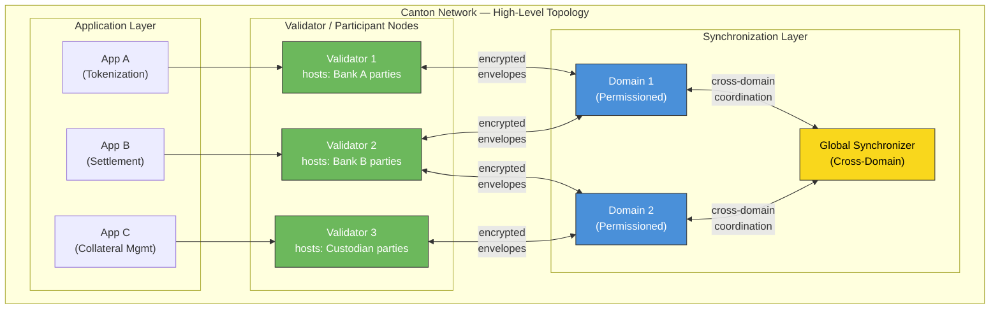

## 2. Core Network Components

### 2.1 Validator / Participant Nodes

The Canton Network overview describes nodes known as **validators** that are responsible for storing contract data, executing smart contract code, and participating in consensus via synchronizers. Earlier Canton documentation refers to **participant nodes**, which host parties and maintain their views of the shared ledger, mapping parties to underlying ledger state.[7][5][6]

Conceptually, a validator/participant node has the following responsibilities:

- Maintain the active contract set for the parties it hosts, using an underlying database such as Postgres.[5]
- Execute Daml transactions and validate authorization and privacy constraints defined at the contract level.[7][5]
- Communicate with synchronizers to submit encrypted transaction envelopes and receive ordered notifications.[2][3][4]
- Enforce need-to-know distribution of contract payloads to other participants involved in a transaction.[5][7]

A simplified logical view of a validator/participant node:


### 2.2 Synchronizers and Synchronization Domains

Canton documentation defines a **synchronization domain** (often shortened to **domain**) as the component that provides a total order of encrypted transactions, transparency of ledger changes to designated participants, and finality for committed transactions. The domain can be backed by various underlying technologies, including relational databases or blockchains like Hyperledger Fabric or Ethereum, as long as it satisfies Canton's functional and non-functional requirements.[3]

Key functional responsibilities of a synchronization domain include:[3]

- **Synchronization**: Establish a total order of transactions.
- **Transparency**: Notify the right participants about ledger changes.
- **Finality**: Ensure append-only, finalized transaction history.
- **Notification support**: Provide offset-based access to ledger notifications.

Non-functional requirements emphasize reliability (including failover for domain entities and resilience to faults), performance, and privacy given that domains only see encrypted transactions.[3]

#### 2.2.1 Domain Sub-Components

A synchronization domain is internally composed of three key entities that work together to provide the ordering and consensus guarantees:[3][5]

- **Sequencer**: Provides a total-order multicast service. All participants connected to a domain receive messages in the same order. The sequencer timestamps each message, establishing a global ordering within the domain. It only handles encrypted envelopes and never sees plaintext contract data.
- **Mediator**: Coordinates the confirmation protocol (Canton's two-phase commit). It collects confirmation and rejection responses from participants, computes the transaction result, and distributes the final verdict. The mediator sees only encrypted metadata — it knows which participants are involved but not what the transaction contains.
- **Topology Manager**: Manages the identity-to-key mappings and domain membership. It maintains the set of registered participants, their signing and encryption keys, and domain-level configuration such as permissioning policies.

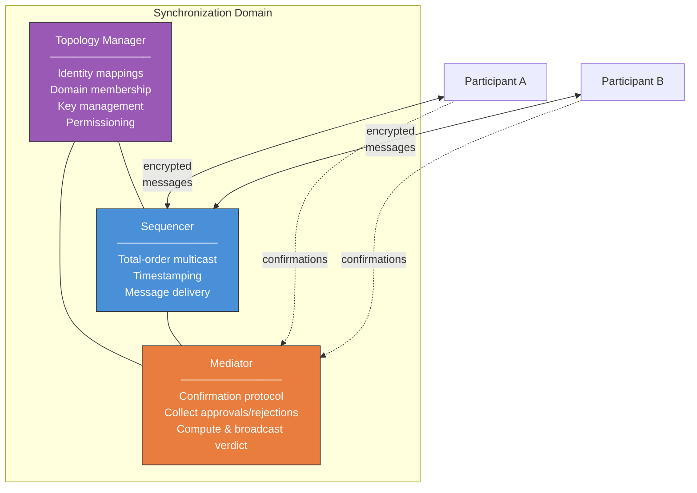


The **Global Synchronizer** is described as a fundamental component that ensures ordering, consensus, and privacy across all participants in a synchronization domain, coordinating two-phase commit for atomic transactions while only seeing encrypted transaction data. In architectural diagrams, participant nodes send encrypted transactions to the Global Synchronizer, which sequences and coordinates them and then distributes ordered notifications back to participants.[2]

### 2.3 Permissioned and Open Domains

The Canton user manual describes that the overall Canton virtual ledger is composed of multiple sync domains, which can be configured as open or permissioned. Open domains allow any participant with access to a sequencer node to join, while permissioned domains require the operator (via topology managers) to explicitly allow-list participants before they can register.[9]

Control layers include:

- **Network-level access control**: Standard tools such as firewalls and VPNs to restrict access to sequencer public APIs.[9]
- **Domain configuration**: Topology flags (for example, `topology.open = false`) to enforce permissioning at the domain level.[9]

This configuration model supports institutional deployments where only vetted validators can participate in specific domains, aligning with regulatory and risk controls.

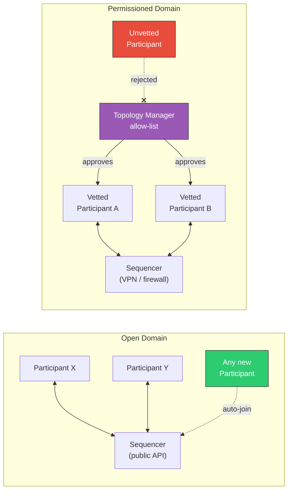

## 3. Transaction Lifecycle and Confirmation Protocol

### 3.1 Transaction Submission and Confirmation (Two-Phase Commit)

Canton uses a confirmation protocol — a variant of two-phase commit — to atomically commit transactions across participants within a domain. The protocol ensures that all stakeholders agree on the validity of a transaction before it is committed, and that invalid or conflicting transactions are rejected.[5][7][3]

The protocol proceeds through the following phases:

**Phase 1 — Submission and Distribution:**
1. The submitting participant constructs the full transaction tree locally, executing all Daml contract logic.
2. The transaction tree is decomposed into **views** — each view contains only the information relevant to a specific set of stakeholders. Each view is encrypted with the public keys of its intended recipients.
3. The encrypted views (packaged as a **confirmation request**) are sent to the domain's **sequencer**, which timestamps and totally orders the request.
4. The sequencer distributes the confirmation request to all involved participants. Each participant can only decrypt the views addressed to them.

**Phase 2 — Confirmation and Verdict:**
5. Each receiving participant decrypts its views, validates the transaction (checking authorization, consistency, and that input contracts are active), and sends a **confirmation response** (approve or reject) to the **mediator** via the sequencer.
6. The mediator collects all responses. If all confirming parties approve, the mediator issues an **approval verdict**. If any party rejects, a **rejection verdict** is issued.
7. The verdict is distributed through the sequencer to all participants, who then either commit the transaction (updating their active contract sets) or discard it.

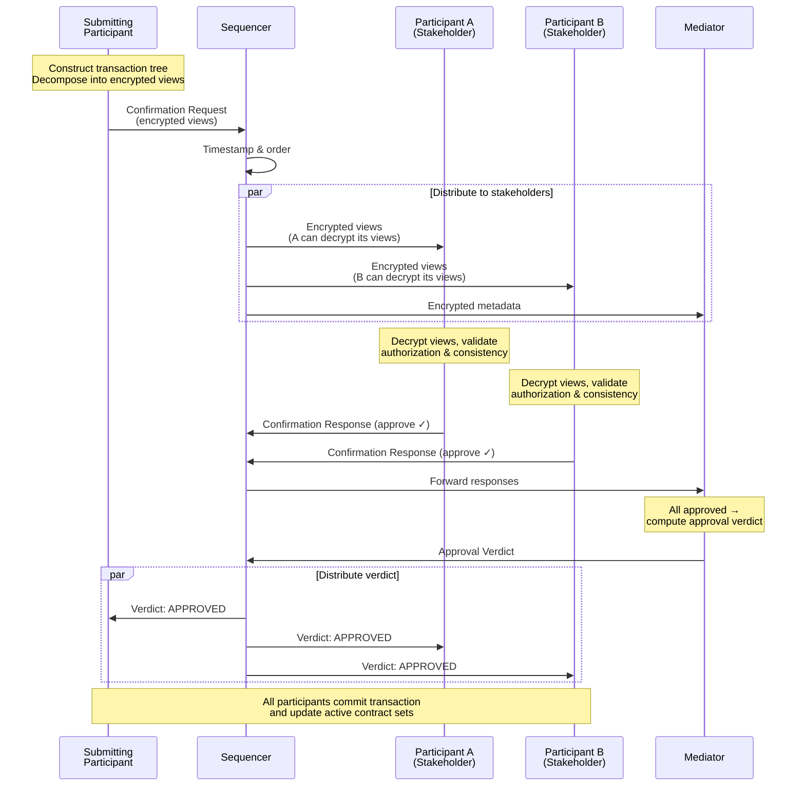


### 3.2 Transaction Views and View Encryption

A critical aspect of Canton's privacy model is how transactions are decomposed into **views** before being submitted to a domain. Each view represents a subtree of the full transaction tree, containing only the actions visible to a specific set of parties.[7][5]

- The **full transaction tree** is known only to the submitting participant.
- Each stakeholder receives a **projected view** containing the actions they are entitled to see under Daml's privacy rules.
- Views are encrypted using the recipient parties' public keys, so even the sequencer and mediator cannot read them.
- A party who is a stakeholder on a top-level action but not on a nested subaction will see a **blinded hash** in place of the subaction, preserving the tree structure without revealing hidden content.

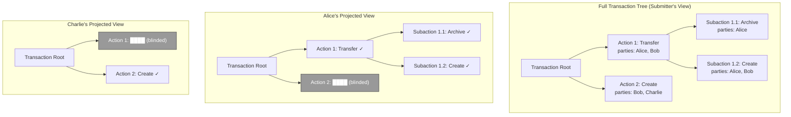

### 3.3 Conflict Detection

Canton uses a UTXO-like model for conflict detection. Since active contracts can only be consumed once, Canton must detect and reject double-spend attempts. This is handled during the confirmation protocol:[7][5]

- Each participant tracks which contracts are active in its local store.
- When a participant receives a confirmation request that consumes a contract, it checks whether that contract is still active.
- If the contract has already been consumed by a previously committed transaction, the participant sends a **rejection** response.
- The mediator aggregates responses — a single rejection from a confirming party triggers a rejection verdict for the entire transaction.
- The sequencer's total ordering ensures that conflicting transactions are processed in a deterministic sequence, so all honest participants reach the same conflict-detection outcome.

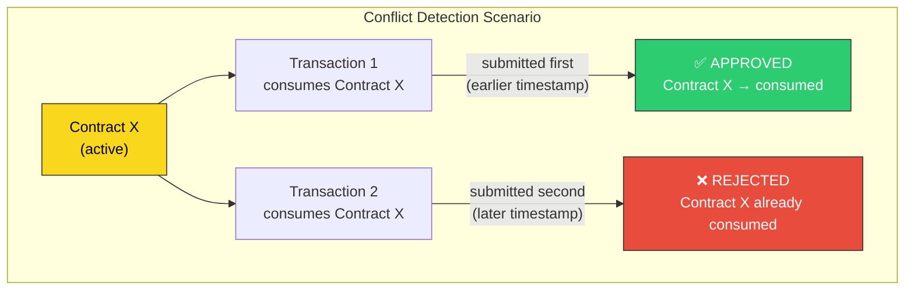

## 4. Interoperability and Global Architecture

### 4.1 Virtual Shared Ledger and Domain Composition

The Canton introduction explicitly describes the protocol as connecting different Daml ledgers into a single virtual global ledger. Each domain provides ordering and finality for a subset of contracts, but the Canton protocol allows parties on different participant nodes to transact as if they shared a common ledger, as long as they share connectivity to appropriate domains.[7][5]

The Canton whitepaper explains that contracts are associated with domains that act as the authority for ordering actions on those contracts, and that contracts can be transferred between domains by changing which domain is responsible for ordering their actions. Cross-domain transactions are allowed when there exists a single domain to which all participants in a transaction are connected, preserving atomicity while maintaining resilience and privacy.[7]

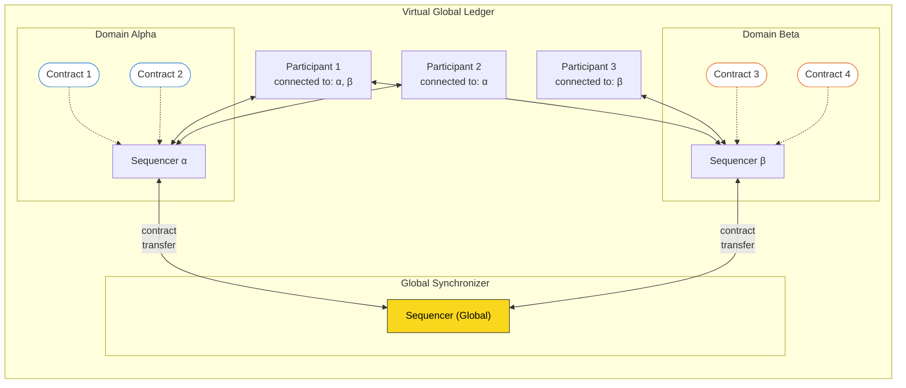

### 4.2 Cross-Domain Contract Transfers

When a transaction requires participants that are not all connected to the same domain, Canton performs a **contract transfer** to move the relevant contract(s) to a domain where all parties can interact. The transfer protocol ensures atomicity — the contract is deactivated on the source domain and activated on the target domain as a single logical operation.[7][5]

The transfer proceeds in two steps:

1. **Transfer-Out**: The contract is marked as transferred-out on the source domain. The source domain's sequencer timestamps this event, and all stakeholders on the source domain are notified. The contract is no longer active on the source domain after this point.
2. **Transfer-In**: The contract is registered on the target domain. The target domain's sequencer timestamps the transfer-in, and the contract becomes active on the target domain. Stakeholders connected to the target domain can now act on it.

The Global Synchronizer can facilitate this coordination, ensuring consistent ordering across domains.

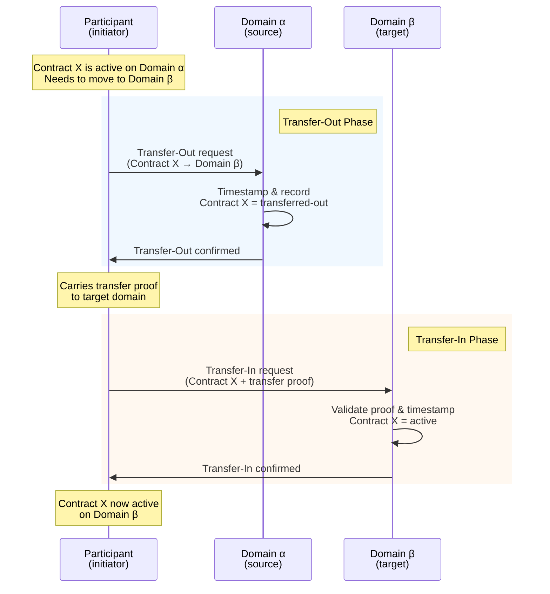


### 4.3 Global Synchronizer and Cross-Domain Interoperability

Industry-focused material describes the **Global Synchronizer** as a decentralized and transparently governed interoperability service connecting Canton domains and applications. It is positioned as the unifying infrastructure that addresses financial industry calls for a common foundation to connect tokenized assets and drive liquidity across fragmented systems.[11][4][2]

In practice, the Global Synchronizer:

- Links separate synchronization domains so that cross-application flows can be coordinated without centralizing all state on a single chain.[4][2]
- Coordinates atomic operations across independent applications by ordering their encrypted transaction envelopes and enforcing consistent results.[4][2][7]
- Preserves privacy by only handling encrypted metadata and envelopes, not plaintext contract contents.[2]

This architecture allows Canton to support cross-chain and cross-domain interoperability while maintaining institutional privacy and compliance guarantees.

### 4.4 External Interoperability Providers

Canton ecosystem documentation notes that the network is seeing integration from major interoperability providers such as Chainlink, LayerZero, and Wormhole. These services connect Canton-based assets and applications to other ecosystems, enabling flows such as cross-chain asset movements or data feeds while leveraging Canton's privacy-preserving infrastructure.[13][14]

In addition, providers such as Ownera and other network-as-a-service firms offer interoperability routing, node hosting, and connectivity services that help financial institutions integrate Canton-based assets into their broader infrastructure.[14][11]

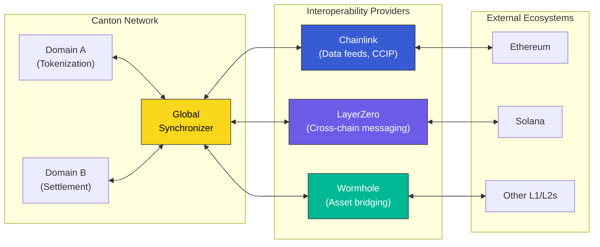

## 5. Ecosystem and Participant Roles

### 5.1 Ecosystem Scale and Composition

The Canton Network ecosystem site describes over **200 partners** across financial institutions, technology providers, exchanges, custodians, and service providers, making it one of the larger institutional blockchain ecosystems. Published figures highlight more than **600 validators**, dozens of super validators, and trillions of dollars in on-chain or processed tokenized volumes, including multi-trillion monthly repo flows.[8][10][13]

The network is governed by the Canton Foundation, with participation from leading global financial institutions, and is powered by the native Canton Coin used for network-level operations. This governance and token model underpins decentralized decision-making, validator incentives, and network sustainability.[8][11]

### 5.2 Institution Types and Roles

Ecosystem materials categorize participants into several broad roles:[12][1][10][11]

- **Application providers**: Organizations building tokenization, trading, settlement, collateral management, and other applications on Canton.
- **Infrastructure providers**: Validators, domain operators, and node hosting providers running the core network infrastructure.
- **Service providers**: Custodians, compliance and KYC services, and other institutional middleware.
- **End users**: Financial institutions and corporates using Canton-based applications for real-world asset flows.

Concrete examples include major global banks (such as Goldman Sachs, Bank of America, Citi, JP Morgan, BNP Paribas, HSBC, BNY Mellon, and State Street) participating as application providers, validators, or custodians in the ecosystem. Other participants include exchanges, digital asset custodians like BitGo, and consulting firms supporting application design and validation.[10][12][14][11][8]

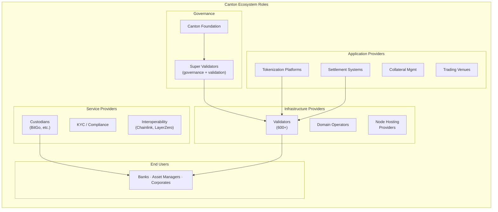

### 5.3 Digital Asset's Role

Digital Asset (DA) is a core ecosystem member providing enterprise-grade technology and services for Canton. DA supplies:[1][12]

- Validator node software and enterprise versions of the Daml SDK.[12][1]
- Pre-built composable applications and utilities covering token standards, collateral mobility, financing, and settlement use cases.[1][12]
- Advisory and implementation services to accelerate institutional deployments.[12][1]

DA is also a Canton Foundation member, a super validator, and a service provider delivering developer tools and network utilities.[12]

## 6. Canton Infrastructure Architecture

### 6.1 Logical Layering

Based on available documentation, Canton's infrastructure can be viewed as a set of layered services:[6][1][5][3]

1. **Application Layer**
   - Daml-based business applications and composable modules.
   - Wallets, exchanges, and middleware integrating Canton assets.

2. **Contract & Ledger Layer**
   - Validator/participant nodes hosting parties and contract state.
   - Daml runtime enforcing authorization and privacy within each node.

3. **Synchronization Layer**
   - Synchronizers and synchronization domains providing ordering and finality.
   - Global Synchronizer for cross-domain interoperability.

4. **Persistence & Infrastructure Layer**
   - Databases and possible blockchain backends supporting domains.[3]
   - Cloud or on-premise infrastructure used by validators and domain operators.

A conceptual stack diagram:

```text
+------------------------------+
|  Daml Applications & Wallets |
+------------------------------+
|  Canton Protocol & Daml RTS |
|  (on Validator/Participant)  |
+------------------------------+
|  Synchronizers & Domains     |
|  (incl. Global Synchronizer) |
+------------------------------+
|  Databases / L1 Integrations |
|  Infrastructure & Hosting    |
+------------------------------+
```

### 6.2 Domain Backends and Integrations

Canton's synchronization domain architecture is designed to be agnostic to specific backend technologies, as long as they satisfy the ordering, transparency, finality, and reliability requirements. Published examples include domains backed by relational databases like Postgres, and integrations with blockchains such as Hyperledger Fabric and Ethereum.[3]

This flexibility allows domain operators to choose backends that match their regulatory, operational, and performance needs, while still participating in the same Canton protocol and interoperability model.[5][3]

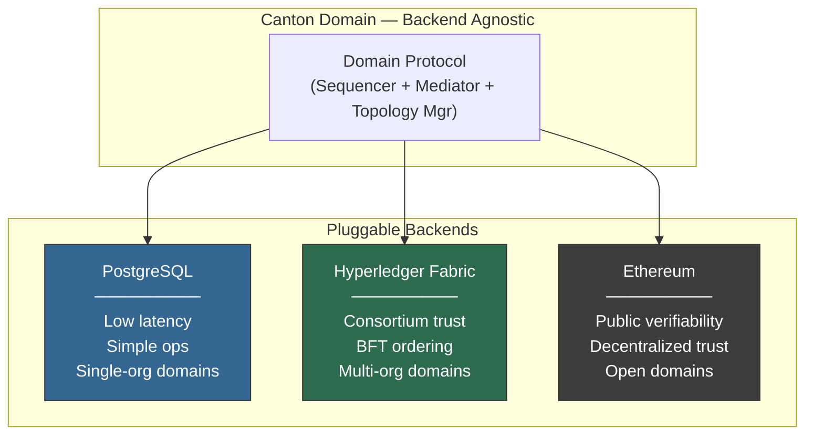

### 6.3 Privacy and Need-to-Know Distribution

The Canton Network overview emphasizes that transaction data is distributed only on a **need-to-know basis**, rather than being fully replicated across all validators as in many other blockchains. Daml's privacy model ensures that actions on a contract are visible only to the contract's stakeholders, and the synchronization protocol faithfully enforces these visibility constraints during transaction propagation.[6][5][7]

Domains and synchronizers therefore only ever see encrypted transaction envelopes and metadata, never plaintext contract contents, while participants exchange the necessary encrypted payloads directly with each other. This architecture provides strong confidentiality while still enabling global ordering and auditability of contract lifecycles.[4][2][7][3]

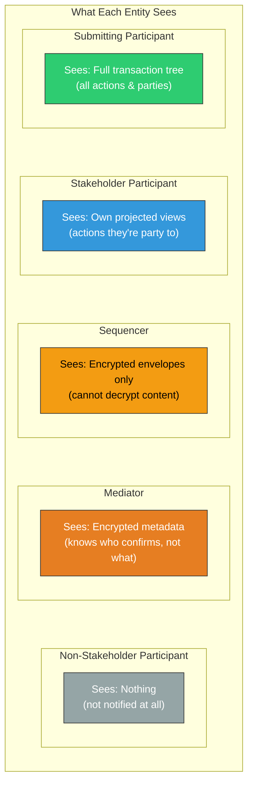

## 7. Daml Contract Architecture on Canton

### 7.1 Daml as the Smart Contract Language

Daml is described in the Canton whitepaper as a smart contract programming language whose distinguishing features are built-in models of authorization and privacy. Contracts are the fundamental data objects in Canton and have unique identifiers, and Daml concisely describes all possible actions on a given contract, including their consequences.[7]

Canton is explicitly introduced as a protocol that faithfully implements the authorization and privacy requirements defined in Daml transactions, so that the behavior specified at the language level is enforced by the distributed infrastructure.[5][7]

### 7.2 Contracts, Actions, and Transactions

The whitepaper explains that Daml transactions are hierarchical, consisting of a list of actions on contracts, where each action can in turn contain a sub-transaction (a list of subactions or consequences). Contracts that have been created but not yet consumed are called **active contracts**, analogous to unspent transaction outputs in systems like Bitcoin.[7]

Key concepts include:[7]

- **Contracts**: Data objects with unique identifiers and associated parties.
- **Actions on contracts**: Operations such as creating a contract or consuming it as part of a transaction.
- **Transactions**: Hierarchical structures composed of actions and subactions.
- **Active contracts**: Contracts created and not yet consumed (similar to UTXOs).

A high-level representation of a Daml transaction:

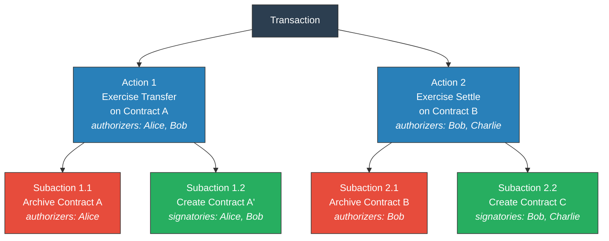


### 7.3 Authorization Model

Daml has a built-in notion of authorization, where every action has one or more required authorizers, representing the parties that must authorize that action. The whitepaper relates this to contract law principles, emphasizing that actions involving a contract cannot occur without the agreement of the relevant parties.[7]

Within a transaction:

- Each create or consume action specifies the parties whose signatures or approvals are required.
- Canton's protocol ensures that these authorizations are collected and validated before a transaction is accepted and committed.[5][7]

This model prevents double spends and unauthorized contract changes, as only duly authorized actions can modify the active contract set.[7]

Daml templates define several party roles that determine authorization requirements:

- **Signatories**: Parties who must authorize the creation of the contract. They are always stakeholders and must consent to any action that creates or archives the contract.
- **Observers**: Parties who can see the contract but cannot unilaterally act on it. They are stakeholders for visibility purposes.
- **Controllers**: Parties authorized to exercise a specific choice (action) on a contract, as defined per-choice in the template.

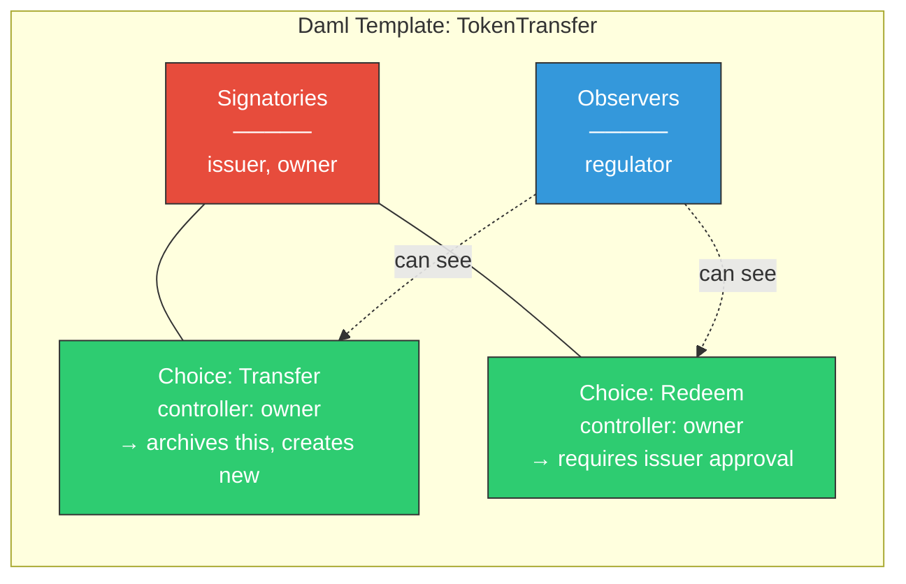

### 7.4 Privacy Model

Daml also provides a built-in model of privacy, where an action on a contract (including its subactions) is visible only to the contract's stakeholders. Stakeholders are the parties with a direct interest in the contract, and only they receive the full details of actions and sub-transactions affecting it.[7]

Canton's synchronization protocol respects this model by:

- Distributing plaintext transaction information only to stakeholders and other parties entitled under the Daml model.[5][7]
- Ensuring that non-stakeholders see at most encrypted metadata or no information at all about unrelated contracts.[2][4][3][7]

This approach enables fine-grained privacy on a shared infrastructure, avoiding the full-public-state model of many traditional blockchains.

### 7.5 Contract Lifecycle

A Daml contract on Canton goes through a well-defined lifecycle from creation to archival (or transfer). Understanding this lifecycle is essential to understanding how the active contract set evolves over time.

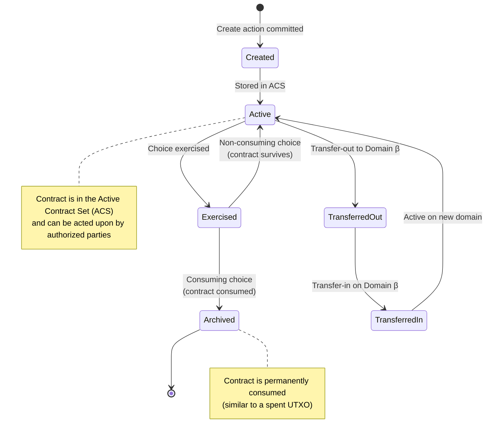
```mermaid
stateDiagram-v2
    [*] --> Created: Create action committed
    Created --> Active: Stored in ACS

    Active --> Exercised: Choice exercised
    Exercised --> Archived: Consuming choice<br/>(contract consumed)
    Exercised --> Active: Non-consuming choice<br/>(contract survives)

    Active --> TransferredOut: Transfer-out to Domain β
    TransferredOut --> TransferredIn: Transfer-in on Domain β
    TransferredIn --> Active: Active on new domain

    Archived --> [*]

    note right of Active
        Contract is in the Active Contract Set (ACS)
        and can be acted upon by authorized parties
    end note

    note right of Archived
        Contract is permanently consumed
        (similar to a spent UTXO)
    end note
```

### 7.6 Relationship Between Daml Contracts and Canton Smart Contracts

In Canton, Daml contracts effectively are the smart contracts: the Daml templates and their defined actions correspond to the business logic executed on validator nodes and coordinated across domains. The Canton protocol does not introduce a separate execution language; instead, it provides the distributed infrastructure that enforces Daml's semantics at scale.[6][5][7]

The relationship can be summarized as:

- **Daml level**: Defines templates, data schemas, and permissible actions (creates, consumes, and other operations) together with authorization and privacy conditions.
- **Canton node level**: Executes Daml-defined transactions locally, checks authorization rules, constructs transaction graphs, and maintains the active contract set for hosted parties.[5][7]
- **Synchronization level**: Orders encrypted transaction envelopes, ensures atomicity and finality, and propagates notifications in line with Daml's visibility rules.[4][2][3][7]

```mermaid
graph TD
    subgraph "Daml Level"
        T["Template Definition<br/>─────────<br/>Data fields<br/>Signatories & observers<br/>Choices (actions)<br/>Ensure clauses"]
        I["Contract Instance<br/>─────────<br/>Unique contract ID<br/>Bound parties<br/>Active / consumed state"]
        TX["Transaction Tree<br/>─────────<br/>Hierarchical actions<br/>Authorization per action<br/>Visibility per subtree"]

        T -->|"instantiation"| I
        I -->|"actions within tx"| TX
    end

    subgraph "Canton Node Level"
        ENG["Protocol Engine<br/>─────────<br/>Execute Daml logic<br/>Validate authorization<br/>Construct tx tree<br/>Encrypt into views"]
        ACS["Active Contract Set<br/>─────────<br/>Local DB (Postgres)<br/>Track active contracts<br/>Conflict detection"]

        TX -->|"submit"| ENG
        ENG -->|"commit / reject"| ACS
    end

    subgraph "Synchronization Level"
        SEQ2["Sequencer<br/>─────────<br/>Total-order multicast<br/>Timestamp messages"]
        MED2["Mediator<br/>─────────<br/>Collect confirmations<br/>Issue verdict"]

        ENG -->|"encrypted<br/>envelopes"| SEQ2
        SEQ2 <--> MED2
        MED2 -->|"verdict"| ENG
    end

    style T fill:#8e44ad,stroke:#333,color:#fff
    style I fill:#8e44ad,stroke:#333,color:#fff
    style TX fill:#8e44ad,stroke:#333,color:#fff
    style ENG fill:#2980b9,stroke:#333,color:#fff
    style ACS fill:#2980b9,stroke:#333,color:#fff
    style SEQ2 fill:#e67e22,stroke:#333,color:#fff
    style MED2 fill:#e67e22,stroke:#333,color:#fff
```

### 7.7 Visual Model of Daml Contracts on Canton

Based on available descriptions, the following conceptual diagram illustrates how Daml contracts underpin Canton smart contracts:

```mermaid
graph TD
    subgraph "Daml Level"
        T["Template Definition<br/>─────────<br/>Data fields<br/>Signatories & observers<br/>Choices (actions)<br/>Ensure clauses"]
        I["Contract Instance<br/>─────────<br/>Unique contract ID<br/>Bound parties<br/>Active / consumed state"]
        TX["Transaction Tree<br/>─────────<br/>Hierarchical actions<br/>Authorization per action<br/>Visibility per subtree"]

        T -->|"instantiation"| I
        I -->|"actions within tx"| TX
    end

    subgraph "Canton Node Level"
        ENG["Protocol Engine<br/>─────────<br/>Execute Daml logic<br/>Validate authorization<br/>Construct tx tree<br/>Encrypt into views"]
        ACS["Active Contract Set<br/>─────────<br/>Local DB (Postgres)<br/>Track active contracts<br/>Conflict detection"]

        TX -->|"submit"| ENG
        ENG -->|"commit / reject"| ACS
    end

    subgraph "Synchronization Level"
        SEQ2["Sequencer<br/>─────────<br/>Total-order multicast<br/>Timestamp messages"]
        MED2["Mediator<br/>─────────<br/>Collect confirmations<br/>Issue verdict"]

        ENG -->|"encrypted<br/>envelopes"| SEQ2
        SEQ2 <--> MED2
        MED2 -->|"verdict"| ENG
    end

    style T fill:#8e44ad,stroke:#333,color:#fff
    style I fill:#8e44ad,stroke:#333,color:#fff
    style TX fill:#8e44ad,stroke:#333,color:#fff
    style ENG fill:#2980b9,stroke:#333,color:#fff
    style ACS fill:#2980b9,stroke:#333,color:#fff
    style SEQ2 fill:#e67e22,stroke:#333,color:#fff
    style MED2 fill:#e67e22,stroke:#333,color:#fff
```
This diagram emphasizes that Daml's contract and transaction model is the foundation of Canton's smart contract behavior, while the Canton architecture provides the distributed consensus, privacy-preserving messaging, and interoperability.

## 8. Operational Considerations

### 8.1 Node and Domain Operations

Digital Asset's platform documentation includes guidance on operating participant nodes and synchronizers, indicating that institutions can deploy their own nodes and set up domains that satisfy Canton's topology and security requirements. Domain operators configure permissioning, protocol versions, and infrastructure parameters (for example, setting `topology.open` for permissioned domains), and validators connect to these domains via defined connection configurations.[15][1][9][3]

Operational best practices highlighted in documentation include securing sequencer APIs using firewalls and VPNs and ensuring domain entities can tolerate crash faults through redundant deployments.[9][3]

### 8.2 Custody, Wallets, and Access

Ecosystem partners such as BitGo provide custody support for Canton Coin and assets on the Canton Network, offering qualified custody, institutional insurance, and self-custody wallet infrastructure tailored to institutional requirements. Other ecosystem services focus on integrating wallets, exchanges, and settlement systems with Canton-based assets, providing compliant access paths for institutional users.[14][10][1][12]

### 8.3 Governance and Standards

Press releases and ecosystem communications emphasize that the Canton Network is governed by the Canton Foundation with participation from major financial institutions, with a focus on establishing industry-wide standards for digital assets and cross-border collateral mobility. Working groups explore use cases such as 24/7 cross-border repo and collateral mobility, demonstrating Canton's ability to handle production-grade institutional workflows on a shared, interoperable infrastructure.[13][8]

## 9. Summary of Key Architectural Properties

```mermaid
mindmap
    root((Canton<br/>Architecture))
        Privacy
            Need-to-know distribution
            Encrypted envelopes on domain
            View-based decomposition
            Only stakeholders see plaintext
        Execution Model
            Daml smart contracts
            UTXO-like active contracts
            Hierarchical transactions
            Language-level auth & privacy
        Consensus
            Two-phase confirmation protocol
            Sequencer total ordering
            Mediator verdict aggregation
            Deterministic conflict detection
        Interoperability
            Multi-domain virtual ledger
            Cross-domain contract transfers
            Global Synchronizer
            External bridges (Chainlink, etc.)
        Institutional Design
            Permissioned & open domains
            Pluggable backends
            Canton Foundation governance
            600+ validators
```

- **Privacy-preserving virtual shared ledger**: Canton connects multiple Daml-ledgers into a global ledger where only involved parties see contract details, while infrastructure nodes see only encrypted transaction envelopes.[6][2][5][7]
- **Separated execution and ordering**: Validator/participant nodes execute Daml contracts and maintain state, while synchronization domains and the Global Synchronizer provide ordering, finality, and interoperability.[2][4][6][3]
- **Language-level authorization and privacy**: Daml's built-in models for authorization and privacy directly determine which actions are allowed and who can see them, with Canton enforcing these models across distributed nodes.[5][7]
- **Interoperable institutional ecosystem**: A large and growing ecosystem of validators, application providers, custodians, and interoperability services uses Canton for regulated financial applications and cross-chain connectivity.[11][10][13][14][8][1][12]

This report is strictly based on published documentation and ecosystem materials available through early 2026, and avoids conjecture about features or components not explicitly described in those sources.[15][10][13][14][8][11][1][12][9][4][6][2][3][5][7]

---

## 10. Canton Commit / Confirmation Protocol — Deep Technical Reference

*Sources: Canton 3.x scaladoc (docs.digitalasset.com/operate/3.5/scaladoc), Daml SDK 2.x architecture docs, Canton whitepaper (canton.io/publications/canton-whitepaper.pdf), daml.com/canton/architecture/overview.html*

### 10.1 Protocol Phases

The Canton confirmation protocol is internally structured as two logical phases but is commonly described with the following five-to-seven numbered steps depending on the level of detail. The canonical breakdown used in the architecture documentation:

**Step 1 — Transaction construction (submitting participant)**
The submitting participant interprets the Daml command, produces the full Daml-LF transaction tree, and derives the `GenTransactionTree`. The tree is decomposed into per-stakeholder views.

**Step 2 — Confirmation request assembly and submission**
The submitter packages all views into a `TransactionConfirmationRequest` and sends it through the sequencer. The request contains:
- An `InformeeMessage` (sent to the mediator): carries the `FullInformeeTree`, which discloses view structure and informees but blinds participant-specific data and contract payloads.
- A set of `EncryptedViewMessage` envelopes (one per view per recipient): each envelope holds the encrypted `ViewTree` and encrypted session key randomness.
- A `RootHashMessage` per participant, enabling participants to verify they have received all views for a given root hash.

**Step 3 — Sequencing and distribution**
The domain sequencer timestamps the `TransactionConfirmationRequest`, assigns it a monotonically increasing sequence number, and multicasts it to all recipients listed in the envelopes. The sequencer sees only encrypted envelopes; it does not learn transaction contents.

**Step 4 — Participant validation and lock acquisition**
Each receiving participant:
1. Decrypts its `EncryptedViewMessage` using the session key derived from its asymmetric encryption key.
2. Verifies well-formedness, consistency with Daml semantics, and authorization.
3. Checks that all input contracts are active (not locked or archived) in its local Active Contract Set (ACS).
4. If valid, marks all consumed contracts as **locked** (tentatively archived) until the mediator verdict arrives.
5. Constructs a `ConfirmationResponse` with `localVerdict = LocalApprove` or `LocalReject`.
6. Signs and sends the `ConfirmationResponse` to the mediator via the sequencer.

**Step 5 — Mediator aggregation and verdict**
The mediator collects `ConfirmationResponse` messages. It evaluates them against the `ConfirmationPolicy` embedded in the informee tree. Once all required responses have been received (or the confirmation timeout expires):
- If the policy is satisfied: issues an `Approved` verdict.
- If any required party rejected: issues a `Rejected` verdict.
- If timeout with insufficient confirmations: issues a `Timeout` rejection.
The mediator assembles a `ConfirmationResultMessage` signed with its key and multicasts it through the sequencer to all view informees.

**Step 6 — Commit or rollback**
Each participant receives the `ConfirmationResultMessage`. On `Approved`: atomically commits all locked contracts (archives inputs, creates outputs in ACS). On `Rejected` or `Timeout`: releases all locks without modifying ACS.

*The protocol is sometimes described as "two-phase commit" (request phase + result phase) or with 5–7 steps depending on whether transaction construction, sequencing, and lock release are counted as separate phases. There is no canonical "7-phase" label in the public documentation; the whitepaper uses a 2-layer model (2PC for replication + sequencing for ordering).*

### 10.2 Message Types (Canton 3.5 scaladoc, `com.digitalasset.canton.protocol.messages`)

| Message Type | Direction | Description |
|---|---|---|
| `TransactionConfirmationRequest` | Submitter → Sequencer → Participants + Mediator | Container for `InformeeMessage` and `Seq[OpenEnvelope[TransactionViewMessage]]`. Fields: `informeeMessage`, `viewEnvelopes`, `protocolVersion`. |
| `InformeeMessage` | Submitter → Mediator (via sequencer) | Carries `fullInformeeTree` (blinded GenTransactionTree showing structure and informees) and `submittingParticipantSignature`. |
| `EncryptedViewMessage[VT]` | Submitter → Participant (via sequencer) | Per-view encrypted envelope. Fields: `viewHash` (plaintext), `sessionKeys: NonEmpty[Seq[AsymmetricEncrypted[SecureRandomness]]]`, `encryptedView: EncryptedView[VT]`, `viewEncryptionScheme: SymmetricKeyScheme`, `submittingParticipantSignature`, `psid`. |
| `RootHashMessage` | Submitter → Each participant (via sequencer) | Allows each participant to verify they have all view envelopes for a given `RootHash`. |
| `ConfirmationResponse` | Participant → Mediator (via sequencer) | Fields: `confirmingParties: Set[LfPartyId]`, `localVerdict: LocalVerdict`, `viewPositionO: Option[ViewPosition]`. Wrapped in `SignedProtocolMessage`. |
| `ConfirmationResultMessage` | Mediator → All informees (via sequencer) | Fields: `synchronizerId`, `viewType`, `requestId`, `rootHash`, `verdict: Verdict`. Implements `SignedProtocolMessageContent`. |
| `SignedProtocolMessage[M]` | Any node → recipients | Outer envelope carrying a signed `ProtocolMessage`. |
| `MediatorConfirmationRequest` | Base trait for `InformeeMessage`, `AssignmentMediatorMessage`, `UnassignmentMediatorMessage` | |
| `ConfirmationResponses` | Participant → Mediator | Aggregates multiple `ConfirmationResponse` values from a single participant. |

**LocalVerdict subtypes** (participant perspective):
- `LocalApprove` — participant approves the view
- `LocalReject` — participant rejects (with rejection reason)
- `LocalAbstain` — participant abstains (no opinion)

**Verdict subtypes** (mediator's final decision in `ConfirmationResultMessage`):
- `Approve` — all required confirmations received
- `MediatorReject` — mediator-level rejection (timeout, policy violation)
- `ParticipantReject` — at least one required confirming party rejected

### 10.3 Mediator Aggregation and Confirmation Policy

The mediator evaluates responses against the **confirmation policy** embedded in the `FullInformeeTree` (carried in the `InformeeMessage`). The policy is per-view and stored in `ViewConfirmationParameters` inside `ViewCommonData`.

**`Quorum`** (`com.digitalasset.canton.data.Quorum`):
- A set of `(partyId → weight: PositiveInt)` assignments plus a `threshold`.
- A view is confirmed if the total weight of approving parties meets or exceeds the threshold.
- Multiple quorums can be specified for a view; the view is confirmed if *any one* quorum is satisfied.

**Built-in confirmation policies** (from whitepaper / architecture docs):

| Policy | Logic |
|---|---|
| **Full Informee** | Every informee of every action must confirm. Maximally safe, sacrifices liveness if any participant is down. |
| **Signatory** (default) | Only signatories of each action must confirm. Sufficient for most Daml contracts. |
| **VIP** | At least one VIP (trusted) participant must confirm every view. Applicable when a trusted market operator is an informee on every action. Guarantees validity assuming VIP acts honestly. |

The mediator does not learn transaction content; it sees the blinded informee tree (which parties are involved, which views exist) but not the actual contract data.

### 10.4 Conflict Detection at the Participant Level

Canton uses a **pessimistic locking / optimistic execution** model:

1. When a `TransactionConfirmationRequest` arrives and passes initial validation, the participant immediately **locks** all contracts it will consume. The lock marks them as "possibly archived" (pending confirmation).

2. If a second transaction arrives that tries to consume a locked contract, the participant **immediately rejects** it (sends `LocalReject`) without waiting for the first transaction's result.

3. When the `ConfirmationResultMessage` arrives:
   - `Approved` → locks become permanent archives; outputs are added to ACS.
   - `Rejected` / `Timeout` → all locks are released; contracts return to active state.

4. Conflict detection does not require a centralized component. Each participant independently tracks its own ACS. The sequencer's **total ordering** ensures that all participants process conflicting requests in the same order, so they reach the same lock/reject decisions deterministically.

5. The ordering property also prevents races: even if two requests arrive almost simultaneously, the sequencer timestamp assigns one definitively before the other.

**Key implication**: A "phantom" conflict can occur where transaction B is pessimistically rejected because transaction A locked a contract, even if A is later rolled back. This is an accepted trade-off documented in the architecture materials.

### 10.5 View Encryption — HKDF-Based Key Derivation

Canton uses **hybrid encryption** to protect transaction views from the domain infrastructure (sequencer, mediator) while delivering them to the correct participants.

**Scheme (from Canton 3.4/3.5 docs and scaladoc):**

1. The submitting participant generates a **per-view symmetric encryption key** for each `TransactionView` in the `GenTransactionTree`.

2. Rather than directly encrypting the view with recipient public keys (which would require storing one ciphertext per recipient per view), Canton uses a **session key randomness** approach:
   - A `SecureRandomness` seed is generated for each view.
   - The symmetric key for the view is **derived from this seed using HKDF** (HMAC-based Key Derivation Function, RFC 5869).
   - The seed is asymmetrically encrypted once per recipient using the recipient's long-term encryption public key, yielding `AsymmetricEncrypted[SecureRandomness]`.
   - All per-recipient encrypted seeds are carried in `EncryptedViewMessage.sessionKeys`.

3. The view tree is **compressed then symmetrically encrypted** using the derived key and the scheme specified by `viewEncryptionScheme: SymmetricKeyScheme` (e.g., AES-GCM).

4. For **nested subviews** (views that are subviews of another view in the hierarchy), instead of encrypting the seed anew, the subview's key randomness is derived from the **parent view's seed** using a pseudorandom function. This means:
   - Informees (direct recipients) receive the seed encrypted with their public key.
   - Witnesses higher in the tree hierarchy can derive child seeds from parent seeds, without needing separate key distributions.

5. `ViewHashAndKey` (scaladoc `com.digitalasset.canton.data.ViewHashAndKey`) binds a `viewHash` to `viewEncryptionKeyRandomness: SecureRandomness`, providing a typed association between a view's identity and its encryption randomness.

6. **Session symmetric keys** (as described in Canton 3.4 security docs): Beyond view-level keys, Canton nodes also maintain in-memory session symmetric keys for general encrypted communication. These are ephemeral (configurable lifetime), kept only in memory, never persisted to disk, and asymmetrically wrapped with the recipient's long-term key when sent alongside ciphertext.

**Key types and classes:**
- `EncryptedViewMessage.sessionKeys: NonEmpty[Seq[AsymmetricEncrypted[SecureRandomness]]]`
- `EncryptedViewMessage.viewEncryptionScheme: SymmetricKeyScheme`
- `ViewHashAndKey.viewEncryptionKeyRandomness: SecureRandomness`

### 10.6 Merkle Tree Structure — GenTransactionTree and TransactionView

*Package: `com.digitalasset.canton.data`*

Canton encodes the transaction as a **Merkle tree** to enable selective disclosure: different participants receive differently blinded versions of the same tree, but all versions share the same root hash, enabling consistent verification without revealing hidden content.

**Core hierarchy:**

```
GenTransactionTree
 ├── submitterMetadata:  MerkleTree[SubmitterMetadata]    (blinded for non-submitters)
 ├── commonMetadata:     MerkleTree[CommonMetadata]       (unblinded in FullInformeeTree)
 ├── participantMetadata:MerkleTree[ParticipantMetadata]  (blinded in InformeeTree)
 └── rootViews:          MerkleSeq[TransactionView]
      └── TransactionView (MerkleTreeInnerNode)
           ├── viewCommonData:      MerkleTree[ViewCommonData]      (visible to all view informees)
           ├── viewParticipantData: MerkleTree[ViewParticipantData] (blinded in InformeeTree; per-participant)
           └── subviews:            TransactionSubviews (recursive TransactionViews)
```

**Class descriptions:**

| Class | Description |
|---|---|
| `GenTransactionTree` | Top-level Daml transaction decomposed into views in a Merkle tree. Nodes may be blinded. Used also as `InformeeTree` and `TransactionViewTree`. |
| `TransactionView` | A `MerkleTreeInnerNode[TransactionView]`. Single view of a transaction. Has `viewHash: ViewHash`, `viewCommonData`, `viewParticipantData`, `subviews`. |
| `ViewCommonData` | Information visible to all members involved in processing the view (informees): view's action description, confirmation policy (`ViewConfirmationParameters`), salt. |
| `ViewParticipantData` | Information for each participant processing the view: created contracts, consumed contracts, exercise metadata. Blinded in `InformeeTree`. |
| `CommonMetadata` | Transaction-level metadata visible to all members: synchronizer ID, transaction salt, UUID, protocol version. |
| `ParticipantMetadata` | Transaction-level metadata for participants: ledger effective time, submission time. Blinded in InformeeTree. |
| `SubmitterMetadata` | Submitter's identity and application ID. Blinded for non-submitters. |
| `TransactionSubviews` | Abstraction over subviews of a `TransactionView`; implemented as a Merkle tree. |
| `MerkleSeq[A]` | A sequence embedded as a balanced binary Merkle tree. Supports blinding of individual elements. |
| `BlindedNode[A]` | A blinded Merkle node; has no subtrees, represented only by its hash. |
| `FullTransactionViewTree` | Wraps a `GenTransactionTree` where exactly **one view (including its subviews)** is unblinded. Used for view delivery to participants. |
| `LightTransactionViewTree` | Wraps a `GenTransactionTree` where exactly **one view (direct subviews blinded)** is unblinded. |
| `FullInformeeTree` | Wraps a `GenTransactionTree` where `CommonMetadata` is unblinded but `ParticipantMetadata` and `SubmitterMetadata` are blinded. Sent to mediator inside `InformeeMessage`. |

**Blinding rules by recipient:**

| Recipient | What they receive |
|---|---|
| Submitting participant | Fully unblinded `GenTransactionTree` |
| Non-submitting participant (view informee) | `FullTransactionViewTree` for their view(s): their view and subviews unblinded; other views replaced by `BlindedNode` hashes |
| Mediator | `FullInformeeTree`: view structure + informees unblinded, contract payloads blinded |
| Sequencer | Only encrypted `EncryptedViewMessage` envelopes; no plaintext |
| Non-informee participant | Nothing beyond `RootHashMessage` (if required for ACS witness) |

**Root hash:** The `RootHash` is the Merkle root of the `GenTransactionTree`. It is included in every `ConfirmationResponse` and `ConfirmationResultMessage`, binding all messages to the same transaction.

---

## 11. Node Hosting Architecture for Regulated Institutions

### 11.1 Hosting Models

Banks and regulated entities have three primary options for participating as validator nodes on the Canton Network. Each model carries different trust, privacy, and operational trade-offs.

```mermaid
graph TB
    subgraph "Hosting Model Spectrum"
        direction LR

        subgraph "Model A: Fully Managed<br/>(Third-Party Hosted)"
            A1["Provider runs<br/>validator infra"]
            A2["Provider manages<br/>DB, networking, patching"]
            A3["Bank retains<br/>root namespace key"]
            A1 --> A2 --> A3
        end

        subgraph "Model B: Hybrid<br/>(Provider Infra + Bank KMS)"
            B1["Provider runs<br/>validator infra"]
            B2["Bank controls<br/>KMS (CloudHSM)"]
            B3["Provider cannot<br/>sign or decrypt"]
            B1 --> B2 --> B3
        end

        subgraph "Model C: Self-Hosted<br/>(Full Control)"
            C1["Bank runs<br/>own infrastructure"]
            C2["Bank manages<br/>all keys in own HSM"]
            C3["Bank handles<br/>ops, patching, HA"]
            C1 --> C2 --> C3
        end
    end

    style A1 fill:#e74c3c,stroke:#333,color:#fff
    style A2 fill:#e74c3c,stroke:#333,color:#fff
    style A3 fill:#e74c3c,stroke:#333,color:#fff
    style B1 fill:#f39c12,stroke:#333,color:#000
    style B2 fill:#f39c12,stroke:#333,color:#000
    style B3 fill:#f39c12,stroke:#333,color:#000
    style C1 fill:#27ae60,stroke:#333,color:#fff
    style C2 fill:#27ae60,stroke:#333,color:#fff
    style C3 fill:#27ae60,stroke:#333,color:#fff
```

**Model A — Fully Managed (Third-Party Hosted)**: A Node-as-a-Service provider (e.g., Blockdaemon, Figment, Kiln, Everstake) runs the validator node on their infrastructure. The provider has access to the node's private signing and encryption keys, the PostgreSQL database containing the Private Contract Store (full decrypted contract payloads), and the Active Contract Journal. The bank retains the root namespace key in cold storage. Fastest time-to-network, but highest trust surface.

**Model B — Hybrid (Provider Infra + Bank KMS)**: The provider operates the compute and networking infrastructure, but the bank controls all cryptographic keys via an external KMS (AWS CloudHSM, Azure Key Vault, HashiCorp Vault). The validator node is configured to call the bank's KMS for every signing and decryption operation. The provider physically hosts the database, but cannot independently decrypt transaction views or sign topology transactions without KMS authorization. Recommended model for regulated institutions using third-party hosting.

**Model C — Self-Hosted (Full Control)**: The bank operates the entire stack — compute, database, networking, key management — in its own data center or cloud tenancy. Maximum control over data residency, key custody, and operational procedures. Highest operational burden.

### 11.2 Third-Party Provider Role and Access

Approved Node-as-a-Service providers on Canton include: Blockdaemon, BCW StakeFI, Copper, Dfns, DSRV, Everstake, Figment, Kiln, and P2P.org (among others listed by the Canton Foundation). These providers offer institutional-grade SLAs (99.9%+ uptime), 24/7 monitoring, and compliance certifications (ISO 27001, SOC 2 Type II).

**What the provider has access to (Model A — no external KMS):**

| Data / Asset | Provider Access | Risk |
|---|---|---|
| Private encryption keys | Full access (stored on provider infra) | Can decrypt all transaction views for hosted parties |
| Private signing keys | Full access | Can sign topology transactions, protocol messages |
| Private Contract Store (PCS) | Full access (PostgreSQL on provider infra) | Contains all decrypted contract payloads |
| Active Contract Journal | Full access | Reveals which contracts are active/archived |
| Root namespace key | **No access** (bank retains in cold storage) | Cannot perform namespace-level identity operations |
| Transaction metadata | Full access | Counterparty IDs, timestamps, amounts |

**With external KMS (Model B):**

| Data / Asset | Provider Access | Risk |
|---|---|---|
| Private encryption/signing keys | **No direct access** (keys in bank KMS) | Cannot independently decrypt or sign |
| PCS database (encrypted at rest) | Physical hosting but keys in KMS | Access requires KMS authorization |
| Root namespace key | **No access** | Bank retains full identity control |
| Network traffic patterns | Observable (timestamps, envelope sizes) | Metadata leakage remains |

### 11.3 Trust Boundaries and Privacy Under Each Model

```mermaid
graph TB
    subgraph "Trust Boundary — Third-Party Hosted (Model A)"
        direction TB
        BANK_A["Bank<br/>─────<br/>Holds: Root namespace key<br/>Controls: Party identity"]
        PROVIDER_A["Hosting Provider<br/>─────<br/>Holds: Signing keys, Encryption keys<br/>Accesses: PCS, ACJ, full transaction data<br/>Runs: Validator process, PostgreSQL"]
        SYNC_A["Synchronizer<br/>─────<br/>Sees: Encrypted envelopes only"]

        BANK_A -->|"delegates operational<br/>trust"| PROVIDER_A
        PROVIDER_A <-->|"encrypted<br/>gRPC/TLS"| SYNC_A
    end

    subgraph "Trust Boundary — Hybrid (Model B)"
        direction TB
        BANK_B["Bank<br/>─────<br/>Holds: Root key + operational keys (KMS)<br/>Controls: All crypto operations"]
        PROVIDER_B["Hosting Provider<br/>─────<br/>Runs: Infra, networking<br/>Cannot: Decrypt or sign independently"]
        SYNC_B["Synchronizer<br/>─────<br/>Sees: Encrypted envelopes only"]

        BANK_B -->|"KMS calls for<br/>every crypto op"| PROVIDER_B
        PROVIDER_B <-->|"encrypted<br/>gRPC/TLS"| SYNC_B
    end

    style BANK_A fill:#3498db,stroke:#333,color:#fff
    style PROVIDER_A fill:#e74c3c,stroke:#333,color:#fff
    style SYNC_A fill:#95a5a6,stroke:#333,color:#fff
    style BANK_B fill:#3498db,stroke:#333,color:#fff
    style PROVIDER_B fill:#f39c12,stroke:#333,color:#000
    style SYNC_B fill:#95a5a6,stroke:#333,color:#fff
```

Canton's sub-transaction privacy ensures that even in Model A, the hosting provider only sees data relevant to the bank's own parties. The provider cannot see transactions between other participants on the network. However, the provider does have full visibility into every contract, counterparty, and amount flowing through the bank's validator — which for a regulated institution may include highly sensitive financial positions, counterparty exposures, and trading strategies.

### 11.4 Self-Hosting: What a Bank Must Manage

Banks choosing Model C must provision and operate:

**Infrastructure:**
- PostgreSQL 14-17 (only supported production DB in Canton 3.x)
- JVM/Scala runtime for the Canton node process
- Kubernetes recommended (lifecycle management, scaling, automated failover)
- Fixed egress IP address (must be whitelisted by sponsoring Super Validator)
- gRPC over TLS for all inter-node communication
- OIDC integration for authentication

**Canton Coin (CC):**
- No staking or locking requirement — fundamentally different from PoS chains
- CC needed only for purchasing **traffic** (message sequencing fees on the synchronizer)
- CC earned passively through **liveness rewards** (binary: node is online or it isn't)
- Bank must manage CC treasury: receiving rewards, purchasing traffic, potentially acquiring CC from market

**Traffic Management:**
- Two-tier traffic system: free base rate + purchased extra traffic
- Base rate: ~400KB burst replenishing over ~20 minutes of inactivity
- Extra traffic: purchased with CC at ~$60/MB (USD-denominated, settled by burning CC)
- When both base and extra traffic are exhausted, the sequencer denies further submissions
- Automatic top-up available via validator app automation
- Must monitor traffic consumption and ensure adequate CC balance

**Rewards:**
- Mining rounds every 10 minutes; coupons must be redeemed next round or lost permanently
- Validator liveness rewards (binary proof-of-life)
- Transaction rewards (cashback on traffic when hosted parties transact)
- Application provider rewards (if the bank also develops apps)

**Operational Procedures:**
- Database backups must be refreshed within 30 days (sequencer pruning window)
- Key rotation and lifecycle management
- Software upgrades (Canton releases)
- Monitoring, alerting, incident response

### 11.5 Node Resiliency and Data Safeguarding

```mermaid
graph TB
    subgraph "Recovery Layers"
        direction TB
        L1["Layer 1: Auto Self-Healing<br/>─────<br/>Automatic retry of DB/network outages<br/>No intervention needed"]
        L2["Layer 2: Crash/Restart Recovery<br/>─────<br/>Re-create state from persisted stores<br/>Replay from synchronizer<br/>Dedup functional after catch-up"]
        L3["Layer 3: Disaster Recovery<br/>─────<br/>Restore from DB backup (<30 days)<br/>Replay missing data from synchronizer<br/>ACS commitments verify state"]
        L4["Layer 4: Manual Repair<br/>─────<br/>repair.add_contracts / purge_contracts<br/>repair.change_domain<br/>Requires disconnect + no in-flight txs"]

        L1 --> L2 --> L3 --> L4
    end

    style L1 fill:#27ae60,stroke:#333,color:#fff
    style L2 fill:#2ecc71,stroke:#333,color:#fff
    style L3 fill:#f39c12,stroke:#333,color:#000
    style L4 fill:#e74c3c,stroke:#333,color:#fff
```

**What happens when a node goes down:**
- The bank's parties cannot submit new transactions or receive updates while offline
- Liveness rewards stop accumulating (binary: alive or not)
- Pending in-flight transactions may time out at the mediator
- On restart, the node automatically replays from the synchronizer, catching up on all committed transactions that occurred during downtime
- The Private Contract Store is rebuilt from replayed events
- ACS commitments (periodic cryptographic hashes exchanged between participant pairs) verify that the recovered state matches the counterparty's view

**Data loss scenarios and safeguards:**

| Scenario | Impact | Mitigation |
|---|---|---|
| Node crash (no data loss) | Temporary downtime; auto-recovery on restart | Kubernetes auto-restart; SequencerClient handles reconnection |
| Database corruption | ACS may be inconsistent | Restore from backup + replay from synchronizer |
| Database lost entirely | All local state lost | Restore from backup < 30 days old; replay committed txs from synchronizer |
| Backup older than 30 days | Synchronizer has pruned history | **Unrecoverable via standard replay**; requires Layer 4 repair (ACS import from scan APIs) |
| Synchronizer goes down | All connected participants stalled | Participants wait; BFT synchronizer (2/3 majority) tolerates minority failures |
| Synchronizer permanently lost | Contracts stranded on dead synchronizer | `repair.change_domain` to migrate contracts to new synchronizer |

**Recommended safeguarding architecture:**

1. **PostgreSQL HA**: Streaming replication with automatic failover (managed cloud PostgreSQL or Patroni)
2. **Backup cadence**: Daily database backups, tested restores, strict < 30-day retention enforcement
3. **ACS commitment monitoring**: Alert on `CommitmentPeriod` mismatches — early detection of state divergence
4. **Key backup**: Root namespace key in geographically redundant cold storage (HSM in separate facility); operational keys in replicated KMS
5. **Multi-region**: For critical deployments, deploy standby node in secondary region with replicated database
6. **Monitoring**: Track traffic consumption (avoid denial of service from exhaustion), node liveness, sequencer subscription health, ACS commitment status

### 11.6 Regulatory Considerations for Hosting

| Concern | Self-Hosted | Third-Party Hosted | Hybrid (KMS) |
|---|---|---|---|
| Data residency | Full control — bank chooses jurisdiction | Must contractually enforce with provider | Provider hosts infra; bank controls key material jurisdiction |
| Key custody | Bank HSMs exclusively | Provider holds operational keys | Bank KMS; provider cannot access |
| Operational risk | Internal ops team; single point if underfunded | Provider SLA (99.9%+); concentration risk | Split responsibility; clear SLA boundaries |
| Audit compliance | Direct access to all logs and data | Rely on SOC 2 / ISO 27001 attestations | Mix of direct access (KMS audit logs) and provider attestations |
| Supervisory access | Regulators can be observer parties with real-time view | Same, but through provider's infrastructure | Same, but crypto operations are bank-controlled |
| Basel framework | Full compliance — institution controls assets and data | Must demonstrate provider oversight | Strong compliance posture |

Canton was designed for **existing regulatory models** ("same risk, same activity, same regulation"). Regulators can be permissioned as **observer parties** with real-time, immutable, read-only access to supervised transactions. Every trade and settlement can auto-generate cryptographically proven regulatory reports.

---

## Diagram Index

| # | File | Description |
|---|------|-------------|
| 1 | [01-high-level-topology.mmd](diagrams/01-high-level-topology.mmd) | Network topology: apps → validators → domains → Global Synchronizer |
| 2 | [02-domain-subcomponents.mmd](diagrams/02-domain-subcomponents.mmd) | Domain internals: Sequencer, Mediator, Topology Manager |
| 3 | [03-permissioned-vs-open.mmd](diagrams/03-permissioned-vs-open.mmd) | Open vs. permissioned domain access control |
| 4 | [04-confirmation-protocol.mmd](diagrams/04-confirmation-protocol.mmd) | Two-phase commit confirmation protocol (sequence diagram) |
| 5 | [05-transaction-views.mmd](diagrams/05-transaction-views.mmd) | Transaction view decomposition with blinded nodes |
| 6 | [06-conflict-detection.mmd](diagrams/06-conflict-detection.mmd) | Double-spend conflict detection and resolution |
| 7 | [07-virtual-global-ledger.mmd](diagrams/07-virtual-global-ledger.mmd) | Multi-domain virtual ledger composition |
| 8 | [08-cross-domain-transfer.mmd](diagrams/08-cross-domain-transfer.mmd) | Contract transfer-out / transfer-in protocol |
| 9 | [09-external-interop.mmd](diagrams/09-external-interop.mmd) | External interoperability bridges (Chainlink, LayerZero, Wormhole) |
| 10 | [10-ecosystem-roles.mmd](diagrams/10-ecosystem-roles.mmd) | Ecosystem role hierarchy |
| 11 | [11-domain-backends.mmd](diagrams/11-domain-backends.mmd) | Pluggable domain backends (Postgres, Fabric, Ethereum) |
| 12 | [12-privacy-visibility.mmd](diagrams/12-privacy-visibility.mmd) | Privacy model: what each entity sees |
| 13 | [13-transaction-tree.mmd](diagrams/13-transaction-tree.mmd) | Daml transaction tree with authorizers |
| 14 | [14-authorization-model.mmd](diagrams/14-authorization-model.mmd) | Template authorization: signatories, observers, controllers |
| 15 | [15-contract-lifecycle.mmd](diagrams/15-contract-lifecycle.mmd) | Contract lifecycle state diagram |
| 16 | [16-daml-canton-relationship.mmd](diagrams/16-daml-canton-relationship.mmd) | Three-tier Daml → Canton → Sync relationship |
| 17 | [17-architecture-mindmap.mmd](diagrams/17-architecture-mindmap.mmd) | Architecture overview mind map |
