# DEPOSIT TOKEN — Mint, Transfer & Redemption Specification

## Canton Network | Blockdaemon Node Services | Internal KMS

**Version 1.0 | March 2026 | CONFIDENTIAL — Internal Use Only**

---

## Table of Contents

1. [Executive Summary](#1-executive-summary)
2. [Glossary of Terms](#2-glossary-of-terms)
3. [Architecture Overview](#3-architecture-overview)
4. [Component Inventory](#4-component-inventory)
5. [Canton Utility Contracts: Credentials & Registry](#5-canton-utility-contracts-credentials--registry)
6. [Use Case: DEPO Deposit Token — Corporate Payment (USD 5M)](#6-use-case-depo-deposit-token--corporate-payment-usd-5m)
7. [End-to-End Workflow: Mint](#7-end-to-end-workflow-mint)
8. [End-to-End Workflow: Transfer](#8-end-to-end-workflow-transfer)
9. [End-to-End Workflow: Redemption](#9-end-to-end-workflow-redemption)
10. [Internal Ledger API Specification](#10-internal-ledger-api-specification)
11. [Business API Specification](#11-business-api-specification)
12. [Invoke Request/Response Payloads](#12-invoke-requestresponse-payloads)
13. [Blockdaemon Integration Specification](#13-blockdaemon-integration-specification)
14. [KMS Signing Specification](#14-kms-signing-specification)
15. [Non-Functional Requirements](#15-non-functional-requirements)
16. [Error Handling Framework](#16-error-handling-framework)
17. [Accounting & Regulatory Treatment](#17-accounting--regulatory-treatment)

---

## 1. Executive Summary

This document defines the end-to-end technical, business, and accounting specification for a **Deposit Token** product (designated **DEPO**) built on the **Canton Network**. The DEPO token represents a claim on a US dollar demand deposit held at the issuing bank. It supports three core lifecycle operations: **Mint** (issuance), **Transfer** (peer-to-peer movement between credentialed parties), and **Redemption** (burn and return of fiat to the holder).

The architecture integrates the bank's internal transaction system, an off-chain internal ledger, a bank-controlled KMS for cryptographic signing, Blockdaemon as the Canton validator node service provider, and Canton's on-chain Credentials and Registry utility contracts. Every on-chain action is preceded by an off-chain transaction, creating a **dual-record architecture** where the Internal Ledger is the system of record and Canton is the cryptographically verifiable execution layer.

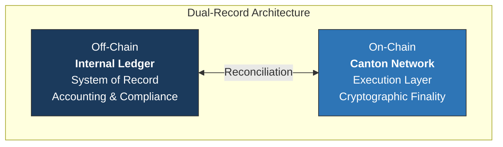

---

## 2. Glossary of Terms

| Term | Definition |
|---|---|
| **ACS** (Active Contract Set) | The set of all currently active (unconsumed) Daml contracts stored locally on a participant/validator node |
| **Canton Coin (CC)** | Native utility token of the Canton Network; used to purchase sequencer traffic |
| **Confirmation Protocol** | Canton's two-phase commit variant where participants validate and confirm transactions before the mediator issues a verdict |
| **Credentials Contract** | Daml utility contract recording KYC/AML attestations, party verification, and permissioning for token operations |
| **Daml** | Smart contract language on Canton; provides built-in authorization and privacy at the language level |
| **Deposit Token (DEPO)** | Tokenized representation of a US dollar demand deposit; each unit equals one US dollar |
| **Global Synchronizer** | Decentralized synchronization service on Canton coordinating cross-domain transactions via BFT consensus |
| **Internal KMS** | Bank's key management service (CloudHSM / Vault) exclusively holding signing and encryption keys |
| **Internal Ledger** | Bank's authoritative off-chain system of record tracking all deposit token positions, movements, and balances |
| **Mediator** | Canton component collecting confirmation responses and computing the final transaction verdict |
| **PCS** (Private Contract Store) | Local database on validator node containing decrypted contract payloads for hosted parties |
| **Registry Contract** | Daml utility contract maintaining the on-chain registry of all deposit token positions, ownership, and lifecycle state |
| **Sequencer** | Canton component providing total-order multicast of encrypted envelopes and timestamping each message |
| **Synchronizer** | Canton infrastructure (sequencer + mediator + topology manager) providing ordering, consensus, and finality |
| **Validator Node** | Canton node hosting parties, storing contract state, executing Daml transactions, and participating in confirmation |

---

## 3. Architecture Overview

### 3.1 End-to-End System Topology

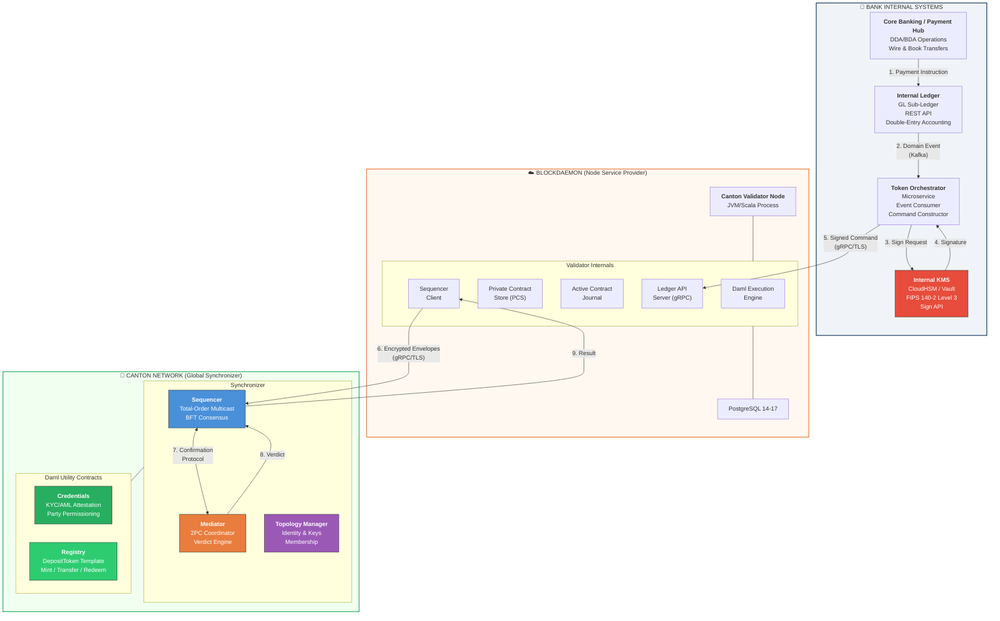

### 3.2 Layer Decomposition

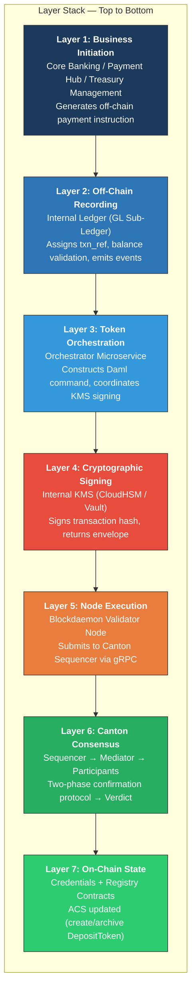

### 3.3 Hosting Model: Hybrid (Model B)

The bank operates under **Hybrid hosting (Model B)** where Blockdaemon runs the validator infrastructure, but the bank retains exclusive control of all cryptographic keys via an external KMS.

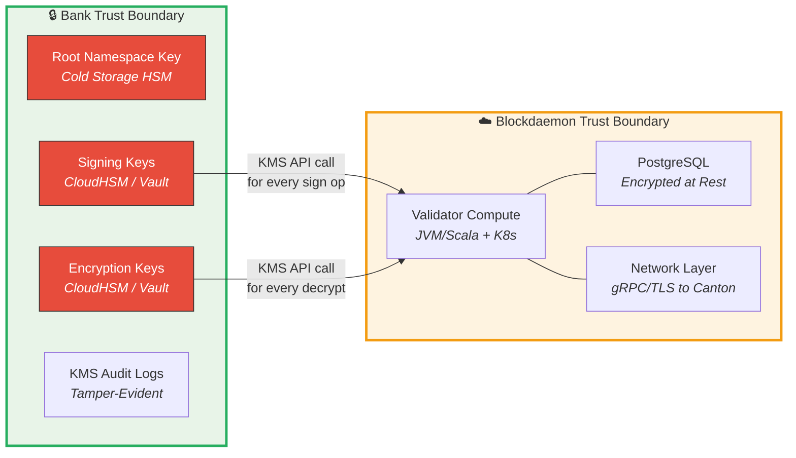

| Aspect | Bank Controls | Blockdaemon Controls |
|---|---|---|
| **Signing Keys** | All keys in bank KMS. Blockdaemon cannot sign independently. | No access |
| **Encryption Keys** | All keys in bank KMS. Blockdaemon cannot decrypt independently. | No access |
| **Root Namespace Key** | Cold storage (geo-redundant HSMs). Never exposed. | No access |
| **Validator Compute** | Defines config, monitors SLA | Operates JVM/Scala, PostgreSQL, K8s |
| **Contract Data (PCS)** | Encrypted at rest with bank keys | Hosts DB but cannot decrypt without KMS |

---

## 4. Component Inventory

### 4.1 Component Relationship Map

```mermaid
graph TB
    subgraph "Component Relationships & Data Flow"
        CLIENT["👤 Corporate Client<br/>(Portal / API)"]
        
        ITS["<b>Internal Txn System</b><br/>Core Banking<br/>DDA Debit/Credit<br/>Reserve Management"]
        
        IL["<b>Internal Ledger</b><br/>GL Sub-Ledger<br/>Position Tracking<br/>Event Emitter"]
        
        KAFKA["<b>Event Bus</b><br/>Kafka<br/>MintRequested<br/>TransferRequested<br/>RedeemRequested"]
        
        ORCH["<b>Token Orchestrator</b><br/>Daml Command Builder<br/>KMS Coordinator<br/>Retry / Reconciliation"]
        
        KMS["<b>Internal KMS</b><br/>FIPS 140-2 L3<br/>ECDSA_P256_SHA256"]
        
        BD["<b>Blockdaemon Node</b><br/>Canton Validator<br/>Ledger API (gRPC)"]
        
        CANTON["<b>Canton Network</b><br/>Sequencer + Mediator<br/>Credentials + Registry"]

        CLIENT -->|"Request"| ITS
        ITS -->|"REST POST"| IL
        IL -->|"Domain Event"| KAFKA
        KAFKA -->|"Consume"| ORCH
        ORCH <-->|"Sign/Verify"| KMS
        ORCH -->|"gRPC Submit"| BD
        BD <-->|"Canton Protocol"| CANTON
        BD -->|"Callback"| ORCH
        ORCH -->|"Status Update"| IL
        IL -->|"Response"| ITS
        ITS -->|"Confirmation"| CLIENT
    end

    style CLIENT fill:#f5f5f5,stroke:#333
    style KMS fill:#e74c3c,stroke:#333,color:#fff
    style CANTON fill:#27ae60,stroke:#333,color:#fff
    style BD fill:#e87d3e,stroke:#333,color:#fff
```

### 4.2 Component Descriptions

**Internal Transaction System** — The bank's core banking or payment hub that originates the business transaction. Handles DDA debits/credits, BDA movements, wire transfers, and book transfers. Generates a structured event when a qualifying transaction is identified.

**Internal Ledger** — GL sub-ledger serving as the authoritative off-chain system of record. Maintains a double-entry accounting model. Exposes a RESTful API, enforces idempotency via `txn_ref`, and emits domain events via Kafka.

**Token Orchestrator** — Containerized microservice bridging off-chain and on-chain planes. Subscribes to Kafka events, constructs Daml commands (CreateCommand for mint, ExerciseCommand for transfer/redeem), coordinates KMS signing, submits via gRPC, and handles callbacks and reconciliation.

**Internal KMS** — Hardware security module or cloud-based KMS holding all Canton signing and encryption keys. Exposes a signing API accepting transaction hashes and returning signatures. Enforces IAM-based access control, rate limiting, and audit logging.

**Blockdaemon Validator Node** — Canton validator under 99.9% uptime SLA with 24/7 monitoring (ISO 27001, SOC 2 Type II). JVM/Scala process backed by PostgreSQL 14–17 on Kubernetes. Configured to call bank's external KMS for every signing and decryption operation.

---

## 5. Canton Utility Contracts: Credentials & Registry

### 5.1 Credentials Contract

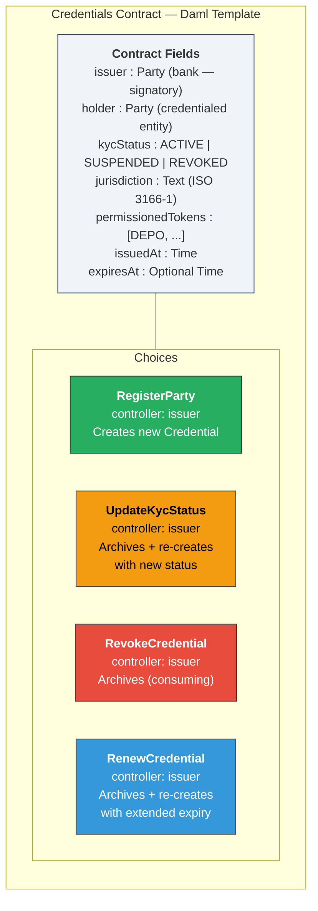

**Conceptual Daml:**

```
template Credential
  with
    issuer              : Party        -- The bank (always signatory)
    holder              : Party        -- The credentialed entity
    kycStatus           : KycStatus    -- ACTIVE | SUSPENDED | REVOKED
    jurisdiction        : Text         -- ISO 3166-1 alpha-2
    permissionedTokens  : [TokenType]  -- e.g., [DEPO, USDC]
    issuedAt            : Time
    expiresAt           : Optional Time
  where
    signatory issuer
    observer holder

    choice UpdateKycStatus : ContractId Credential
      with newStatus : KycStatus
      controller issuer
      do create this with kycStatus = newStatus

    choice RevokeCredential : ()
      controller issuer
      do return ()   -- archives the contract
```

### 5.2 Registry Contract (DepositToken)

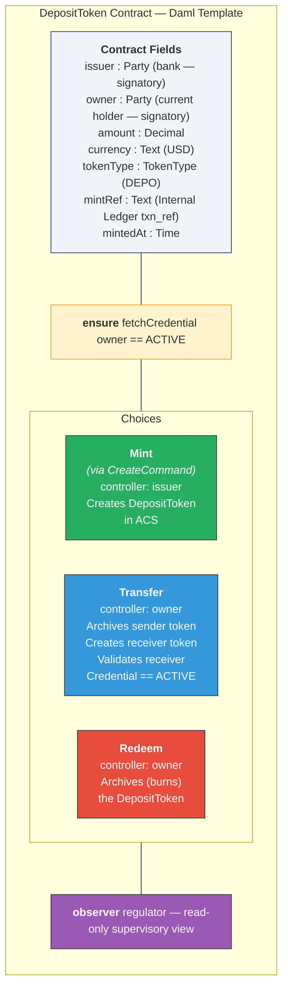

**Conceptual Daml:**

```
template DepositToken
  with
    issuer    : Party         -- The bank (always signatory)
    owner     : Party         -- Current token holder
    amount    : Decimal       -- Token amount in base currency
    currency  : Text          -- ISO 4217 (e.g., USD)
    tokenType : TokenType     -- DEPO
    mintRef   : Text          -- Internal Ledger txn_ref
    mintedAt  : Time
  where
    signatory issuer, owner
    observer regulator

    ensure fetchCredential owner == ACTIVE

    choice Transfer : ContractId DepositToken
      with newOwner : Party
      controller owner
      do
        assertMsg "Receiver must have active credential"
          (fetchCredential newOwner == ACTIVE)
        create this with owner = newOwner

    choice Redeem : ()
      controller owner
      do return ()   -- archives (burns) the token
```

### 5.3 Contract Lifecycle State Machine

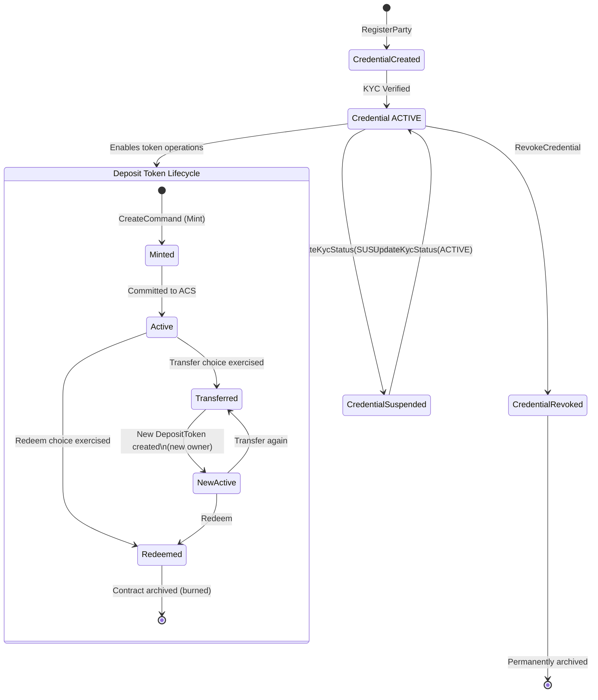

---

## 6. Use Case: DEPO Deposit Token — Corporate Payment (USD 5M)

### 6.1 Scenario Overview

**Acme Corporation** wishes to pay **Global Logistics Inc.** USD 5,000,000 for a supply chain financing settlement. Instead of a traditional wire (T+1, correspondent fees), Acme requests that the bank mint DEPO deposit tokens against Acme's DDA balance and transfer them to Global Logistics, achieving **instant atomic settlement** on Canton.

### 6.2 Participants

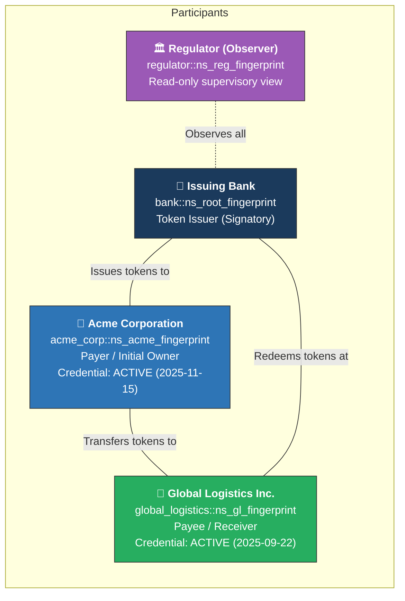

### 6.3 Four-Phase Flow Overview

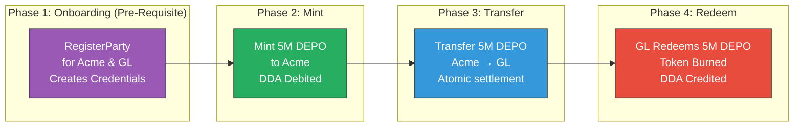

---

## 7. End-to-End Workflow: Mint

### 7.1 Mint Sequence Diagram

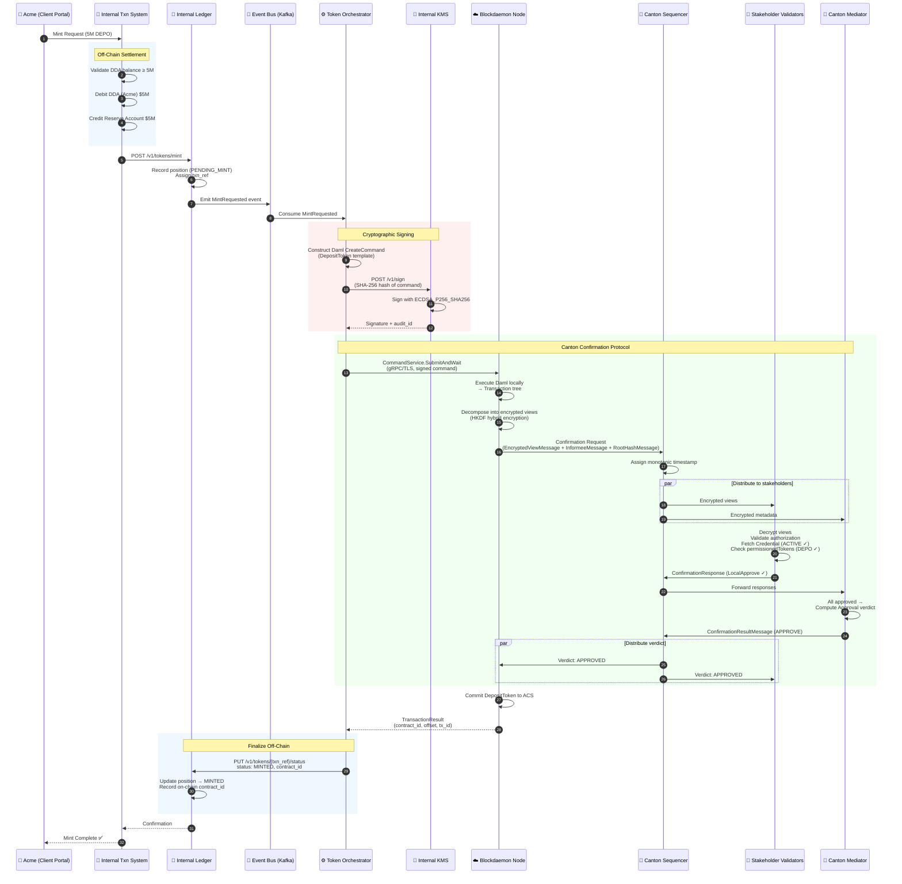

### 7.2 Credential Validation During Mint

During participant validation, each stakeholder evaluates the `ensure` clause on the DepositToken create action:

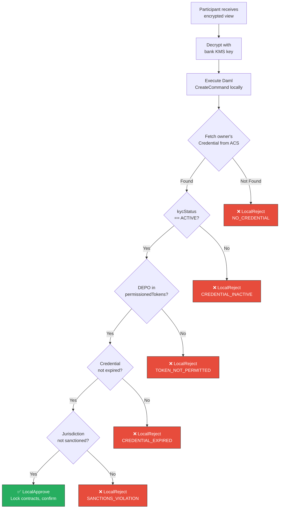

---

## 8. End-to-End Workflow: Transfer

### 8.1 Transfer Sequence Diagram

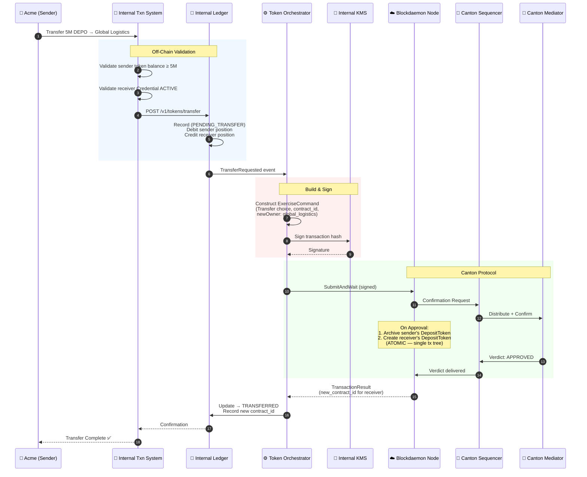

### 8.2 Atomic Transfer — Contract State Transition

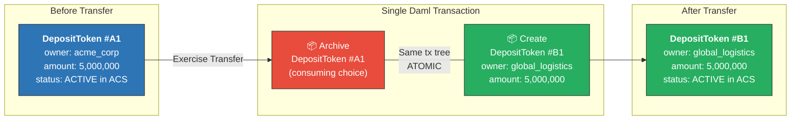

There is **no intermediate state** where the token exists in neither or both accounts. Canton's UTXO-like model guarantees this: the sender's contract is consumed and the receiver's is created as subactions within a single transaction tree, confirmed by a single mediator verdict.

---

## 9. End-to-End Workflow: Redemption

### 9.1 Redemption Sequence Diagram

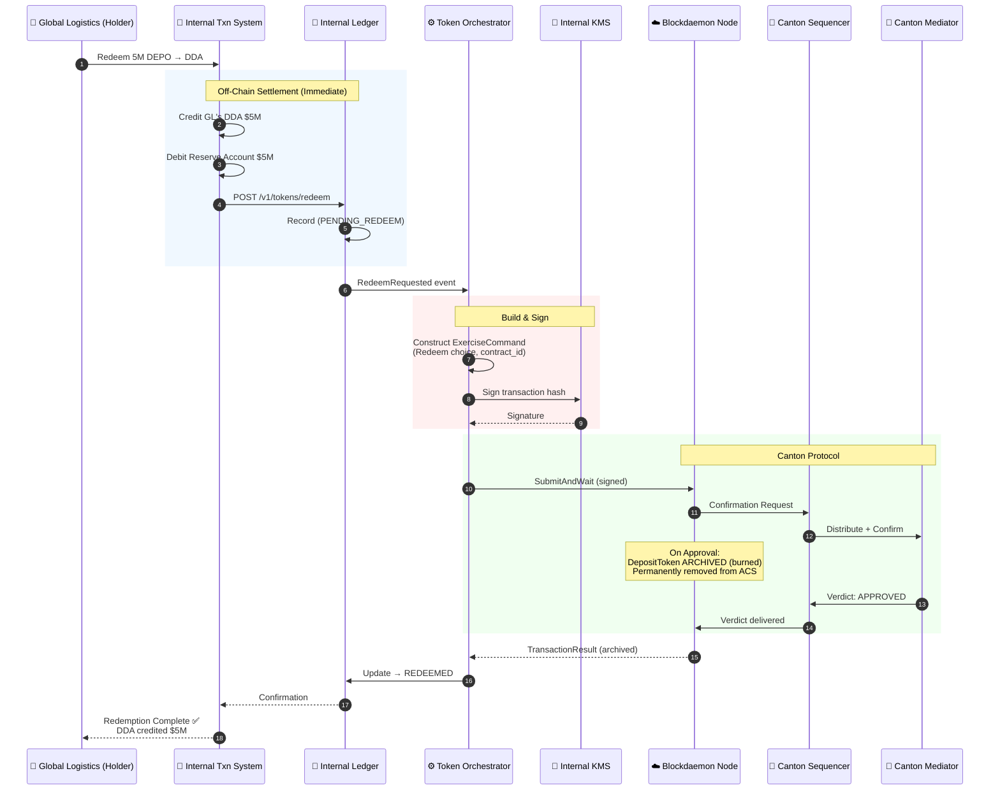

### 9.2 Redemption — Token Burned

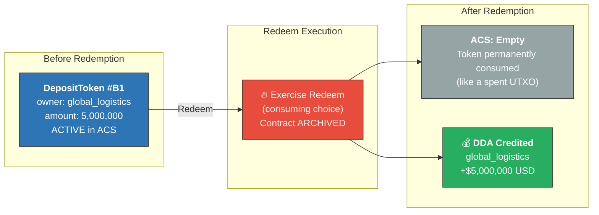

---

## 10. Internal Ledger API Specification

### 10.1 Communication Protocol

| Attribute | Value |
|---|---|
| **Protocol** | HTTPS (TLS 1.3) |
| **Format** | JSON (`application/json`) |
| **Authentication** | OAuth 2.0 Bearer Token (machine-to-machine client credentials grant) |
| **Base URL** | `https://internal-ledger.bank.internal/api/v1` |
| **Idempotency** | All mutating endpoints accept `Idempotency-Key` header (UUID v4) |
| **Rate Limiting** | 10,000 requests/minute per service account |
| **Timeout** | 30s (client-side); 60s (server-side gateway) |

### 10.2 Mint Endpoint

**`POST /v1/tokens/mint`**

**Request:**
```json
{
  "request_ref": "MINT-2026-0301-00001",
  "token_type": "DEPO",
  "amount": 5000000.00,
  "currency": "USD",
  "owner_party_id": "acme_corp::ns_acme_fingerprint",
  "source_account": {
    "account_type": "DDA",
    "account_number": "****4521",
    "routing_number": "021000021"
  },
  "metadata": {
    "initiated_by": "treasury_ops@acme.com",
    "business_reason": "Supply chain settlement",
    "reference": "PO-2026-88712"
  }
}
```

**Response (201 Created):**
```json
{
  "txn_ref": "TXN-MINT-20260301-A7F3E9",
  "status": "PENDING_MINT",
  "token_type": "DEPO",
  "amount": 5000000.00,
  "currency": "USD",
  "owner_party_id": "acme_corp::ns_acme_fingerprint",
  "ledger_entries": [
    { "account": "DDA-****4521", "side": "DEBIT", "amount": 5000000.00 },
    { "account": "RESERVE-DEPO-001", "side": "CREDIT", "amount": 5000000.00 }
  ],
  "created_at": "2026-03-01T10:00:00.000Z",
  "idempotency_key": "f47ac10b-58cc-4372-a567-0e02b2c3d479"
}
```

### 10.3 Transfer Endpoint

**`POST /v1/tokens/transfer`**

**Request:**
```json
{
  "request_ref": "XFER-2026-0301-00001",
  "token_type": "DEPO",
  "amount": 5000000.00,
  "currency": "USD",
  "sender_party_id": "acme_corp::ns_acme_fingerprint",
  "receiver_party_id": "global_logistics::ns_gl_fingerprint",
  "source_contract_id": "00a1b2c3d4e5f6...::DEPO",
  "metadata": {
    "initiated_by": "treasury_ops@acme.com",
    "business_reason": "Payment for PO-2026-88712"
  }
}
```

**Response (201 Created):**
```json
{
  "txn_ref": "TXN-XFER-20260301-B8G4F0",
  "status": "PENDING_TRANSFER",
  "sender_position_delta": -5000000.00,
  "receiver_position_delta": 5000000.00,
  "created_at": "2026-03-01T10:05:00.000Z"
}
```

### 10.4 Redeem Endpoint

**`POST /v1/tokens/redeem`**

**Request:**
```json
{
  "request_ref": "REDM-2026-0301-00001",
  "token_type": "DEPO",
  "amount": 5000000.00,
  "currency": "USD",
  "holder_party_id": "global_logistics::ns_gl_fingerprint",
  "source_contract_id": "00x9y8z7w6v5u4...::DEPO",
  "destination_account": {
    "account_type": "DDA",
    "account_number": "****7832",
    "routing_number": "021000021"
  }
}
```

**Response (201 Created):**
```json
{
  "txn_ref": "TXN-REDM-20260301-C9H5G1",
  "status": "PENDING_REDEEM",
  "ledger_entries": [
    { "account": "RESERVE-DEPO-001", "side": "DEBIT", "amount": 5000000.00 },
    { "account": "DDA-****7832", "side": "CREDIT", "amount": 5000000.00 }
  ],
  "created_at": "2026-03-01T14:00:00.000Z"
}
```

### 10.5 Status Update Endpoint

**`PUT /v1/tokens/{txn_ref}/status`**

```json
{
  "status": "MINTED",
  "on_chain": {
    "contract_id": "00a1b2c3d4e5f6...::DEPO",
    "transaction_id": "tx-2026030100001-abc123def456",
    "offset": "000000000001234567",
    "committed_at": "2026-03-01T10:00:02.150Z"
  }
}
```

---

## 11. Business API Specification

The Business API is the external-facing API exposed to corporate clients. It abstracts the complexity of the Internal Ledger and on-chain operations.

| Method | Endpoint | Description |
|---|---|---|
| `POST` | `/v1/deposit-tokens/mint` | Request minting against DDA balance |
| `POST` | `/v1/deposit-tokens/transfer` | Transfer to another credentialed party |
| `POST` | `/v1/deposit-tokens/redeem` | Redeem back to DDA |
| `GET` | `/v1/deposit-tokens/balance` | Current token balance |
| `GET` | `/v1/deposit-tokens/transactions` | Transaction history (paginated) |
| `GET` | `/v1/deposit-tokens/transactions/{txn_ref}` | Status of specific transaction |

**Balance Query Response:**
```json
{
  "party_id": "acme_corp::ns_acme_fingerprint",
  "balances": [
    {
      "token_type": "DEPO",
      "currency": "USD",
      "available_balance": 5000000.00,
      "pending_balance": 0.00,
      "total_balance": 5000000.00,
      "active_contracts": 1,
      "last_updated": "2026-03-01T10:02:15.000Z"
    }
  ]
}
```

---

## 12. Invoke Request/Response Payloads

### 12.1 Mint — Daml CreateCommand (Ledger API v2)

```json
{
  "commands": {
    "user_id": "token_orchestrator_svc",
    "command_id": "CMD-MINT-20260301-A7F3E9",
    "act_as": ["bank::ns_root_fingerprint"],
    "read_as": ["regulator::ns_reg_fingerprint"],
    "commands": [
      {
        "create": {
          "template_id": {
            "package_id": "abc123...deposit_token_pkg",
            "module_name": "DepositToken.Registry",
            "entity_name": "DepositToken"
          },
          "create_arguments": {
            "fields": [
              { "label": "issuer", "value": { "party": "bank::ns_root_fingerprint" } },
              { "label": "owner", "value": { "party": "acme_corp::ns_acme_fingerprint" } },
              { "label": "amount", "value": { "numeric": "5000000.00" } },
              { "label": "currency", "value": { "text": "USD" } },
              { "label": "tokenType", "value": { "enum": "DEPO" } },
              { "label": "mintRef", "value": { "text": "TXN-MINT-20260301-A7F3E9" } }
            ]
          }
        }
      }
    ],
    "synchronizer_id": "global_sync::canton_global"
  }
}
```

### 12.2 Transfer — Daml ExerciseCommand

```json
{
  "commands": {
    "user_id": "token_orchestrator_svc",
    "command_id": "CMD-XFER-20260301-B8G4F0",
    "act_as": ["acme_corp::ns_acme_fingerprint"],
    "commands": [
      {
        "exercise": {
          "template_id": {
            "package_id": "abc123...deposit_token_pkg",
            "module_name": "DepositToken.Registry",
            "entity_name": "DepositToken"
          },
          "contract_id": "00a1b2c3d4e5f6...::DEPO",
          "choice": "Transfer",
          "choice_argument": {
            "fields": [
              { "label": "newOwner", "value": { "party": "global_logistics::ns_gl_fingerprint" } }
            ]
          }
        }
      }
    ]
  }
}
```

### 12.3 Redeem — Daml ExerciseCommand

```json
{
  "commands": {
    "user_id": "token_orchestrator_svc",
    "command_id": "CMD-REDM-20260301-C9H5G1",
    "act_as": ["global_logistics::ns_gl_fingerprint"],
    "commands": [
      {
        "exercise": {
          "template_id": {
            "package_id": "abc123...deposit_token_pkg",
            "module_name": "DepositToken.Registry",
            "entity_name": "DepositToken"
          },
          "contract_id": "00x9y8z7w6v5u4...::DEPO",
          "choice": "Redeem",
          "choice_argument": { "fields": [] }
        }
      }
    ]
  }
}
```

### 12.4 Canton Ledger API — Success Response

```json
{
  "transaction": {
    "transaction_id": "tx-2026030100001-abc123def456",
    "command_id": "CMD-MINT-20260301-A7F3E9",
    "offset": "000000000001234567",
    "effective_at": "2026-03-01T10:00:02.150Z",
    "events": [
      {
        "created": {
          "contract_id": "00a1b2c3d4e5f6...::DEPO",
          "template_id": {
            "package_id": "abc123...",
            "module_name": "DepositToken.Registry",
            "entity_name": "DepositToken"
          },
          "create_arguments": { "..." : "..." },
          "signatories": ["bank::ns_root_fingerprint", "acme_corp::ns_acme_fingerprint"],
          "observers": ["regulator::ns_reg_fingerprint"]
        }
      }
    ]
  }
}
```

---

## 13. Blockdaemon Integration Specification

### 13.1 Communication Architecture

| Attribute | Value |
|---|---|
| **Protocol** | gRPC over TLS 1.3 (mTLS for production) |
| **Endpoint** | `canton-validator.blockdaemon.com:443` |
| **Authentication** | mTLS client certificate + OAuth 2.0 bearer token (OIDC) |
| **Serialization** | Protocol Buffers — Canton Ledger API v2 |
| **Connection Model** | Persistent gRPC channel with keepalive (30s interval, 10s timeout) |
| **Retry Policy** | Exponential backoff (initial: 100ms, max: 30s, jitter: 0.2) |

### 13.2 gRPC Service Methods

| Service | Method | Use Case | Mode |
|---|---|---|---|
| `CommandService` | `SubmitAndWait` | Primary for mint/transfer/redeem — blocks until verdict | Sync |
| `CommandSubmissionService` | `Submit` | Fire-and-forget for batch operations | Async |
| `CommandCompletionService` | `CompletionStream` | Async completion monitoring | Streaming |
| `UpdateService` | `GetUpdates` | Real-time event stream for reconciliation | Streaming |
| `StateService` | `GetActiveContracts` | ACS snapshot for periodic reconciliation | Sync |
| `InteractiveSubmissionService` | `PrepareSubmission` | Step 1: prepare tx for KMS signing | Sync |
| `InteractiveSubmissionService` | `ExecuteSubmission` | Step 2: submit externally-signed tx | Sync |

### 13.3 Interactive Submission Flow (External KMS Signing)

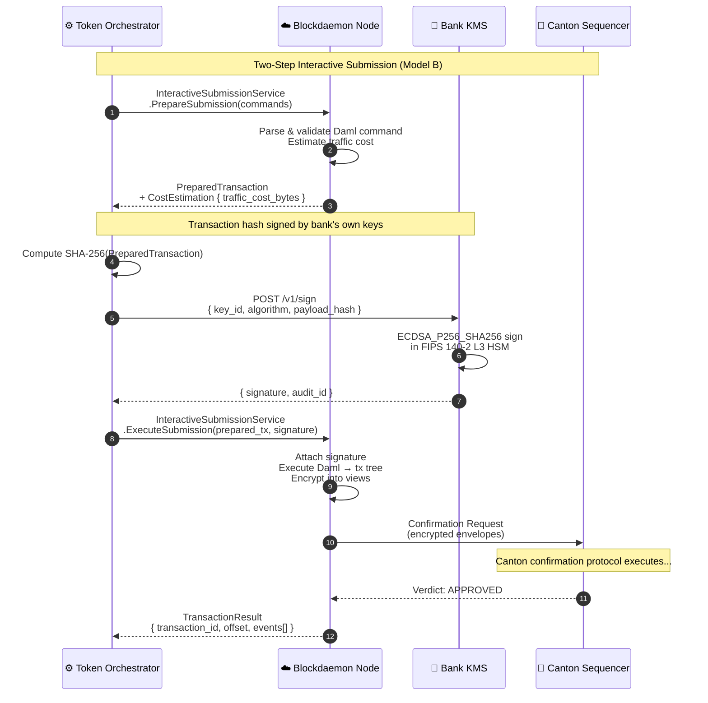

### 13.4 Blockdaemon Internal Processing

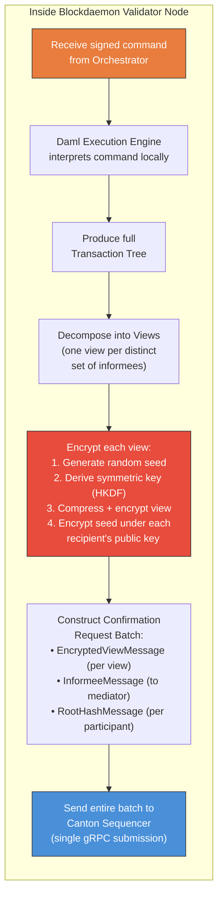

---

## 14. KMS Signing Specification

### 14.1 Signing API

| Attribute | Value |
|---|---|
| **Protocol** | HTTPS (TLS 1.3) or gRPC |
| **Endpoint** | `https://kms.bank.internal/v1/sign` |
| **Authentication** | mTLS + IAM role-based access control |
| **Algorithms** | ECDSA_P256_SHA256, Ed25519, ECDSA_SECP256K1_SHA256 |
| **Key Storage** | FIPS 140-2 Level 3 HSM |
| **Audit** | Every operation logged: timestamp, key_id, caller, payload_hash, result |
| **Rate Limit** | 1,000 sign ops/minute per key_id |
| **Timeout** | 5 seconds (hard limit) |

### 14.2 Sign Request/Response

**Request:**
```json
{
  "key_id": "canton-signing-key-prod-001",
  "algorithm": "ECDSA_P256_SHA256",
  "payload_hash": "a3f2b1c4d5e6f7...sha256_of_prepared_transaction",
  "context": {
    "operation": "CANTON_TX_SIGN",
    "command_id": "CMD-MINT-20260301-A7F3E9",
    "txn_ref": "TXN-MINT-20260301-A7F3E9"
  }
}
```

**Response (200 OK):**
```json
{
  "signature": "MEUCIQDh8k...base64_encoded_signature",
  "signing_key_fingerprint": "SHA256:xYz123...key_fingerprint",
  "algorithm": "ECDSA_P256_SHA256",
  "signed_at": "2026-03-01T10:00:01.500Z",
  "audit_id": "KMS-AUDIT-20260301-001234"
}
```

### 14.3 Key Hierarchy

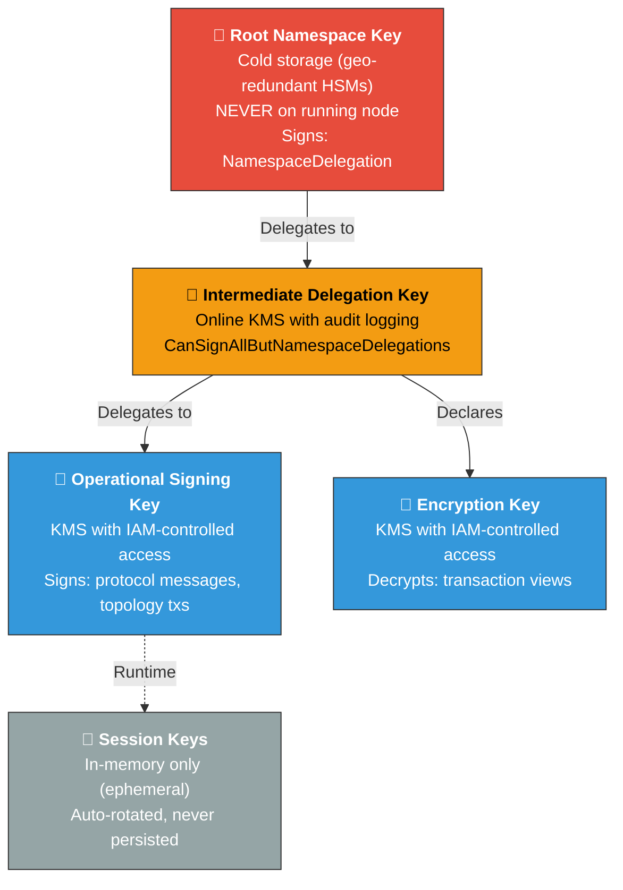

---

## 15. Non-Functional Requirements

| Category | Requirement | Target | Measurement |
|---|---|---|---|
| **Availability** | System uptime (excl. planned maintenance) | 99.95% | Monthly uptime % |
| **Latency — Internal Ledger** | Ledger API response time | < 200ms (p99) | APM |
| **Latency — KMS Signing** | Sign request → signature response | < 100ms (p99) | KMS audit logs |
| **Latency — Blockdaemon** | gRPC submit → Canton verdict receipt | < 5s (p99) | Orchestrator instrumentation |
| **Latency — End-to-End Mint** | Client request → MINTED confirmation | < 10s (p99) | OpenTelemetry tracing |
| **Throughput** | Sustained deposit token operations | 500 TPS (target); 100 TPS (guaranteed) | Load testing |
| **Idempotency** | All mutating APIs idempotent | 100% | API gateway enforcement |
| **Data Durability** | Zero data loss (ledger + on-chain) | RPO = 0 | Sync replication + ACS commitments |
| **Recovery Time** | Single-node failure recovery | < 15 min (RTO) | K8s auto-restart + DB failover |
| **Backup Cadence** | Validator PostgreSQL backups | Daily (< 25 day retention) | Backup monitoring |
| **Security** | All inter-service comms encrypted | TLS 1.3 / mTLS | Certificate management |
| **Observability** | Distributed tracing | 100% trace coverage | OpenTelemetry |
| **Regulatory Reporting** | Auto-generated supervisory reports | Real-time (< 1 min delay) | Observer party event stream |

### 15.1 Timeout Configuration Map

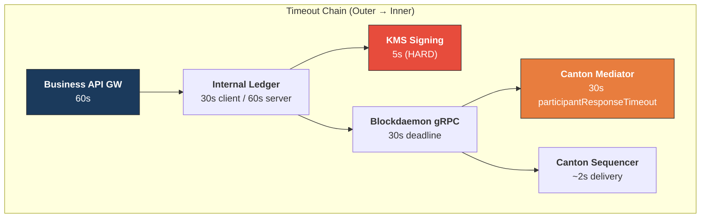

---

## 16. Error Handling Framework

### 16.1 Error Categories

```mermaid
graph TB
    subgraph "Error Classification"
        direction TB
        
        E1["<b>4xx — Client Errors</b><br/>Invalid payload, insufficient balance,<br/>expired credential, unknown party<br/>🔄 No retry — fix and resubmit"]
        
        E2["<b>IL-5xxx — Ledger Errors</b><br/>DB unavailable, event bus failure,<br/>idempotency conflict<br/>🔄 Retry: exp backoff (max 3)"]
        
        E3["<b>KMS-6xxx — KMS Errors</b><br/>Key not found, signing timeout,<br/>HSM unavailable, rate limit<br/>🔄 Retry transient; alert persistent"]
        
        E4["<b>BD-7xxx — Blockdaemon Errors</b><br/>gRPC UNAVAILABLE, DEADLINE_EXCEEDED,<br/>connection refused<br/>🔄 Retry: exp backoff (100ms→30s)"]
        
        E5["<b>CN-8xxx — Canton Protocol</b><br/>MediatorReject, Timeout, LocalReject<br/>(credential fail), conflict detection<br/>🔄 No retry for Reject; 1x for Timeout"]
        
        E6["<b>RC-9xxx — Reconciliation</b><br/>Ledger/ACS mismatch,<br/>orphaned positions<br/>🔄 Manual investigation"]
    end

    style E1 fill:#f39c12,stroke:#333,color:#000
    style E2 fill:#e67e22,stroke:#333,color:#fff
    style E3 fill:#e74c3c,stroke:#333,color:#fff
    style E4 fill:#d35400,stroke:#333,color:#fff
    style E5 fill:#c0392b,stroke:#333,color:#fff
    style E6 fill:#8e44ad,stroke:#333,color:#fff
```

### 16.2 Error Response Format

```json
{
  "error": {
    "code": "CN-8001",
    "category": "CANTON_PROTOCOL",
    "message": "Transaction rejected by mediator: LocalReject from stakeholder",
    "details": {
      "rejection_reason": "CREDENTIAL_VALIDATION_FAILED",
      "party": "acme_corp::ns_acme_fingerprint",
      "credential_status": "EXPIRED",
      "command_id": "CMD-MINT-20260301-A7F3E9"
    },
    "trace_id": "abc123def456-trace-001",
    "timestamp": "2026-03-01T10:00:03.200Z",
    "retryable": false
  }
}
```

### 16.3 Error Decision Tree

```mermaid
graph TD
    START["Error Received"] --> TYPE{"Error<br/>Category?"}
    
    TYPE -->|"4xx Client"| FIX["Fix request payload<br/>Resubmit"]
    TYPE -->|"IL-5xxx"| RETRY_IL{"Attempt<br/>≤ 3?"}
    TYPE -->|"KMS-6xxx"| KMS_CHECK{"Transient?"}
    TYPE -->|"BD-7xxx"| RETRY_BD{"gRPC status?"}
    TYPE -->|"CN-8xxx"| CANTON_CHECK{"Verdict type?"}
    TYPE -->|"RC-9xxx"| MANUAL["Escalate to Ops<br/>Trigger reconciliation"]
    
    RETRY_IL -->|"Yes"| BACKOFF_IL["Exponential backoff<br/>100ms → 5s"]
    RETRY_IL -->|"No"| ALERT_IL["Alert Ops team<br/>Circuit breaker OPEN"]
    
    KMS_CHECK -->|"Yes (timeout)"| RETRY_KMS["Retry with backoff"]
    KMS_CHECK -->|"No (key error)"| ALERT_KMS["Alert InfoSec<br/>HALT operations"]
    
    RETRY_BD -->|"UNAVAILABLE"| BACKOFF_BD["Exp backoff<br/>100ms → 30s"]
    RETRY_BD -->|"DEADLINE_EXCEEDED"| CHECK_COMPLETION["Check CompletionStream<br/>for async result"]
    
    CANTON_CHECK -->|"MediatorReject"| NO_RETRY["No retry<br/>Log + update IL: REJECTED"]
    CANTON_CHECK -->|"Timeout"| RETRY_ONCE["Retry once<br/>with new command_id"]
    CANTON_CHECK -->|"LocalReject"| INVESTIGATE["Check credential status<br/>Update if needed"]

    style START fill:#1B3A5C,stroke:#333,color:#fff
    style FIX fill:#f39c12,stroke:#333,color:#000
    style ALERT_KMS fill:#e74c3c,stroke:#333,color:#fff
    style NO_RETRY fill:#e74c3c,stroke:#333,color:#fff
```

---

## 17. Accounting & Regulatory Treatment

### 17.1 Double-Entry Accounting Model

Every lifecycle event generates corresponding double-entry journal entries. The deposit token is treated as a **liability** of the issuing bank representing the holder's claim on the underlying demand deposit.

#### Mint Entries

```mermaid
graph LR
    subgraph "Mint: $5M DEPO to Acme"
        DR1["<b>DR</b> DDA — Acme<br/>$5,000,000"]
        CR1["<b>CR</b> Deposit Token Reserve<br/>$5,000,000"]
        MEMO1["<b>CR</b> Token Liability (Memo)<br/>$5,000,000"]
    end

    style DR1 fill:#e74c3c,stroke:#333,color:#fff
    style CR1 fill:#27ae60,stroke:#333,color:#fff
    style MEMO1 fill:#9b59b6,stroke:#333,color:#fff
```

| Account | Debit | Credit | Description |
|---|---|---|---|
| DDA — Client (Acme) | $5,000,000 | | Debit client DDA (reduces available cash) |
| Deposit Token Reserve | | $5,000,000 | Credit reserve (earmarks funds backing token) |
| Token Liability (Off-BS Memo) | | $5,000,000 | Record token outstanding |

#### Transfer Entries

```mermaid
graph LR
    subgraph "Transfer: Acme → Global Logistics"
        DR2["<b>DR</b> Token Position — Acme<br/>$5,000,000"]
        CR2["<b>CR</b> Token Position — GL<br/>$5,000,000"]
        NOTE2["No GL impact<br/>Reserve unchanged<br/>Liability unchanged"]
    end

    style DR2 fill:#e74c3c,stroke:#333,color:#fff
    style CR2 fill:#27ae60,stroke:#333,color:#fff
    style NOTE2 fill:#f5f5f5,stroke:#999
```

| Account | Debit | Credit | Description |
|---|---|---|---|
| Token Position — Acme (Sub-Ledger) | $5,000,000 | | Reduce Acme's position |
| Token Position — GL (Sub-Ledger) | | $5,000,000 | Increase GL's position |
| *(No GL impact — reserve and liability unchanged)* | | | Position reassignment only |

#### Redemption Entries

```mermaid
graph LR
    subgraph "Redeem: GL redeems $5M DEPO"
        DR3["<b>DR</b> Deposit Token Reserve<br/>$5,000,000"]
        CR3["<b>CR</b> DDA — GL<br/>$5,000,000"]
        MEMO3["<b>DR</b> Token Liability (Memo)<br/>$5,000,000"]
    end

    style DR3 fill:#e74c3c,stroke:#333,color:#fff
    style CR3 fill:#27ae60,stroke:#333,color:#fff
    style MEMO3 fill:#9b59b6,stroke:#333,color:#fff
```

| Account | Debit | Credit | Description |
|---|---|---|---|
| Deposit Token Reserve | $5,000,000 | | Debit reserve (release earmarked funds) |
| DDA — Client (GL) | | $5,000,000 | Credit client DDA (return cash) |
| Token Liability (Off-BS Memo) | $5,000,000 | | Extinguish token liability |

### 17.2 Full Lifecycle — Balance Sheet Impact

```mermaid
graph TB
    subgraph "Balance Sheet Impact Over Token Lifecycle"
        direction LR
        
        subgraph T0["T₀: Pre-Mint"]
            BS0_A["<b>Assets</b><br/>DDA Cash: $5M"]
            BS0_L["<b>Liabilities</b><br/>DDA Obligation: $5M<br/>Token Liability: $0"]
        end
        
        subgraph T1["T₁: Post-Mint"]
            BS1_A["<b>Assets</b><br/>DDA Cash: $0<br/>Reserve: $5M"]
            BS1_L["<b>Liabilities</b><br/>DDA Obligation: $0<br/>Token Liability: $5M"]
        end
        
        subgraph T2["T₂: Post-Transfer"]
            BS2_A["<b>Assets</b><br/>Reserve: $5M<br/>(unchanged)"]
            BS2_L["<b>Liabilities</b><br/>Token Liability: $5M<br/>(owner changed)"]
        end
        
        subgraph T3["T₃: Post-Redeem"]
            BS3_A["<b>Assets</b><br/>Reserve: $0"]
            BS3_L["<b>Liabilities</b><br/>DDA Obligation: $5M<br/>Token Liability: $0"]
        end

        T0 -->|"Mint"| T1 -->|"Transfer"| T2 -->|"Redeem"| T3
    end
```

### 17.3 Regulatory Reporting

The Regulator party is provisioned as an **observer** on all DepositToken contracts. Their participant node automatically receives projected views of every create, exercise, and archive event.

```mermaid
graph TB
    subgraph "Regulatory Reporting Architecture"
        CANTON_EVENTS["Canton UpdateService<br/>(Event Stream)"]
        
        REG_NODE["Regulator's<br/>Participant Node"]
        
        subgraph REPORTS["Automated Reports"]
            direction LR
            R1["🟢 Issuance Report<br/>Every Mint<br/>Real-time"]
            R2["🔵 Transfer Report<br/>Every Transfer<br/>Real-time"]
            R3["🔴 Redemption Report<br/>Every Redeem<br/>Real-time"]
            R4["📊 Outstanding Position<br/>Daily at 00:00 UTC<br/>Batch"]
            R5["⚠️ AML Monitoring<br/>Threshold triggers<br/>Real-time alert"]
        end
        
        CANTON_EVENTS --> REG_NODE
        REG_NODE --> REPORTS
    end

    style CANTON_EVENTS fill:#4a90d9,stroke:#333,color:#fff
    style REG_NODE fill:#9b59b6,stroke:#333,color:#fff
```

### 17.4 Daily Reconciliation

```mermaid
graph TD
    START["Daily Reconciliation Job<br/>(00:30 UTC)"] --> FETCH_IL["Fetch all positions<br/>from Internal Ledger"]
    FETCH_IL --> FETCH_ACS["Fetch ACS snapshot<br/>via StateService.GetActiveContracts"]
    FETCH_ACS --> COMPARE{"Compare:<br/>1. Total supply == Reserve balance?<br/>2. Per-party positions match?<br/>3. No orphaned contracts?"}
    
    COMPARE -->|"All match ✅"| PASS["Reconciliation PASSED<br/>Log + continue"]
    COMPARE -->|"Mismatch ❌"| FAIL["RC-9xxx Error<br/>Escalate to Ops<br/>Block new operations<br/>until resolved"]

    style START fill:#1B3A5C,stroke:#333,color:#fff
    style PASS fill:#27ae60,stroke:#333,color:#fff
    style FAIL fill:#e74c3c,stroke:#333,color:#fff
```

---

*— End of Document —*