# DEPOSIT TOKEN — Mint, Transfer & Redemption Specification

## Canton Network | Blockdaemon Node Services | Internal KMS

**Version 1.0 | March 2026 | CONFIDENTIAL — Internal Use Only**

---

## Table of Contents

1. [Executive Summary](#1-executive-summary)
2. [Glossary of Terms](#2-glossary-of-terms)
3. [Architecture Overview](#3-architecture-overview)
4. [Component Inventory](#4-component-inventory)
5. [Canton Utility Contracts: Credentials & Registry](#5-canton-utility-contracts-credentials--registry)
6. [Use Case: DEPO Deposit Token — Corporate Payment (USD 5M)](#6-use-case-depo-deposit-token--corporate-payment-usd-5m)
7. [End-to-End Workflow: Mint](#7-end-to-end-workflow-mint)
8. [End-to-End Workflow: Transfer](#8-end-to-end-workflow-transfer)
9. [End-to-End Workflow: Redemption](#9-end-to-end-workflow-redemption)
10. [Internal Ledger API Specification](#10-internal-ledger-api-specification)
11. [Business API Specification](#11-business-api-specification)
12. [Invoke Request/Response Payloads](#12-invoke-requestresponse-payloads)
13. [Blockdaemon Integration Specification](#13-blockdaemon-integration-specification) — PrepareSubmission, External Signing, ExecuteSubmission
14. [Key Management Architecture — Bank-Operated Canton Crypto Gateway](#14-key-management-architecture--bank-operated-canton-crypto-gateway)
15. [Non-Functional Requirements](#15-non-functional-requirements)
16. [Error Handling Framework](#16-error-handling-framework)
17. [Accounting & Regulatory Treatment](#17-accounting--regulatory-treatment)

---

## 1. Executive Summary

This document defines the end-to-end technical, business, and accounting specification for a **Deposit Token** product (designated **DEPO**) built on the **Canton Network**. The DEPO token represents a claim on a US dollar demand deposit held at the issuing bank. It supports three core lifecycle operations: **Mint** (issuance), **Transfer** (peer-to-peer movement between credentialed parties), and **Redemption** (burn and return of fiat to the holder).

The architecture integrates the bank's internal transaction system, an off-chain internal ledger, a bank-controlled KMS for cryptographic signing, Blockdaemon as the Canton validator node service provider, and Canton's on-chain Credentials and Registry utility contracts. Every on-chain action is preceded by an off-chain transaction, creating a **dual-record architecture** where the Internal Ledger is the system of record and Canton is the cryptographically verifiable execution layer.

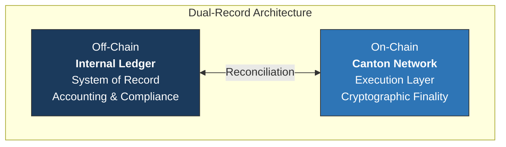
```mermaid
graph LR
    subgraph "Dual-Record Architecture"
        direction LR
        A["Off-Chain<br/><b>Internal Ledger</b><br/>System of Record<br/>Accounting & Compliance"] 
        B["On-Chain<br/><b>Canton Network</b><br/>Execution Layer<br/>Cryptographic Finality"]
        A <-->|"Reconciliation"| B
    end

    style A fill:#1B3A5C,stroke:#333,color:#fff
    style B fill:#2E75B6,stroke:#333,color:#fff
```

---

## 2. Glossary of Terms

| Term | Definition |
|---|---|
| **ACS** (Active Contract Set) | The set of all currently active (unconsumed) Daml contracts stored locally on a participant/validator node |
| **Canton Coin (CC)** | Native utility token of the Canton Network; used to purchase sequencer traffic |
| **Confirmation Protocol** | Canton's two-phase commit variant where participants validate and confirm transactions before the mediator issues a verdict |
| **Credentials Contract** | Daml utility contract recording KYC/AML attestations, party verification, and permissioning for token operations |
| **Daml** | Smart contract language on Canton; provides built-in authorization and privacy at the language level |
| **Deposit Token (DEPO)** | Tokenized representation of a US dollar demand deposit; each unit equals one US dollar |
| **Global Synchronizer** | Decentralized synchronization service on Canton coordinating cross-domain transactions via BFT consensus |
| **Internal KMS** | Bank's key management service (CloudHSM / Vault) exclusively holding signing and encryption keys |
| **Internal Ledger** | Bank's authoritative off-chain system of record tracking all deposit token positions, movements, and balances |
| **Mediator** | Canton component collecting confirmation responses and computing the final transaction verdict |
| **PCS** (Private Contract Store) | Local database on validator node containing decrypted contract payloads for hosted parties |
| **Registry Contract** | Daml utility contract maintaining the on-chain registry of all deposit token positions, ownership, and lifecycle state |
| **Sequencer** | Canton component providing total-order multicast of encrypted envelopes and timestamping each message |
| **Synchronizer** | Canton infrastructure (sequencer + mediator + topology manager) providing ordering, consensus, and finality |
| **Validator Node** | Canton node hosting parties, storing contract state, executing Daml transactions, and participating in confirmation |

---

## 3. Architecture Overview

### 3.1 End-to-End System Topology

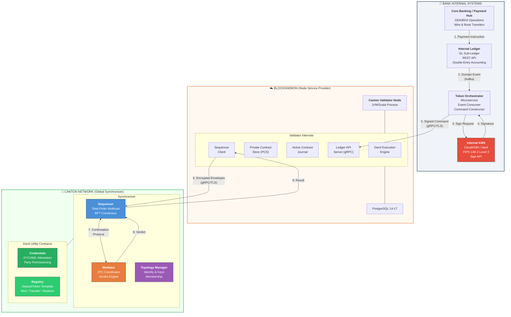
```mermaid
graph TB
    subgraph BANK["🏦 BANK INTERNAL SYSTEMS"]
        direction TB
        CB["<b>Core Banking / Payment Hub</b><br/>DDA/BDA Operations<br/>Wire & Book Transfers"]
        IL["<b>Internal Ledger</b><br/>GL Sub-Ledger<br/>REST API<br/>Double-Entry Accounting"]
        TO["<b>Token Orchestrator</b><br/>Microservice<br/>Event Consumer<br/>Command Constructor"]
        KMS["<b>Internal KMS</b><br/>CloudHSM / Vault<br/>FIPS 140-2 Level 3<br/>Sign API"]
        
        CB -->|"1. Payment Instruction"| IL
        IL -->|"2. Domain Event<br/>(Kafka)"| TO
        TO -->|"3. Sign Request"| KMS
        KMS -->|"4. Signature"| TO
    end

    subgraph BD["☁️ BLOCKDAEMON (Node Service Provider)"]
        direction TB
        VN["<b>Canton Validator Node</b><br/>JVM/Scala Process"]
        
        subgraph VN_INNER["Validator Internals"]
            direction LR
            DE["Daml Execution<br/>Engine"]
            PCS["Private Contract<br/>Store (PCS)"]
            ACJ["Active Contract<br/>Journal"]
            LAPI["Ledger API<br/>Server (gRPC)"]
            SC["Sequencer<br/>Client"]
        end
        
        PG["PostgreSQL 14-17"]
        VN --- VN_INNER
        VN_INNER --- PG
    end

    subgraph CANTON["🔗 CANTON NETWORK (Global Synchronizer)"]
        direction TB
        subgraph SYNC["Synchronizer"]
            direction LR
            SEQ["<b>Sequencer</b><br/>Total-Order Multicast<br/>BFT Consensus"]
            MED["<b>Mediator</b><br/>2PC Coordinator<br/>Verdict Engine"]
            TM["<b>Topology Manager</b><br/>Identity & Keys<br/>Membership"]
        end
        
        subgraph CONTRACTS["Daml Utility Contracts"]
            direction LR
            CRED["<b>Credentials</b><br/>KYC/AML Attestation<br/>Party Permissioning"]
            REG["<b>Registry</b><br/>DepositToken Template<br/>Mint / Transfer / Redeem"]
        end

        SYNC --- CONTRACTS
    end

    TO -->|"5. Signed Command<br/>(gRPC/TLS)"| LAPI
    SC -->|"6. Encrypted Envelopes<br/>(gRPC/TLS)"| SEQ
    SEQ <-->|"7. Confirmation<br/>Protocol"| MED
    MED -->|"8. Verdict"| SEQ
    SEQ -->|"9. Result"| SC

    style BANK fill:#f0f4f8,stroke:#1B3A5C,stroke-width:2px
    style BD fill:#fff8f0,stroke:#e87d3e,stroke-width:2px
    style CANTON fill:#f0fff0,stroke:#27ae60,stroke-width:2px
    style KMS fill:#e74c3c,stroke:#333,color:#fff
    style SEQ fill:#4a90d9,stroke:#333,color:#fff
    style MED fill:#e87d3e,stroke:#333,color:#fff
    style TM fill:#9b59b6,stroke:#333,color:#fff
    style CRED fill:#27ae60,stroke:#333,color:#fff
    style REG fill:#2ecc71,stroke:#333,color:#fff
```

### 3.2 Layer Decomposition

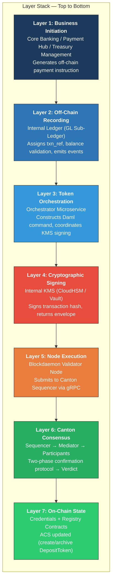
```mermaid
graph TB
    subgraph "Layer Stack — Top to Bottom"
        direction TB
        L1["<b>Layer 1: Business Initiation</b><br/>Core Banking / Payment Hub / Treasury Management<br/>Generates off-chain payment instruction"]
        L2["<b>Layer 2: Off-Chain Recording</b><br/>Internal Ledger (GL Sub-Ledger)<br/>Assigns txn_ref, balance validation, emits events"]
        L3["<b>Layer 3: Token Orchestration</b><br/>Orchestrator Microservice<br/>Constructs Daml command, coordinates KMS signing"]
        L4["<b>Layer 4: Cryptographic Signing</b><br/>Internal KMS (CloudHSM / Vault)<br/>Signs transaction hash, returns envelope"]
        L5["<b>Layer 5: Node Execution</b><br/>Blockdaemon Validator Node<br/>Submits to Canton Sequencer via gRPC"]
        L6["<b>Layer 6: Canton Consensus</b><br/>Sequencer → Mediator → Participants<br/>Two-phase confirmation protocol → Verdict"]
        L7["<b>Layer 7: On-Chain State</b><br/>Credentials + Registry Contracts<br/>ACS updated (create/archive DepositToken)"]

        L1 --> L2 --> L3 --> L4 --> L5 --> L6 --> L7
    end

    style L1 fill:#1B3A5C,stroke:#333,color:#fff
    style L2 fill:#2E75B6,stroke:#333,color:#fff
    style L3 fill:#3498db,stroke:#333,color:#fff
    style L4 fill:#e74c3c,stroke:#333,color:#fff
    style L5 fill:#e87d3e,stroke:#333,color:#fff
    style L6 fill:#27ae60,stroke:#333,color:#fff
    style L7 fill:#2ecc71,stroke:#333,color:#fff
```

### 3.3 Hosting Model: Hybrid (Model B)

The bank operates under **Hybrid hosting (Model B)** where Blockdaemon runs the validator infrastructure, but the bank retains exclusive control of all cryptographic keys via an external KMS.

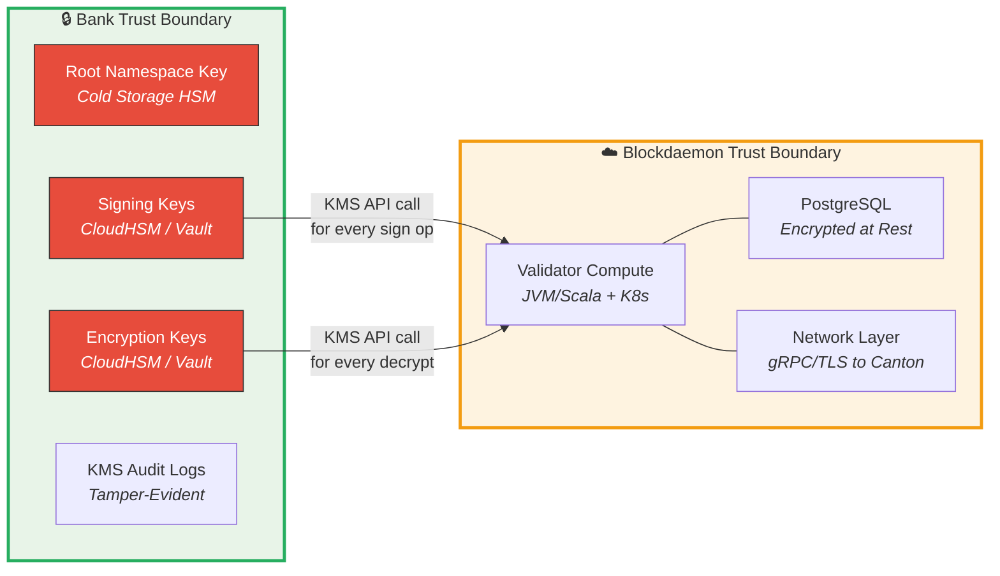
```mermaid
graph LR
    subgraph BANK_TRUST["🔒 Bank Trust Boundary"]
        RK["Root Namespace Key<br/><i>Cold Storage HSM</i>"]
        SK["Signing Keys<br/><i>CloudHSM / Vault</i>"]
        EK["Encryption Keys<br/><i>CloudHSM / Vault</i>"]
        AUDIT["KMS Audit Logs<br/><i>Tamper-Evident</i>"]
    end

    subgraph BD_TRUST["☁️ Blockdaemon Trust Boundary"]
        COMPUTE["Validator Compute<br/><i>JVM/Scala + K8s</i>"]
        DB["PostgreSQL<br/><i>Encrypted at Rest</i>"]
        NET["Network Layer<br/><i>gRPC/TLS to Canton</i>"]
    end

    SK -->|"KMS API call<br/>for every sign op"| COMPUTE
    EK -->|"KMS API call<br/>for every decrypt"| COMPUTE
    COMPUTE --- DB
    COMPUTE --- NET

    style BANK_TRUST fill:#e8f4e8,stroke:#27ae60,stroke-width:3px
    style BD_TRUST fill:#fef3e0,stroke:#f39c12,stroke-width:3px
    style RK fill:#e74c3c,stroke:#333,color:#fff
    style SK fill:#e74c3c,stroke:#333,color:#fff
    style EK fill:#e74c3c,stroke:#333,color:#fff
```

| Aspect | Bank Controls | Blockdaemon Controls |
|---|---|---|
| **Signing Keys** | All keys in bank KMS. Blockdaemon cannot sign independently. | No access |
| **Encryption Keys** | All keys in bank KMS. Blockdaemon cannot decrypt independently. | No access |
| **Root Namespace Key** | Cold storage (geo-redundant HSMs). Never exposed. | No access |
| **Validator Compute** | Defines config, monitors SLA | Operates JVM/Scala, PostgreSQL, K8s |
| **Contract Data (PCS)** | Encrypted at rest with bank keys | Hosts DB but cannot decrypt without KMS |

---

## 4. Component Inventory

### 4.1 Component Relationship Map


```mermaid
graph TB
    subgraph "Component Relationships & Data Flow"
        CLIENT["👤 Corporate Client<br/>(Portal / API)"]
        
        ITS["<b>Internal Txn System</b><br/>Core Banking<br/>DDA Debit/Credit<br/>Reserve Management"]
        
        IL["<b>Internal Ledger</b><br/>GL Sub-Ledger<br/>Position Tracking<br/>Event Emitter"]
        
        KAFKA["<b>Event Bus</b><br/>Kafka<br/>MintRequested<br/>TransferRequested<br/>RedeemRequested"]
        
        ORCH["<b>Token Orchestrator</b><br/>Daml Command Builder<br/>KMS Coordinator<br/>Retry / Reconciliation"]
        
        KMS["<b>Internal KMS</b><br/>FIPS 140-2 L3<br/>ECDSA_P256_SHA256"]
        
        BD["<b>Blockdaemon Node</b><br/>Canton Validator<br/>Ledger API (gRPC)"]
        
        CANTON["<b>Canton Network</b><br/>Sequencer + Mediator<br/>Credentials + Registry"]

        CLIENT -->|"Request"| ITS
        ITS -->|"REST POST"| IL
        IL -->|"Domain Event"| KAFKA
        KAFKA -->|"Consume"| ORCH
        ORCH <-->|"Sign/Verify"| KMS
        ORCH -->|"gRPC Submit"| BD
        BD <-->|"Canton Protocol"| CANTON
        BD -->|"Callback"| ORCH
        ORCH -->|"Status Update"| IL
        IL -->|"Response"| ITS
        ITS -->|"Confirmation"| CLIENT
    end

    style CLIENT fill:#f5f5f5,stroke:#333
    style KMS fill:#e74c3c,stroke:#333,color:#fff
    style CANTON fill:#27ae60,stroke:#333,color:#fff
    style BD fill:#e87d3e,stroke:#333,color:#fff
```

### 4.2 Component Descriptions

**Internal Transaction System** — The bank's core banking or payment hub that originates the business transaction. Handles DDA debits/credits, BDA movements, wire transfers, and book transfers. Generates a structured event when a qualifying transaction is identified.

**Internal Ledger** — GL sub-ledger serving as the authoritative off-chain system of record. Maintains a double-entry accounting model. Exposes a RESTful API, enforces idempotency via `txn_ref`, and emits domain events via Kafka.

**Token Orchestrator** — Containerized microservice bridging off-chain and on-chain planes. Subscribes to Kafka events, constructs Daml commands (CreateCommand for mint, ExerciseCommand for transfer/redeem), coordinates KMS signing, submits via gRPC, and handles callbacks and reconciliation.

**Internal KMS** — Hardware security module or cloud-based KMS holding all Canton signing and encryption keys. Exposes a signing API accepting transaction hashes and returning signatures. Enforces IAM-based access control, rate limiting, and audit logging.

**Blockdaemon Validator Node** — Canton validator under 99.9% uptime SLA with 24/7 monitoring (ISO 27001, SOC 2 Type II). JVM/Scala process backed by PostgreSQL 14–17 on Kubernetes. Configured to call bank's external KMS for every signing and decryption operation.

---

## 5. Canton Utility Contracts: Credentials & Registry

### 5.1 Credentials Contract

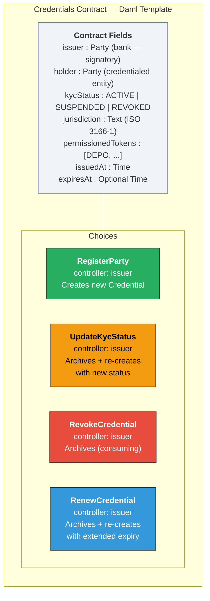
```mermaid
graph TB
    subgraph "Credentials Contract — Daml Template"
        direction TB
        
        FIELDS["<b>Contract Fields</b><br/>issuer : Party (bank — signatory)<br/>holder : Party (credentialed entity)<br/>kycStatus : ACTIVE | SUSPENDED | REVOKED<br/>jurisdiction : Text (ISO 3166-1)<br/>permissionedTokens : [DEPO, ...]<br/>issuedAt : Time<br/>expiresAt : Optional Time"]
        
        subgraph CHOICES["Choices"]
            direction LR
            C1["<b>RegisterParty</b><br/>controller: issuer<br/>Creates new Credential"]
            C2["<b>UpdateKycStatus</b><br/>controller: issuer<br/>Archives + re-creates<br/>with new status"]
            C3["<b>RevokeCredential</b><br/>controller: issuer<br/>Archives (consuming)"]
            C4["<b>RenewCredential</b><br/>controller: issuer<br/>Archives + re-creates<br/>with extended expiry"]
        end
        
        FIELDS --- CHOICES
    end

    style FIELDS fill:#f0f4f8,stroke:#1B3A5C
    style C1 fill:#27ae60,stroke:#333,color:#fff
    style C2 fill:#f39c12,stroke:#333,color:#000
    style C3 fill:#e74c3c,stroke:#333,color:#fff
    style C4 fill:#3498db,stroke:#333,color:#fff
```

**Conceptual Daml:**

```
template Credential
  with
    issuer              : Party        -- The bank (always signatory)
    holder              : Party        -- The credentialed entity
    kycStatus           : KycStatus    -- ACTIVE | SUSPENDED | REVOKED
    jurisdiction        : Text         -- ISO 3166-1 alpha-2
    permissionedTokens  : [TokenType]  -- e.g., [DEPO, USDC]
    issuedAt            : Time
    expiresAt           : Optional Time
  where
    signatory issuer
    observer holder

    choice UpdateKycStatus : ContractId Credential
      with newStatus : KycStatus
      controller issuer
      do create this with kycStatus = newStatus

    choice RevokeCredential : ()
      controller issuer
      do return ()   -- archives the contract
```

### 5.2 Registry Contract (DepositToken)

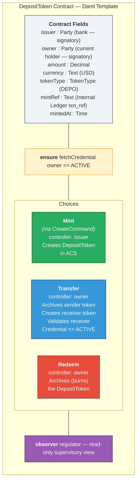
```mermaid
graph TB
    subgraph "DepositToken Contract — Daml Template"
        direction TB
        
        FIELDS["<b>Contract Fields</b><br/>issuer : Party (bank — signatory)<br/>owner : Party (current holder — signatory)<br/>amount : Decimal<br/>currency : Text (USD)<br/>tokenType : TokenType (DEPO)<br/>mintRef : Text (Internal Ledger txn_ref)<br/>mintedAt : Time"]
        
        ENSURE["<b>ensure</b> fetchCredential owner == ACTIVE"]
        
        subgraph CHOICES["Choices"]
            direction LR
            MINT["<b>Mint</b><br/><i>(via CreateCommand)</i><br/>controller: issuer<br/>Creates DepositToken<br/>in ACS"]
            XFER["<b>Transfer</b><br/>controller: owner<br/>Archives sender token<br/>Creates receiver token<br/>Validates receiver<br/>Credential == ACTIVE"]
            REDM["<b>Redeem</b><br/>controller: owner<br/>Archives (burns)<br/>the DepositToken"]
        end
        
        OBS["<b>observer</b> regulator — read-only supervisory view"]
        
        FIELDS --- ENSURE
        ENSURE --- CHOICES
        CHOICES --- OBS
    end

    style FIELDS fill:#f0f4f8,stroke:#1B3A5C
    style ENSURE fill:#fff3cd,stroke:#f39c12
    style MINT fill:#27ae60,stroke:#333,color:#fff
    style XFER fill:#3498db,stroke:#333,color:#fff
    style REDM fill:#e74c3c,stroke:#333,color:#fff
    style OBS fill:#9b59b6,stroke:#333,color:#fff
```

**Conceptual Daml:**

```
template DepositToken
  with
    issuer    : Party         -- The bank (always signatory)
    owner     : Party         -- Current token holder
    amount    : Decimal       -- Token amount in base currency
    currency  : Text          -- ISO 4217 (e.g., USD)
    tokenType : TokenType     -- DEPO
    mintRef   : Text          -- Internal Ledger txn_ref
    mintedAt  : Time
  where
    signatory issuer, owner
    observer regulator

    ensure fetchCredential owner == ACTIVE

    choice Transfer : ContractId DepositToken
      with newOwner : Party
      controller owner
      do
        assertMsg "Receiver must have active credential"
          (fetchCredential newOwner == ACTIVE)
        create this with owner = newOwner

    choice Redeem : ()
      controller owner
      do return ()   -- archives (burns) the token
```

### 5.3 Contract Lifecycle State Machine

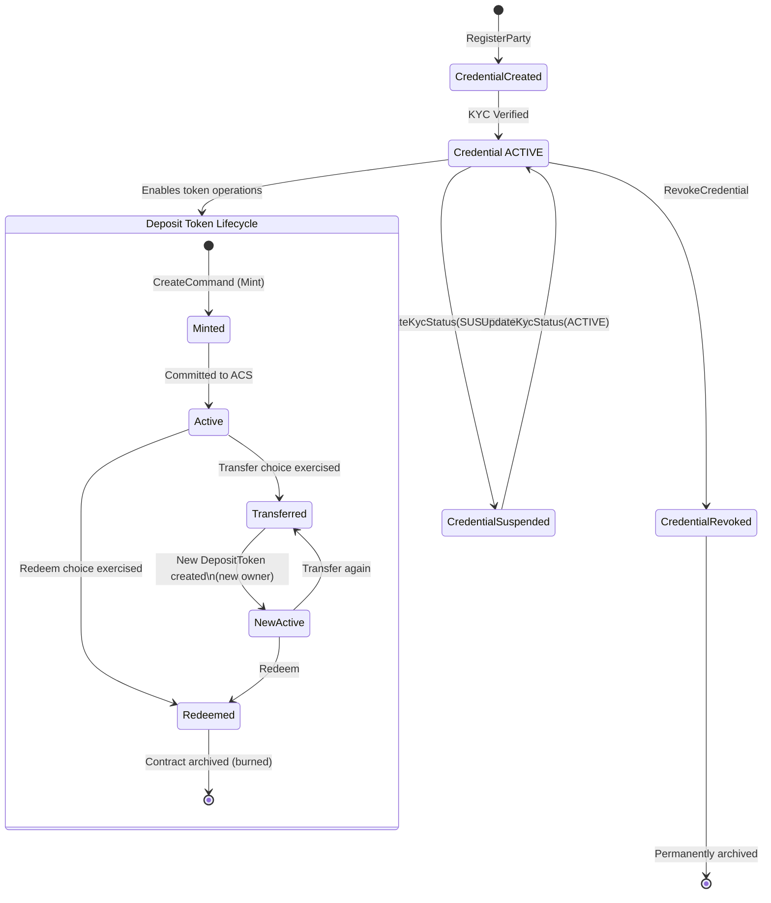
```mermaid
stateDiagram-v2
    [*] --> CredentialCreated: RegisterParty
    CredentialCreated --> CredentialActive: KYC Verified

    state "Credential ACTIVE" as CredentialActive
    state "Deposit Token Lifecycle" as TokenLife {
        [*] --> Minted: CreateCommand (Mint)
        Minted --> Active: Committed to ACS
        
        Active --> Transferred: Transfer choice exercised
        Transferred --> NewActive: New DepositToken created\n(new owner)
        
        Active --> Redeemed: Redeem choice exercised
        Redeemed --> [*]: Contract archived (burned)
        
        NewActive --> Transferred: Transfer again
        NewActive --> Redeemed: Redeem
    }

    CredentialActive --> TokenLife: Enables token operations
    CredentialActive --> CredentialSuspended: UpdateKycStatus(SUSPENDED)
    CredentialSuspended --> CredentialActive: UpdateKycStatus(ACTIVE)
    CredentialActive --> CredentialRevoked: RevokeCredential
    CredentialRevoked --> [*]: Permanently archived
```

---

## 6. Use Case: DEPO Deposit Token — Corporate Payment (USD 5M)

### 6.1 Scenario Overview

**Acme Corporation** wishes to pay **Global Logistics Inc.** USD 5,000,000 for a supply chain financing settlement. Instead of a traditional wire (T+1, correspondent fees), Acme requests that the bank mint DEPO deposit tokens against Acme's DDA balance and transfer them to Global Logistics, achieving **instant atomic settlement** on Canton.

### 6.2 Participants

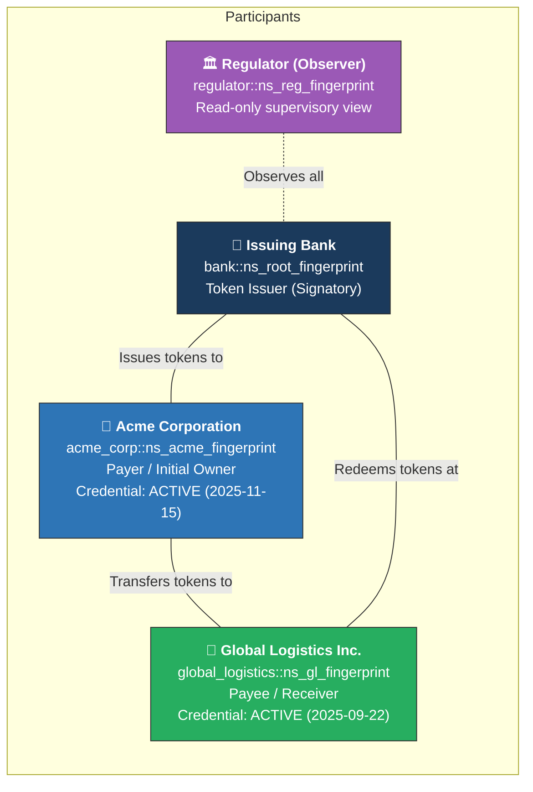
```mermaid
graph LR
    subgraph "Participants"
        direction TB
        BANK["🏦 <b>Issuing Bank</b><br/>bank::ns_root_fingerprint<br/>Token Issuer (Signatory)"]
        ACME["🏢 <b>Acme Corporation</b><br/>acme_corp::ns_acme_fingerprint<br/>Payer / Initial Owner<br/>Credential: ACTIVE (2025-11-15)"]
        GL["🏢 <b>Global Logistics Inc.</b><br/>global_logistics::ns_gl_fingerprint<br/>Payee / Receiver<br/>Credential: ACTIVE (2025-09-22)"]
        REG["🏛️ <b>Regulator (Observer)</b><br/>regulator::ns_reg_fingerprint<br/>Read-only supervisory view"]
    end

    BANK ---|"Issues tokens to"| ACME
    ACME ---|"Transfers tokens to"| GL
    GL ---|"Redeems tokens at"| BANK
    REG -.-|"Observes all"| BANK

    style BANK fill:#1B3A5C,stroke:#333,color:#fff
    style ACME fill:#2E75B6,stroke:#333,color:#fff
    style GL fill:#27ae60,stroke:#333,color:#fff
    style REG fill:#9b59b6,stroke:#333,color:#fff
```

### 6.3 Four-Phase Flow Overview

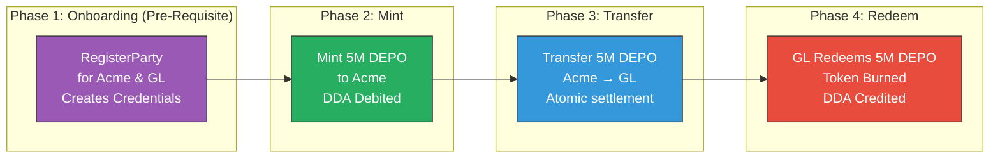
```mermaid
graph LR
    subgraph "Phase 1: Onboarding (Pre-Requisite)"
        P1["RegisterParty<br/>for Acme & GL<br/>Creates Credentials"]
    end
    subgraph "Phase 2: Mint"
        P2["Mint 5M DEPO<br/>to Acme<br/>DDA Debited"]
    end
    subgraph "Phase 3: Transfer"
        P3["Transfer 5M DEPO<br/>Acme → GL<br/>Atomic settlement"]
    end
    subgraph "Phase 4: Redeem"
        P4["GL Redeems 5M DEPO<br/>Token Burned<br/>DDA Credited"]
    end

    P1 --> P2 --> P3 --> P4

    style P1 fill:#9b59b6,stroke:#333,color:#fff
    style P2 fill:#27ae60,stroke:#333,color:#fff
    style P3 fill:#3498db,stroke:#333,color:#fff
    style P4 fill:#e74c3c,stroke:#333,color:#fff
```

---

## 7. End-to-End Workflow: Mint

### 7.1 Mint Sequence Diagram

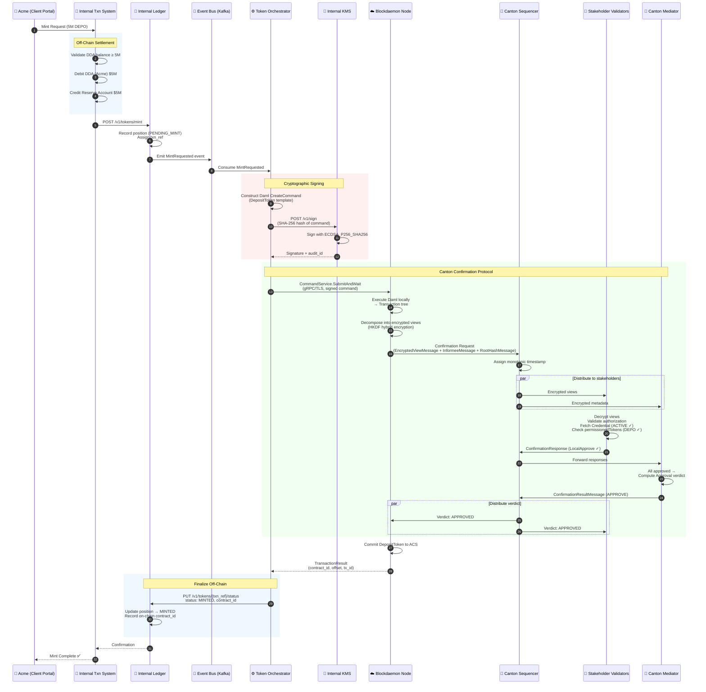
```mermaid
sequenceDiagram
    autonumber
    participant Client as 👤 Acme (Client Portal)
    participant ITS as 🏦 Internal Txn System
    participant IL as 📒 Internal Ledger
    participant Kafka as 📨 Event Bus (Kafka)
    participant Orch as ⚙️ Token Orchestrator
    participant KMS as 🔐 Internal KMS
    participant BD as ☁️ Blockdaemon Node
    participant SEQ as 🔗 Canton Sequencer
    participant VAL as 🔗 Stakeholder Validators
    participant MED as 🔗 Canton Mediator

    Client->>ITS: Mint Request (5M DEPO)
    
    rect rgb(240, 248, 255)
        Note over ITS: Off-Chain Settlement
        ITS->>ITS: Validate DDA balance ≥ 5M
        ITS->>ITS: Debit DDA (Acme) $5M
        ITS->>ITS: Credit Reserve Account $5M
    end
    
    ITS->>IL: POST /v1/tokens/mint
    IL->>IL: Record position (PENDING_MINT)<br/>Assign txn_ref
    IL->>Kafka: Emit MintRequested event
    Kafka->>Orch: Consume MintRequested
    
    rect rgb(255, 240, 240)
        Note over Orch,KMS: Cryptographic Signing
        Orch->>Orch: Construct Daml CreateCommand<br/>(DepositToken template)
        Orch->>KMS: POST /v1/sign<br/>(SHA-256 hash of command)
        KMS->>KMS: Sign with ECDSA_P256_SHA256
        KMS-->>Orch: Signature + audit_id
    end
    
    rect rgb(240, 255, 240)
        Note over Orch,MED: Canton Confirmation Protocol
        Orch->>BD: CommandService.SubmitAndWait<br/>(gRPC/TLS, signed command)
        BD->>BD: Execute Daml locally<br/>→ Transaction tree
        BD->>BD: Decompose into encrypted views<br/>(HKDF hybrid encryption)
        BD->>SEQ: Confirmation Request<br/>(EncryptedViewMessage + InformeeMessage + RootHashMessage)
        SEQ->>SEQ: Assign monotonic timestamp
        
        par Distribute to stakeholders
            SEQ->>VAL: Encrypted views
            SEQ->>MED: Encrypted metadata
        end
        
        VAL->>VAL: Decrypt views<br/>Validate authorization<br/>Fetch Credential (ACTIVE ✓)<br/>Check permissionedTokens (DEPO ✓)
        VAL->>SEQ: ConfirmationResponse (LocalApprove ✓)
        SEQ->>MED: Forward responses
        MED->>MED: All approved →<br/>Compute Approval verdict
        MED->>SEQ: ConfirmationResultMessage (APPROVE)
        
        par Distribute verdict
            SEQ->>BD: Verdict: APPROVED
            SEQ->>VAL: Verdict: APPROVED
        end
    end
    
    BD->>BD: Commit DepositToken to ACS
    BD-->>Orch: TransactionResult<br/>(contract_id, offset, tx_id)
    
    rect rgb(240, 248, 255)
        Note over Orch,IL: Finalize Off-Chain
        Orch->>IL: PUT /v1/tokens/{txn_ref}/status<br/>status: MINTED, contract_id
        IL->>IL: Update position → MINTED<br/>Record on-chain contract_id
    end
    
    IL-->>ITS: Confirmation
    ITS-->>Client: Mint Complete ✅
```

### 7.2 Credential Validation During Mint

During participant validation, each stakeholder evaluates the `ensure` clause on the DepositToken create action:

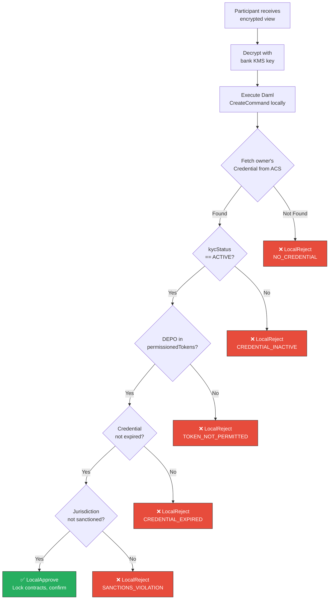
```mermaid
graph TD
    A["Participant receives<br/>encrypted view"] --> B["Decrypt with<br/>bank KMS key"]
    B --> C["Execute Daml<br/>CreateCommand locally"]
    C --> D{"Fetch owner's<br/>Credential from ACS"}
    
    D -->|"Found"| E{"kycStatus<br/>== ACTIVE?"}
    D -->|"Not Found"| REJECT1["❌ LocalReject<br/>NO_CREDENTIAL"]
    
    E -->|"Yes"| F{"DEPO in<br/>permissionedTokens?"}
    E -->|"No"| REJECT2["❌ LocalReject<br/>CREDENTIAL_INACTIVE"]
    
    F -->|"Yes"| G{"Credential<br/>not expired?"}
    F -->|"No"| REJECT3["❌ LocalReject<br/>TOKEN_NOT_PERMITTED"]
    
    G -->|"Yes"| H{"Jurisdiction<br/>not sanctioned?"}
    G -->|"No"| REJECT4["❌ LocalReject<br/>CREDENTIAL_EXPIRED"]
    
    H -->|"Yes"| APPROVE["✅ LocalApprove<br/>Lock contracts, confirm"]
    H -->|"No"| REJECT5["❌ LocalReject<br/>SANCTIONS_VIOLATION"]

    style APPROVE fill:#27ae60,stroke:#333,color:#fff
    style REJECT1 fill:#e74c3c,stroke:#333,color:#fff
    style REJECT2 fill:#e74c3c,stroke:#333,color:#fff
    style REJECT3 fill:#e74c3c,stroke:#333,color:#fff
    style REJECT4 fill:#e74c3c,stroke:#333,color:#fff
    style REJECT5 fill:#e74c3c,stroke:#333,color:#fff
```

---

## 8. End-to-End Workflow: Transfer

### 8.1 Transfer Sequence Diagram

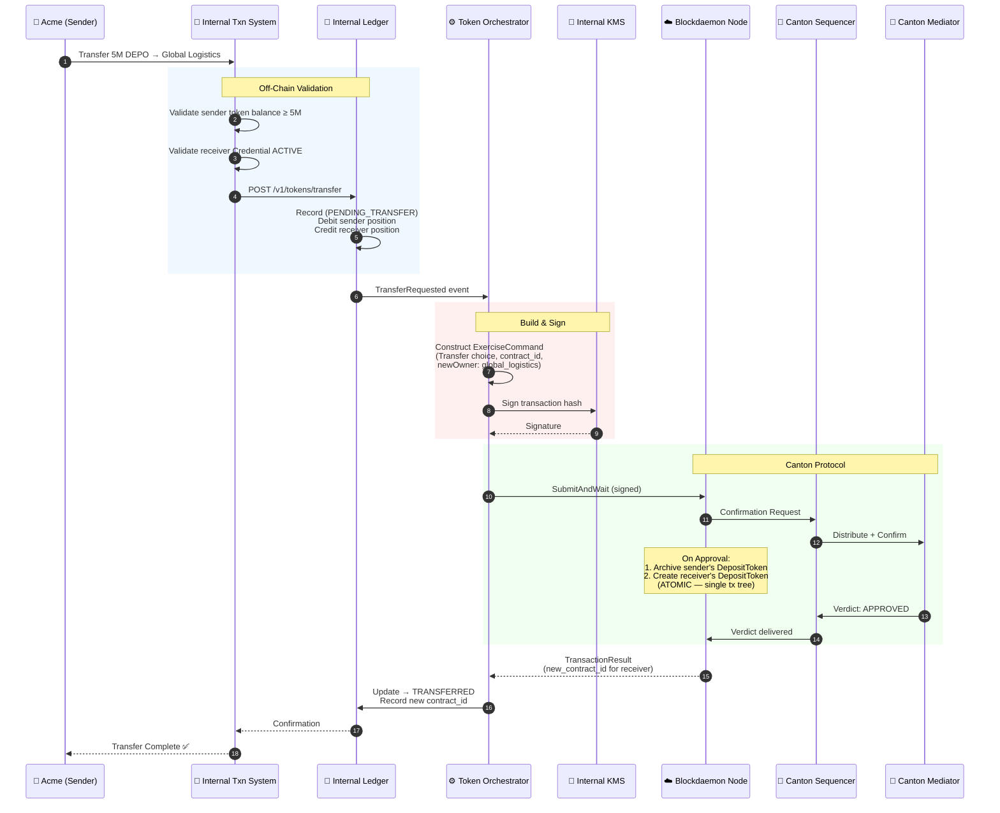
```mermaid
sequenceDiagram
    autonumber
    participant Acme as 👤 Acme (Sender)
    participant ITS as 🏦 Internal Txn System
    participant IL as 📒 Internal Ledger
    participant Orch as ⚙️ Token Orchestrator
    participant KMS as 🔐 Internal KMS
    participant BD as ☁️ Blockdaemon Node
    participant SEQ as 🔗 Canton Sequencer
    participant MED as 🔗 Canton Mediator

    Acme->>ITS: Transfer 5M DEPO → Global Logistics
    
    rect rgb(240, 248, 255)
        Note over ITS,IL: Off-Chain Validation
        ITS->>ITS: Validate sender token balance ≥ 5M
        ITS->>ITS: Validate receiver Credential ACTIVE
        ITS->>IL: POST /v1/tokens/transfer
        IL->>IL: Record (PENDING_TRANSFER)<br/>Debit sender position<br/>Credit receiver position
    end
    
    IL->>Orch: TransferRequested event
    
    rect rgb(255, 240, 240)
        Note over Orch,KMS: Build & Sign
        Orch->>Orch: Construct ExerciseCommand<br/>(Transfer choice, contract_id,<br/>newOwner: global_logistics)
        Orch->>KMS: Sign transaction hash
        KMS-->>Orch: Signature
    end
    
    rect rgb(240, 255, 240)
        Note over BD,MED: Canton Protocol
        Orch->>BD: SubmitAndWait (signed)
        BD->>SEQ: Confirmation Request
        SEQ->>MED: Distribute + Confirm
        
        Note over BD: On Approval:<br/>1. Archive sender's DepositToken<br/>2. Create receiver's DepositToken<br/>(ATOMIC — single tx tree)
        
        MED->>SEQ: Verdict: APPROVED
        SEQ->>BD: Verdict delivered
    end
    
    BD-->>Orch: TransactionResult<br/>(new_contract_id for receiver)
    Orch->>IL: Update → TRANSFERRED<br/>Record new contract_id
    IL-->>ITS: Confirmation
    ITS-->>Acme: Transfer Complete ✅
```

### 8.2 Atomic Transfer — Contract State Transition

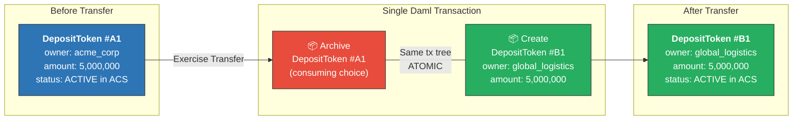
```mermaid
graph LR
    subgraph "Before Transfer"
        DT1["<b>DepositToken #A1</b><br/>owner: acme_corp<br/>amount: 5,000,000<br/>status: ACTIVE in ACS"]
    end
    
    subgraph "Single Daml Transaction"
        direction TB
        ARCHIVE["📦 Archive<br/>DepositToken #A1<br/>(consuming choice)"]
        CREATE["📦 Create<br/>DepositToken #B1<br/>owner: global_logistics<br/>amount: 5,000,000"]
        ARCHIVE ---|"Same tx tree<br/>ATOMIC"| CREATE
    end
    
    subgraph "After Transfer"
        DT2["<b>DepositToken #B1</b><br/>owner: global_logistics<br/>amount: 5,000,000<br/>status: ACTIVE in ACS"]
    end

    DT1 -->|"Exercise Transfer"| ARCHIVE
    CREATE --> DT2

    style DT1 fill:#2E75B6,stroke:#333,color:#fff
    style ARCHIVE fill:#e74c3c,stroke:#333,color:#fff
    style CREATE fill:#27ae60,stroke:#333,color:#fff
    style DT2 fill:#27ae60,stroke:#333,color:#fff
```

There is **no intermediate state** where the token exists in neither or both accounts. Canton's UTXO-like model guarantees this: the sender's contract is consumed and the receiver's is created as subactions within a single transaction tree, confirmed by a single mediator verdict.

---

## 9. End-to-End Workflow: Redemption

### 9.1 Redemption Sequence Diagram

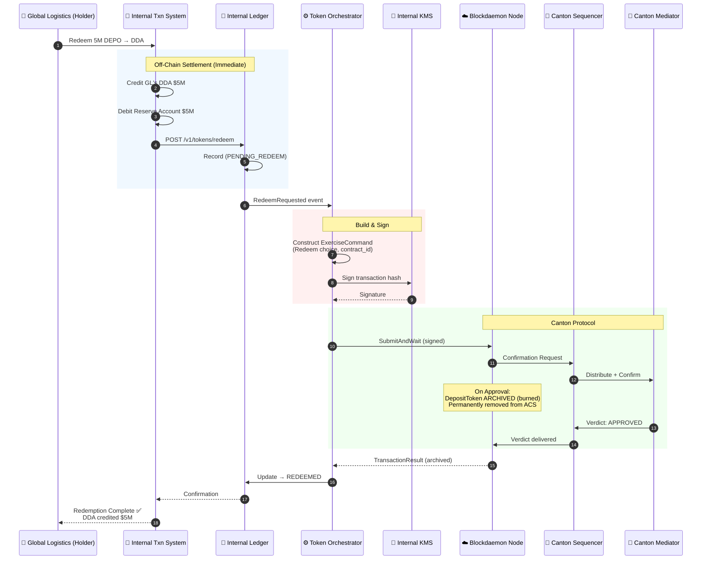
```mermaid
sequenceDiagram
    autonumber
    participant GL as 👤 Global Logistics (Holder)
    participant ITS as 🏦 Internal Txn System
    participant IL as 📒 Internal Ledger
    participant Orch as ⚙️ Token Orchestrator
    participant KMS as 🔐 Internal KMS
    participant BD as ☁️ Blockdaemon Node
    participant SEQ as 🔗 Canton Sequencer
    participant MED as 🔗 Canton Mediator

    GL->>ITS: Redeem 5M DEPO → DDA
    
    rect rgb(240, 248, 255)
        Note over ITS,IL: Off-Chain Settlement (Immediate)
        ITS->>ITS: Credit GL's DDA $5M
        ITS->>ITS: Debit Reserve Account $5M
        ITS->>IL: POST /v1/tokens/redeem
        IL->>IL: Record (PENDING_REDEEM)
    end
    
    IL->>Orch: RedeemRequested event
    
    rect rgb(255, 240, 240)
        Note over Orch,KMS: Build & Sign
        Orch->>Orch: Construct ExerciseCommand<br/>(Redeem choice, contract_id)
        Orch->>KMS: Sign transaction hash
        KMS-->>Orch: Signature
    end
    
    rect rgb(240, 255, 240)
        Note over BD,MED: Canton Protocol
        Orch->>BD: SubmitAndWait (signed)
        BD->>SEQ: Confirmation Request
        SEQ->>MED: Distribute + Confirm
        
        Note over BD: On Approval:<br/>DepositToken ARCHIVED (burned)<br/>Permanently removed from ACS
        
        MED->>SEQ: Verdict: APPROVED
        SEQ->>BD: Verdict delivered
    end
    
    BD-->>Orch: TransactionResult (archived)
    Orch->>IL: Update → REDEEMED
    IL-->>ITS: Confirmation
    ITS-->>GL: Redemption Complete ✅<br/>DDA credited $5M
```

### 9.2 Redemption — Token Burned

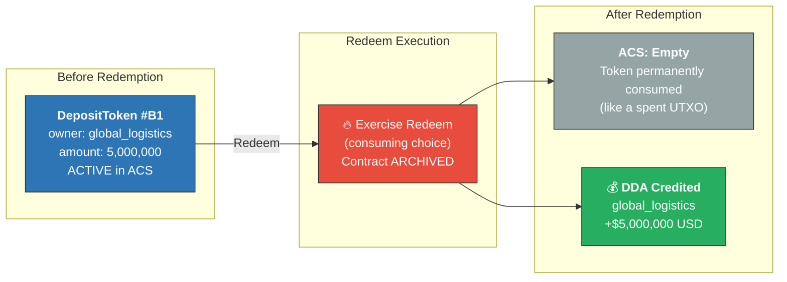
```mermaid
graph LR
    subgraph "Before Redemption"
        DT["<b>DepositToken #B1</b><br/>owner: global_logistics<br/>amount: 5,000,000<br/>ACTIVE in ACS"]
    end
    
    subgraph "Redeem Execution"
        BURN["🔥 Exercise Redeem<br/>(consuming choice)<br/>Contract ARCHIVED"]
    end
    
    subgraph "After Redemption"
        EMPTY["<b>ACS: Empty</b><br/>Token permanently consumed<br/>(like a spent UTXO)"]
        DDA["💰 <b>DDA Credited</b><br/>global_logistics<br/>+$5,000,000 USD"]
    end

    DT -->|"Redeem"| BURN
    BURN --> EMPTY
    BURN --> DDA

    style DT fill:#2E75B6,stroke:#333,color:#fff
    style BURN fill:#e74c3c,stroke:#333,color:#fff
    style EMPTY fill:#95a5a6,stroke:#333,color:#fff
    style DDA fill:#27ae60,stroke:#333,color:#fff
```

---

## 10. Internal Ledger API Specification

### 10.1 Communication Protocol

| Attribute | Value |
|---|---|
| **Protocol** | HTTPS (TLS 1.3) |
| **Format** | JSON (`application/json`) |
| **Authentication** | OAuth 2.0 Bearer Token (machine-to-machine client credentials grant) |
| **Base URL** | `https://internal-ledger.bank.internal/api/v1` |
| **Idempotency** | All mutating endpoints accept `Idempotency-Key` header (UUID v4) |
| **Rate Limiting** | 10,000 requests/minute per service account |
| **Timeout** | 30s (client-side); 60s (server-side gateway) |

### 10.2 Mint Endpoint

**`POST /v1/tokens/mint`**

**Request:**
```json
{
  "request_ref": "MINT-2026-0301-00001",
  "token_type": "DEPO",
  "amount": 5000000.00,
  "currency": "USD",
  "owner_party_id": "acme_corp::ns_acme_fingerprint",
  "source_account": {
    "account_type": "DDA",
    "account_number": "****4521",
    "routing_number": "021000021"
  },
  "metadata": {
    "initiated_by": "treasury_ops@acme.com",
    "business_reason": "Supply chain settlement",
    "reference": "PO-2026-88712"
  }
}
```

**Response (201 Created):**
```json
{
  "txn_ref": "TXN-MINT-20260301-A7F3E9",
  "status": "PENDING_MINT",
  "token_type": "DEPO",
  "amount": 5000000.00,
  "currency": "USD",
  "owner_party_id": "acme_corp::ns_acme_fingerprint",
  "ledger_entries": [
    { "account": "DDA-****4521", "side": "DEBIT", "amount": 5000000.00 },
    { "account": "RESERVE-DEPO-001", "side": "CREDIT", "amount": 5000000.00 }
  ],
  "created_at": "2026-03-01T10:00:00.000Z",
  "idempotency_key": "f47ac10b-58cc-4372-a567-0e02b2c3d479"
}
```

### 10.3 Transfer Endpoint

**`POST /v1/tokens/transfer`**

**Request:**
```json
{
  "request_ref": "XFER-2026-0301-00001",
  "token_type": "DEPO",
  "amount": 5000000.00,
  "currency": "USD",
  "sender_party_id": "acme_corp::ns_acme_fingerprint",
  "receiver_party_id": "global_logistics::ns_gl_fingerprint",
  "source_contract_id": "00a1b2c3d4e5f6...::DEPO",
  "metadata": {
    "initiated_by": "treasury_ops@acme.com",
    "business_reason": "Payment for PO-2026-88712"
  }
}
```

**Response (201 Created):**
```json
{
  "txn_ref": "TXN-XFER-20260301-B8G4F0",
  "status": "PENDING_TRANSFER",
  "sender_position_delta": -5000000.00,
  "receiver_position_delta": 5000000.00,
  "created_at": "2026-03-01T10:05:00.000Z"
}
```

### 10.4 Redeem Endpoint

**`POST /v1/tokens/redeem`**

**Request:**
```json
{
  "request_ref": "REDM-2026-0301-00001",
  "token_type": "DEPO",
  "amount": 5000000.00,
  "currency": "USD",
  "holder_party_id": "global_logistics::ns_gl_fingerprint",
  "source_contract_id": "00x9y8z7w6v5u4...::DEPO",
  "destination_account": {
    "account_type": "DDA",
    "account_number": "****7832",
    "routing_number": "021000021"
  }
}
```

**Response (201 Created):**
```json
{
  "txn_ref": "TXN-REDM-20260301-C9H5G1",
  "status": "PENDING_REDEEM",
  "ledger_entries": [
    { "account": "RESERVE-DEPO-001", "side": "DEBIT", "amount": 5000000.00 },
    { "account": "DDA-****7832", "side": "CREDIT", "amount": 5000000.00 }
  ],
  "created_at": "2026-03-01T14:00:00.000Z"
}
```

### 10.5 Status Update Endpoint

**`PUT /v1/tokens/{txn_ref}/status`**

```json
{
  "status": "MINTED",
  "on_chain": {
    "contract_id": "00a1b2c3d4e5f6...::DEPO",
    "transaction_id": "tx-2026030100001-abc123def456",
    "offset": "000000000001234567",
    "committed_at": "2026-03-01T10:00:02.150Z"
  }
}
```

---

## 11. Business API Specification

The Business API is the external-facing API exposed to corporate clients. It abstracts the complexity of the Internal Ledger and on-chain operations.

| Method | Endpoint | Description |
|---|---|---|
| `POST` | `/v1/deposit-tokens/mint` | Request minting against DDA balance |
| `POST` | `/v1/deposit-tokens/transfer` | Transfer to another credentialed party |
| `POST` | `/v1/deposit-tokens/redeem` | Redeem back to DDA |
| `GET` | `/v1/deposit-tokens/balance` | Current token balance |
| `GET` | `/v1/deposit-tokens/transactions` | Transaction history (paginated) |
| `GET` | `/v1/deposit-tokens/transactions/{txn_ref}` | Status of specific transaction |

**Balance Query Response:**
```json
{
  "party_id": "acme_corp::ns_acme_fingerprint",
  "balances": [
    {
      "token_type": "DEPO",
      "currency": "USD",
      "available_balance": 5000000.00,
      "pending_balance": 0.00,
      "total_balance": 5000000.00,
      "active_contracts": 1,
      "last_updated": "2026-03-01T10:02:15.000Z"
    }
  ]
}
```

---

## 12. Invoke Request/Response Payloads

### 12.1 Mint — Daml CreateCommand (Ledger API v2)

```json
{
  "commands": {
    "user_id": "token_orchestrator_svc",
    "command_id": "CMD-MINT-20260301-A7F3E9",
    "act_as": ["bank::ns_root_fingerprint"],
    "read_as": ["regulator::ns_reg_fingerprint"],
    "commands": [
      {
        "create": {
          "template_id": {
            "package_id": "abc123...deposit_token_pkg",
            "module_name": "DepositToken.Registry",
            "entity_name": "DepositToken"
          },
          "create_arguments": {
            "fields": [
              { "label": "issuer", "value": { "party": "bank::ns_root_fingerprint" } },
              { "label": "owner", "value": { "party": "acme_corp::ns_acme_fingerprint" } },
              { "label": "amount", "value": { "numeric": "5000000.00" } },
              { "label": "currency", "value": { "text": "USD" } },
              { "label": "tokenType", "value": { "enum": "DEPO" } },
              { "label": "mintRef", "value": { "text": "TXN-MINT-20260301-A7F3E9" } }
            ]
          }
        }
      }
    ],
    "synchronizer_id": "global_sync::canton_global"
  }
}
```

### 12.2 Transfer — Daml ExerciseCommand

```json
{
  "commands": {
    "user_id": "token_orchestrator_svc",
    "command_id": "CMD-XFER-20260301-B8G4F0",
    "act_as": ["acme_corp::ns_acme_fingerprint"],
    "commands": [
      {
        "exercise": {
          "template_id": {
            "package_id": "abc123...deposit_token_pkg",
            "module_name": "DepositToken.Registry",
            "entity_name": "DepositToken"
          },
          "contract_id": "00a1b2c3d4e5f6...::DEPO",
          "choice": "Transfer",
          "choice_argument": {
            "fields": [
              { "label": "newOwner", "value": { "party": "global_logistics::ns_gl_fingerprint" } }
            ]
          }
        }
      }
    ]
  }
}
```

### 12.3 Redeem — Daml ExerciseCommand

```json
{
  "commands": {
    "user_id": "token_orchestrator_svc",
    "command_id": "CMD-REDM-20260301-C9H5G1",
    "act_as": ["global_logistics::ns_gl_fingerprint"],
    "commands": [
      {
        "exercise": {
          "template_id": {
            "package_id": "abc123...deposit_token_pkg",
            "module_name": "DepositToken.Registry",
            "entity_name": "DepositToken"
          },
          "contract_id": "00x9y8z7w6v5u4...::DEPO",
          "choice": "Redeem",
          "choice_argument": { "fields": [] }
        }
      }
    ]
  }
}
```

### 12.4 Canton Ledger API — Success Response

```json
{
  "transaction": {
    "transaction_id": "tx-2026030100001-abc123def456",
    "command_id": "CMD-MINT-20260301-A7F3E9",
    "offset": "000000000001234567",
    "effective_at": "2026-03-01T10:00:02.150Z",
    "events": [
      {
        "created": {
          "contract_id": "00a1b2c3d4e5f6...::DEPO",
          "template_id": {
            "package_id": "abc123...",
            "module_name": "DepositToken.Registry",
            "entity_name": "DepositToken"
          },
          "create_arguments": { "..." : "..." },
          "signatories": ["bank::ns_root_fingerprint", "acme_corp::ns_acme_fingerprint"],
          "observers": ["regulator::ns_reg_fingerprint"]
        }
      }
    ]
  }
}
```

---

## 13. Blockdaemon Integration Specification

### 13.1 Communication Architecture

| Attribute | Value |
|---|---|
| **Protocol** | gRPC over TLS 1.3 (mTLS for production) |
| **Endpoint** | `canton-validator.blockdaemon.com:443` |
| **Authentication** | mTLS client certificate + OAuth 2.0 bearer token (OIDC) |
| **Serialization** | Protocol Buffers — Canton Ledger API v2 |
| **Connection Model** | Persistent gRPC channel with keepalive (30s interval, 10s timeout) |
| **Retry Policy** | Exponential backoff (initial: 100ms, max: 30s, jitter: 0.2) |

### 13.2 gRPC Service Methods

| Service | Method | Use Case | Mode |
|---|---|---|---|
| `CommandService` | `SubmitAndWait` | Primary for mint/transfer/redeem — blocks until verdict | Sync |
| `CommandSubmissionService` | `Submit` | Fire-and-forget for batch operations | Async |
| `CommandCompletionService` | `CompletionStream` | Async completion monitoring | Streaming |
| `UpdateService` | `GetUpdates` | Real-time event stream for reconciliation | Streaming |
| `StateService` | `GetActiveContracts` | ACS snapshot for periodic reconciliation | Sync |
| `InteractiveSubmissionService` | `PrepareSubmission` | Step 1: prepare tx for KMS signing | Sync |
| `InteractiveSubmissionService` | `ExecuteSubmission` | Step 2: submit externally-signed tx | Sync |

### 13.3 Interactive Submission Flow (External KMS Signing)

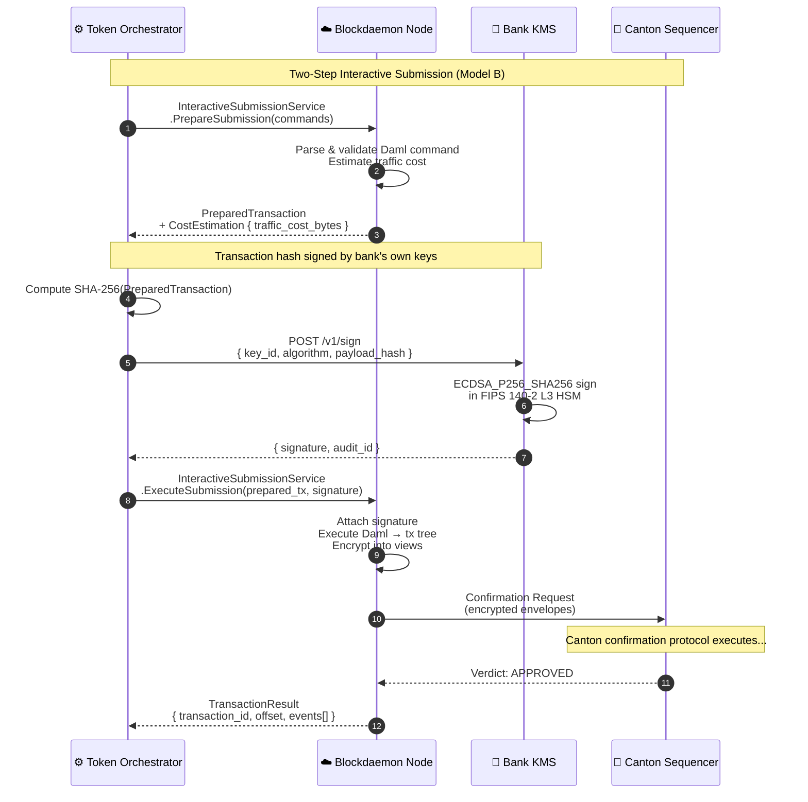
```mermaid
sequenceDiagram
    autonumber
    participant Orch as ⚙️ Token Orchestrator
    participant BD as ☁️ Blockdaemon Node
    participant KMS as 🔐 Bank KMS
    participant SEQ as 🔗 Canton Sequencer

    Note over Orch,SEQ: Two-Step Interactive Submission (Model B)
    
    Orch->>BD: InteractiveSubmissionService<br/>.PrepareSubmission(commands)
    BD->>BD: Parse & validate Daml command<br/>Estimate traffic cost
    BD-->>Orch: PreparedTransaction<br/>+ CostEstimation { traffic_cost_bytes }
    
    Note over Orch,KMS: Transaction hash signed by bank's own keys
    Orch->>Orch: Compute SHA-256(PreparedTransaction)
    Orch->>KMS: POST /v1/sign<br/>{ key_id, algorithm, payload_hash }
    KMS->>KMS: ECDSA_P256_SHA256 sign<br/>in FIPS 140-2 L3 HSM
    KMS-->>Orch: { signature, audit_id }
    
    Orch->>BD: InteractiveSubmissionService<br/>.ExecuteSubmission(prepared_tx, signature)
    BD->>BD: Attach signature<br/>Execute Daml → tx tree<br/>Encrypt into views
    BD->>SEQ: Confirmation Request<br/>(encrypted envelopes)
    
    Note over SEQ: Canton confirmation protocol executes...
    
    SEQ-->>BD: Verdict: APPROVED
    BD-->>Orch: TransactionResult<br/>{ transaction_id, offset, events[] }
```

### 13.4 PrepareSubmission — Detailed API Contract

The `PrepareSubmission` gRPC call sends Daml commands to the Blockdaemon validator node, which interprets them locally (without submitting to the network) and returns a serialized `PreparedTransaction` along with a cost estimation.

**gRPC Service Definition (Canton Ledger API v2):**

```protobuf
service InteractiveSubmissionService {
  rpc PrepareSubmission (PrepareSubmissionRequest) returns (PrepareSubmissionResponse);
  rpc ExecuteSubmission (ExecuteSubmissionRequest) returns (ExecuteSubmissionResponse);
}

message PrepareSubmissionRequest {
  string application_id = 1;            // e.g. "bank-depo-orchestrator"
  string command_id = 2;                // idempotency key, e.g. "CMD-MINT-20260301-A7F3E9"
  string workflow_id = 3;               // correlates related commands
  repeated string act_as = 4;           // submitting parties
  repeated string read_as = 5;          // observer parties
  repeated Command commands = 6;        // Daml commands (Create, Exercise)
  google.protobuf.Duration min_ledger_time_rel = 7;
  int64 disclosure_interval = 8;        // deduplication window
  string domain_id = 9;                 // target synchronizer
  PrepareSubmissionConfig config = 10;
}

message PrepareSubmissionResponse {
  oneof result {
    PreparedTransaction prepared_transaction = 1;
    PrepareError error = 2;
  }
}

message PreparedTransaction {
  bytes prepared_transaction_data = 1;  // opaque serialized tx
  bytes transaction_hash = 2;           // SHA-256 hash to be signed
  string hash_algorithm = 3;            // "SHA256"
  repeated PartySignatureRequirement
      signature_requirements = 4;       // which parties + key fingerprints must sign
  CostEstimation cost_estimation = 5;
}

message CostEstimation {
  int64 traffic_cost_bytes = 1;         // Canton Coin traffic units consumed
  int64 estimated_sequencing_time_ms = 2;
}
```

**What happens inside the validator during Prepare:**

| Step | Action | Output |
|---|---|---|
| 1 | Parse and validate Daml commands against loaded packages | Validated command set |
| 2 | Execute Daml interpretation engine (compute full transaction tree locally) | Transaction tree with created/archived contracts |
| 3 | Compute participant-level views (which parties see what) | Informee decomposition |
| 4 | Serialize the prepared transaction into a canonical byte representation | `prepared_transaction_data` |
| 5 | Hash the serialized bytes: `SHA-256(prepared_transaction_data)` | `transaction_hash` (32 bytes) |
| 6 | Identify which party keys must sign (from `act_as` parties) | `signature_requirements[]` |
| 7 | Estimate Canton Coin traffic cost based on envelope sizes | `cost_estimation` |

**Key point:** The validator does NOT submit anything to the sequencer during Prepare. The transaction exists only in memory on the validator. It is discarded if ExecuteSubmission is not called within the configured timeout (default: 30s).

### 13.5 Token Orchestrator — Transaction Signing (Bank Internal)

After receiving the `PreparedTransaction`, the Token Orchestrator must sign the `transaction_hash` using the bank's own keys held in the **bank's internal KMS** (HashiCorp Vault Transit engine). The Orchestrator calls Vault directly over the internal network — this path does not use the Crypto Gateway (see §14.3). The validator cannot perform this step — it has no access to signing keys under Model B.

**Architecture:**

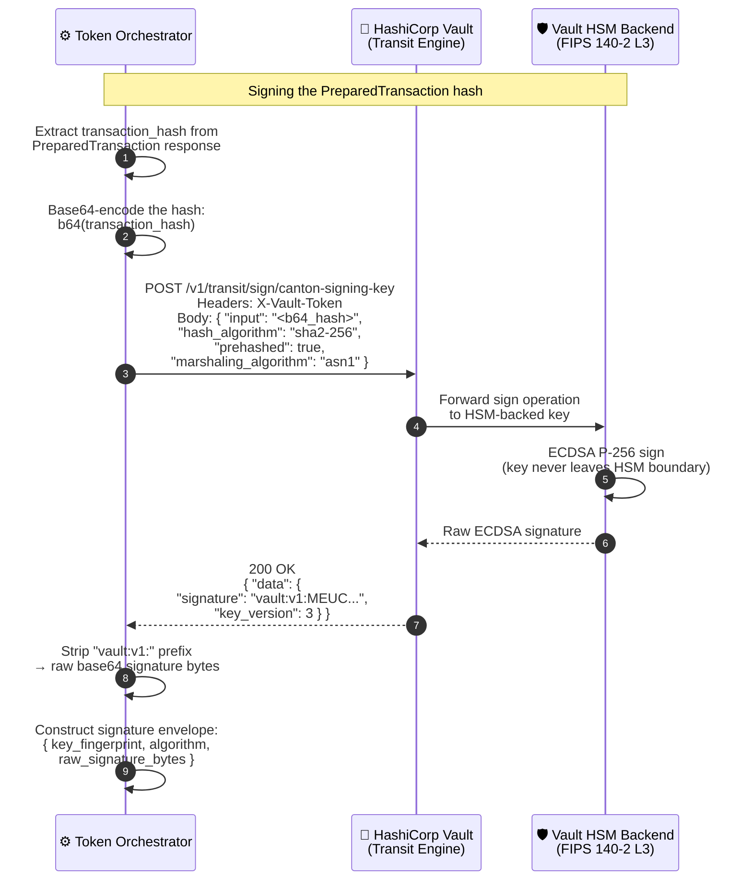
```mermaid
sequenceDiagram
    autonumber
    participant Orch as ⚙️ Token Orchestrator
    participant Vault as 🔐 HashiCorp Vault<br/>(Transit Engine)
    participant HSM as 🛡️ Vault HSM Backend<br/>(FIPS 140-2 L3)

    Note over Orch,HSM: Signing the PreparedTransaction hash

    Orch->>Orch: Extract transaction_hash from<br/>PreparedTransaction response
    Orch->>Orch: Base64-encode the hash:<br/>b64(transaction_hash)

    Orch->>Vault: POST /v1/transit/sign/canton-signing-key<br/>Headers: X-Vault-Token<br/>Body: { "input": "<b64_hash>",<br/>"hash_algorithm": "sha2-256",<br/>"prehashed": true,<br/>"marshaling_algorithm": "asn1" }

    Vault->>HSM: Forward sign operation<br/>to HSM-backed key
    HSM->>HSM: ECDSA P-256 sign<br/>(key never leaves HSM boundary)
    HSM-->>Vault: Raw ECDSA signature

    Vault-->>Orch: 200 OK<br/>{ "data": {<br/>"signature": "vault:v1:MEUC...",<br/>"key_version": 3 } }

    Orch->>Orch: Strip "vault:v1:" prefix<br/>→ raw base64 signature bytes
    Orch->>Orch: Construct signature envelope:<br/>{ key_fingerprint, algorithm,<br/>  raw_signature_bytes }
```

**Vault Transit Sign Request — Full Specification:**

```
POST https://vault.bank.internal:8200/v1/transit/sign/canton-signing-key
```

| Header | Value |
|---|---|
| `X-Vault-Token` | Vault token (AppRole or Kubernetes auth) |
| `X-Vault-Namespace` | `bank/canton-prod` (Enterprise namespaces) |
| `Content-Type` | `application/json` |

**Request Body:**
```json
{
  "input": "o/KxwNV3...base64_of_transaction_hash",
  "hash_algorithm": "sha2-256",
  "prehashed": true,
  "marshaling_algorithm": "asn1",
  "context": "Q0FOVE9OX1RYX1NJR04="
}
```

| Field | Required | Purpose |
|---|---|---|
| `input` | Yes | Base64-encoded `transaction_hash` from PrepareSubmission response |
| `hash_algorithm` | Yes | Must match the hash used in PrepareSubmission (`sha2-256`) |
| `prehashed` | Yes | **Must be `true`** — the hash was already computed by the validator node. Vault must NOT re-hash. |
| `marshaling_algorithm` | Yes | `asn1` for DER-encoded ECDSA (Canton expects ASN.1/DER format). Do NOT use `jws`. |
| `context` | No | Optional base64 string for convergent encryption keys. Used for audit correlation. |

**Response Body:**
```json
{
  "data": {
    "signature": "vault:v1:MEUCIQDh8kF2n...base64_DER_signature",
    "key_version": 3
  }
}
```

**Post-processing the signature:**
1. Strip the `vault:v1:` prefix → yields raw base64 DER-encoded ECDSA signature
2. Base64-decode → binary DER bytes (ASN.1 SEQUENCE of two INTEGERs: r, s)
3. Pass these bytes directly to `ExecuteSubmission` as the signature payload

### 13.6 ExecuteSubmission — Detailed API Contract

Once the Orchestrator has the signature from Vault, it calls `ExecuteSubmission` to hand the signed transaction back to the Blockdaemon validator for actual submission to the Canton network.

**gRPC Message Definition:**

```protobuf
message ExecuteSubmissionRequest {
  bytes prepared_transaction_data = 1;   // exactly as received from Prepare
  repeated PartySignatures party_signatures = 2;
}

message PartySignatures {
  string party = 1;                       // party ID that signed
  repeated Signature signatures = 2;      // one or more signatures for this party
}

message Signature {
  bytes signature = 1;                    // raw DER-encoded ECDSA signature bytes
  string signed_by = 2;                   // key fingerprint (from Vault public key)
  SignatureFormat format = 3;             // SIGNATURE_FORMAT_RAW
}

message ExecuteSubmissionResponse {
  oneof result {
    TransactionResult transaction_result = 1;
    ExecuteError error = 2;
  }
}

message TransactionResult {
  string transaction_id = 1;             // Canton tx ID (globally unique)
  string offset = 2;                     // ledger offset for this tx
  google.protobuf.Timestamp effective_at = 3;
  repeated Event events = 4;             // created/archived contract events
}
```

**What happens inside the validator during Execute:**

| Step | Action | Failure Mode |
|---|---|---|
| 1 | Retrieve the in-memory prepared transaction (by hash) | `PREPARED_TX_NOT_FOUND` if expired (>30s) |
| 2 | Verify each signature against the corresponding party's public key registered in Canton topology | `INVALID_SIGNATURE` if key mismatch or corrupt sig |
| 3 | Attach verified signatures to the transaction tree | — |
| 4 | Encrypt transaction views (HKDF seed → AES-GCM per view) | — |
| 5 | Construct confirmation request batch (encrypted envelopes) | — |
| 6 | Submit batch to Canton Sequencer via gRPC | `SEQUENCER_UNAVAILABLE` with retry |
| 7 | Wait for mediator verdict (confirmation protocol) | `TIMEOUT` if mediator doesn't respond in 30s |
| 8 | Return `TransactionResult` with tx_id, offset, and events | — |

**Critical timing constraint:** The `prepared_transaction_data` is cached in the validator's memory only for a limited window (configurable, default ~30s). If the Vault signing takes longer (e.g., due to a multi-approval policy), the orchestrator must re-call `PrepareSubmission` to get a fresh prepared transaction. This is why KMS signing latency is hard-limited to 5s.

### 13.7 End-to-End Code Flow: Prepare → Sign → Execute

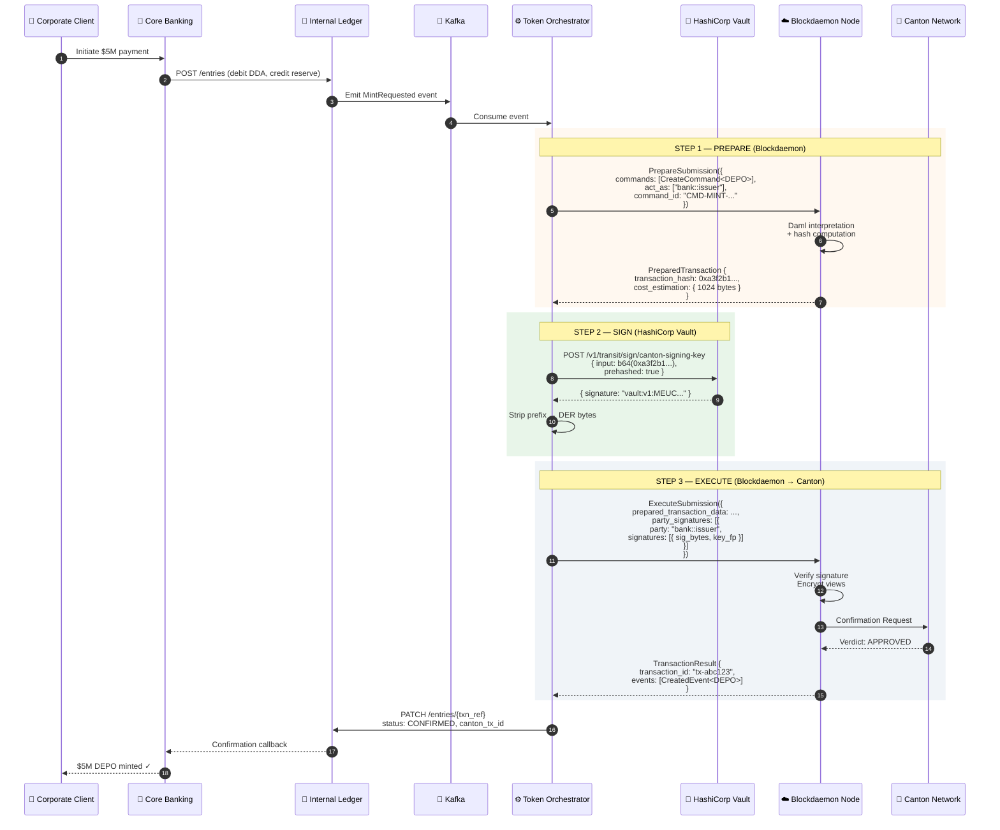
```mermaid
sequenceDiagram
    autonumber
    participant Client as 👤 Corporate Client
    participant ITS as 🏦 Core Banking
    participant IL as 📒 Internal Ledger
    participant Kafka as 📨 Kafka
    participant Orch as ⚙️ Token Orchestrator
    participant Vault as 🔐 HashiCorp Vault
    participant BD as ☁️ Blockdaemon Node
    participant Canton as 🔗 Canton Network

    Client->>ITS: Initiate $5M payment
    ITS->>IL: POST /entries (debit DDA, credit reserve)
    IL->>Kafka: Emit MintRequested event
    Kafka->>Orch: Consume event

    rect rgb(255, 248, 240)
        Note over Orch,Canton: STEP 1 — PREPARE (Blockdaemon)
        Orch->>BD: PrepareSubmission({<br/>  commands: [CreateCommand<DEPO>],<br/>  act_as: ["bank::issuer"],<br/>  command_id: "CMD-MINT-..."<br/>})
        BD->>BD: Daml interpretation<br/>+ hash computation
        BD-->>Orch: PreparedTransaction {<br/>  transaction_hash: 0xa3f2b1...,<br/>  cost_estimation: { 1024 bytes }<br/>}
    end

    rect rgb(232, 245, 233)
        Note over Orch,Vault: STEP 2 — SIGN (HashiCorp Vault)
        Orch->>Vault: POST /v1/transit/sign/canton-signing-key<br/>{ input: b64(0xa3f2b1...),<br/>  prehashed: true }
        Vault-->>Orch: { signature: "vault:v1:MEUC..." }
        Orch->>Orch: Strip prefix → DER bytes
    end

    rect rgb(240, 244, 248)
        Note over Orch,Canton: STEP 3 — EXECUTE (Blockdaemon → Canton)
        Orch->>BD: ExecuteSubmission({<br/>  prepared_transaction_data: ...,<br/>  party_signatures: [{<br/>    party: "bank::issuer",<br/>    signatures: [{ sig_bytes, key_fp }]<br/>  }]<br/>})
        BD->>BD: Verify signature<br/>Encrypt views
        BD->>Canton: Confirmation Request
        Canton-->>BD: Verdict: APPROVED
        BD-->>Orch: TransactionResult {<br/>  transaction_id: "tx-abc123",<br/>  events: [CreatedEvent<DEPO>]<br/>}
    end

    Orch->>IL: PATCH /entries/{txn_ref}<br/>status: CONFIRMED, canton_tx_id
    IL-->>ITS: Confirmation callback
    ITS-->>Client: $5M DEPO minted ✓
```

### 13.8 Error Handling for Interactive Submission

| Error Code | Source | Cause | Recovery |
|---|---|---|---|
| `INVALID_ARGUMENT` | PrepareSubmission | Malformed Daml command, missing party | Fix payload, no retry |
| `PARTY_NOT_AUTHORIZED` | PrepareSubmission | `act_as` party not hosted on this node | Config issue — escalate |
| `PACKAGE_NOT_FOUND` | PrepareSubmission | Daml package not uploaded to node | Upload package via admin API |
| `PREPARED_TX_NOT_FOUND` | ExecuteSubmission | Prepared tx expired (>30s) or wrong hash | Re-call PrepareSubmission |
| `INVALID_SIGNATURE` | ExecuteSubmission | Signature doesn't match registered key | Verify Vault key ↔ Canton topology key match |
| `SIGNATURE_KEY_UNKNOWN` | ExecuteSubmission | Key fingerprint not registered in Canton | Register public key via topology transaction |
| `SEQUENCER_UNAVAILABLE` | ExecuteSubmission | Canton sequencer down | Retry with backoff (max 3 attempts) |
| `MEDIATOR_REJECT` | ExecuteSubmission | Counterparty rejected or timeout | Investigate rejection reason in events |
| `TRAFFIC_LIMIT_EXCEEDED` | ExecuteSubmission | Insufficient Canton Coin for traffic | Top up CC balance, retry |
| `403 Forbidden` | Vault /transit/sign | Vault token expired or insufficient policy | Rotate AppRole token, check policy |
| `404 Not Found` | Vault /transit/sign | Key name doesn't exist in Transit engine | Verify key name: `canton-signing-key` |
| `429 Too Many Requests` | Vault /transit/sign | Rate limit exceeded | Backoff; consider Vault performance replication |

### 13.9 Blockdaemon Internal Processing

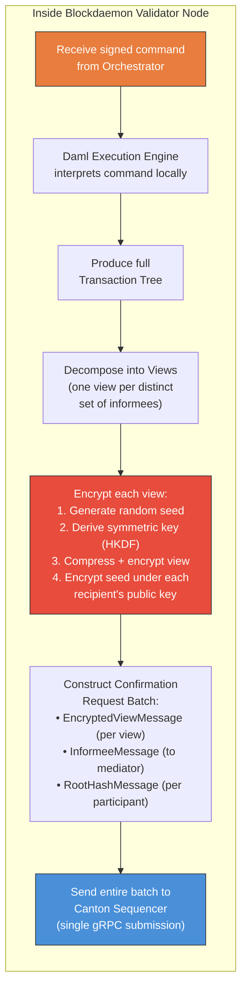
```mermaid
graph TB
    subgraph "Inside Blockdaemon Validator Node"
        direction TB
        
        A["Receive signed command<br/>from Orchestrator"] --> B["Daml Execution Engine<br/>interprets command locally"]
        B --> C["Produce full<br/>Transaction Tree"]
        C --> D["Decompose into Views<br/>(one view per distinct<br/>set of informees)"]
        D --> E["Encrypt each view:<br/>1. Generate random seed<br/>2. Derive symmetric key (HKDF)<br/>3. Compress + encrypt view<br/>4. Encrypt seed under each<br/>   recipient's public key"]
        E --> F["Construct Confirmation<br/>Request Batch:<br/>• EncryptedViewMessage (per view)<br/>• InformeeMessage (to mediator)<br/>• RootHashMessage (per participant)"]
        F --> G["Send entire batch to<br/>Canton Sequencer<br/>(single gRPC submission)"]
    end

    style A fill:#e87d3e,stroke:#333,color:#fff
    style E fill:#e74c3c,stroke:#333,color:#fff
    style G fill:#4a90d9,stroke:#333,color:#fff
```

---

## 14. Key Management Architecture — Bank-Operated Canton Crypto Gateway

### 14.1 Canton Protocol Key Inventory

Canton requires five distinct cryptographic keys for a participant to operate on the network. Each serves a specific protocol function:

| # | Key Name | Type | Protocol Purpose | Usage Frequency | Used By |
|---|---|---|---|---|---|
| 1 | **Root Namespace Key** | ECDSA P-256 | Defines the participant's Canton identity. `namespace = fingerprint(root_public_key)`. Signs `NamespaceDelegation` topology transactions. | One-time setup + emergency only | Topology Admin (ceremony) |
| 2 | **Intermediate Delegation Key** | ECDSA P-256 | Authorized by root to sign all other topology transactions: `OwnerToKeyMapping`, `PartyToParticipant`, `DomainTrustCertificate`. | Key rotation, party onboarding, domain joining | Topology Admin |
| 3 | **Signing Key (Operational)** | ECDSA P-256 | Signs `transaction_hash` from `PrepareSubmission`. Hot-path key for Daml command submission. | Every Daml command (mint, transfer, redeem) | Token Orchestrator |
| 4 | **Signing Key (Protocol)** | ECDSA P-256 | Signs `ConfirmationResponse` and other `SignedProtocolMessage` envelopes during Canton's confirmation protocol. | Every transaction where the node is a stakeholder (inbound + outbound) | Validator Node (automatic) |
| 5 | **Encryption Key** | ECIES (X25519 / P-256) | Encrypts outbound HKDF seeds per recipient. Decrypts inbound `EncryptedViewMessage` session keys addressed to hosted parties. | Every transaction involving hosted parties | Validator Node (automatic) |

**Keys 3 and 4** may be the same ECDSA key or separate keys — Canton supports both configurations. This specification assumes **separate keys** for defense in depth: the Orchestrator can sign transactions but not protocol messages, and vice versa.

```mermaid
graph TD
    subgraph CANTON_KEYS["Canton Key Hierarchy"]
        ROOT["🔑 <b>1. Root Namespace Key</b><br/>ECDSA P-256 | COLD<br/>Signs: NamespaceDelegation<br/>Ceremony only — never online"]

        INT["🔑 <b>2. Intermediate Key</b><br/>ECDSA P-256 | RESTRICTED<br/>Signs: OwnerToKeyMapping,<br/>PartyToParticipant,<br/>DomainTrustCertificate"]

        SIGN_OPS["🔑 <b>3. Signing Key (Ops)</b><br/>ECDSA P-256 | HOT<br/>Signs: PreparedTransaction hash<br/>Used by: Orchestrator"]

        SIGN_PROTO["🔑 <b>4. Signing Key (Protocol)</b><br/>ECDSA P-256 | HOT<br/>Signs: ConfirmationResponse<br/>Used by: Validator via Gateway"]

        ENC["🔑 <b>5. Encryption Key</b><br/>ECIES | HOT<br/>Encrypts/Decrypts: Transaction views<br/>Used by: Validator via Gateway"]
    end

    ROOT -->|"NamespaceDelegation<br/>(delegates to intermediate)"| INT
    INT -->|"OwnerToKeyMapping"| SIGN_OPS
    INT -->|"OwnerToKeyMapping"| SIGN_PROTO
    INT -->|"OwnerToKeyMapping"| ENC

    style ROOT fill:#e74c3c,stroke:#333,color:#fff
    style INT fill:#f39c12,stroke:#333,color:#000
    style SIGN_OPS fill:#3498db,stroke:#333,color:#fff
    style SIGN_PROTO fill:#3498db,stroke:#333,color:#fff
    style ENC fill:#2ecc71,stroke:#333,color:#fff
```

**Three categories by access pattern:**

```
┌───────────────────────────────────────────────────────────────────┐
│  COLD — Ceremony Only (Keys 1–2)                                  │
│  Root + Intermediate keys. Used by Topology Admin during           │
│  identity setup, key registration, and rotation ceremonies.        │
│  Never accessed at runtime. Vault policy: deny online signing.     │
├───────────────────────────────────────────────────────────────────┤
│  HOT — Transaction Submission (Key 3)                              │
│  Used by Token Orchestrator for PrepareSubmission → Sign → Execute │
│  flow. Orchestrator calls bank's Vault directly (same network).    │
├───────────────────────────────────────────────────────────────────┤
│  HOT — Protocol Operations (Keys 4–5)                              │
│  Used by Blockdaemon's validator node automatically during         │
│  Canton's confirmation protocol. Validator accesses these keys     │
│  through the bank-operated Crypto Gateway.                         │
└───────────────────────────────────────────────────────────────────┘
```

### 14.2 Trust Boundary: Bank vs Blockdaemon

The bank's security posture requires **all private key material to remain within the bank's KMS** (internal HashiCorp Vault). Blockdaemon operates the validator compute infrastructure but has zero access to any private key.

| Asset | Bank Controls | Blockdaemon Controls |
|---|---|---|
| **Root namespace key** | Vault (cold, ceremony only). Never exposed. | No access |
| **Intermediate key** | Vault (restricted policy). Topology Admin only. | No access |
| **Signing key (ops — key 3)** | Vault (hot path). Orchestrator has sign access. | No access |
| **Signing key (protocol — key 4)** | Vault (hot path). Crypto Gateway mediates access. | No access — validator calls Gateway |
| **Encryption key (key 5)** | Vault (hot path). Crypto Gateway mediates access. | No access — validator calls Gateway |
| **Validator compute** | Defines config, monitors SLA | Operates JVM/Scala, K8s |
| **PostgreSQL (PCS)** | Encrypted at rest with bank keys | Hosts DB, cannot decrypt without KMS |

```mermaid
graph LR
    subgraph BANK_BOUNDARY["🔒 Bank Trust Boundary"]
        direction TB
        VAULT["HashiCorp Vault<br/>─────────────<br/>All 5 Canton keys<br/>Transit Engine<br/>HSM-backed"]
        ORCH["Token Orchestrator<br/>─────────────<br/>Calls Vault directly<br/>for Key 3 (sign ops)"]
        ADMIN["Topology Admin<br/>─────────────<br/>Calls Vault for<br/>Keys 1–2 (ceremony)"]
    end

    subgraph DMZ_BOUNDARY["🔒 Bank DMZ (Bank-Owned VPC)"]
        GW["Crypto Gateway<br/>─────────────<br/>Stateless proxy<br/>Mediates Keys 4–5<br/>mTLS + rate limit + audit"]
    end

    subgraph BD_BOUNDARY["☁️ Blockdaemon (Provider Infra)"]
        VN["Canton Validator<br/>─────────────<br/>JVM/Scala + K8s<br/>Holds NO private keys<br/>Calls Gateway for crypto"]
        PG["PostgreSQL<br/>Encrypted at rest"]
        VN --- PG
    end

    ORCH -->|"Direct Vault call<br/>(internal network)"| VAULT
    ADMIN -->|"Direct Vault call<br/>(internal network)"| VAULT
    GW -->|"PrivateLink / VPN<br/>(bank-initiated outbound)"| VAULT
    VN -->|"mTLS gRPC<br/>(VPC Peering)"| GW

    style BANK_BOUNDARY fill:#f0f4f8,stroke:#1B3A5C,stroke-width:3px
    style DMZ_BOUNDARY fill:#e8f4e8,stroke:#27ae60,stroke-width:3px
    style BD_BOUNDARY fill:#fef3e0,stroke:#f39c12,stroke-width:2px
    style VAULT fill:#e74c3c,stroke:#333,color:#fff
    style GW fill:#3498db,stroke:#333,color:#fff
    style VN fill:#e87d3e,stroke:#333,color:#fff
```

**Key principle:** The bank generates all keys in its Vault, registers public keys in Canton topology, and controls key lifecycle (rotation, revocation). Blockdaemon's validator accesses signing and decryption capabilities through the bank-operated Crypto Gateway — never the keys themselves.

### 14.3 Bank-Operated Canton Crypto Gateway

The Crypto Gateway is a lightweight, stateless proxy deployed in a **bank-controlled DMZ VPC**. It solves two problems simultaneously:

1. Provides the validator with crypto capabilities without exposing keys
2. Avoids inbound network connections from external infrastructure into the bank's core network

**Architecture:**

```mermaid
graph TB
    subgraph BANK_CORE["🏦 Bank Core Network (No External Access)"]
        direction TB
        VAULT["<b>HashiCorp Vault</b><br/>Transit Engine<br/>FIPS 140-2 L3 HSM-backed<br/>All 5 Canton keys<br/>─────────────<br/>HA: 3-node Raft cluster<br/>DR: Cross-region replication"]
    end

    subgraph BANK_DMZ["🔒 Bank DMZ VPC (Bank-Owned, Bank-Deployed)"]
        direction TB
        GW["<b>Canton Crypto Gateway</b><br/>──────────────────────────────<br/>• Stateless — no persistent storage<br/>• No key material in memory beyond single request<br/>• Exposes CryptoPrivateApi (gRPC/mTLS)<br/>• Authenticates validator via client certificate<br/>• Forwards sign/decrypt → Vault<br/>• Rate limiting + anomaly detection<br/>• Full audit logging → bank SIEM<br/>• Bank deploys, patches, and monitors"]
    end

    subgraph BD_INFRA["☁️ Blockdaemon Infrastructure"]
        direction TB
        VN["<b>Canton Validator Node</b><br/>JVM/Scala on K8s<br/>Configured for external crypto backend<br/>Holds NO private key material"]
        PG["PostgreSQL 14–17<br/>(encrypted at rest)"]
        VN --- PG
    end

    subgraph BANK_ORCH["⚙️ Bank Orchestrator Zone (Internal)"]
        ORCH["<b>Token Orchestrator</b><br/>Calls Vault directly<br/>(same internal network)"]
    end

    VAULT <-->|"Internal network"| ORCH
    GW -->|"AWS PrivateLink / VPN<br/>(bank-initiated outbound)"| VAULT
    VN -->|"mTLS gRPC<br/>(VPC Peering / PrivateLink)"| GW

    style BANK_CORE fill:#f0f4f8,stroke:#1B3A5C,stroke-width:3px
    style BANK_DMZ fill:#e8f4e8,stroke:#27ae60,stroke-width:3px
    style BD_INFRA fill:#fef3e0,stroke:#f39c12,stroke-width:2px
    style VAULT fill:#e74c3c,stroke:#333,color:#fff
    style GW fill:#3498db,stroke:#333,color:#fff
    style VN fill:#e87d3e,stroke:#333,color:#fff
```

**Connection model — no inbound to bank core:**

| Connection | Direction | Transport | Who Initiates |
|---|---|---|---|
| Vault ↔ Crypto Gateway | Gateway → Vault (outbound from DMZ) | AWS PrivateLink / Site-to-Site VPN | Bank |
| Validator ↔ Crypto Gateway | Validator → Gateway | VPC Peering / PrivateLink, mTLS | Blockdaemon (to bank DMZ only) |
| Orchestrator ↔ Vault | Orchestrator → Vault (internal) | Internal network, AppRole auth | Bank |

**Security controls:**

| Control | Implementation |
|---|---|
| **Authentication** | mTLS — only Blockdaemon's validator client certificate (issued by bank CA) is accepted |
| **Authorization** | Allowed operations whitelist: `Sign` (key 4 only), `Decrypt` (key 5 only), `GetPublicKey`. No key creation, export, rotation, or access to keys 1–3. |
| **Rate limiting** | Max N ops/second per key. Anomalous spikes trigger SOC alerts. |
| **Request validation** | Reject malformed payloads, oversized inputs, unknown key IDs before they reach Vault |
| **Audit logging** | Every request logged: caller identity, operation, key_id, timestamp, latency, result. Forwarded to bank SIEM. |
| **No persistence** | Stateless. No disk, no cache, no key material in memory beyond a single request lifetime. |
| **Health monitoring** | If Vault is unreachable, Gateway returns `UNAVAILABLE`. Validator queues/retries. Bank alerting triggered. |
| **Deployment** | Bank CI/CD pipeline. Immutable container images. Bank-owned container registry. |

### 14.4 Crypto Operation Flows

#### 14.4.1 Transaction Submission (Orchestrator Path — Key 3)

The Orchestrator is inside the bank's network and calls Vault directly. The Crypto Gateway is **not** in this path.

```mermaid
sequenceDiagram
    autonumber
    participant Orch as ⚙️ Token Orchestrator<br/>(Bank Internal)
    participant Vault as 🔐 HashiCorp Vault<br/>(Bank Internal)
    participant BD as ☁️ Blockdaemon Validator
    participant Canton as 🔗 Canton Network

    Note over Orch,Canton: Orchestrator → Vault (direct, internal network)

    Orch->>BD: PrepareSubmission(commands)
    BD-->>Orch: PreparedTransaction { transaction_hash }

    Orch->>Vault: POST /v1/transit/sign/canton-signing-ops<br/>{ input: b64(hash), prehashed: true,<br/>marshaling_algorithm: "asn1" }
    Vault-->>Orch: { signature: "vault:v1:MEUC..." }
    Orch->>Orch: Strip "vault:v1:" prefix → DER bytes

    Orch->>BD: ExecuteSubmission(prepared_tx, signature)
    BD->>BD: Verify signature, encrypt views
    BD->>Canton: Confirmation Request (encrypted envelopes)
    Canton-->>BD: Verdict: APPROVED
    BD-->>Orch: TransactionResult { tx_id, events[] }
```

#### 14.4.2 Inbound Transaction (Validator Path — Keys 4+5 via Crypto Gateway)

When another participant sends a transaction involving the bank's parties, the validator must decrypt views and sign confirmation responses. These operations go through the Crypto Gateway.

```mermaid
sequenceDiagram
    autonumber
    participant Canton as 🔗 Canton Sequencer
    participant BD as ☁️ Blockdaemon Validator
    participant GW as 🔒 Crypto Gateway<br/>(Bank DMZ)
    participant Vault as 🔐 HashiCorp Vault<br/>(Bank Internal)

    Canton->>BD: EncryptedViewMessage<br/>(inbound transaction for bank's parties)

    rect rgb(232, 245, 233)
        Note over BD,Vault: Step 1 — Decrypt inbound view (Key 5)
        BD->>GW: Decrypt(encrypted_session_key_seed, key_id)
        GW->>GW: mTLS auth ✓, rate limit ✓, validate request
        GW->>Vault: POST /v1/transit/decrypt/canton-encryption-key
        Vault-->>GW: { plaintext: session_key_seed }
        GW->>GW: Audit log: decrypt op, caller, timestamp
        GW-->>BD: Decrypted session key seed
    end

    BD->>BD: Derive symmetric key via HKDF (RFC 5869)<br/>Decrypt + decompress view payload<br/>Execute Daml validation locally<br/>Check authorization, credential status

    rect rgb(240, 244, 248)
        Note over BD,Vault: Step 2 — Sign ConfirmationResponse (Key 4)
        BD->>GW: Sign(confirmation_response_hash, key_id)
        GW->>GW: mTLS auth ✓, rate limit ✓, validate request
        GW->>Vault: POST /v1/transit/sign/canton-signing-protocol
        Vault-->>GW: { signature }
        GW->>GW: Audit log: sign op, caller, timestamp
        GW-->>BD: Signature bytes (DER-encoded)
    end

    BD->>BD: Wrap in SignedProtocolMessage
    BD->>Canton: ConfirmationResponse (LocalApprove ✓)
```

#### 14.4.3 Topology Ceremony (Keys 1+2 — Offline/Restricted)

Topology operations are performed by a Topology Admin workstation, not the validator or Orchestrator. These never go through the Crypto Gateway.

```mermaid
sequenceDiagram
    autonumber
    participant Admin as 🧑‍💼 Topology Admin<br/>(Bank Workstation)
    participant Vault as 🔐 HashiCorp Vault
    participant BD as ☁️ Blockdaemon Validator

    Note over Admin,BD: Example: Register new signing key in Canton topology

    Admin->>Vault: GET /v1/transit/keys/canton-signing-ops<br/>(read public key)
    Vault-->>Admin: Public key (PEM, ECDSA P-256)

    Admin->>Admin: Construct OwnerToKeyMapping<br/>topology transaction<br/>(maps participant → new public key)

    Admin->>Vault: POST /v1/transit/sign/canton-intermediate-key<br/>(sign topology tx hash)
    Vault-->>Admin: Signature (DER-encoded)

    Admin->>BD: Submit signed topology transaction<br/>via participant admin API
    BD->>BD: Canton processes topology tx<br/>→ new key recognized across network

    Note over Admin,BD: Same flow for PartyToParticipant,<br/>DomainTrustCertificate, key rotation
```

### 14.5 Vault Configuration — Transit Engine Keys

All Canton keys are managed in the bank's internal HashiCorp Vault Transit engine. Keys are non-exportable — private material never leaves Vault's process memory (or HSM if seal-wrapped).

**Key creation:**

```bash
# 1. Root Namespace Key — COLD, policy-disabled for online signing
vault write transit/keys/canton-root-ns-key \
  type=ecdsa-p256 exportable=false \
  allow_plaintext_backup=false deletion_allowed=false

# 2. Intermediate Delegation Key — restricted to Topology Admin
vault write transit/keys/canton-intermediate-key \
  type=ecdsa-p256 exportable=false deletion_allowed=false

# 3. Operational Signing Key — hot path, Orchestrator calls Vault directly
vault write transit/keys/canton-signing-ops \
  type=ecdsa-p256 exportable=false deletion_allowed=false \
  auto_rotate_period=2160h  # 90-day auto-rotation

# 4. Protocol Signing Key — hot path, validator calls via Crypto Gateway
vault write transit/keys/canton-signing-protocol \
  type=ecdsa-p256 exportable=false deletion_allowed=false \
  auto_rotate_period=2160h

# 5. Encryption Key — hot path, validator calls via Crypto Gateway
vault write transit/keys/canton-encryption-key \
  type=aes256-gcm96 exportable=false deletion_allowed=false \
  auto_rotate_period=2160h
```

**Vault Policies (RBAC):**

| Role | Policy Name | Allowed Keys | Denied Keys |
|---|---|---|---|
| **Token Orchestrator** | `canton-orchestrator-policy` | `sign`/`verify` on `canton-signing-ops` | All other keys |
| **Crypto Gateway** | `canton-gateway-policy` | `sign`/`verify` on `canton-signing-protocol`, `decrypt` on `canton-encryption-key` | All other keys (especially keys 1–3) |
| **Topology Admin** | `canton-topology-admin-policy` | `sign` on `canton-intermediate-key`, `read` on all keys (public key export) | `canton-root-ns-key` (except ceremony with MFA + dual approval) |

**Orchestrator policy (HCL):**
```hcl
path "transit/sign/canton-signing-ops" {
  capabilities = ["update"]
}
path "transit/verify/canton-signing-ops" {
  capabilities = ["update"]
}
path "transit/keys/canton-signing-ops" {
  capabilities = ["read"]
}
# Explicitly deny all other signing keys
path "transit/sign/canton-root-ns-key" { capabilities = ["deny"] }
path "transit/sign/canton-intermediate-key" { capabilities = ["deny"] }
path "transit/sign/canton-signing-protocol" { capabilities = ["deny"] }
```

**Crypto Gateway policy (HCL):**
```hcl
path "transit/sign/canton-signing-protocol" {
  capabilities = ["update"]
}
path "transit/decrypt/canton-encryption-key" {
  capabilities = ["update"]
}
# Deny operational and identity keys
path "transit/sign/canton-signing-ops" { capabilities = ["deny"] }
path "transit/sign/canton-root-ns-key" { capabilities = ["deny"] }
path "transit/sign/canton-intermediate-key" { capabilities = ["deny"] }
```

**AppRole auth bindings:**

```bash
# Orchestrator — bound to internal subnet
vault write auth/approle/role/canton-orchestrator \
  token_policies="canton-orchestrator-policy" \
  token_ttl=1h token_max_ttl=4h \
  token_bound_cidrs="10.0.100.0/24"

# Crypto Gateway — bound to DMZ subnet
vault write auth/approle/role/canton-gateway \
  token_policies="canton-gateway-policy" \
  token_ttl=1h token_max_ttl=4h \
  token_bound_cidrs="10.0.200.0/24"
```

### 14.6 Crypto Gateway — API Specification

The Crypto Gateway exposes a gRPC interface that implements the subset of Canton's `CryptoPrivateApi` needed by the validator.

**gRPC Service Definition:**

```protobuf
service CantonCryptoGateway {
  // Sign a hash with a registered Canton key
  rpc Sign (SignRequest) returns (SignResponse);

  // Decrypt an asymmetrically encrypted payload
  rpc Decrypt (DecryptRequest) returns (DecryptResponse);

  // Retrieve the public key for a Canton key ID
  rpc GetPublicKey (GetPublicKeyRequest) returns (GetPublicKeyResponse);

  // Health check
  rpc Health (HealthRequest) returns (HealthResponse);
}

message SignRequest {
  bytes payload_hash = 1;           // Pre-hashed data to sign
  string key_id = 2;               // Canton key fingerprint → maps to Vault key name
  string hash_algorithm = 3;       // "SHA256"
  string signature_format = 4;     // "DER" (ASN.1)
}

message SignResponse {
  bytes signature = 1;              // DER-encoded ECDSA signature
  string key_fingerprint = 2;      // Public key fingerprint used
  int32 key_version = 3;           // Vault key version used
  string audit_id = 4;             // Correlation ID for audit trail
}

message DecryptRequest {
  bytes ciphertext = 1;            // Asymmetrically encrypted data
  string key_id = 2;               // Canton key fingerprint → maps to Vault key name
}

message DecryptResponse {
  bytes plaintext = 1;             // Decrypted data
  string audit_id = 2;
}

message GetPublicKeyRequest {
  string key_id = 1;
}

message GetPublicKeyResponse {
  bytes public_key_der = 1;        // DER-encoded public key
  string key_fingerprint = 2;
  int32 key_version = 3;
}
```

**Key ID mapping (Gateway maintains a static config):**

| Canton Key Fingerprint | Vault Transit Key Name | Allowed Operations |
|---|---|---|
| `fp:abcd1234...` (signing protocol) | `canton-signing-protocol` | `Sign` |
| `fp:efgh5678...` (encryption) | `canton-encryption-key` | `Decrypt` |

### 14.7 Key Registration in Canton Topology

Each key must be registered in Canton's topology store before it can be used. This is a one-time operation per key version (repeated on rotation).

**Registration flow (per key):**

| Step | Action | Who | Vault Key Used |
|---|---|---|---|
| 1 | Generate new key (or auto-rotate triggers new version) in Vault | Vault / Admin | Target key |
| 2 | Export public key: `GET /v1/transit/keys/{key_name}` | Topology Admin | — (read only) |
| 3 | Construct `OwnerToKeyMapping` topology transaction with new public key | Topology Admin | — |
| 4 | Sign topology transaction hash | Topology Admin | `canton-intermediate-key` |
| 5 | Submit signed topology tx to Canton via validator admin API | Topology Admin | — |
| 6 | Canton processes topology tx → new key recognized across network | Canton | — |
| 7 | Orchestrator / Validator can now use the new key version | Runtime | Signing / Encryption key |

**Canton topology transactions for key management:**

| Topology Transaction | Purpose | Signed By |
|---|---|---|
| `NamespaceDelegation` | Delegates authority from root key to intermediate key | Root namespace key (key 1) |
| `OwnerToKeyMapping` | Maps participant → signing public key, participant → encryption public key | Intermediate key (key 2) |
| `PartyToParticipant` | Maps a Daml party to the participant node that hosts it | Intermediate key (key 2) |
| `DomainTrustCertificate` | Declares the participant trusts a specific synchronization domain | Intermediate key (key 2) |

### 14.8 Key Rotation Strategy

| Key | Rotation Cadence | Procedure | Canton Impact |
|---|---|---|---|
| **Root NS Key (1)** | Never (unless compromised) | Air-gapped ceremony, 2-of-3 custodians, Vault MFA + Control Group | Re-delegate entire identity chain |
| **Intermediate Key (2)** | Quarterly (manual ceremony) | Topology Admin rotates in Vault, re-signs all `OwnerToKeyMapping` delegations | Both old + new valid during transition window |
| **Signing Key — Ops (3)** | 90-day auto-rotation | Vault auto-rotates → Topology Admin registers new public key via `OwnerToKeyMapping` | Old version valid until topology tx archives it |
| **Signing Key — Protocol (4)** | 90-day auto-rotation | Same as key 3. Crypto Gateway automatically uses latest Vault version. | Same |
| **Encryption Key (5)** | 90-day auto-rotation | `min_decryption_version` in Vault tracks old versions for backward compatibility | Old versions kept — needed to decrypt historical views |

**Rotation window protocol:**
1. Vault auto-rotates key (e.g., `canton-signing-ops` v3 → v4)
2. Topology Admin exports new public key from Vault
3. Topology Admin signs + submits new `OwnerToKeyMapping` to Canton
4. Canton recognizes both v3 and v4 public keys (transition period)
5. Orchestrator / Gateway starts using v4 by default (Vault `latest`)
6. After confirmation that v4 works, archive old `OwnerToKeyMapping` for v3
7. Set `min_encryption_version` / `min_decryption_version` in Vault to retire old versions (encryption key only — keep old versions for decryption)

### 14.9 Latency & Availability

**Latency budget per crypto operation:**

| Segment | Target | Notes |
|---|---|---|
| Validator → Crypto Gateway | < 5ms | VPC Peering, same availability zone ideal |
| Crypto Gateway → Vault (sign) | < 20ms | PrivateLink, same region. Vault Transit is fast (~5ms typical). |
| Crypto Gateway → Vault (decrypt) | < 20ms | Same profile as sign |
| Gateway overhead (auth, validation, logging) | < 2ms | Stateless, in-memory only |
| **Total per-operation overhead** | **< 27ms** | vs. ~0ms if keys were local to validator |
| Canton mediator timeout | 30s | ~1000× margin — latency is not the risk |

**Throughput at 500 TPS target:**

| Operation | Estimated Calls/sec | Source |
|---|---|---|
| Orchestrator → Vault (key 3 sign) | ~500 | 1 sign per submitted transaction |
| Gateway → Vault (key 5 decrypt) | ~500–1000 | 1–2 decrypts per inbound transaction (varies by view count) |
| Gateway → Vault (key 4 sign) | ~500 | 1 protocol sign per inbound transaction |
| **Total Vault calls/sec** | **~1500–2000** | Vault Transit handles 10,000+ ops/sec per node |

**Availability considerations:**

| Failure | Impact | Mitigation |
|---|---|---|
| Crypto Gateway single instance down | Validator crypto ops fail temporarily | Deploy Gateway as **HA pair** (active/active behind NLB) in bank DMZ |
| Vault single node failure | None — HA failover < 2s | Automatic Raft leader election (3-node cluster) |
| Vault cluster total loss | All crypto ops fail → validator cannot participate | Restore from Raft snapshots + HSM unseal at DR site |
| Network blip: Gateway ↔ Vault | Transient crypto failures | Gateway retries with 100ms exponential backoff, max 3 attempts |
| Network blip: Validator ↔ Gateway | Validator-side retry | Canton protocol has built-in retry + 30s mediator timeout |
| HSM failure | Vault cannot unseal after restart | Failover to HSM replica at DR site |

### 14.10 Discussion Points for Blockdaemon

These questions must be resolved with Blockdaemon before implementation:

| # | Question | Why It Matters |
|---|---|---|
| 1 | **Does your managed validator support an external crypto backend (e.g., Canton's `CryptoPrivateApi`) for protocol-level signing and decryption?** | Make-or-break for the Crypto Gateway architecture. Without this, the bank cannot hold protocol keys externally. |
| 2 | **What is the exact gRPC/API interface the validator expects from an external crypto backend?** | Required to implement the Crypto Gateway's server-side interface. The protobuf contract in §14.6 is a proposal — Blockdaemon's actual interface may differ. |
| 3 | **Can the validator operate with zero local private key material?** | Confirms no bootstrap keys, fallback keys, or TLS private keys need to reside on Blockdaemon infra. |
| 4 | **Can we co-locate our DMZ VPC with your validator infrastructure via VPC Peering or AWS PrivateLink?** | Required for the < 27ms latency budget. Public internet is not acceptable. |
| 5 | **What happens to the validator when the crypto backend is temporarily unavailable (e.g., 5s outage)?** | Determines Gateway HA requirements: does the validator queue crypto requests, retry with backoff, or immediately fail the protocol message? |
| 6 | **What is the expected crypto operation throughput at our 500 TPS target?** | Need to confirm: ~1500–2000 Vault calls/sec is sustainable through the Gateway and network path. |
| 7 | **How is the mapping between Canton key fingerprints and the external crypto backend configured?** | The validator needs to know which key fingerprint maps to which Gateway endpoint / key identifier. |
| 8 | **Do you have tooling or documentation for `OwnerToKeyMapping` and other topology transactions?** | Determines how much of the key registration ceremony is manual vs. automated. |

### 14.11 Audit & Compliance

**Dual audit trail — every crypto operation is logged in two places:**

| Audit Layer | What It Captures | Retention |
|---|---|---|
| **Crypto Gateway logs** | Caller identity (mTLS cert), operation type, key_id, request timestamp, response latency, success/failure, correlation_id | Bank SIEM (≥ 7 years for regulated ops) |
| **Vault audit logs** | Vault token identity, policy applied, Transit operation, key name, key version, IP address, timestamp | Tamper-evident file + syslog (≥ 7 years) |

**Compliance mapping:**

| Requirement | How This Architecture Satisfies It |
|---|---|
| Key non-exportability | `exportable=false` on all Vault Transit keys. Private material never leaves Vault. |
| Separation of duties | Four distinct roles with separate Vault policies: Orchestrator, Gateway, Topology Admin, Vault Admin. No single role can access all keys. |
| Dual control for root key | Vault Control Groups (Enterprise) — 2-of-3 custodian approval for `canton-root-ns-key` signing. |
| No external key exposure | Crypto Gateway is stateless. Keys never transit to Blockdaemon infra. |
| Audit trail | Two independent audit layers (Gateway + Vault). Every operation traceable to caller, key, and timestamp. |
| Geographic key residency | Keys reside only in bank's Vault (bank-chosen jurisdiction). Gateway in bank-owned VPC. |
| HSM backing | Vault auto-unseal via FIPS 140-2 L3 HSM. Transit keys optionally seal-wrapped with HSM master key. |

### 14.12 Disaster Recovery — Key Availability

| Scenario | Impact | Recovery |
|---|---|---|
| Single Vault node failure | None — HA failover (< 2s) | Automatic Raft leader election |
| Vault cluster total loss | All crypto ops fail → validator goes offline | Restore from Raft snapshots + HSM unseal at DR site |
| Crypto Gateway failure | Validator crypto ops fail | HA pair auto-failover; bank redeploys from CI/CD |
| HSM failure | Vault cannot unseal after restart | Failover to HSM replica at DR site |
| Signing key compromise (key 3 or 4) | Attacker can sign transactions via compromised path | Revoke key version in Vault, archive `OwnerToKeyMapping` in Canton topology, rotate to new version |
| Root NS key compromise (key 1) | Attacker can forge namespace delegations | Emergency ceremony: generate new root key, re-delegate entire identity chain, coordinate with Canton Foundation |
| Crypto Gateway compromise | Attacker can make sign/decrypt requests through Gateway | Gateway holds no key material — revoke its Vault AppRole token immediately, rotate, redeploy. Rate limits + audit alerts bound the blast radius. |

---

## 15. Non-Functional Requirements

| Category | Requirement | Target | Measurement |
|---|---|---|---|
| **Availability** | System uptime (excl. planned maintenance) | 99.95% | Monthly uptime % |
| **Latency — Internal Ledger** | Ledger API response time | < 200ms (p99) | APM |
| **Latency — KMS Signing** | Sign request → signature response | < 100ms (p99) | KMS audit logs |
| **Latency — Blockdaemon** | gRPC submit → Canton verdict receipt | < 5s (p99) | Orchestrator instrumentation |
| **Latency — End-to-End Mint** | Client request → MINTED confirmation | < 10s (p99) | OpenTelemetry tracing |
| **Throughput** | Sustained deposit token operations | 500 TPS (target); 100 TPS (guaranteed) | Load testing |
| **Idempotency** | All mutating APIs idempotent | 100% | API gateway enforcement |
| **Data Durability** | Zero data loss (ledger + on-chain) | RPO = 0 | Sync replication + ACS commitments |
| **Recovery Time** | Single-node failure recovery | < 15 min (RTO) | K8s auto-restart + DB failover |
| **Backup Cadence** | Validator PostgreSQL backups | Daily (< 25 day retention) | Backup monitoring |
| **Security** | All inter-service comms encrypted | TLS 1.3 / mTLS | Certificate management |
| **Observability** | Distributed tracing | 100% trace coverage | OpenTelemetry |
| **Regulatory Reporting** | Auto-generated supervisory reports | Real-time (< 1 min delay) | Observer party event stream |

### 15.1 Timeout Configuration Map

```mermaid
graph LR
    subgraph "Timeout Chain (Outer → Inner)"
        direction LR
        T1["<b>Business API GW</b><br/>60s"] --> T2["<b>Internal Ledger</b><br/>30s client / 60s server"]
        T2 --> T3["<b>KMS Signing</b><br/>5s (HARD)"]
        T2 --> T4["<b>Blockdaemon gRPC</b><br/>30s deadline"]
        T4 --> T5["<b>Canton Mediator</b><br/>30s participantResponseTimeout"]
        T4 --> T6["<b>Canton Sequencer</b><br/>~2s delivery"]
    end

    style T1 fill:#1B3A5C,stroke:#333,color:#fff
    style T3 fill:#e74c3c,stroke:#333,color:#fff
    style T5 fill:#e87d3e,stroke:#333,color:#fff
```

---

## 16. Error Handling Framework

### 16.1 Error Categories

```mermaid
graph TB
    subgraph "Error Classification"
        direction TB
        
        E1["<b>4xx — Client Errors</b><br/>Invalid payload, insufficient balance,<br/>expired credential, unknown party<br/>🔄 No retry — fix and resubmit"]
        
        E2["<b>IL-5xxx — Ledger Errors</b><br/>DB unavailable, event bus failure,<br/>idempotency conflict<br/>🔄 Retry: exp backoff (max 3)"]
        
        E3["<b>KMS-6xxx — KMS Errors</b><br/>Key not found, signing timeout,<br/>HSM unavailable, rate limit<br/>🔄 Retry transient; alert persistent"]
        
        E4["<b>BD-7xxx — Blockdaemon Errors</b><br/>gRPC UNAVAILABLE, DEADLINE_EXCEEDED,<br/>connection refused<br/>🔄 Retry: exp backoff (100ms→30s)"]
        
        E5["<b>CN-8xxx — Canton Protocol</b><br/>MediatorReject, Timeout, LocalReject<br/>(credential fail), conflict detection<br/>🔄 No retry for Reject; 1x for Timeout"]
        
        E6["<b>RC-9xxx — Reconciliation</b><br/>Ledger/ACS mismatch,<br/>orphaned positions<br/>🔄 Manual investigation"]
    end

    style E1 fill:#f39c12,stroke:#333,color:#000
    style E2 fill:#e67e22,stroke:#333,color:#fff
    style E3 fill:#e74c3c,stroke:#333,color:#fff
    style E4 fill:#d35400,stroke:#333,color:#fff
    style E5 fill:#c0392b,stroke:#333,color:#fff
    style E6 fill:#8e44ad,stroke:#333,color:#fff
```

### 16.2 Error Response Format

```json
{
  "error": {
    "code": "CN-8001",
    "category": "CANTON_PROTOCOL",
    "message": "Transaction rejected by mediator: LocalReject from stakeholder",
    "details": {
      "rejection_reason": "CREDENTIAL_VALIDATION_FAILED",
      "party": "acme_corp::ns_acme_fingerprint",
      "credential_status": "EXPIRED",
      "command_id": "CMD-MINT-20260301-A7F3E9"
    },
    "trace_id": "abc123def456-trace-001",
    "timestamp": "2026-03-01T10:00:03.200Z",
    "retryable": false
  }
}
```

### 16.3 Error Decision Tree

```mermaid
graph TD
    START["Error Received"] --> TYPE{"Error<br/>Category?"}
    
    TYPE -->|"4xx Client"| FIX["Fix request payload<br/>Resubmit"]
    TYPE -->|"IL-5xxx"| RETRY_IL{"Attempt<br/>≤ 3?"}
    TYPE -->|"KMS-6xxx"| KMS_CHECK{"Transient?"}
    TYPE -->|"BD-7xxx"| RETRY_BD{"gRPC status?"}
    TYPE -->|"CN-8xxx"| CANTON_CHECK{"Verdict type?"}
    TYPE -->|"RC-9xxx"| MANUAL["Escalate to Ops<br/>Trigger reconciliation"]
    
    RETRY_IL -->|"Yes"| BACKOFF_IL["Exponential backoff<br/>100ms → 5s"]
    RETRY_IL -->|"No"| ALERT_IL["Alert Ops team<br/>Circuit breaker OPEN"]
    
    KMS_CHECK -->|"Yes (timeout)"| RETRY_KMS["Retry with backoff"]
    KMS_CHECK -->|"No (key error)"| ALERT_KMS["Alert InfoSec<br/>HALT operations"]
    
    RETRY_BD -->|"UNAVAILABLE"| BACKOFF_BD["Exp backoff<br/>100ms → 30s"]
    RETRY_BD -->|"DEADLINE_EXCEEDED"| CHECK_COMPLETION["Check CompletionStream<br/>for async result"]
    
    CANTON_CHECK -->|"MediatorReject"| NO_RETRY["No retry<br/>Log + update IL: REJECTED"]
    CANTON_CHECK -->|"Timeout"| RETRY_ONCE["Retry once<br/>with new command_id"]
    CANTON_CHECK -->|"LocalReject"| INVESTIGATE["Check credential status<br/>Update if needed"]

    style START fill:#1B3A5C,stroke:#333,color:#fff
    style FIX fill:#f39c12,stroke:#333,color:#000
    style ALERT_KMS fill:#e74c3c,stroke:#333,color:#fff
    style NO_RETRY fill:#e74c3c,stroke:#333,color:#fff
```

---

## 17. Accounting & Regulatory Treatment

### 17.1 Double-Entry Accounting Model

Every lifecycle event generates corresponding double-entry journal entries. The deposit token is treated as a **liability** of the issuing bank representing the holder's claim on the underlying demand deposit.

#### Mint Entries

```mermaid
graph LR
    subgraph "Mint: $5M DEPO to Acme"
        DR1["<b>DR</b> DDA — Acme<br/>$5,000,000"]
        CR1["<b>CR</b> Deposit Token Reserve<br/>$5,000,000"]
        MEMO1["<b>CR</b> Token Liability (Memo)<br/>$5,000,000"]
    end

    style DR1 fill:#e74c3c,stroke:#333,color:#fff
    style CR1 fill:#27ae60,stroke:#333,color:#fff
    style MEMO1 fill:#9b59b6,stroke:#333,color:#fff
```

| Account | Debit | Credit | Description |
|---|---|---|---|
| DDA — Client (Acme) | $5,000,000 | | Debit client DDA (reduces available cash) |
| Deposit Token Reserve | | $5,000,000 | Credit reserve (earmarks funds backing token) |
| Token Liability (Off-BS Memo) | | $5,000,000 | Record token outstanding |

#### Transfer Entries

```mermaid
graph LR
    subgraph "Transfer: Acme → Global Logistics"
        DR2["<b>DR</b> Token Position — Acme<br/>$5,000,000"]
        CR2["<b>CR</b> Token Position — GL<br/>$5,000,000"]
        NOTE2["No GL impact<br/>Reserve unchanged<br/>Liability unchanged"]
    end

    style DR2 fill:#e74c3c,stroke:#333,color:#fff
    style CR2 fill:#27ae60,stroke:#333,color:#fff
    style NOTE2 fill:#f5f5f5,stroke:#999
```

| Account | Debit | Credit | Description |
|---|---|---|---|
| Token Position — Acme (Sub-Ledger) | $5,000,000 | | Reduce Acme's position |
| Token Position — GL (Sub-Ledger) | | $5,000,000 | Increase GL's position |
| *(No GL impact — reserve and liability unchanged)* | | | Position reassignment only |

#### Redemption Entries

```mermaid
graph LR
    subgraph "Redeem: GL redeems $5M DEPO"
        DR3["<b>DR</b> Deposit Token Reserve<br/>$5,000,000"]
        CR3["<b>CR</b> DDA — GL<br/>$5,000,000"]
        MEMO3["<b>DR</b> Token Liability (Memo)<br/>$5,000,000"]
    end

    style DR3 fill:#e74c3c,stroke:#333,color:#fff
    style CR3 fill:#27ae60,stroke:#333,color:#fff
    style MEMO3 fill:#9b59b6,stroke:#333,color:#fff
```

| Account | Debit | Credit | Description |
|---|---|---|---|
| Deposit Token Reserve | $5,000,000 | | Debit reserve (release earmarked funds) |
| DDA — Client (GL) | | $5,000,000 | Credit client DDA (return cash) |
| Token Liability (Off-BS Memo) | $5,000,000 | | Extinguish token liability |

### 17.2 Full Lifecycle — Balance Sheet Impact

```mermaid
graph TB
    subgraph "Balance Sheet Impact Over Token Lifecycle"
        direction LR
        
        subgraph T0["T₀: Pre-Mint"]
            BS0_A["<b>Assets</b><br/>DDA Cash: $5M"]
            BS0_L["<b>Liabilities</b><br/>DDA Obligation: $5M<br/>Token Liability: $0"]
        end
        
        subgraph T1["T₁: Post-Mint"]
            BS1_A["<b>Assets</b><br/>DDA Cash: $0<br/>Reserve: $5M"]
            BS1_L["<b>Liabilities</b><br/>DDA Obligation: $0<br/>Token Liability: $5M"]
        end
        
        subgraph T2["T₂: Post-Transfer"]
            BS2_A["<b>Assets</b><br/>Reserve: $5M<br/>(unchanged)"]
            BS2_L["<b>Liabilities</b><br/>Token Liability: $5M<br/>(owner changed)"]
        end
        
        subgraph T3["T₃: Post-Redeem"]
            BS3_A["<b>Assets</b><br/>Reserve: $0"]
            BS3_L["<b>Liabilities</b><br/>DDA Obligation: $5M<br/>Token Liability: $0"]
        end

        T0 -->|"Mint"| T1 -->|"Transfer"| T2 -->|"Redeem"| T3
    end
```

### 17.3 Regulatory Reporting

The Regulator party is provisioned as an **observer** on all DepositToken contracts. Their participant node automatically receives projected views of every create, exercise, and archive event.

```mermaid
graph TB
    subgraph "Regulatory Reporting Architecture"
        CANTON_EVENTS["Canton UpdateService<br/>(Event Stream)"]
        
        REG_NODE["Regulator's<br/>Participant Node"]
        
        subgraph REPORTS["Automated Reports"]
            direction LR
            R1["🟢 Issuance Report<br/>Every Mint<br/>Real-time"]
            R2["🔵 Transfer Report<br/>Every Transfer<br/>Real-time"]
            R3["🔴 Redemption Report<br/>Every Redeem<br/>Real-time"]
            R4["📊 Outstanding Position<br/>Daily at 00:00 UTC<br/>Batch"]
            R5["⚠️ AML Monitoring<br/>Threshold triggers<br/>Real-time alert"]
        end
        
        CANTON_EVENTS --> REG_NODE
        REG_NODE --> REPORTS
    end

    style CANTON_EVENTS fill:#4a90d9,stroke:#333,color:#fff
    style REG_NODE fill:#9b59b6,stroke:#333,color:#fff
```

### 17.4 Daily Reconciliation

```mermaid
graph TD
    START["Daily Reconciliation Job<br/>(00:30 UTC)"] --> FETCH_IL["Fetch all positions<br/>from Internal Ledger"]
    FETCH_IL --> FETCH_ACS["Fetch ACS snapshot<br/>via StateService.GetActiveContracts"]
    FETCH_ACS --> COMPARE{"Compare:<br/>1. Total supply == Reserve balance?<br/>2. Per-party positions match?<br/>3. No orphaned contracts?"}
    
    COMPARE -->|"All match ✅"| PASS["Reconciliation PASSED<br/>Log + continue"]
    COMPARE -->|"Mismatch ❌"| FAIL["RC-9xxx Error<br/>Escalate to Ops<br/>Block new operations<br/>until resolved"]

    style START fill:#1B3A5C,stroke:#333,color:#fff
    style PASS fill:#27ae60,stroke:#333,color:#fff
    style FAIL fill:#e74c3c,stroke:#333,color:#fff
```

---

*— End of Document —*