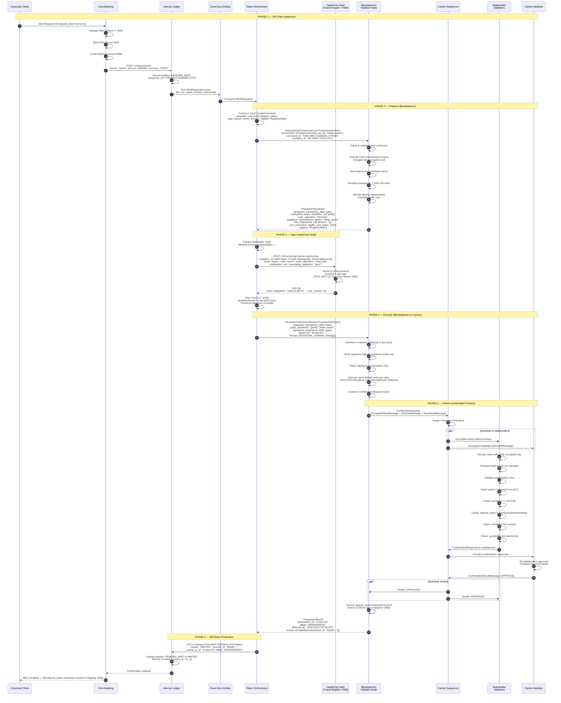
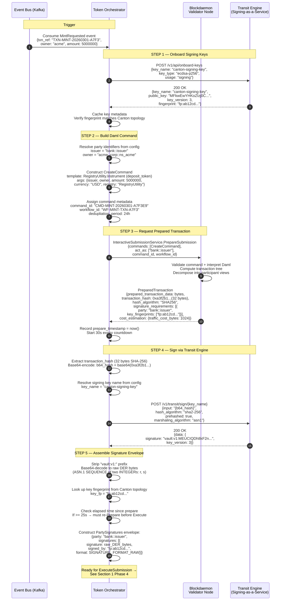
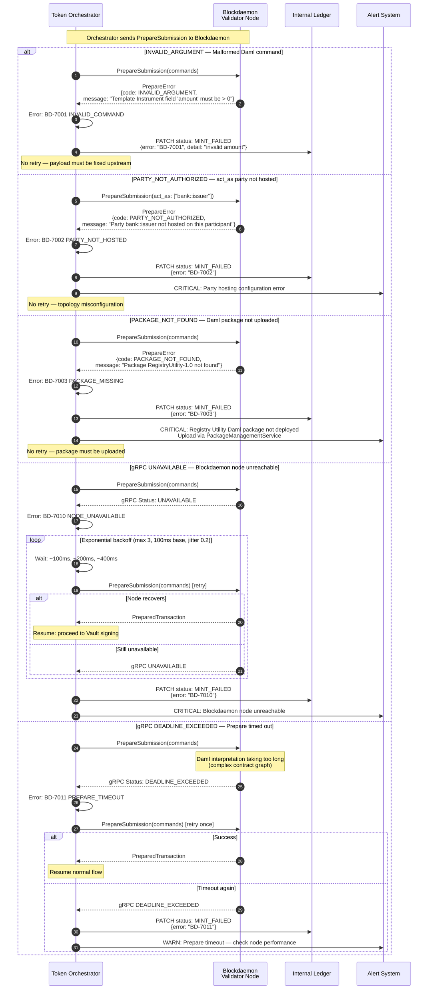
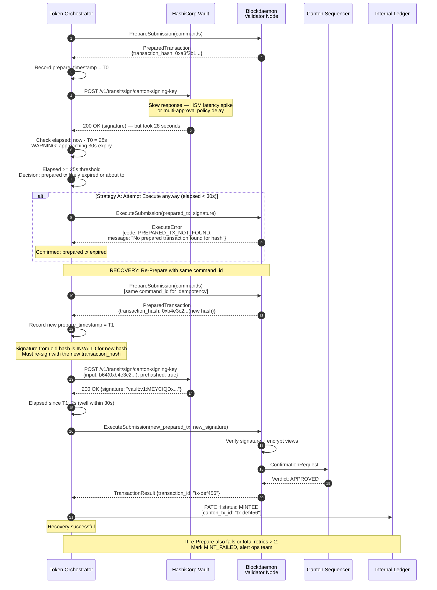
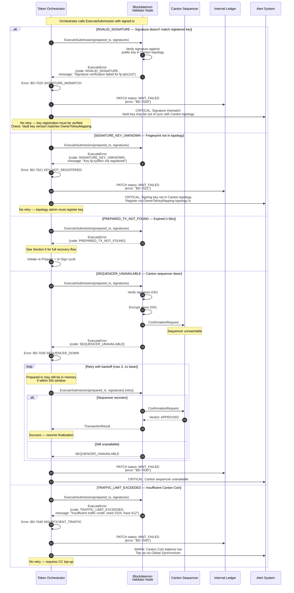
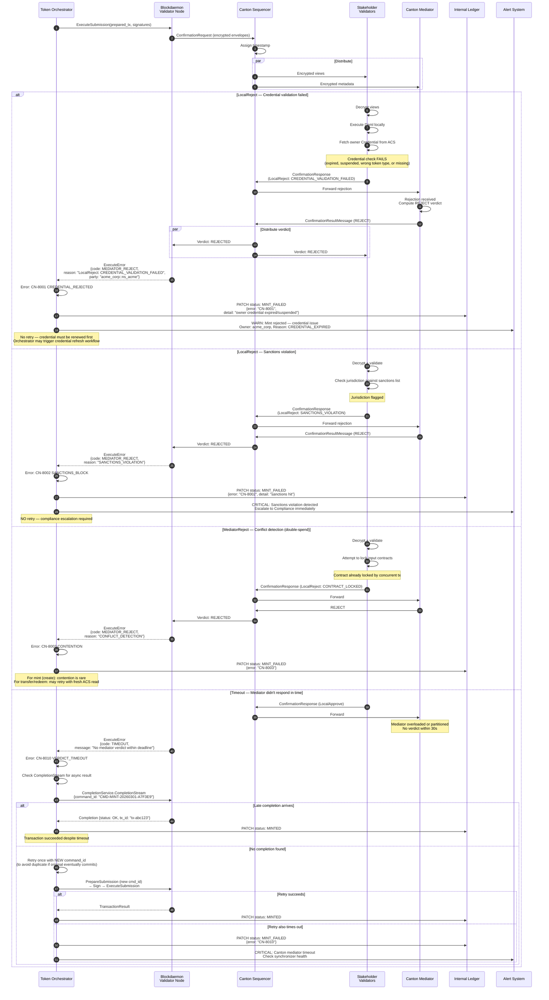
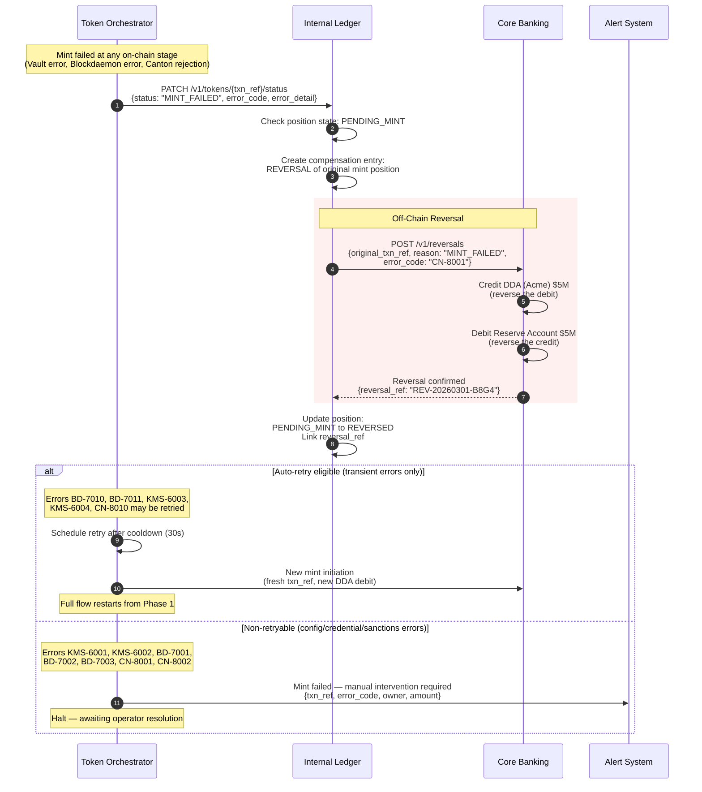

# Mint Sequence Flows — Vault Signing + Blockdaemon Interactive Submission

## Canton Network | `deposit_token` Instrument on Registry Utility

**Version 1.0 | March 2026 | CONFIDENTIAL — Internal Use Only**

---

## Table of Contents

- [Mint Sequence Flows — Vault Signing + Blockdaemon Interactive Submission](#mint-sequence-flows--vault-signing--blockdaemon-interactive-submission)
  - [Canton Network | `deposit_token` Instrument on Registry Utility](#canton-network--deposit_token-instrument-on-registry-utility)
  - [Table of Contents](#table-of-contents)
  - [1. Happy Path — Full E2E Mint](#1-happy-path--full-e2e-mint)
  - [2. Detailed Internal — PrepareSubmission to Signing](#2-detailed-internal--preparesubmission-to-signing)
  - [3. Error Flow — Vault Signing Failures](#3-error-flow--vault-signing-failures)
  - [4. Error Flow — PrepareSubmission Failures](#4-error-flow--preparesubmission-failures)
  - [5. Error Flow — Prepared TX Expiry](#5-error-flow--prepared-tx-expiry)
  - [6. Error Flow — ExecuteSubmission Failures](#6-error-flow--executesubmission-failures)
  - [7. Error Flow — Canton Protocol Rejection](#7-error-flow--canton-protocol-rejection)
  - [8. Rollback \& Compensation](#8-rollback--compensation)
  - [9. Error Decision Matrix](#9-error-decision-matrix)

---

## 1. Happy Path — Full E2E Mint

Unified flow from client request through off-chain settlement, interactive submission (Prepare → Sign → Execute), Canton confirmation protocol, and off-chain finalization.

---

## 2. Detailed Internal — PrepareSubmission to Signing

Zoomed-in view of the Orchestrator's internal flow from constructing the Daml command, requesting a prepared transaction from Blockdaemon, through to signing via the Transit Engine (vault-as-a-service) and assembling the signature envelope for execution.

---

## 3. Error Flow — Vault Signing Failures

```mermaid
sequenceDiagram
    autonumber
    participant Orch as Token Orchestrator
    participant Vault as HashiCorp Vault
    participant IL as Internal Ledger
    participant Alert as Alert System (PagerDuty)

    Note over Orch: Vault signing attempt after PrepareSubmission

    alt 403 Forbidden — Token expired or policy denied
        Orch->>Vault: POST /v1/transit/sign/canton-signing-key
        Vault-->>Orch: 403 {errors: ["permission denied"]}
        Orch->>Orch: Error: KMS-6001 VAULT_AUTH_FAILURE
        Orch->>Orch: Attempt AppRole re-authentication
        Orch->>Vault: POST /v1/auth/approle/login<br/>{role_id, secret_id}
        alt Re-auth succeeds
            Vault-->>Orch: 200 {auth: {client_token: "hvs.new..."}}
            Orch->>Vault: POST /v1/transit/sign/canton-signing-key<br/>(with new token)
            Vault-->>Orch: 200 {data: {signature: "vault:v1:..."}}
            Note over Orch: Resume normal flow
        else Re-auth fails
            Vault-->>Orch: 403
            Orch->>IL: PATCH /v1/tokens/{txn_ref}/status<br/>{status: "MINT_FAILED", error: "KMS-6001"}
            Orch->>Alert: CRITICAL: Vault auth failure<br/>All signing operations halted
            Note over Orch: Circuit breaker OPEN — halt mint operations
        end

    else 404 Not Found — Key doesn't exist
        Orch->>Vault: POST /v1/transit/sign/canton-signing-key
        Vault-->>Orch: 404 {errors: ["key not found"]}
        Orch->>Orch: Error: KMS-6002 KEY_NOT_FOUND
        Orch->>IL: PATCH /v1/tokens/{txn_ref}/status<br/>{status: "MINT_FAILED", error: "KMS-6002"}
        Orch->>Alert: CRITICAL: Canton signing key missing<br/>Possible misconfiguration or key deletion
        Note over Orch: No retry — requires manual investigation

    else 429 Rate Limited
        Orch->>Vault: POST /v1/transit/sign/canton-signing-key
        Vault-->>Orch: 429 Too Many Requests
        Orch->>Orch: Error: KMS-6003 RATE_LIMITED
        loop Retry with exponential backoff (max 3 attempts)
            Orch->>Orch: Wait: 200ms, 400ms, 800ms
            Orch->>Vault: POST /v1/transit/sign/canton-signing-key
            alt Success
                Vault-->>Orch: 200 {data: {signature: "vault:v1:..."}}
                Note over Orch: Resume normal flow
            else Still rate limited
                Vault-->>Orch: 429
            end
        end
        Orch->>IL: PATCH /v1/tokens/{txn_ref}/status<br/>{status: "MINT_FAILED", error: "KMS-6003"}
        Orch->>Alert: WARN: Vault rate limit — check request volume

    else 500/503 — Vault or HSM unavailable
        Orch->>Vault: POST /v1/transit/sign/canton-signing-key
        Vault-->>Orch: 503 Service Unavailable
        Orch->>Orch: Error: KMS-6004 HSM_UNAVAILABLE
        loop Retry with exponential backoff (max 3, 500ms base)
            Orch->>Orch: Wait: 500ms, 1s, 2s
            Orch->>Vault: POST /v1/transit/sign/canton-signing-key
            alt Vault recovers
                Vault-->>Orch: 200 {data: {signature: "vault:v1:..."}}
                Note over Orch: Resume normal flow
            else Still down
                Vault-->>Orch: 503
            end
        end
        Orch->>IL: PATCH /v1/tokens/{txn_ref}/status<br/>{status: "MINT_FAILED", error: "KMS-6004"}
        Orch->>Alert: CRITICAL: HSM/Vault cluster unavailable

    else Timeout (>5s signing latency)
        Orch->>Vault: POST /v1/transit/sign/canton-signing-key
        Note over Vault: HSM latency spike or network issue
        Orch->>Orch: Timeout after 5s<br/>Error: KMS-6005 SIGNING_TIMEOUT
        Orch->>Orch: WARNING: PreparedTransaction may expire<br/>(30s window from PrepareSubmission)
        Orch->>Orch: Retry once with 3s timeout
        alt Retry succeeds within total 30s window
            Orch->>Vault: POST /v1/transit/sign/canton-signing-key
            Vault-->>Orch: 200 {data: {signature: "vault:v1:..."}}
            Note over Orch: Check elapsed time since Prepare<br/>If < 25s: proceed to Execute<br/>If >= 25s: re-Prepare first
        else Retry fails or 30s window exceeded
            Orch->>Orch: PreparedTransaction likely expired
            Orch->>IL: PATCH /v1/tokens/{txn_ref}/status<br/>{status: "MINT_FAILED", error: "KMS-6005"}
            Orch->>Alert: WARN: Vault signing timeout — check HSM health
        end
    end
```

---

## 4. Error Flow — PrepareSubmission Failures

---

## 5. Error Flow — Prepared TX Expiry

The PreparedTransaction is cached in the validator's memory for ~30 seconds. If Vault signing or any intermediate step exceeds this window, ExecuteSubmission will fail with `PREPARED_TX_NOT_FOUND`. The Orchestrator must detect this and re-Prepare.

---

## 6. Error Flow — ExecuteSubmission Failures

---

## 7. Error Flow — Canton Protocol Rejection

Failures that occur after the transaction has been submitted to the Canton network (post-sequencer).

---

## 8. Rollback & Compensation

When a mint fails after off-chain settlement has already occurred (DDA debited, reserve credited), the system must reverse the off-chain positions.

---

## 9. Error Decision Matrix

Summary of all error codes, their source, retryability, and required action.

| Code | Error | Source | Retryable | Max Retries | Action |
|---|---|---|---|---|---|
| **KMS-6001** | Vault auth failure | Vault 403 | Re-auth once | 1 | Re-authenticate AppRole; if fails, circuit break + alert InfoSec |
| **KMS-6002** | Key not found | Vault 404 | No | 0 | Alert InfoSec — verify key name and Transit engine config |
| **KMS-6003** | Rate limited | Vault 429 | Yes | 3 | Exponential backoff (200ms base); consider Vault perf replication |
| **KMS-6004** | HSM unavailable | Vault 503 | Yes | 3 | Backoff (500ms base); check Vault cluster health |
| **KMS-6005** | Signing timeout | Vault >5s | Yes | 1 | Re-sign; if total > 25s, re-Prepare first |
| **BD-7001** | Invalid command | Prepare INVALID_ARGUMENT | No | 0 | Fix Daml command payload upstream |
| **BD-7002** | Party not hosted | Prepare PARTY_NOT_AUTHORIZED | No | 0 | Verify topology — party hosting on Blockdaemon node |
| **BD-7003** | Package missing | Prepare PACKAGE_NOT_FOUND | No | 0 | Upload Daml package via admin API |
| **BD-7010** | Node unavailable | Prepare gRPC UNAVAILABLE | Yes | 3 | Backoff (100ms base, jitter 0.2) |
| **BD-7011** | Prepare timeout | Prepare DEADLINE_EXCEEDED | Yes | 1 | Retry once; check node performance |
| **BD-7020** | Signature mismatch | Execute INVALID_SIGNATURE | No | 0 | Verify Vault key version matches Canton topology |
| **BD-7021** | Key not registered | Execute SIGNATURE_KEY_UNKNOWN | No | 0 | Register public key via OwnerToKeyMapping |
| **BD-7030** | Sequencer down | Execute SEQUENCER_UNAVAILABLE | Yes | 3 | Backoff (1s base); check Canton sequencer status |
| **BD-7040** | Traffic exceeded | Execute TRAFFIC_LIMIT_EXCEEDED | No | 0 | Top up Canton Coin balance |
| **CN-8001** | Credential rejected | Canton LocalReject | No | 0 | Renew/reactivate owner credential |
| **CN-8002** | Sanctions violation | Canton LocalReject | No | 0 | Escalate to Compliance — do NOT retry |
| **CN-8003** | Conflict/contention | Canton MediatorReject | Conditional | 1 | Rare for mint; retry with fresh ACS read for transfer/redeem |
| **CN-8010** | Verdict timeout | Canton Timeout | Yes | 1 | Check CompletionStream first; retry with new command_id |
