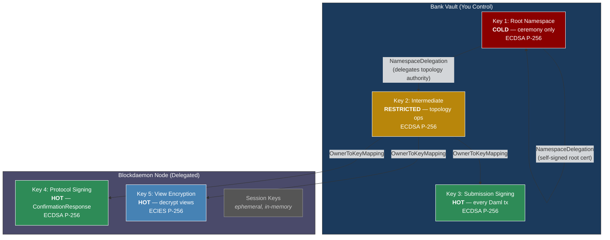
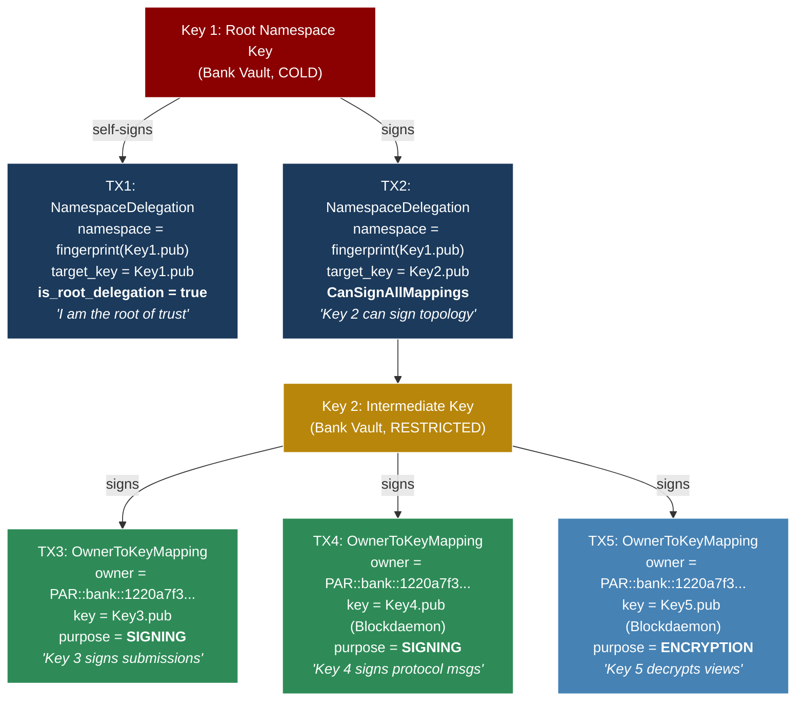
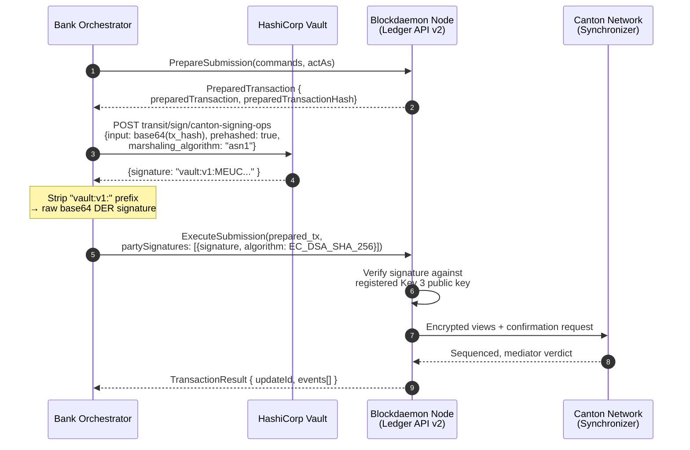
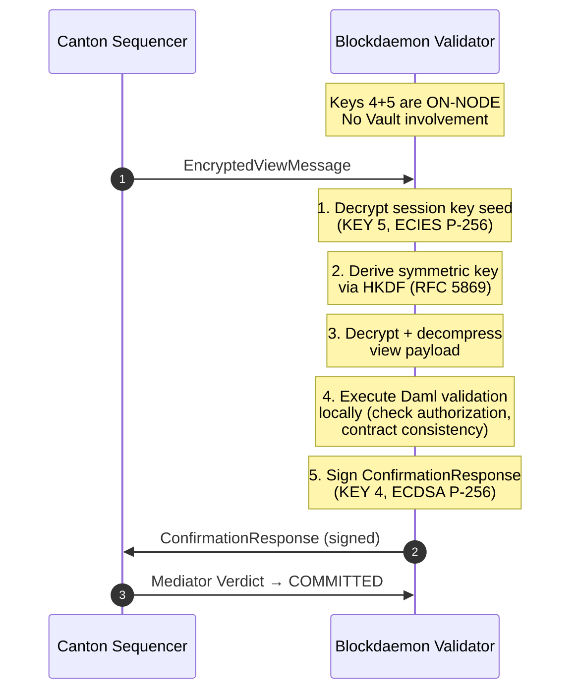
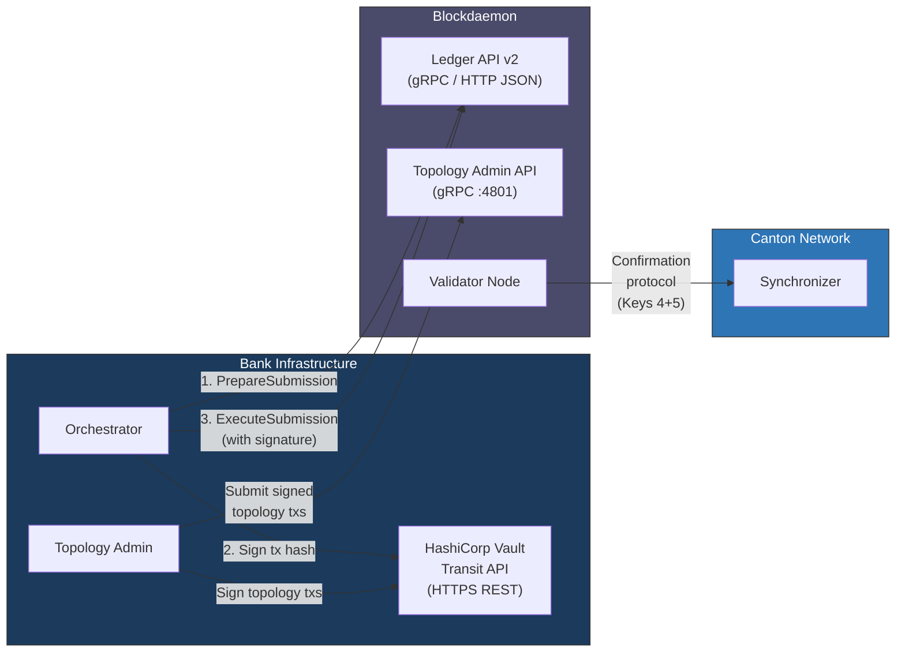

# Canton Node Onboarding — Key Generation, Delegation & Integration Guide

## Blockdaemon NaaS + HashiCorp Vault + Canton Participant Node

---

## Architecture Overview



> Trust flows ONE direction: Root → Intermediate → {Key3, Key4, Key5}.
> Bank can **REVOKE** Blockdaemon keys at any time via topology REMOVE.

**Signing Algorithm:** ECDSA P-256 (secp256r1) with SHA-256 hashing, DER/ASN.1 encoded signatures.
Canton calls this `EC_DSA_SHA_256` in its API. Vault calls it `ecdsa-p256`.

---

## Phase 1: Generate Keys in HashiCorp Vault

You generate 3 keys in Vault's Transit secret engine. These keys are non-exportable — private material never leaves Vault.

### 1.1 Enable Transit Engine (if not already)

```bash
vault secrets enable transit
```

### 1.2 Create the Three Bank-Held Keys

```bash
# KEY 1 — Root Namespace Key
# COLD: used only during bootstrap ceremony and emergency rotation
# This key's public key fingerprint BECOMES your Canton namespace identity
vault write transit/keys/canton-root-ns-key \
  type=ecdsa-p256 \
  exportable=false \
  allow_plaintext_backup=false \
  deletion_allowed=false

# KEY 2 — Intermediate Delegation Key
# RESTRICTED: signs topology changes (key registrations, party mappings)
vault write transit/keys/canton-intermediate-key \
  type=ecdsa-p256 \
  exportable=false \
  deletion_allowed=false

# KEY 3 — Submission Signing Key
# HOT: signs every Daml transaction your orchestrator submits
# auto_rotate_period enables automatic key version rotation every 90 days
vault write transit/keys/canton-signing-ops \
  type=ecdsa-p256 \
  exportable=false \
  deletion_allowed=false \
  auto_rotate_period=2160h
```

### 1.3 Retrieve Public Keys

```bash
for KEY in canton-root-ns-key canton-intermediate-key canton-signing-ops; do
  echo "=== $KEY ==="
  vault read -field=keys transit/keys/$KEY | jq -r 'to_entries | last | .value.public_key'
done
```

Output is PEM-encoded ECDSA P-256 public keys.

### 1.4 Derive Your Canton Namespace

Your namespace is the SHA-256 fingerprint of the root key's DER-encoded public key, prefixed with `1220` (multicodec identifier for SHA-256):

```bash
ROOT_PUB_PEM=$(vault read -field=keys transit/keys/canton-root-ns-key \
  | jq -r 'to_entries | last | .value.public_key')

# Convert PEM → DER → SHA-256
NAMESPACE=$(echo "$ROOT_PUB_PEM" \
  | openssl ec -pubin -outform DER 2>/dev/null \
  | sha256sum -b \
  | cut -d' ' -f1)

# Your Canton fingerprint (used in all party IDs, topology references)
FINGERPRINT="1220${NAMESPACE}"

echo "Canton namespace: $FINGERPRINT"
# Example output: 1220a7f3e9b1c2d4...
```

This fingerprint is permanent. It appears in:
- Your participant ID: `PAR::bank::1220a7f3...`
- All party IDs you create: `bank-token::1220e5f6...`
- All topology transactions under your namespace

### 1.5 Set Up Vault Policies & AppRole Auth

```hcl
# canton-orchestrator-policy.hcl — Orchestrator can ONLY sign with key 3
path "transit/sign/canton-signing-ops" {
  capabilities = ["update"]
}
path "transit/verify/canton-signing-ops" {
  capabilities = ["update"]
}
path "transit/keys/canton-signing-ops" {
  capabilities = ["read"]
}
path "transit/sign/canton-root-ns-key"       { capabilities = ["deny"] }
path "transit/sign/canton-intermediate-key"   { capabilities = ["deny"] }
```

```hcl
# canton-topology-admin-policy.hcl — Topology Admin signs with keys 1 & 2
path "transit/sign/canton-intermediate-key" {
  capabilities = ["update"]
}
path "transit/sign/canton-root-ns-key" {
  capabilities = ["update"]
}
path "transit/keys/canton-*" {
  capabilities = ["read"]
}
```

```bash
# Apply policies
vault policy write canton-orchestrator canton-orchestrator-policy.hcl
vault policy write canton-topology-admin canton-topology-admin-policy.hcl

# Create AppRoles
vault auth enable approle

vault write auth/approle/role/canton-orchestrator \
  token_policies="canton-orchestrator-policy" \
  token_ttl=1h \
  token_max_ttl=4h \
  token_bound_cidrs="10.0.100.0/24"

vault write auth/approle/role/canton-topology-admin \
  token_policies="canton-topology-admin-policy" \
  token_ttl=30m \
  token_max_ttl=30m \
  secret_id_ttl=1h \
  secret_id_num_uses=1 \
  token_bound_cidrs="10.0.1.0/24"
```

---

## Phase 2: Receive Blockdaemon Node Keys

Blockdaemon generates keys 4 and 5 **on their validator node**. You receive only the public keys.

### 2.1 What Blockdaemon Provides

| Key | Type | Format | Purpose |
|---|---|---|---|
| Key 4 public key | ECDSA P-256 | PEM | Protocol signing (ConfirmationResponse) |
| Key 5 public key | ECIES/P-256 | PEM | View encryption/decryption |
| Key 4 fingerprint | SHA-256 | Hex | `1220` + SHA-256(DER pubkey) |
| Key 5 fingerprint | SHA-256 | Hex | `1220` + SHA-256(DER pubkey) |

### 2.2 Compute Fingerprints for Blockdaemon Keys

```bash
# For each Blockdaemon public key PEM
BD_SIGNING_FP="1220$(echo "$BD_SIGNING_PUB_PEM" \
  | openssl ec -pubin -outform DER 2>/dev/null \
  | sha256sum -b | cut -d' ' -f1)"

BD_ENCRYPTION_FP="1220$(echo "$BD_ENCRYPTION_PUB_PEM" \
  | openssl ec -pubin -outform DER 2>/dev/null \
  | sha256sum -b | cut -d' ' -f1)"
```

Verify these match the fingerprints Blockdaemon provided.

---

## Phase 3: Create Delegation Chain (Bootstrap Ceremony)

This is a one-time ceremony that establishes your Canton identity and delegates operational authority to Blockdaemon's node.

### 3.0 Bootstrap Ceremony Flow

```mermaid
sequenceDiagram
    autonumber
    participant Vault as Bank Vault
    participant Admin as Topology Admin
    participant BD as Blockdaemon Node

    rect rgb(30, 50, 80)
    Note over Vault,BD: PHASE A — Key Generation
    Admin->>Vault: Create Key 1 (root), Key 2 (intermediate), Key 3 (signing)
    Vault-->>Admin: 3 ECDSA P-256 keys created (non-exportable)
    BD->>BD: Generate Key 4 (protocol signing), Key 5 (encryption)
    BD-->>Admin: Share public keys 4+5 via secure channel
    end

    rect rgb(50, 30, 30)
    Note over Vault,BD: PHASE B — Derive Namespace
    Admin->>Vault: Read Key 1 public key
    Vault-->>Admin: PEM public key
    Note over Admin: namespace = "1220" + SHA-256(DER(pubkey1))<br/>This becomes the permanent identity
    end

    rect rgb(30, 60, 30)
    Note over Vault,BD: PHASE C — Sign Delegation Chain
    Admin->>Vault: Sign TX1: root self-delegation (Key 1)
    Admin->>Vault: Sign TX2: root → intermediate delegation (Key 1)
    Admin->>Vault: Sign TX3: OwnerToKeyMapping for Key 3 (Key 2)
    Admin->>Vault: Sign TX4: OwnerToKeyMapping for Key 4 (Key 2)
    Admin->>Vault: Sign TX5: OwnerToKeyMapping for Key 5 (Key 2)
    end

    rect rgb(50, 50, 30)
    Note over Vault,BD: PHASE D — Submit & Verify
    Admin->>BD: Submit 5 signed topology txs (strict order)
    BD-->>Admin: All accepted into topology store
    Admin->>BD: List NamespaceDelegations (expect 2)
    Admin->>BD: List OwnerToKeyMappings (expect 3)
    BD-->>Admin: Verified — all keys registered
    end

    rect rgb(60, 20, 20)
    Note over Vault,BD: PHASE E — Lock Root Key
    Admin->>Vault: Move Key 1 to cold-storage policy<br/>(Control Group: 2-of-3 custodians)
    end
```



### 3.1 Delegation Chain Structure



### 3.2 How to Sign Each Topology Transaction

Canton topology transactions are serialized protobufs. You sign the **SHA-256 hash** of the serialized transaction.

**Vault signing pattern (same for all topology transactions):**

```bash
# Generic signing pattern — replace KEY_NAME and TX_HASH per step
VAULT_RESPONSE=$(vault write -format=json transit/sign/<KEY_NAME> \
  input=$(echo -n "$TX_HASH" | base64) \
  prehashed=true \
  marshaling_algorithm="asn1")

# Extract raw DER signature (strip "vault:v1:" prefix)
SIGNATURE=$(echo "$VAULT_RESPONSE" | jq -r '.data.signature' | sed 's/^vault:v1://')
```

| Parameter | Value | Why |
|---|---|---|
| `prehashed=true` | The input is already a SHA-256 hash | Canton provides the hash to sign |
| `marshaling_algorithm="asn1"` | Produces DER-encoded signature | Canton expects ASN.1/DER format |
| Key type | `ecdsa-p256` | Canton requires ECDSA P-256 (EC_DSA_SHA_256) |

### 3.3 Sign and Submit Topology Transactions

**Steps 1-2 — Signed by Root Key (Key 1):**

```bash
# Step 1: Root self-signed NamespaceDelegation
# "I (root key) declare myself as the namespace authority"
vault write transit/sign/canton-root-ns-key \
  input=$(echo -n "$ROOT_SELF_DELEGATION_HASH" | base64) \
  prehashed=true \
  marshaling_algorithm="asn1"

# Step 2: NamespaceDelegation root → intermediate
# "I (root key) delegate topology-signing authority to key 2"
vault write transit/sign/canton-root-ns-key \
  input=$(echo -n "$ROOT_TO_INTERMEDIATE_HASH" | base64) \
  prehashed=true \
  marshaling_algorithm="asn1"
```

**Steps 3-5 — Signed by Intermediate Key (Key 2):**

```bash
# Step 3: Register Key 3 (your submission signing key from Vault)
vault write transit/sign/canton-intermediate-key \
  input=$(echo -n "$OKM_SIGNING_OPS_HASH" | base64) \
  prehashed=true \
  marshaling_algorithm="asn1"

# Step 4: Register Key 4 (Blockdaemon's protocol signing key)
vault write transit/sign/canton-intermediate-key \
  input=$(echo -n "$OKM_PROTOCOL_KEY_HASH" | base64) \
  prehashed=true \
  marshaling_algorithm="asn1"

# Step 5: Register Key 5 (Blockdaemon's encryption key)
vault write transit/sign/canton-intermediate-key \
  input=$(echo -n "$OKM_ENCRYPTION_KEY_HASH" | base64) \
  prehashed=true \
  marshaling_algorithm="asn1"
```

### 3.4 Submit to Blockdaemon Node

Submit all 5 topology transactions in strict order via the Canton topology admin API:

```bash
# Submit via gRPC admin API on the Blockdaemon validator node
grpcurl -d '{
  "signed_topology_transactions": [{
    "serialized": "<base64_serialized_tx>",
    "signatures": [{
      "signed_by": "<signing_key_fingerprint>",
      "signature": "<base64_vault_signature>"
    }]
  }]
}' \
  blockdaemon-node.bank.internal:4801 \
  com.digitalasset.canton.topology.admin.v30.TopologyManagerWriteService/Authorize
```

**Strict submission order** (chain dependencies):

1. Root self-signed NamespaceDelegation (Key 1 signs)
2. Root → Intermediate NamespaceDelegation (Key 1 signs)
3. OwnerToKeyMapping for Key 3 — submission signing (Key 2 signs)
4. OwnerToKeyMapping for Key 4 — protocol signing, Blockdaemon's key (Key 2 signs)
5. OwnerToKeyMapping for Key 5 — encryption, Blockdaemon's key (Key 2 signs)

**Or via Canton HTTP JSON API (Ledger API v2):**

```bash
# Alternative: submit via HTTP JSON API
curl -X POST https://canton-validator.blockdaemon.com/v2/topology/transactions/add \
  -H "Authorization: Bearer $TOKEN" \
  -H "Content-Type: application/json" \
  -d '{
    "transactions": [
      {
        "serialized": "<base64_serialized_tx1>",
        "signatures": [{
          "format": "DER",
          "signed_by": "1220a7f3...",
          "signature": "<base64_der_signature>",
          "algorithm": "EC_DSA_SHA_256"
        }]
      }
    ],
    "store": "Authorized"
  }'
```

### 3.5 Verify Topology State

```bash
# Verify NamespaceDelegations (expect 2: root self-signed + root → intermediate)
grpcurl -d '{"filter_namespace": "<YOUR_NAMESPACE>"}' \
  blockdaemon-node.bank.internal:4801 \
  com.digitalasset.canton.topology.admin.v30.TopologyManagerReadService/ListNamespaceDelegation

# Verify OwnerToKeyMappings (expect 3: keys 3, 4, 5)
grpcurl -d '{"filter_uid": "<YOUR_PARTICIPANT_UID>"}' \
  blockdaemon-node.bank.internal:4801 \
  com.digitalasset.canton.topology.admin.v30.TopologyManagerReadService/ListOwnerToKeyMapping
```

**Or via HTTP JSON API:**

```bash
# Check namespace delegations
curl -X POST https://canton-validator.blockdaemon.com/v2/topology/namespace-delegations/list \
  -H "Authorization: Bearer $TOKEN" \
  -d '{"filterNamespace": "1220a7f3..."}'
# Expected: 2 delegations

# Check owner-to-key mappings
curl -X POST https://canton-validator.blockdaemon.com/v2/topology/owner-to-key-mappings/list \
  -H "Authorization: Bearer $TOKEN" \
  -d '{"filterParticipant": "PAR::bank::1220a7f3..."}'
# Expected: 3 key mappings (signing_ops, protocol_signing, encryption)
```

**Verification checklist:**
- [ ] 2 NamespaceDelegations active (root self-signed, root → intermediate)
- [ ] 3 OwnerToKeyMappings active (keys 3, 4, 5)
- [ ] Key fingerprints match: key 3 from Vault, keys 4+5 from Blockdaemon
- [ ] Serial numbers sequential (no gaps)
- [ ] No rejected transactions

### 3.6 Lock Root Key to Cold-Storage Policy

After bootstrap, restrict root key access to emergency-only:

```bash
# Move root key signing behind Control Group approval (e.g., 2-of-3 custodians)
# This is Vault Enterprise feature — adapt for your Vault deployment
vault write sys/control-group/canton-root-ns-key \
  min_approvals=2
```

---

## Phase 4: How Keys Are Used at Runtime

Once bootstrap is complete, keys serve two distinct runtime paths:

### 4.1 Outbound Path — Bank Submits Daml Transactions (Key 3)

This is the **Interactive Submission** flow. Your orchestrator signs every transaction before it reaches the Canton network.



**Step 1 — Prepare (gRPC or HTTP):**

```json
// POST /v2/interactive-submission/prepare
{
  "commands": [{
    "ExerciseCommand": {
      "templateId": "...pkg_hash:Utility.Registry.App.V0.Service.AllocationFactory:AllocationFactory",
      "contractId": "000b99a1...factory_cid",
      "choice": "AllocationFactory_RequestMint",
      "choiceArgument": { "..." }
    }
  }],
  "actAs": ["bank-token::1220e5f6..."]
}
```

**Response:**

```json
{
  "preparedTransaction": "<base64_protobuf>",
  "preparedTransactionHash": "c8d4e2f1a3b5...sha256_hash"
}
```

**Step 2 — Sign with Vault (Key 3):**

```bash
# The preparedTransactionHash is already a SHA-256 hash
vault write -format=json transit/sign/canton-signing-ops \
  input=$(echo -n "$PREPARED_TX_HASH" | base64) \
  prehashed=true \
  marshaling_algorithm="asn1"
```

```json
// Vault REST API equivalent
// POST /v1/transit/sign/canton-signing-ops
{
  "input": "<base64_of_sha256_hash>",
  "prehashed": true,
  "marshaling_algorithm": "asn1",
  "key_version": 1
}

// Response:
{
  "data": {
    "signature": "vault:v1:MEUCIQDh8k...base64_der_signature",
    "key_version": 1
  }
}
// Strip "vault:v1:" prefix → raw base64 DER signature
```

**Step 3 — Execute with signature:**

```json
// POST /v2/interactive-submission/execute
{
  "preparedTransaction": "<base64_protobuf>",
  "partySignatures": {
    "signatures": [{
      "party": "bank-token::1220e5f6...",
      "signatures": [{
        "format": "DER",
        "signature": "<base64_der_signature_from_vault>",
        "signed_by": "1220e5f6...",
        "algorithm": "EC_DSA_SHA_256"
      }]
    }]
  }
}
```

### 4.2 Inbound Path — Other Participants' Transactions (Keys 4 & 5)

When another party sends a transaction involving your parties, the Blockdaemon node handles everything automatically. **Your Vault is NOT involved.**



> The inbound path is fully automatic — Blockdaemon's on-node keys handle decryption and protocol signing without any call to your Vault.

---

## Phase 5: Party Onboarding (External Signing)

After the node is bootstrapped, you create parties whose signing keys live in your Vault (not on the Blockdaemon node). This gives you exclusive transaction authority.

```mermaid
sequenceDiagram
    autonumber
    participant Vault as Bank Vault
    participant Orch as Orchestrator
    participant Node as Blockdaemon Node
    participant Sync as Synchronizer

    rect rgb(30, 50, 80)
    Note over Vault,Sync: Generate & Register Party Key
    Orch->>Vault: Create Transit key<br/>name=canton-bank-token, type=ecdsa-p256
    Vault-->>Orch: Key created
    Orch->>Vault: Read public key (PEM)
    Vault-->>Orch: DER-encoded public key bytes
    Note over Orch: fingerprint = "1220" + SHA-256(pubkey_der)<br/>party_id = "bank-token::1220e5f6..."
    end

    rect rgb(30, 60, 30)
    Note over Vault,Sync: Generate & Sign Topology
    Orch->>Node: POST /v2/parties/external/generate-topology<br/>{partyHint: "bank-token", publicKey: DER}
    Node-->>Orch: {partyId, transactions: [tx1,tx2,tx3], multiHash}

    Note over Orch: Verify:<br/>TX1 = NamespaceDelegation (party root cert)<br/>TX2 = PartyToParticipant (→ Blockdaemon node)<br/>TX3 = PartyToKeyMapping (→ our Vault key)<br/>Recompute multiHash — must match

    Orch->>Vault: POST transit/sign/canton-bank-token<br/>{input: base64(multiHash), prehashed: true}
    Vault-->>Orch: {signature: DER}
    end

    rect rgb(50, 50, 30)
    Note over Vault,Sync: Submit & Propagate
    Orch->>Node: POST /v2/topology/transactions/add<br/>{signed tx1, tx2, tx3}
    Node->>Sync: RegisterTopologyTransactionRequest
    Sync-->>Node: Distributed to all members
    Node-->>Orch: Party active in topology
    end
```



### 5.1 Generate a Party Key in Vault

```bash
vault write transit/keys/canton-bank-token \
  type=ecdsa-p256 \
  exportable=false \
  deletion_allowed=false
```

### 5.2 Get Public Key and Compute Fingerprint

```bash
PARTY_PUB_PEM=$(vault read -field=keys transit/keys/canton-bank-token \
  | jq -r 'to_entries | last | .value.public_key')

PARTY_PUB_DER=$(echo "$PARTY_PUB_PEM" | openssl ec -pubin -outform DER 2>/dev/null)
PARTY_FP="1220$(echo -n "$PARTY_PUB_DER" | sha256sum -b | cut -d' ' -f1)"

echo "Party fingerprint: $PARTY_FP"
# Party ID will be: bank-token::$PARTY_FP
```

### 5.3 Generate Topology Transactions via Node API

```json
// POST /v2/parties/external/generate-topology
{
  "synchronizer": "global::1220glob...",
  "partyHint": "bank-token",
  "publicKey": {
    "format": "DER",
    "keyData": "<base64_der_public_key>"
  }
}
```

**Response:**

```json
{
  "partyId": "bank-token::1220e5f6...",
  "transactions": [
    // TX1: NamespaceDelegation — root cert for party namespace
    // TX2: PartyToParticipant — maps party to Blockdaemon node
    // TX3: PartyToKeyMapping — declares party's signing key
  ],
  "multiHash": "<sha256_over_all_3_serialized_txs>"
}
```

### 5.4 Verify, Sign, and Submit

```bash
# Verify multiHash matches SHA-256 of all 3 serialized transactions
# Then sign with the party's Vault key:

vault write -format=json transit/sign/canton-bank-token \
  input=$(echo -n "$MULTI_HASH" | base64) \
  prehashed=true \
  marshaling_algorithm="asn1"

# Strip vault:v1: prefix
PARTY_SIG=$(echo "$VAULT_RESPONSE" | jq -r '.data.signature' | sed 's/^vault:v1://')
```

```json
// POST /v2/topology/transactions/add
{
  "transactions": [
    {
      "serialized": "<base64_tx1>",
      "signatures": [{
        "format": "DER",
        "signed_by": "1220e5f6...",
        "signature": "<base64_party_sig>",
        "algorithm": "EC_DSA_SHA_256"
      }]
    },
    // ... tx2, tx3 with same signature
  ],
  "store": "Authorized"
}
```

---

## Integration Points Summary



| Integration Point | Protocol | Bank Side | Blockdaemon Side | Key Used |
|---|---|---|---|---|
| **Vault Transit API** | HTTPS REST | Orchestrator calls `/v1/transit/sign/<key>` | — | Keys 1, 2, or 3 |
| **Topology Admin API** | gRPC (port 4801) | Submit signed topology txs | `TopologyManagerWriteService/Authorize` | Signed by Key 1 or 2 |
| **Topology Read API** | gRPC / HTTP JSON | Verify namespace delegations, key mappings | `TopologyManagerReadService/List*` | Read-only |
| **Interactive Submission** | gRPC / HTTP JSON | `PrepareSubmission` → Vault sign → `ExecuteSubmission` | Canton Ledger API v2 | Key 3 (bank Vault) |
| **Confirmation Protocol** | Canton internal (automatic) | — | Decrypt views (Key 5), sign responses (Key 4) | Keys 4+5 (on-node) |
| **Public Key Exchange** | Secure channel (manual) | Receive Blockdaemon public keys 4+5 | Share PEM public keys | — |
| **Party External Signing** | HTTP JSON | `/v2/parties/external/generate-topology` | Generate unsigned topology txs | Party key (Vault) |

---

## Signing Algorithm Reference

| Property | Value |
|---|---|
| **Algorithm** | ECDSA (Elliptic Curve Digital Signature Algorithm) |
| **Curve** | P-256 (secp256r1 / prime256v1) |
| **Hash** | SHA-256 |
| **Canton name** | `EC_DSA_SHA_256` |
| **Vault key type** | `ecdsa-p256` |
| **Signature encoding** | DER/ASN.1 (not raw R‖S) |
| **Vault parameter** | `marshaling_algorithm="asn1"` |
| **Input mode** | `prehashed=true` (Canton provides the SHA-256 hash) |
| **Key fingerprint** | `"1220" + hex(SHA-256(DER_encoded_public_key))` |
| **Encryption (Key 5)** | ECIES on P-256 with HKDF key derivation (RFC 5869) |

**Why prehashed=true?** Canton's PrepareSubmission and topology APIs return the SHA-256 hash of the data to be signed. You pass this hash directly to Vault. Vault does NOT re-hash it — it signs the raw hash bytes with the ECDSA private key.

**Why ASN.1/DER?** Canton expects signatures in ASN.1 DER format: `SEQUENCE { INTEGER r, INTEGER s }`. Vault's `marshaling_algorithm="asn1"` produces this format. The alternative (`jws`) produces raw R‖S which Canton does not accept.

---

## Example: Full Orchestrator Code (Node.js/TypeScript)

```typescript
import axios from 'axios';
import vault from 'node-vault';

const vaultClient = vault({ endpoint: process.env.VAULT_ADDR, token: process.env.VAULT_TOKEN });
const CANTON_API = 'https://canton-validator.blockdaemon.com';

// ─── Step 1: Prepare Transaction ────────────────────────────────
async function prepareTransaction(commands: any[], actAs: string[]) {
  const res = await axios.post(`${CANTON_API}/v2/interactive-submission/prepare`, {
    commands,
    actAs,
  }, { headers: { Authorization: `Bearer ${process.env.CANTON_TOKEN}` } });

  return {
    preparedTransaction: res.data.preparedTransaction,
    hash: res.data.preparedTransactionHash,
  };
}

// ─── Step 2: Sign with Vault ────────────────────────────────────
async function signWithVault(keyName: string, hash: string): Promise<string> {
  const hashBytes = Buffer.from(hash, 'hex');
  const input = hashBytes.toString('base64');

  const result = await vaultClient.write(`transit/sign/${keyName}`, {
    input,
    prehashed: true,
    marshaling_algorithm: 'asn1',
  });

  // Strip "vault:v1:" prefix to get raw base64 DER signature
  return result.data.signature.replace(/^vault:v\d+:/, '');
}

// ─── Step 3: Execute Signed Transaction ─────────────────────────
async function executeTransaction(
  preparedTransaction: string,
  party: string,
  signature: string,
  signingKeyFingerprint: string,
) {
  const res = await axios.post(`${CANTON_API}/v2/interactive-submission/execute`, {
    preparedTransaction,
    partySignatures: {
      signatures: [{
        party,
        signatures: [{
          format: 'DER',
          signature,
          signed_by: signingKeyFingerprint,
          algorithm: 'EC_DSA_SHA_256',
        }],
      }],
    },
  }, { headers: { Authorization: `Bearer ${process.env.CANTON_TOKEN}` } });

  return res.data;
}

// ─── Full Flow ──────────────────────────────────────────────────
async function submitDamlCommand(commands: any[], party: string, vaultKeyName: string, keyFingerprint: string) {
  const { preparedTransaction, hash } = await prepareTransaction(commands, [party]);
  const signature = await signWithVault(vaultKeyName, hash);
  return executeTransaction(preparedTransaction, party, signature, keyFingerprint);
}
```

---

## Example: Topology Bootstrap Code (Node.js/TypeScript)

```typescript
import { execSync } from 'child_process';
import vault from 'node-vault';

const vaultClient = vault({ endpoint: process.env.VAULT_ADDR, token: process.env.VAULT_TOKEN });

async function signTopologyTransaction(keyName: string, txHash: string): Promise<string> {
  const input = Buffer.from(txHash, 'hex').toString('base64');

  const result = await vaultClient.write(`transit/sign/${keyName}`, {
    input,
    prehashed: true,
    marshaling_algorithm: 'asn1',
  });

  return result.data.signature.replace(/^vault:v\d+:/, '');
}

async function bootstrapCeremony() {
  // 1. Get public keys from Vault
  const rootKeyData = await vaultClient.read('transit/keys/canton-root-ns-key');
  const intermediateKeyData = await vaultClient.read('transit/keys/canton-intermediate-key');
  const signingKeyData = await vaultClient.read('transit/keys/canton-signing-ops');

  // 2. Receive Blockdaemon public keys (from secure channel)
  const bdSigningPubKey = process.env.BD_SIGNING_PUBLIC_KEY;
  const bdEncryptionPubKey = process.env.BD_ENCRYPTION_PUBLIC_KEY;

  // 3. Generate topology transactions via Canton node API
  // (The node provides the serialized transactions to sign)

  // 4. Sign root self-delegation (Key 1 signs)
  const rootSelfDelegationSig = await signTopologyTransaction(
    'canton-root-ns-key',
    rootSelfDelegationHash,
  );

  // 5. Sign root → intermediate delegation (Key 1 signs)
  const rootToIntermediateSig = await signTopologyTransaction(
    'canton-root-ns-key',
    rootToIntermediateHash,
  );

  // 6-8. Sign OwnerToKeyMappings (Key 2 signs)
  const okmSigningOpsSig = await signTopologyTransaction(
    'canton-intermediate-key',
    okmSigningOpsHash,
  );
  const okmProtocolSig = await signTopologyTransaction(
    'canton-intermediate-key',
    okmProtocolKeyHash,
  );
  const okmEncryptionSig = await signTopologyTransaction(
    'canton-intermediate-key',
    okmEncryptionKeyHash,
  );

  // 9. Submit all 5 signed transactions to Blockdaemon node (strict order)
  // ... submit via gRPC or HTTP JSON API
}
```

---

## Key Security Properties

| Property | Guarantee |
|---|---|
| **Bank always controls identity** | Root key (Key 1) in Vault — can revoke any delegation |
| **Blockdaemon cannot forge transactions** | Key 3 never leaves Vault — only bank can sign submissions |
| **Blockdaemon cannot change topology** | Keys 1+2 in Vault — only bank can modify delegation chain |
| **Blockdaemon CAN see contract data** | Key 5 on-node decrypts views for hosted parties |
| **Bank can revoke Blockdaemon anytime** | REMOVE OwnerToKeyMapping for keys 4+5 via topology API |
| **Key loss recovery** | Bank generates new OwnerToKeyMappings with new Blockdaemon keys |
