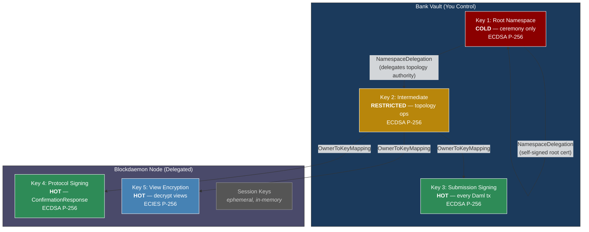
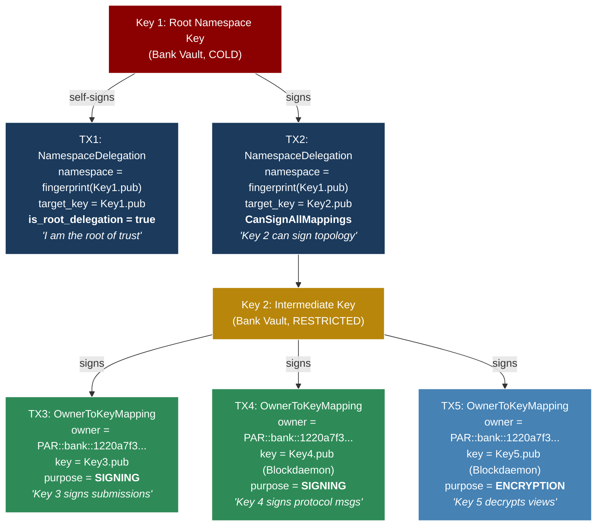
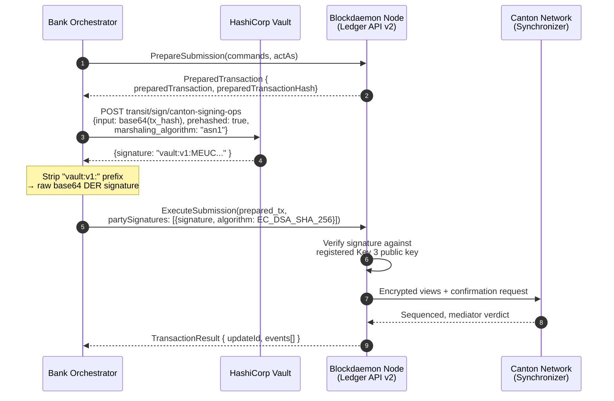
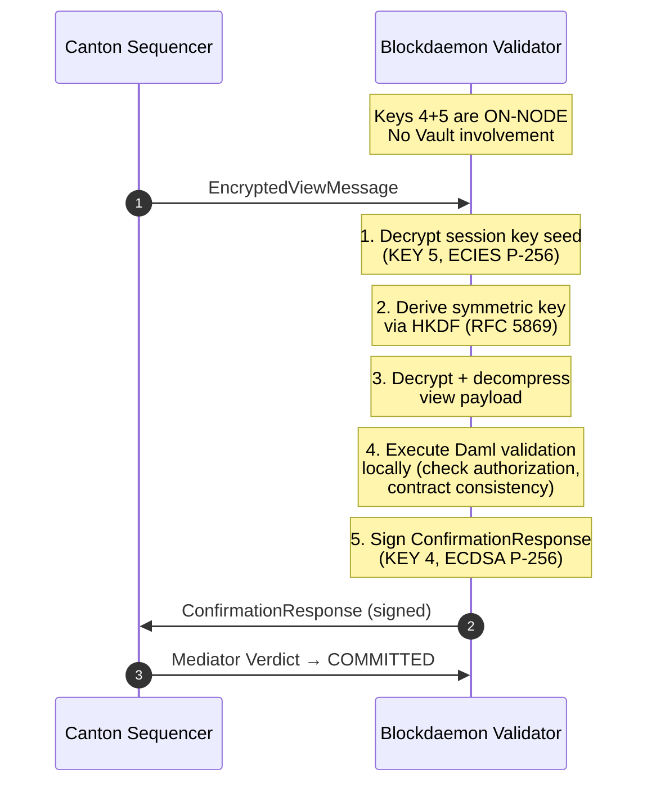
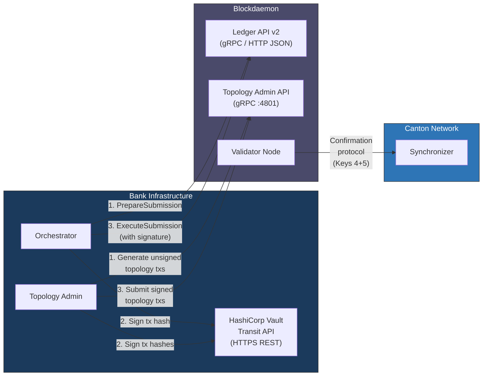

# Canton Node Onboarding — Key Generation, Delegation & Integration Guide

## Blockdaemon NaaS + HashiCorp Vault + Canton Participant Node

---

## Architecture Overview



> Trust flows ONE direction: Root → Intermediate → {Key3, Key4, Key5}.
> Bank can **REVOKE** Blockdaemon keys at any time via topology REMOVE.

**Signing Algorithm:** ECDSA P-256 (secp256r1) with SHA-256 hashing, DER/ASN.1 encoded signatures.
Canton calls this `EC_DSA_SHA_256` in its API. Vault calls it `ecdsa-p256`.

---

## Phase 1: Generate Keys in HashiCorp Vault

You generate 3 keys in Vault's Transit secret engine. These keys are non-exportable — private material never leaves Vault.

### 1.1 Enable Transit Engine (if not already)

```bash
vault secrets enable transit
```

### 1.2 Create the Three Bank-Held Keys

```bash
# KEY 1 — Root Namespace Key
# COLD: used only during bootstrap ceremony and emergency rotation
# This key's public key fingerprint BECOMES your Canton namespace identity
vault write transit/keys/canton-root-ns-key \
  type=ecdsa-p256 \
  exportable=false \
  allow_plaintext_backup=false \
  deletion_allowed=false

# KEY 2 — Intermediate Delegation Key
# RESTRICTED: signs topology changes (key registrations, party mappings)
vault write transit/keys/canton-intermediate-key \
  type=ecdsa-p256 \
  exportable=false \
  deletion_allowed=false

# KEY 3 — Submission Signing Key
# HOT: signs every Daml transaction your orchestrator submits
# auto_rotate_period enables automatic key version rotation every 90 days
vault write transit/keys/canton-signing-ops \
  type=ecdsa-p256 \
  exportable=false \
  deletion_allowed=false \
  auto_rotate_period=2160h
```

### 1.3 Retrieve Public Keys

```bash
for KEY in canton-root-ns-key canton-intermediate-key canton-signing-ops; do
  echo "=== $KEY ==="
  vault read -field=keys transit/keys/$KEY | jq -r 'to_entries | last | .value.public_key'
done
```

Output is PEM-encoded ECDSA P-256 public keys.

### 1.4 Derive Your Canton Namespace

Your namespace is the SHA-256 fingerprint of the root key's DER-encoded public key, prefixed with `1220` (multicodec identifier for SHA-256):

```bash
ROOT_PUB_PEM=$(vault read -field=keys transit/keys/canton-root-ns-key \
  | jq -r 'to_entries | last | .value.public_key')

# Convert PEM → DER → SHA-256
NAMESPACE=$(echo "$ROOT_PUB_PEM" \
  | openssl ec -pubin -outform DER 2>/dev/null \
  | sha256sum -b \
  | cut -d' ' -f1)

# Your Canton fingerprint (used in all party IDs, topology references)
FINGERPRINT="1220${NAMESPACE}"

echo "Canton namespace: $FINGERPRINT"
# Example output: 1220a7f3e9b1c2d4...
```

This fingerprint is permanent. It appears in:
- Your participant ID: `PAR::bank::1220a7f3...`
****- All party IDs you create: `registrar::1220e5f6...`
- All topology transactions under your namespace

### 1.5 Set Up Vault Policies & AppRole Auth

```hcl
# canton-orchestrator-policy.hcl — Orchestrator can ONLY sign with key 3
path "transit/sign/canton-signing-ops" {
  capabilities = ["update"]
}
path "transit/verify/canton-signing-ops" {
  capabilities = ["update"]
}
path "transit/keys/canton-signing-ops" {
  capabilities = ["read"]
}
path "transit/sign/canton-root-ns-key"       { capabilities = ["deny"] }
path "transit/sign/canton-intermediate-key"   { capabilities = ["deny"] }
```

```hcl
# canton-topology-admin-policy.hcl — Topology Admin signs with keys 1 & 2
path "transit/sign/canton-intermediate-key" {
  capabilities = ["update"]
}
path "transit/sign/canton-root-ns-key" {
  capabilities = ["update"]
}
path "transit/keys/canton-*" {
  capabilities = ["read"]
}
```

```bash
# Apply policies
vault policy write canton-orchestrator canton-orchestrator-policy.hcl
vault policy write canton-topology-admin canton-topology-admin-policy.hcl

# Create AppRoles
vault auth enable approle

vault write auth/approle/role/canton-orchestrator \
  token_policies="canton-orchestrator-policy" \
  token_ttl=1h \
  token_max_ttl=4h \
  token_bound_cidrs="10.0.100.0/24"

vault write auth/approle/role/canton-topology-admin \
  token_policies="canton-topology-admin-policy" \
  token_ttl=30m \
  token_max_ttl=30m \
  secret_id_ttl=1h \
  secret_id_num_uses=1 \
  token_bound_cidrs="10.0.1.0/24"
```

---

## Phase 2: Receive Blockdaemon Node Keys

Blockdaemon generates keys 4 and 5 **on their validator node**. You receive only the public keys.

### 2.1 What Blockdaemon Provides

| Key | Type | Format | Purpose |
|---|---|---|---|
| Key 4 public key | ECDSA P-256 | PEM | Protocol signing (ConfirmationResponse) |
| Key 5 public key | ECIES/P-256 | PEM | View encryption/decryption |
| Key 4 fingerprint | SHA-256 | Hex | `1220` + SHA-256(DER pubkey) |
| Key 5 fingerprint | SHA-256 | Hex | `1220` + SHA-256(DER pubkey) |

### 2.2 Compute Fingerprints for Blockdaemon Keys

```bash
# For each Blockdaemon public key PEM
BD_SIGNING_FP="1220$(echo "$BD_SIGNING_PUB_PEM" \
  | openssl ec -pubin -outform DER 2>/dev/null \
  | sha256sum -b | cut -d' ' -f1)"

BD_ENCRYPTION_FP="1220$(echo "$BD_ENCRYPTION_PUB_PEM" \
  | openssl ec -pubin -outform DER 2>/dev/null \
  | sha256sum -b | cut -d' ' -f1)"
```

Verify these match the fingerprints Blockdaemon provided.

### 2.3 Canton Unique Identifiers (UIDs)

Every Canton entity has a **Unique Identifier (UID)** with three parts:

```
<TYPE>::<name>::<namespace>
```

**Part 1 — Type Prefix:**

| Prefix | Entity | Description |
|---|---|---|
| `PAR` | Participant | Node that hosts parties, submits transactions, validates views |
| `MED` | Mediator | Confirms transaction results, issues verdicts |
| `SEQ` | Sequencer | Orders messages, provides global ordering guarantees |

> In your setup, the Blockdaemon node is a **Participant** (`PAR`). Mediators and sequencers are operated by the synchronizer (Canton Network infrastructure).

**Part 2 — Name:**

A human-readable identifier. **Who chooses this depends on the entity type:**

| Entity | Name decided by | When | Can change? |
|---|---|---|---|
| **Participant** (`PAR::bank::...`) | Blockdaemon (NaaS provider) | Node provisioning | No — permanent |
| **External Party** (`registrar::...`) | You (Vault key holder) | Party creation via `partyHint` field (section 5.3) | No — permanent |

**Participant name examples** (set by Blockdaemon):

| Example | Meaning |
|---|---|
| `bank` | Your bank's participant |
| `exchange-prod` | A production exchange node |
| `custodian-sg` | A Singapore-based custodian |

**Party hint examples** (chosen by you):

| Example | Registry Utility Role | Meaning |
|---|---|---|
| `registrar` | Provider + Registrar | Controls credentials, onboards participants, manages instruments |
| `issuer` | Issuer (`isIssuerOf`) | Mints and burns tokens via AllocationFactory |
| `receiver` | Holder (`isHolderOf`) | Receives and holds tokenized assets |

The name/hint is permanent for both — it cannot be changed after creation.

**Part 3 — Namespace (Fingerprint):**

The cryptographic identity derived from the root namespace key (Key 1):

```
"1220" + hex(SHA-256(DER_encoded_public_key))
```

| Component | Value | Source |
|---|---|---|
| `1220` | Multicodec prefix for SHA-256 | Fixed constant |
| SHA-256 hash | 64 hex characters | Computed from Key 1's DER public key (section 1.4) |

**Full identifier example:**

```
PAR::bank::1220a7f3e9b1c2d4...
│     │      │
│     │      └── Namespace: SHA-256 fingerprint of your root key
│     └── Name: assigned during Blockdaemon node provisioning
└── Type: Participant node
```

**Party IDs follow a similar pattern** but differ in two important ways:

1. **No type prefix** — party IDs have only two parts (`<hint>::<namespace>`), not three
2. **Different namespace source** — the namespace comes from the **party's own signing key**, not the participant's root key (Key 1)

```
Participant ID:   PAR :: bank       :: 1220a7f3...  ← from Key 1 (participant root key)
Party ID:                registrar  :: 1220e5f6...  ← from party's signing key in Vault
```

This means a single participant can host **multiple parties, each with a different namespace**:

```
Participant:  PAR::bank::1220a7f3...          ← one participant node
  ├── Party:  registrar::1220e5f6...          ← namespace from canton-registrar Vault key
  ├── Party:  issuer::1220b8c2...             ← namespace from canton-issuer Vault key
  └── Party:  receiver::1220d4a9...           ← namespace from canton-receiver Vault key
```

Each party has its own signing key in Vault, its own namespace, and can only sign transactions when your Vault authorizes it.

| Component | Participant ID | Party ID |
|---|---|---|
| **Format** | `TYPE::name::namespace` | `hint::namespace` |
| **Type prefix** | `PAR`, `MED`, `SEQ` | None |
| **Name / Hint** | Set by **Blockdaemon** during node provisioning | Set by **you** via `partyHint` in section 5.3 |
| **Namespace source** | Key 1 (participant root key, in your Vault) | Party's own signing key (separate Vault key per party) |
| **Name decided by** | NaaS provider (Blockdaemon) | Vault key holder (you) |
| **Namespace decided by** | You (derived from your Key 1) | You (derived from party key you create) |
| **Example** | `PAR::bank::1220a7f3...` | `registrar::1220e5f6...` |

> **Why separate namespaces?** This is what makes external party signing powerful. Because each party's namespace is derived from its own key (held in your Vault), the Blockdaemon node **cannot impersonate any party** — even though it hosts them. The node can decrypt views and sign protocol messages (Keys 4+5), but it cannot forge a Daml transaction submission because it doesn't hold the party signing keys.

### 2.4 Retrieve Your Participant ID

Query the Blockdaemon node to get your full participant ID:

```bash
# Via HTTP JSON API
curl -s https://canton-validator.blockdaemon.com/v2/participant/id \
  -H "Authorization: Bearer $TOKEN"
```

```json
// Response:
{
  "participantId": "PAR::bank::1220a7f3e9b1c2d4..."
}
```

```bash
# Via gRPC
grpcurl \
  blockdaemon-node.bank.internal:4801 \
  com.digitalasset.canton.participant.admin.v30.ParticipantStatusService/GetStatus
```

Save the `participantId` — you'll use it as the `owner` field in all `OwnerToKeyMapping` topology transactions (Phase 3).

```bash
PARTICIPANT_ID="PAR::bank::1220a7f3..."
```

> **Verify consistency:** The namespace portion of the participant ID should match the fingerprint you derived from Key 1 in section 1.4. If they don't match, the node was initialized with a different root key.

---

## Phase 3: Create Delegation Chain (Bootstrap Ceremony)

This is a one-time ceremony that establishes your Canton identity and delegates operational authority to Blockdaemon's node.

### 3.0 Bootstrap Ceremony Flow

```mermaid
sequenceDiagram
    autonumber
    participant Vault as Bank Vault
    participant Admin as Topology Admin
    participant BD as Blockdaemon Node

    rect rgb(30, 50, 80)
    Note over Vault,BD: PHASE A — Key Generation
    Admin->>Vault: Create Key 1 (root), Key 2 (intermediate), Key 3 (signing)
    Vault-->>Admin: 3 ECDSA P-256 keys created (non-exportable)
    BD->>BD: Generate Key 4 (protocol signing), Key 5 (encryption)
    BD-->>Admin: Share public keys 4+5 via secure channel
    end

    rect rgb(50, 30, 30)
    Note over Vault,BD: PHASE B — Derive Namespace
    Admin->>Vault: Read Key 1 public key
    Vault-->>Admin: PEM public key
    Note over Admin: namespace = "1220" + SHA-256(DER(pubkey1))<br/>This becomes the permanent identity
    end

    rect rgb(30, 60, 30)
    Note over Vault,BD: PHASE C — Generate Unsigned Topology Transactions
    Admin->>BD: Generate TX1: NamespaceDelegation (root self-signed)<br/>POST /v2/topology/namespace-delegations/authorize
    BD-->>Admin: {serialized: protobuf, hash: SHA-256}
    Admin->>BD: Generate TX2: NamespaceDelegation (root → intermediate)<br/>POST /v2/topology/namespace-delegations/authorize
    BD-->>Admin: {serialized: protobuf, hash: SHA-256}
    Admin->>BD: Generate TX3-5: OwnerToKeyMappings (Keys 3,4,5)<br/>POST /v2/topology/owner-to-key-mappings/authorize
    BD-->>Admin: {serialized: protobuf, hash: SHA-256} × 3
    end

    rect rgb(50, 40, 20)
    Note over Vault,BD: PHASE D — Sign Hashes in Vault
    Admin->>Vault: Sign TX1 hash + TX2 hash (Key 1)
    Vault-->>Admin: 2 DER signatures
    Admin->>Vault: Sign TX3 + TX4 + TX5 hashes (Key 2)
    Vault-->>Admin: 3 DER signatures
    end

    rect rgb(50, 50, 30)
    Note over Vault,BD: PHASE E — Submit Signed Transactions & Verify
    Admin->>BD: POST /v2/topology/transactions/add<br/>{5 signed txs, strict order}
    BD-->>Admin: All accepted into topology store
    Admin->>BD: List NamespaceDelegations (expect 2)
    Admin->>BD: List OwnerToKeyMappings (expect 3)
    BD-->>Admin: Verified — all keys registered
    end

    rect rgb(60, 20, 20)
    Note over Vault,BD: PHASE F — Lock Root Key
    Admin->>Vault: Move Key 1 to cold-storage policy<br/>(Control Group: 2-of-3 custodians)
    end
```



### 3.1 Delegation Chain Structure



### 3.2 Generate Unsigned Topology Transactions

You don't construct topology protobufs yourself. You call the Canton node API to **generate** each unsigned topology transaction. The node returns the serialized protobuf bytes and the SHA-256 hash you need to sign.

**TX1 — Root Self-Signed NamespaceDelegation:**

```json
// POST /v2/topology/namespace-delegations/authorize
{
  "namespace": "1220a7f3...",
  "targetKey": {
    "format": "DER",
    "keyData": "<base64_key1_der_public_key>"
  },
  "isRootDelegation": true,
  "signedBy": [],
  "store": "Proposed"
}
```

```json
// Response:
{
  "serialized": "<base64_serialized_protobuf>",
  "hash": "a1b2c3d4e5f6...64_hex_chars"
}
// hash = SHA-256 of the serialized protobuf — this is what you sign
```

**TX2 — NamespaceDelegation Root → Intermediate:**

```json
// POST /v2/topology/namespace-delegations/authorize
{
  "namespace": "1220a7f3...",
  "targetKey": {
    "format": "DER",
    "keyData": "<base64_key2_der_public_key>"
  },
  "isRootDelegation": false,
  "permission": "CanSignAllMappings",
  "signedBy": [],
  "store": "Proposed"
}
```

**TX3 — OwnerToKeyMapping for Key 3 (Submission Signing):**

The `owner` is your participant ID from section 2.4.

```json
// POST /v2/topology/owner-to-key-mappings/authorize
{
  "owner": "PAR::bank::1220a7f3...",
  "key": {
    "format": "DER",
    "keyData": "<base64_key3_der_public_key>"
  },
  "purpose": "SIGNING",
  "signedBy": [],
  "store": "Proposed"
}
```

```json
// Response (same structure for all topology authorize calls):
{
  "serialized": "<base64_serialized_protobuf>",
  "hash": "c8d4e2f1a3b5...64_hex_chars"
}
```

**TX4 — OwnerToKeyMapping for Key 4 (Blockdaemon Protocol Signing):**

```json
// POST /v2/topology/owner-to-key-mappings/authorize
{
  "owner": "PAR::bank::1220a7f3...",
  "key": {
    "format": "DER",
    "keyData": "<base64_bd_signing_der_public_key>"
  },
  "purpose": "SIGNING",
  "signedBy": [],
  "store": "Proposed"
}
```

**TX5 — OwnerToKeyMapping for Key 5 (Blockdaemon Encryption):**

```json
// POST /v2/topology/owner-to-key-mappings/authorize
{
  "owner": "PAR::bank::1220a7f3...",
  "key": {
    "format": "DER",
    "keyData": "<base64_bd_encryption_der_public_key>"
  },
  "purpose": "ENCRYPTION",
  "signedBy": [],
  "store": "Proposed"
}
```

> **What `store: "Proposed"` means:** The transaction is generated and stored in the node's "Proposed" store — it is not yet active. It becomes active only after you sign it and submit it to the "Authorized" store in step 3.4.

After generating all 5 transactions, you have 5 pairs of `(serialized, hash)`. Save these — you need both the hashes (for signing) and the serialized bytes (for submission).

### 3.3 Sign Transaction Hashes with Vault

Each `hash` from step 3.2 is already a SHA-256 digest. You pass it to Vault with `prehashed=true` so Vault signs the raw hash bytes without re-hashing.

**Vault signing pattern (same for all topology transactions):**

```bash
# Generic signing pattern — replace KEY_NAME and TX_HASH per step
VAULT_RESPONSE=$(vault write -format=json transit/sign/<KEY_NAME> \
  input=$(echo -n "$TX_HASH" | xxd -r -p | base64) \
  prehashed=true \
  marshaling_algorithm="asn1")

# Extract raw DER signature (strip "vault:v1:" prefix)
SIGNATURE=$(echo "$VAULT_RESPONSE" | jq -r '.data.signature' | sed 's/^vault:v1://')
```

> **Note on encoding:** The `hash` from the node is a hex string. Vault's `input` field expects base64. You must convert hex → raw bytes → base64: `echo -n "$TX_HASH" | xxd -r -p | base64`.

| Parameter | Value | Why |
|---|---|---|
| `prehashed=true` | The input is already a SHA-256 hash | Canton provides the hash; Vault must NOT re-hash |
| `marshaling_algorithm="asn1"` | Produces DER-encoded signature | Canton expects ASN.1/DER format |
| Key type | `ecdsa-p256` | Canton requires ECDSA P-256 (EC_DSA_SHA_256) |

**Steps 1-2 — Sign with Root Key (Key 1):**

```bash
# TX1 hash from step 3.2 (root self-signed NamespaceDelegation)
TX1_SIG=$(vault write -format=json transit/sign/canton-root-ns-key \
  input=$(echo -n "$TX1_HASH" | xxd -r -p | base64) \
  prehashed=true \
  marshaling_algorithm="asn1" \
  | jq -r '.data.signature' | sed 's/^vault:v1://')

# TX2 hash from step 3.2 (root → intermediate delegation)
TX2_SIG=$(vault write -format=json transit/sign/canton-root-ns-key \
  input=$(echo -n "$TX2_HASH" | xxd -r -p | base64) \
  prehashed=true \
  marshaling_algorithm="asn1" \
  | jq -r '.data.signature' | sed 's/^vault:v1://')
```

**Steps 3-5 — Sign with Intermediate Key (Key 2):**

```bash
# TX3 hash (OwnerToKeyMapping for Key 3 — submission signing)
TX3_SIG=$(vault write -format=json transit/sign/canton-intermediate-key \
  input=$(echo -n "$TX3_HASH" | xxd -r -p | base64) \
  prehashed=true \
  marshaling_algorithm="asn1" \
  | jq -r '.data.signature' | sed 's/^vault:v1://')

# TX4 hash (OwnerToKeyMapping for Key 4 — Blockdaemon protocol signing)
TX4_SIG=$(vault write -format=json transit/sign/canton-intermediate-key \
  input=$(echo -n "$TX4_HASH" | xxd -r -p | base64) \
  prehashed=true \
  marshaling_algorithm="asn1" \
  | jq -r '.data.signature' | sed 's/^vault:v1://')

# TX5 hash (OwnerToKeyMapping for Key 5 — Blockdaemon encryption)
TX5_SIG=$(vault write -format=json transit/sign/canton-intermediate-key \
  input=$(echo -n "$TX5_HASH" | xxd -r -p | base64) \
  prehashed=true \
  marshaling_algorithm="asn1" \
  | jq -r '.data.signature' | sed 's/^vault:v1://')
```

### 3.4 Submit Signed Transactions

Attach each signature to its corresponding serialized transaction and submit all 5 to the "Authorized" store in strict order.

**Strict submission order** (each transaction depends on the previous):

1. TX1: Root self-signed NamespaceDelegation — `signed_by` = Key 1 fingerprint
2. TX2: Root → Intermediate NamespaceDelegation — `signed_by` = Key 1 fingerprint
3. TX3: OwnerToKeyMapping for Key 3 — `signed_by` = Key 2 fingerprint
4. TX4: OwnerToKeyMapping for Key 4 — `signed_by` = Key 2 fingerprint
5. TX5: OwnerToKeyMapping for Key 5 — `signed_by` = Key 2 fingerprint

```bash
# Submit all 5 signed transactions via HTTP JSON API
# Each transaction pairs the serialized bytes from 3.2 with the signature from 3.3
curl -X POST https://canton-validator.blockdaemon.com/v2/topology/transactions/add \
  -H "Authorization: Bearer $TOKEN" \
  -H "Content-Type: application/json" \
  -d '{
    "transactions": [
      {
        "serialized": "'"$TX1_SERIALIZED"'",
        "signatures": [{
          "format": "DER",
          "signed_by": "'"$KEY1_FINGERPRINT"'",
          "signature": "'"$TX1_SIG"'",
          "algorithm": "EC_DSA_SHA_256"
        }]
      },
      {
        "serialized": "'"$TX2_SERIALIZED"'",
        "signatures": [{
          "format": "DER",
          "signed_by": "'"$KEY1_FINGERPRINT"'",
          "signature": "'"$TX2_SIG"'",
          "algorithm": "EC_DSA_SHA_256"
        }]
      },
      {
        "serialized": "'"$TX3_SERIALIZED"'",
        "signatures": [{
          "format": "DER",
          "signed_by": "'"$KEY2_FINGERPRINT"'",
          "signature": "'"$TX3_SIG"'",
          "algorithm": "EC_DSA_SHA_256"
        }]
      },
      {
        "serialized": "'"$TX4_SERIALIZED"'",
        "signatures": [{
          "format": "DER",
          "signed_by": "'"$KEY2_FINGERPRINT"'",
          "signature": "'"$TX4_SIG"'",
          "algorithm": "EC_DSA_SHA_256"
        }]
      },
      {
        "serialized": "'"$TX5_SERIALIZED"'",
        "signatures": [{
          "format": "DER",
          "signed_by": "'"$KEY2_FINGERPRINT"'",
          "signature": "'"$TX5_SIG"'",
          "algorithm": "EC_DSA_SHA_256"
        }]
      }
    ],
    "store": "Authorized"
  }'
```

**Or via gRPC admin API:**

```bash
grpcurl -d '{
  "signed_topology_transactions": [{
    "serialized": "'"$TX1_SERIALIZED"'",
    "signatures": [{
      "signed_by": "'"$KEY1_FINGERPRINT"'",
      "signature": "'"$TX1_SIG"'"
    }]
  }]
}' \
  blockdaemon-node.bank.internal:4801 \
  com.digitalasset.canton.topology.admin.v30.TopologyManagerWriteService/Authorize
# Repeat for TX2-TX5 in order
```

> **Why strict order?** TX2 depends on TX1 (root must exist before delegating). TX3-TX5 depend on TX2 (intermediate key must have authority before it can register operational keys). If you submit out of order, the node will reject the transaction with a missing authorization error.

### 3.5 Verify Topology State

```bash
# Verify NamespaceDelegations (expect 2: root self-signed + root → intermediate)
grpcurl -d '{"filter_namespace": "<YOUR_NAMESPACE>"}' \
  blockdaemon-node.bank.internal:4801 \
  com.digitalasset.canton.topology.admin.v30.TopologyManagerReadService/ListNamespaceDelegation

# Verify OwnerToKeyMappings (expect 3: keys 3, 4, 5)
grpcurl -d '{"filter_uid": "<YOUR_PARTICIPANT_UID>"}' \
  blockdaemon-node.bank.internal:4801 \
  com.digitalasset.canton.topology.admin.v30.TopologyManagerReadService/ListOwnerToKeyMapping
```

**Or via HTTP JSON API:**

```bash
# Check namespace delegations
curl -X POST https://canton-validator.blockdaemon.com/v2/topology/namespace-delegations/list \
  -H "Authorization: Bearer $TOKEN" \
  -d '{"filterNamespace": "1220a7f3..."}'
# Expected: 2 delegations

# Check owner-to-key mappings
curl -X POST https://canton-validator.blockdaemon.com/v2/topology/owner-to-key-mappings/list \
  -H "Authorization: Bearer $TOKEN" \
  -d '{"filterParticipant": "PAR::bank::1220a7f3..."}'
# Expected: 3 key mappings (signing_ops, protocol_signing, encryption)
```

**Verification checklist:**
- [ ] 2 NamespaceDelegations active (root self-signed, root → intermediate)
- [ ] 3 OwnerToKeyMappings active (keys 3, 4, 5)
- [ ] Key fingerprints match: key 3 from Vault, keys 4+5 from Blockdaemon
- [ ] Serial numbers sequential (no gaps)
- [ ] No rejected transactions

### 3.6 Lock Root Key to Cold-Storage Policy

After bootstrap, restrict root key access to emergency-only:

```bash
# Move root key signing behind Control Group approval (e.g., 2-of-3 custodians)
# This is Vault Enterprise feature — adapt for your Vault deployment
vault write sys/control-group/canton-root-ns-key \
  min_approvals=2
```

---

## Phase 4: How Keys Are Used at Runtime

Once bootstrap is complete, keys serve two distinct runtime paths:

### 4.1 Outbound Path — Bank Submits Daml Transactions (Key 3)

This is the **Interactive Submission** flow. Your orchestrator signs every transaction before it reaches the Canton network.



**Step 1 — Prepare (gRPC or HTTP):**

```json
// POST /v2/interactive-submission/prepare
{
  "commands": [{
    "ExerciseCommand": {
      "templateId": "...pkg_hash:Utility.Registry.App.V0.Service.AllocationFactory:AllocationFactory",
      "contractId": "000b99a1...factory_cid",
      "choice": "AllocationFactory_RequestMint",
      "choiceArgument": { "..." }
    }
  }],
  "actAs": ["registrar::1220e5f6..."]
}
```

**Response:**

```json
{
  "preparedTransaction": "<base64_protobuf>",
  "preparedTransactionHash": "c8d4e2f1a3b5...sha256_hash"
}
```

**Step 2 — Sign with Vault (Key 3):**

```bash
# The preparedTransactionHash is already a SHA-256 hash
vault write -format=json transit/sign/canton-signing-ops \
  input=$(echo -n "$PREPARED_TX_HASH" | base64) \
  prehashed=true \
  marshaling_algorithm="asn1"
```

```json
// Vault REST API equivalent
// POST /v1/transit/sign/canton-signing-ops
{
  "input": "<base64_of_sha256_hash>",
  "prehashed": true,
  "marshaling_algorithm": "asn1",
  "key_version": 1
}

// Response:
{
  "data": {
    "signature": "vault:v1:MEUCIQDh8k...base64_der_signature",
    "key_version": 1
  }
}
// Strip "vault:v1:" prefix → raw base64 DER signature
```

**Step 3 — Execute with signature:**

```json
// POST /v2/interactive-submission/execute
{
  "preparedTransaction": "<base64_protobuf>",
  "partySignatures": {
    "signatures": [{
      "party": "registrar::1220e5f6...",
      "signatures": [{
        "format": "DER",
        "signature": "<base64_der_signature_from_vault>",
        "signed_by": "1220e5f6...",
        "algorithm": "EC_DSA_SHA_256"
      }]
    }]
  }
}
```

### 4.2 Inbound Path — Other Participants' Transactions (Keys 4 & 5)

When another party sends a transaction involving your parties, the Blockdaemon node handles everything automatically. **Your Vault is NOT involved.**



> The inbound path is fully automatic — Blockdaemon's on-node keys handle decryption and protocol signing without any call to your Vault.

---

## Phase 5: Party Onboarding (External Signing)

After the node is bootstrapped, you create parties whose signing keys live in your internal Vault (not on the Blockdaemon node). This gives you exclusive transaction authority — only your Vault can sign submissions for these parties.

**Three parties to create:**

| Party Hint | Vault Key Name | Registry Utility Role | Purpose |
|---|---|---|---|
| `registrar` | `canton-registrar` | Provider + Registrar | Onboards participants, maintains ownership records, controls credentials |
| `issuer` | `canton-issuer` | Issuer (`isIssuerOf`) | Mints/burns tokens via AllocationFactory |
| `receiver` | `canton-receiver` | Holder (`isHolderOf`) | Receives and holds tokens |

Steps 5.1–5.4 repeat for **each party**. The examples below use `registrar` — repeat with `issuer` and `receiver`.

At runtime, the orchestrator uses the **Ledger API v2 Interactive Submission** flow (prepare → Vault sign → execute) to submit Daml transactions, signing with the party's own Vault key.

```mermaid
sequenceDiagram
    autonumber
    participant Vault as Bank Vault
    participant Orch as Orchestrator
    participant Node as Blockdaemon Node<br/>(Ledger API v2)
    participant Sync as Synchronizer

    rect rgb(30, 50, 80)
    Note over Vault,Sync: PHASE A — Generate & Register Party Key
    Orch->>Vault: Create Transit key<br/>name=canton-registrar, type=ecdsa-p256
    Vault-->>Orch: Key created
    Orch->>Vault: Read public key (PEM)
    Vault-->>Orch: DER-encoded public key bytes
    Note over Orch: fingerprint = "1220" + SHA-256(pubkey_der)<br/>party_id = "registrar::1220e5f6..."
    end

    rect rgb(30, 60, 30)
    Note over Vault,Sync: PHASE B — Generate & Sign Topology
    Orch->>Node: POST /v2/parties/external/generate-topology<br/>{partyHint: "registrar", publicKey: DER}
    Node-->>Orch: {partyId, transactions: [tx1,tx2,tx3], multiHash}

    Note over Orch: Verify:<br/>TX1 = NamespaceDelegation (party root cert)<br/>TX2 = PartyToParticipant (→ Blockdaemon node)<br/>TX3 = PartyToKeyMapping (→ our Vault key)<br/>Recompute multiHash — must match

    Orch->>Vault: POST transit/sign/canton-registrar<br/>{input: base64(multiHash), prehashed: true}
    Vault-->>Orch: {signature: DER}
    end

    rect rgb(50, 50, 30)
    Note over Vault,Sync: PHASE C — Submit & Propagate
    Orch->>Node: POST /v2/topology/transactions/add<br/>{signed tx1, tx2, tx3}
    Node->>Sync: RegisterTopologyTransactionRequest
    Sync-->>Node: Distributed to all members
    Node-->>Orch: Party active in topology
    end

    rect rgb(60, 40, 20)
    Note over Vault,Sync: PHASE D — Runtime Transaction Signing (Ledger API)
    Orch->>Node: POST /v2/interactive-submission/prepare<br/>{commands, actAs: ["registrar::1220e5f6..."]}
    Node-->>Orch: {preparedTransaction, preparedTransactionHash}

    Orch->>Vault: POST transit/sign/canton-registrar<br/>{input: base64(tx_hash), prehashed: true,<br/>marshaling_algorithm: "asn1"}
    Vault-->>Orch: {signature: "vault:v1:MEUC..."}

    Note over Orch: Strip "vault:v1:" prefix<br/>→ raw base64 DER signature

    Orch->>Node: POST /v2/interactive-submission/execute<br/>{preparedTransaction, partySignatures:<br/>[{party, signature, signed_by: party_fp}]}
    Node->>Node: Verify signature against<br/>registered party public key
    Node->>Sync: Encrypted views + confirmation
    Sync-->>Node: Sequenced, mediator verdict
    Node-->>Orch: TransactionResult { updateId, events[] }
    end
```



> **Key difference from Phase 4.1:** Phase 4.1 uses Key 3 (`canton-signing-ops`) for the participant's own submissions. Here, each externally-signed party has its **own dedicated Vault key** (e.g., `canton-registrar`), and the `signed_by` field in the execute request references that party key's fingerprint — not Key 3's.

### 5.1 Generate a Party Key in Vault

```bash
vault write transit/keys/canton-registrar \
  type=ecdsa-p256 \
  exportable=false \
  deletion_allowed=false
```

### 5.2 Get Public Key and Compute Fingerprint

```bash
PARTY_PUB_PEM=$(vault read -field=keys transit/keys/canton-registrar \
  | jq -r 'to_entries | last | .value.public_key')

PARTY_PUB_DER=$(echo "$PARTY_PUB_PEM" | openssl ec -pubin -outform DER 2>/dev/null)
PARTY_FP="1220$(echo -n "$PARTY_PUB_DER" | sha256sum -b | cut -d' ' -f1)"

echo "Party fingerprint: $PARTY_FP"
# Party ID will be: registrar::$PARTY_FP
```

### 5.3 Generate Topology Transactions via Node API

```json
// POST /v2/parties/external/generate-topology
{
  "synchronizer": "global::1220glob...",
  "partyHint": "registrar",
  "publicKey": {
    "format": "DER",
    "keyData": "<base64_der_public_key>"
  }
}
```

**Response:**

```json
{
  "partyId": "registrar::1220e5f6...",
  "transactions": [
    // TX1: NamespaceDelegation — root cert for party namespace
    // TX2: PartyToParticipant — maps party to Blockdaemon node
    // TX3: PartyToKeyMapping — declares party's signing key
  ],
  "multiHash": "<sha256_over_all_3_serialized_txs>"
}
```

### 5.4 Verify, Sign, and Submit

```bash
# Verify multiHash matches SHA-256 of all 3 serialized transactions
# Then sign with the party's Vault key:

vault write -format=json transit/sign/canton-registrar \
  input=$(echo -n "$MULTI_HASH" | base64) \
  prehashed=true \
  marshaling_algorithm="asn1"

# Strip vault:v1: prefix
PARTY_SIG=$(echo "$VAULT_RESPONSE" | jq -r '.data.signature' | sed 's/^vault:v1://')
```

```json
// POST /v2/topology/transactions/add
{
  "transactions": [
    {
      "serialized": "<base64_tx1>",
      "signatures": [{
        "format": "DER",
        "signed_by": "1220e5f6...",
        "signature": "<base64_party_sig>",
        "algorithm": "EC_DSA_SHA_256"
      }]
    },
    // ... tx2, tx3 with same signature
  ],
  "store": "Authorized"
}
```

### 5.5 Runtime: Sign Daml Transactions via Ledger API

Once the party is registered in topology, use the **Ledger API v2 Interactive Submission** flow to sign every Daml transaction with the party's Vault key.

**Step 1 — Prepare via Ledger API:**

```json
// POST /v2/interactive-submission/prepare
{
  "commands": [{
    "ExerciseCommand": {
      "templateId": "...pkg_hash:Module:Template",
      "contractId": "<contract_id>",
      "choice": "ChoiceName",
      "choiceArgument": { "..." }
    }
  }],
  "actAs": ["registrar::1220e5f6..."]
}
```

**Response:**

```json
{
  "preparedTransaction": "<base64_protobuf>",
  "preparedTransactionHash": "c8d4e2f1a3b5...sha256_hash"
}
```

**Step 2 — Sign with Party's Vault Key:**

```bash
# Sign with the PARTY key (not canton-signing-ops)
vault write -format=json transit/sign/canton-registrar \
  input=$(echo -n "$PREPARED_TX_HASH" | base64) \
  prehashed=true \
  marshaling_algorithm="asn1"

# Strip vault:v1: prefix
PARTY_TX_SIG=$(echo "$VAULT_RESPONSE" | jq -r '.data.signature' | sed 's/^vault:v1://')
```

**Step 3 — Execute with Party Signature:**

```json
// POST /v2/interactive-submission/execute
{
  "preparedTransaction": "<base64_protobuf>",
  "partySignatures": {
    "signatures": [{
      "party": "registrar::1220e5f6...",
      "signatures": [{
        "format": "DER",
        "signature": "<base64_der_signature_from_vault>",
        "signed_by": "1220e5f6...",
        "algorithm": "EC_DSA_SHA_256"
      }]
    }]
  }
}
```

> **Important:** The `signed_by` field must be the **party key's fingerprint** (from section 5.2), not the participant's Key 3 fingerprint. Canton validates the signature against the public key registered in the party's `PartyToKeyMapping` topology transaction.

### 5.6 Vault Policy for Party Keys

Add a policy to allow the orchestrator to sign with party keys:

```hcl
# canton-party-signing-policy.hcl
# Repeat for each party key: canton-registrar, canton-issuer, canton-receiver
path "transit/sign/canton-registrar" {
  capabilities = ["update"]
}
path "transit/sign/canton-issuer" {
  capabilities = ["update"]
}
path "transit/sign/canton-receiver" {
  capabilities = ["update"]
}
path "transit/verify/canton-+" {
  capabilities = ["update"]
}
path "transit/keys/canton-+" {
  capabilities = ["read"]
}
```

```bash
vault policy write canton-party-signing canton-party-signing-policy.hcl

# Extend the orchestrator's AppRole to include party signing
vault write auth/approle/role/canton-orchestrator \
  token_policies="canton-orchestrator-policy,canton-party-signing" \
  token_ttl=1h \
  token_max_ttl=4h \
  token_bound_cidrs="10.0.100.0/24"
```

---

## Integration Points Summary



| Integration Point | Protocol | Bank Side | Blockdaemon Side | Key Used |
|---|---|---|---|---|
| **Vault Transit API** | HTTPS REST | Orchestrator calls `/v1/transit/sign/<key>` | — | Keys 1, 2, or 3 |
| **Topology Generate** | gRPC / HTTP JSON | Request unsigned topology txs (receive serialized + hash) | `/v2/topology/*/authorize` with `store: "Proposed"` | None (generates only) |
| **Topology Submit** | gRPC / HTTP JSON | Submit signed topology txs to Authorized store | `/v2/topology/transactions/add` or `TopologyManagerWriteService/Authorize` | Signed by Key 1 or 2 |
| **Topology Read API** | gRPC / HTTP JSON | Verify namespace delegations, key mappings | `TopologyManagerReadService/List*` | Read-only |
| **Interactive Submission** | gRPC / HTTP JSON | `PrepareSubmission` → Vault sign → `ExecuteSubmission` | Canton Ledger API v2 | Key 3 (bank Vault) |
| **Confirmation Protocol** | Canton internal (automatic) | — | Decrypt views (Key 5), sign responses (Key 4) | Keys 4+5 (on-node) |
| **Public Key Exchange** | Secure channel (manual) | Receive Blockdaemon public keys 4+5 | Share PEM public keys | — |
| **Party Topology Registration** | HTTP JSON | `/v2/parties/external/generate-topology` | Generate unsigned topology txs | Party key (Vault) |
| **Party Transaction Signing** | gRPC / HTTP JSON | `PrepareSubmission` → Vault sign → `ExecuteSubmission` | Canton Ledger API v2 | Party key (Vault) |

---

## Signing Algorithm Reference

| Property | Value |
|---|---|
| **Algorithm** | ECDSA (Elliptic Curve Digital Signature Algorithm) |
| **Curve** | P-256 (secp256r1 / prime256v1) |
| **Hash** | SHA-256 |
| **Canton name** | `EC_DSA_SHA_256` |
| **Vault key type** | `ecdsa-p256` |
| **Signature encoding** | DER/ASN.1 (not raw R‖S) |
| **Vault parameter** | `marshaling_algorithm="asn1"` |
| **Input mode** | `prehashed=true` (Canton provides the SHA-256 hash) |
| **Key fingerprint** | `"1220" + hex(SHA-256(DER_encoded_public_key))` |
| **Encryption (Key 5)** | ECIES on P-256 with HKDF key derivation (RFC 5869) |

**Why prehashed=true?** Canton's PrepareSubmission and topology APIs return the SHA-256 hash of the data to be signed. You pass this hash directly to Vault. Vault does NOT re-hash it — it signs the raw hash bytes with the ECDSA private key.

**Why ASN.1/DER?** Canton expects signatures in ASN.1 DER format: `SEQUENCE { INTEGER r, INTEGER s }`. Vault's `marshaling_algorithm="asn1"` produces this format. The alternative (`jws`) produces raw R‖S which Canton does not accept.

---

## Example: Full Orchestrator Code (Node.js/TypeScript)

```typescript
import axios from 'axios';
import vault from 'node-vault';

const vaultClient = vault({ endpoint: process.env.VAULT_ADDR, token: process.env.VAULT_TOKEN });
const CANTON_API = 'https://canton-validator.blockdaemon.com';

// ─── Step 1: Prepare Transaction ────────────────────────────────
async function prepareTransaction(commands: any[], actAs: string[]) {
  const res = await axios.post(`${CANTON_API}/v2/interactive-submission/prepare`, {
    commands,
    actAs,
  }, { headers: { Authorization: `Bearer ${process.env.CANTON_TOKEN}` } });

  return {
    preparedTransaction: res.data.preparedTransaction,
    hash: res.data.preparedTransactionHash,
  };
}

// ─── Step 2: Sign with Vault ────────────────────────────────────
async function signWithVault(keyName: string, hash: string): Promise<string> {
  const hashBytes = Buffer.from(hash, 'hex');
  const input = hashBytes.toString('base64');

  const result = await vaultClient.write(`transit/sign/${keyName}`, {
    input,
    prehashed: true,
    marshaling_algorithm: 'asn1',
  });

  // Strip "vault:v1:" prefix to get raw base64 DER signature
  return result.data.signature.replace(/^vault:v\d+:/, '');
}

// ─── Step 3: Execute Signed Transaction ─────────────────────────
async function executeTransaction(
  preparedTransaction: string,
  party: string,
  signature: string,
  signingKeyFingerprint: string,
) {
  const res = await axios.post(`${CANTON_API}/v2/interactive-submission/execute`, {
    preparedTransaction,
    partySignatures: {
      signatures: [{
        party,
        signatures: [{
          format: 'DER',
          signature,
          signed_by: signingKeyFingerprint,
          algorithm: 'EC_DSA_SHA_256',
        }],
      }],
    },
  }, { headers: { Authorization: `Bearer ${process.env.CANTON_TOKEN}` } });

  return res.data;
}

// ─── Full Flow ──────────────────────────────────────────────────
// For participant-level signing (Key 3):
//   submitDamlCommand(commands, party, 'canton-signing-ops', key3Fingerprint)
// For externally-signed party (party's own Vault key):
//   submitDamlCommand(commands, party, 'canton-registrar', partyKeyFingerprint)
async function submitDamlCommand(commands: any[], party: string, vaultKeyName: string, keyFingerprint: string) {
  const { preparedTransaction, hash } = await prepareTransaction(commands, [party]);
  const signature = await signWithVault(vaultKeyName, hash);
  return executeTransaction(preparedTransaction, party, signature, keyFingerprint);
}
```

---

## Example: Topology Bootstrap Code (Node.js/TypeScript)

```typescript
import axios from 'axios';
import vault from 'node-vault';
import crypto from 'crypto';

const vaultClient = vault({ endpoint: process.env.VAULT_ADDR, token: process.env.VAULT_TOKEN });
const CANTON_API = 'https://canton-validator.blockdaemon.com';
const headers = { Authorization: `Bearer ${process.env.CANTON_TOKEN}` };

interface TopologyTx {
  serialized: string;
  hash: string;
}

// ─── Helper: Get latest public key from Vault Transit key ──────
async function getPublicKeyDer(keyName: string): Promise<string> {
  const keyData = await vaultClient.read(`transit/keys/${keyName}`);
  const keys = keyData.data.keys;
  const latestVersion = Object.keys(keys).pop()!;
  const pem = keys[latestVersion].public_key;

  // PEM → DER → base64 (strip PEM headers and decode)
  const derBase64 = pem
    .replace(/-----BEGIN PUBLIC KEY-----/, '')
    .replace(/-----END PUBLIC KEY-----/, '')
    .replace(/\n/g, '');
  return derBase64;
}

// ─── Helper: Compute Canton fingerprint from DER public key ────
function computeFingerprint(derBase64: string): string {
  const derBytes = Buffer.from(derBase64, 'base64');
  const hash = crypto.createHash('sha256').update(derBytes).digest('hex');
  return `1220${hash}`;
}

// ─── Step 1: Generate unsigned topology tx via Canton API ──────
async function generateNamespaceDelegation(
  namespace: string,
  targetKeyDer: string,
  isRootDelegation: boolean,
  permission?: string,
): Promise<TopologyTx> {
  const body: any = {
    namespace,
    targetKey: { format: 'DER', keyData: targetKeyDer },
    isRootDelegation,
    signedBy: [],
    store: 'Proposed',
  };
  if (permission) body.permission = permission;

  const res = await axios.post(
    `${CANTON_API}/v2/topology/namespace-delegations/authorize`,
    body,
    { headers },
  );
  return { serialized: res.data.serialized, hash: res.data.hash };
}

async function generateOwnerToKeyMapping(
  owner: string,
  keyDer: string,
  purpose: 'SIGNING' | 'ENCRYPTION',
): Promise<TopologyTx> {
  const res = await axios.post(
    `${CANTON_API}/v2/topology/owner-to-key-mappings/authorize`,
    {
      owner,
      key: { format: 'DER', keyData: keyDer },
      purpose,
      signedBy: [],
      store: 'Proposed',
    },
    { headers },
  );
  return { serialized: res.data.serialized, hash: res.data.hash };
}

// ─── Step 2: Sign hash with Vault ──────────────────────────────
async function signWithVault(keyName: string, hexHash: string): Promise<string> {
  const input = Buffer.from(hexHash, 'hex').toString('base64');

  const result = await vaultClient.write(`transit/sign/${keyName}`, {
    input,
    prehashed: true,
    marshaling_algorithm: 'asn1',
  });

  return result.data.signature.replace(/^vault:v\d+:/, '');
}

// ─── Step 3: Submit signed transactions ────────────────────────
async function submitSignedTransactions(
  txs: Array<{ tx: TopologyTx; signature: string; signedBy: string }>,
) {
  const res = await axios.post(
    `${CANTON_API}/v2/topology/transactions/add`,
    {
      transactions: txs.map(({ tx, signature, signedBy }) => ({
        serialized: tx.serialized,
        signatures: [{
          format: 'DER',
          signed_by: signedBy,
          signature,
          algorithm: 'EC_DSA_SHA_256',
        }],
      })),
      store: 'Authorized',
    },
    { headers },
  );
  return res.data;
}

// ─── Full Bootstrap Ceremony ───────────────────────────────────
async function bootstrapCeremony() {
  // 1. Get public keys from Vault
  const rootKeyDer = await getPublicKeyDer('canton-root-ns-key');
  const intermediateKeyDer = await getPublicKeyDer('canton-intermediate-key');
  const signingOpsKeyDer = await getPublicKeyDer('canton-signing-ops');

  // 2. Compute fingerprints
  const rootFp = computeFingerprint(rootKeyDer);
  const intermediateFp = computeFingerprint(intermediateKeyDer);
  const namespace = rootFp;
  const participantId = `PAR::bank::${namespace}`;

  // 3. Receive Blockdaemon public keys (from secure channel, base64 DER)
  const bdSigningKeyDer = process.env.BD_SIGNING_PUBLIC_KEY!;
  const bdEncryptionKeyDer = process.env.BD_ENCRYPTION_PUBLIC_KEY!;

  // 4. Generate unsigned topology transactions from Canton node
  const tx1 = await generateNamespaceDelegation(namespace, rootKeyDer, true);
  const tx2 = await generateNamespaceDelegation(namespace, intermediateKeyDer, false, 'CanSignAllMappings');
  const tx3 = await generateOwnerToKeyMapping(participantId, signingOpsKeyDer, 'SIGNING');
  const tx4 = await generateOwnerToKeyMapping(participantId, bdSigningKeyDer, 'SIGNING');
  const tx5 = await generateOwnerToKeyMapping(participantId, bdEncryptionKeyDer, 'ENCRYPTION');

  // 5. Sign hashes with Vault (TX1-2 with root key, TX3-5 with intermediate key)
  const sig1 = await signWithVault('canton-root-ns-key', tx1.hash);
  const sig2 = await signWithVault('canton-root-ns-key', tx2.hash);
  const sig3 = await signWithVault('canton-intermediate-key', tx3.hash);
  const sig4 = await signWithVault('canton-intermediate-key', tx4.hash);
  const sig5 = await signWithVault('canton-intermediate-key', tx5.hash);

  // 6. Submit all 5 signed transactions in strict order
  await submitSignedTransactions([
    { tx: tx1, signature: sig1, signedBy: rootFp },
    { tx: tx2, signature: sig2, signedBy: rootFp },
    { tx: tx3, signature: sig3, signedBy: intermediateFp },
    { tx: tx4, signature: sig4, signedBy: intermediateFp },
    { tx: tx5, signature: sig5, signedBy: intermediateFp },
  ]);

  console.log(`Bootstrap complete. Namespace: ${namespace}`);
}
```

---

## Key Security Properties

| Property | Guarantee |
|---|---|
| **Bank always controls identity** | Root key (Key 1) in Vault — can revoke any delegation |
| **Blockdaemon cannot forge transactions** | Key 3 never leaves Vault — only bank can sign submissions |
| **Blockdaemon cannot change topology** | Keys 1+2 in Vault — only bank can modify delegation chain |
| **Blockdaemon CAN see contract data** | Key 5 on-node decrypts views for hosted parties |
| **Bank can revoke Blockdaemon anytime** | REMOVE OwnerToKeyMapping for keys 4+5 via topology API |
| **Key loss recovery** | Bank generates new OwnerToKeyMappings with new Blockdaemon keys |

---

## Phase 6: Registry Utility Onboarding (Application Layer)

Phase 5 registered your three parties (`registrar`, `issuer`, `receiver`) in Canton's **topology layer** — they exist as cryptographic identities with signing keys in Vault. But topology alone doesn't give them permission to issue tokens, hold assets, or manage credentials.

This phase establishes their roles in the **Registry Utility** — Canton's Daml-level credential and service framework that governs who can do what with tokens.

```
┌─────────────────────────────────────────────────────────────────┐
│  Layer 1 — Topology (Phase 5)                                  │
│  Party keys, namespaces, PartyToParticipant mappings            │
│  "These parties EXIST on the network"                           │
├─────────────────────────────────────────────────────────────────┤
│  Layer 2 — Application (Phase 6)                                │
│  Registry Utility roles, credentials, services                  │
│  "These parties can ISSUE, HOLD, and TRANSFER tokens"           │
└─────────────────────────────────────────────────────────────────┘
```

### 6.1 How DA Becomes Aware of Your Parties

After your parties exist in topology, DA (Digital Asset — the Canton Network operator) needs to know about them to offer the initial credentials. This happens through the **CredentialUserService** request:

```mermaid
sequenceDiagram
    autonumber
    participant Orch as Bank Orchestrator
    participant Node as Blockdaemon Node<br/>(Ledger API v2)
    participant DA as DA Operator<br/>(Canton Network)

    rect rgb(30, 50, 80)
    Note over Orch,DA: STEP 1 — Request CredentialUserService
    Orch->>Node: CreateCommand<br/>template: CredentialUserServiceRequest<br/>actAs: registrar::1220e5f6...
    Node->>DA: Transaction visible to DA<br/>(DA is observer/signatory on CredentialUserServiceRequest)
    Note over DA: DA now knows registrar party exists<br/>and wants to participate in Registry Utility
    DA-->>Node: Exercises Accept on CredentialUserServiceRequest
    Node-->>Orch: CredentialUserService contract created
    end

    rect rgb(30, 60, 30)
    Note over Orch,DA: STEP 2 — DA Offers Provider Credential
    DA->>Node: CreateCommand<br/>template: Credential:CredentialOffer<br/>property: hasRegistryRole, value: Provider<br/>subject: registrar::1220e5f6...
    Node-->>Orch: CredentialOffer visible via UpdateService
    Orch->>Node: Exercise Accept on CredentialOffer<br/>actAs: registrar
    Node-->>Orch: Credential contract created
    end
```



**How DA discovers your parties:**

| Method | When to Use |
|---|---|
| **Testnet Portal** | Manual — login, click "Request Credential User Service" |
| **Programmatic CreateCommand** | Automated — orchestrator submits `CredentialUserServiceRequest` via Ledger API |
| **Off-chain coordination** | Enterprise — share party IDs via secure channel, DA creates offers directly |

The `CredentialUserServiceRequest` template is the handshake: your party creates the contract, DA is a signatory, so the transaction automatically becomes visible to DA's participant node.

### 6.2 Full Credential Onboarding Sequence

```mermaid
sequenceDiagram
    autonumber
    participant Orch as Bank Orchestrator
    participant Node as Ledger API v2
    participant DA as DA Operator

    rect rgb(30, 50, 80)
    Note over Orch,DA: A — CredentialUserService (all 3 parties)
    loop For each party: registrar, issuer, receiver
        Orch->>Node: CreateCommand: CredentialUserServiceRequest<br/>actAs: [party]
        DA-->>Node: Accept → CredentialUserService created
    end
    end

    rect rgb(30, 60, 30)
    Note over Orch,DA: B — Provider Credential (registrar only)
    DA->>Node: CredentialOffer<br/>{property: hasRegistryRole, value: Provider}<br/>subject: registrar
    Orch->>Node: Accept CredentialOffer<br/>actAs: registrar
    end

    rect rgb(50, 50, 30)
    Note over Orch,DA: C — Provider Service (registrar only)
    Orch->>Node: CreateCommand: ProviderServiceRequest<br/>actAs: registrar
    DA-->>Node: Accept → ProviderService created
    end

    rect rgb(60, 40, 40)
    Note over Orch,DA: D — Self-Grant Registrar (registrar acts as Provider)
    Orch->>Node: Exercise ProviderService.OfferCredential<br/>{subject: registrar, property: hasRegistryRole, value: Registrar}
    Orch->>Node: Accept CredentialOffer<br/>actAs: registrar
    end

    rect rgb(40, 40, 60)
    Note over Orch,DA: E — Registrar Service
    Orch->>Node: CreateCommand: RegistrarServiceRequest<br/>actAs: registrar
    Orch->>Node: Accept (self, as Provider)<br/>→ RegistrarService created
    end

    rect rgb(50, 30, 50)
    Note over Orch,DA: F — Issue Credentials for issuer + receiver
    Orch->>Node: Exercise ProviderService.OfferCredential<br/>{subject: issuer, property: isIssuerOf, value: DEPO}
    Orch->>Node: Accept CredentialOffer actAs: issuer
    Orch->>Node: Exercise ProviderService.OfferCredential<br/>{subject: receiver, property: isHolderOf, value: DEPO}
    Orch->>Node: Accept CredentialOffer actAs: receiver
    end
```



### 6.3 Programmatic Onboarding — Concrete API Payloads

Each step uses the **Interactive Submission** flow from Phase 5.5 (prepare → Vault sign → execute).

**Step A — Request CredentialUserService (repeat for each party):**

```json
// POST /v2/interactive-submission/prepare
{
  "commands": [{
    "CreateCommand": {
      "templateId": "Utility.Credential.V0.Service:CredentialUserServiceRequest",
      "createArguments": {
        "operator": "operator::1220b39d...b8fe",
        "user": "registrar::1220e5f6..."
      }
    }
  }],
  "actAs": ["registrar::1220e5f6..."]
}
```

> Sign with `canton-registrar` Vault key, then execute. Repeat for `issuer` (sign with `canton-issuer`) and `receiver` (sign with `canton-receiver`).

**Step B — Accept Provider Credential Offer (registrar only):**

Wait for DA to create the `CredentialOffer` (detected via UpdateService — see section 6.4). Then:

```json
{
  "commands": [{
    "ExerciseCommand": {
      "templateId": "Utility.Credential.V0.Credential:CredentialOffer",
      "contractId": "<credential_offer_contract_id>",
      "choice": "CredentialOffer_Accept",
      "choiceArgument": {}
    }
  }],
  "actAs": ["registrar::1220e5f6..."]
}
```

**Step C — Request Provider Service (registrar only):**

```json
{
  "commands": [{
    "CreateCommand": {
      "templateId": "Utility.Registry.App.V0.Service.Provider:ProviderServiceRequest",
      "createArguments": {
        "operator": "operator::1220b39d...b8fe",
        "provider": "registrar::1220e5f6..."
      }
    }
  }],
  "actAs": ["registrar::1220e5f6..."]
}
```

**Step D — Self-Grant Registrar Credential:**

Once `ProviderService` contract is active (detected via UpdateService):

```json
{
  "commands": [{
    "ExerciseCommand": {
      "templateId": "Utility.Registry.App.V0.Service.Provider:ProviderService",
      "contractId": "<provider_service_contract_id>",
      "choice": "ProviderService_OfferCredential",
      "choiceArgument": {
        "subject": "registrar::1220e5f6...",
        "claims": {
          "properties": [{ "property": "hasRegistryRole", "value": "Registrar" }]
        }
      }
    }
  }],
  "actAs": ["registrar::1220e5f6..."]
}
```

Then accept the resulting `CredentialOffer` (same pattern as Step B).

**Step E — Request Registrar Service:**

```json
{
  "commands": [{
    "CreateCommand": {
      "templateId": "Utility.Registry.App.V0.Service.Registrar:RegistrarServiceRequest",
      "createArguments": {
        "operator": "operator::1220b39d...b8fe",
        "provider": "registrar::1220e5f6...",
        "registrar": "registrar::1220e5f6..."
      }
    }
  }],
  "actAs": ["registrar::1220e5f6..."]
}
```

Accept as Provider (self-accept since registrar is both Provider and Registrar).

**Step F — Issue Credentials to Issuer and Holder:**

```json
// Issuer credential (isIssuerOf)
{
  "commands": [{
    "ExerciseCommand": {
      "templateId": "Utility.Registry.App.V0.Service.Provider:ProviderService",
      "contractId": "<provider_service_contract_id>",
      "choice": "ProviderService_OfferCredential",
      "choiceArgument": {
        "subject": "issuer::1220b8c2...",
        "claims": {
          "properties": [{ "property": "isIssuerOf", "value": "DEPO" }]
        }
      }
    }
  }],
  "actAs": ["registrar::1220e5f6..."]
}
// Then accept actAs: issuer (sign with canton-issuer)

// Holder credential (isHolderOf)
{
  "commands": [{
    "ExerciseCommand": {
      "templateId": "Utility.Registry.App.V0.Service.Provider:ProviderService",
      "contractId": "<provider_service_contract_id>",
      "choice": "ProviderService_OfferCredential",
      "choiceArgument": {
        "subject": "receiver::1220d4a9...",
        "claims": {
          "properties": [{ "property": "isHolderOf", "value": "DEPO" }]
        }
      }
    }
  }],
  "actAs": ["registrar::1220e5f6..."]
}
// Then accept actAs: receiver (sign with canton-receiver)
```

### 6.4 Monitoring: Event-Driven Orchestrator

The onboarding flow is **asynchronous** — DA accepts requests and offers credentials on their own schedule. Your orchestrator must track these events via the **Ledger API v2 UpdateService**.

**Three monitoring services:**

| Service | HTTP endpoint | Transport | Use Case |
|---|---|---|---|
| `UpdateService.GetUpdates` | `POST /v2/updates` | chunked streaming (NDJSON) | **Primary** — real-time stream of all committed transactions |
| `CommandCompletionService.CompletionStream` | `POST /v2/completions` | chunked streaming (NDJSON) | Track **your** submitted commands (accepted/rejected/timed-out) |
| `StateService.GetActiveContracts` | `POST /v2/state/active-contracts` | chunked streaming (NDJSON) | **Startup recovery** — paginated snapshot of live contracts |

---

#### UpdateService.GetUpdates

**Full request schema:**

```json
// POST /v2/updates
// Response: newline-delimited JSON stream, one object per committed transaction
{
  "beginExclusive": "000000000000000100",  // hex ledger offset, exclusive start. Use "" for ledger start, or last persisted offset
  "endInclusive": null,                    // optional hex offset; omit to stream indefinitely
  "filter": {
    "filtersByParty": {
      "registrar::1220e5f6...": {
        "cumulative": [{
          "templateFilters": [
            { "templateId": "Utility.Credential.V0.Credential:CredentialOffer" },
            { "templateId": "Utility.Credential.V0.Credential:Credential" },
            { "templateId": "Utility.Registry.App.V0.Service.Provider:ProviderService" },
            { "templateId": "Utility.Registry.App.V0.Service.Registrar:RegistrarService" },
            { "templateId": "Utility.Credential.V0.Service:CredentialUserService" }
          ]
        }]
      },
      "issuer::1220b8c2...": {
        "cumulative": [{
          "templateFilters": [
            { "templateId": "Utility.Credential.V0.Credential:CredentialOffer" },
            { "templateId": "Utility.Credential.V0.Credential:Credential" }
          ]
        }]
      },
      "receiver::1220d4a9...": {
        "cumulative": [{
          "templateFilters": [
            { "templateId": "Utility.Credential.V0.Credential:CredentialOffer" },
            { "templateId": "Utility.Credential.V0.Credential:Credential" }
          ]
        }]
      }
    }
  },
  "verbose": false   // true → include field names in createArguments; false → positional array (smaller payload)
}
```

**Streaming response — each line is a `GetUpdatesResponse` JSON object:**

```json
// Line 1: a Transaction update
{
  "transaction": {
    "updateId": "update::1220aabb...",   // globally unique update ID
    "commandId": "cmd-abc123",           // echoes the commandId you submitted (empty for DA-initiated txns)
    "workflowId": "",
    "effectiveAt": "2024-01-15T10:30:00Z",
    "offset": "000000000000000200",      // NEW offset after this transaction — persist this
    "synchronizerId": "global-domain::1220...",
    "events": [
      {
        "created": {
          "eventId": "#update::1220aabb.../0",
          "contractId": "00abc123...",
          "templateId": "Utility.Credential.V0.Credential:CredentialOffer",
          "packageName": "utility-credential",
          "createArguments": {
            "fields": {
              "operator": { "party": "operator::1220b39d..." },
              "subject":  { "party": "registrar::1220e5f6..." },
              "claims": {
                "record": {
                  "fields": {
                    "properties": {
                      "list": [
                        { "record": { "fields": {
                          "property": { "text": "hasRegistryRole" },
                          "value":    { "text": "Provider" }
                        }}}
                      ]
                    }
                  }
                }
              }
            }
          },
          "witnessParties": ["registrar::1220e5f6...", "operator::1220b39d..."],
          "signatories":    ["operator::1220b39d..."],
          "observers":      ["registrar::1220e5f6..."],
          "createdAt": "2024-01-15T10:30:00Z"
        }
      }
    ]
  }
}

// Line 2: an ArchivedEvent (offer consumed after acceptance)
{
  "transaction": {
    "updateId": "update::1220ccdd...",
    "offset": "000000000000000201",
    "events": [
      {
        "archived": {
          "eventId": "#update::1220ccdd.../0",
          "contractId": "00abc123...",   // same contractId as the created event
          "templateId": "Utility.Credential.V0.Credential:CredentialOffer",
          "witnessParties": ["registrar::1220e5f6..."]
        }
      }
    ]
  }
}

// Heartbeat line (keepalive, no events) — safe to ignore
{ "heartbeat": { "offset": "000000000000000201" } }
```

**Key fields to extract:**

| Field | Where | Notes |
|---|---|---|
| `transaction.offset` | Every transaction line | **Persist after processing** — use as `beginExclusive` on reconnect |
| `transaction.commandId` | Transaction lines | Matches the `commandId` you sent; empty for DA-initiated actions |
| `event.created.contractId` | CreatedEvent | Use in subsequent `ExerciseCommand` calls (e.g. `CredentialOffer_Accept`) |
| `event.created.templateId` | CreatedEvent | Determines which contract type was created — drives your state machine |
| `event.created.createArguments.fields.claims` | CreatedEvent | Contains `properties[].property` and `properties[].value` — classify credential type |
| `event.archived.contractId` | ArchivedEvent | Offer was consumed; remove from your pending-offer map |
| `heartbeat.offset` | Heartbeat lines | Optionally persist to advance your checkpoint without waiting for a transaction |

**Event dispatch table:**

| `templateId` in `created` | Relevant `claims` field | Action |
|---|---|---|
| `Utility.Credential.V0.Service:CredentialUserService` | — | DA accepted service request — mark step complete |
| `Utility.Credential.V0.Credential:CredentialOffer` | `properties[0].property` | Classify offer (see below), then exercise `CredentialOffer_Accept` |
| `Utility.Credential.V0.Credential:Credential` | `properties[0].property + value` | Credential active — trigger next provisioning step |
| `Utility.Registry.App.V0.Service.Provider:ProviderService` | — | Provider role active — self-grant Registrar, issue issuer/holder credentials |
| `Utility.Registry.App.V0.Service.Registrar:RegistrarService` | — | Onboarding complete — stop stream |
| `Utility.Credential.V0.Credential:CredentialOffer` archived | — | Remove from pending-offer map |

---

#### CommandCompletionService.CompletionStream

Use this to detect whether a command you submitted was **accepted** (landed in a transaction) or **rejected** (e.g. duplicate contract key, authorization failure).

**Request:**

```json
// POST /v2/completions
{
  "applicationId": "canton-onboarding-orchestrator",
  "parties": [
    "registrar::1220e5f6...",
    "issuer::1220b8c2...",
    "receiver::1220d4a9..."
  ],
  "beginExclusive": "000000000000000100"
}
```

**Response stream — each line is a `CompletionStreamResponse`:**

```json
// Successful completion
{
  "completion": {
    "commandId": "cmd-abc123",
    "updateId": "update::1220aabb...",   // only present on success; matches transaction updateId
    "offset": "000000000000000200",
    "status": { "code": 0 },            // gRPC OK
    "actAs": ["registrar::1220e5f6..."]
  }
}

// Failed completion
{
  "completion": {
    "commandId": "cmd-xyz789",
    "offset": "000000000000000201",
    "status": {
      "code": 10,                        // gRPC ABORTED
      "message": "CONTRACT_NOT_FOUND Contract could not be found..."
    },
    "actAs": ["registrar::1220e5f6..."]
  }
}
```

**Common rejection codes:**

| gRPC `code` | Ledger error | Likely cause |
|---|---|---|
| `10` ABORTED | `CONTRACT_NOT_FOUND` | `contractId` was archived before your exercise landed |
| `10` ABORTED | `DUPLICATE_COMMAND` | Same `commandId` submitted twice — safe to ignore |
| `9` FAILED_PRECONDITION | `INCONSISTENT` | Stale ACS — re-fetch via `GetActiveContracts` and retry |
| `7` PERMISSION_DENIED | `AUTHORIZATION_ERROR` | Wrong `actAs` party for the choice |

> **Pattern:** send commands via `UpdateService` filter (to detect DA responses) and **simultaneously** subscribe to `CompletionStream` filtered to your `commandId`. On rejection, retry with a new `commandId` after re-querying ACS.

---

#### Offset management

```typescript
// Persist offset after every successfully processed transaction
let currentOffset = await loadOffsetFromDb() ?? '';   // '' = start from ledger beginning

for await (const line of stream) {
  if (line.transaction) {
    await processEvents(line.transaction.events);
    currentOffset = line.transaction.offset;
    await persistOffset(currentOffset);               // write to DB before acking
  } else if (line.heartbeat) {
    currentOffset = line.heartbeat.offset;
    await persistOffset(currentOffset);               // advance checkpoint on heartbeats too
  }
}

// On reconnect
const stream = subscribeToUpdates({ beginExclusive: currentOffset, ... });
```

> **At-least-once delivery:** persist the offset **after** processing (not before). If your process crashes mid-transaction, you replay from the last persisted offset. Make your handlers idempotent on `contractId` + `eventId`.

### 6.5 Startup Recovery: ACS Snapshot

On orchestrator restart, use `StateService.GetActiveContracts` to determine which onboarding steps are already complete:

```json
// POST /v2/state/active-contracts
{
  "filter": {
    "filtersByParty": {
      "registrar::1220e5f6...": {
        "cumulative": [{
          "templateFilters": [
            { "templateId": "Utility.Credential.V0.Credential:Credential" },
            { "templateId": "Utility.Credential.V0.Credential:CredentialOffer" },
            { "templateId": "Utility.Credential.V0.Service:CredentialUserService" },
            { "templateId": "Utility.Registry.App.V0.Service.Provider:ProviderService" },
            { "templateId": "Utility.Registry.App.V0.Service.Registrar:RegistrarService" }
          ]
        }]
      }
    }
  }
}
```

**Orchestrator startup logic:**

```typescript
interface OnboardingState {
  credentialUserService: boolean;
  providerCredential: boolean;
  providerService: boolean;
  registrarCredential: boolean;
  registrarService: boolean;
  issuerCredential: boolean;
  holderCredential: boolean;
  pendingOffers: Map<string, { contractId: string; claims: any }>;
}

async function checkOnboardingState(): Promise<OnboardingState> {
  const state: OnboardingState = {
    credentialUserService: false,
    providerCredential: false,
    providerService: false,
    registrarCredential: false,
    registrarService: false,
    issuerCredential: false,
    holderCredential: false,
    pendingOffers: new Map(),
  };

  const acs = await getActiveContracts(/* filter as above */);

  for (const contract of acs) {
    switch (contract.templateId) {
      case 'Utility.Credential.V0.Service:CredentialUserService':
        state.credentialUserService = true;
        break;
      case 'Utility.Credential.V0.Credential:Credential':
        const prop = contract.payload.claims.properties[0];
        if (prop.property === 'hasRegistryRole' && prop.value === 'Provider')
          state.providerCredential = true;
        if (prop.property === 'hasRegistryRole' && prop.value === 'Registrar')
          state.registrarCredential = true;
        if (prop.property === 'isIssuerOf')
          state.issuerCredential = true;
        if (prop.property === 'isHolderOf')
          state.holderCredential = true;
        break;
      case 'Utility.Credential.V0.Credential:CredentialOffer':
        state.pendingOffers.set(contract.contractId, {
          contractId: contract.contractId,
          claims: contract.payload.claims,
        });
        break;
      case 'Utility.Registry.App.V0.Service.Provider:ProviderService':
        state.providerService = true;
        break;
      case 'Utility.Registry.App.V0.Service.Registrar:RegistrarService':
        state.registrarService = true;
        break;
    }
  }

  return state;
}
```

### 6.6 Event-Driven Orchestrator Flow

The orchestrator combines ACS startup check + streaming event loop:

```typescript
async function runOnboardingOrchestrator() {
  // 1. Check current state on startup
  const state = await checkOnboardingState();

  // 2. Accept any pending credential offers found in ACS
  for (const [cid, offer] of state.pendingOffers) {
    const party = determineAcceptingParty(offer.claims);
    await acceptCredentialOffer(cid, party);
  }

  // 3. Execute any steps that haven't completed yet
  if (!state.credentialUserService) {
    await requestCredentialUserService('registrar');
    await requestCredentialUserService('issuer');
    await requestCredentialUserService('receiver');
  }

  // 4. Start streaming for events we're waiting on
  const stream = subscribeToUpdates(/* filter from section 6.4 */);

  for await (const update of stream) {
    for (const event of update.events) {
      if (event.created) {
        const { templateId, contractId, payload } = event.created;

        switch (templateId) {
          case 'Utility.Credential.V0.Service:CredentialUserService':
            // DA accepted our service request — no action needed, proceed
            break;

          case 'Utility.Credential.V0.Credential:CredentialOffer':
            // DA offered a credential — accept it
            const party = determineAcceptingParty(payload.claims);
            await acceptCredentialOffer(contractId, party);
            break;

          case 'Utility.Credential.V0.Credential:Credential':
            const prop = payload.claims.properties[0];
            if (prop.property === 'hasRegistryRole' && prop.value === 'Provider') {
              // Provider credential received — request ProviderService
              await requestProviderService();
            }
            break;

          case 'Utility.Registry.App.V0.Service.Provider:ProviderService':
            // ProviderService active — self-grant Registrar + issue credentials
            await selfGrantRegistrar(contractId);
            await requestRegistrarService();
            await issueCredential(contractId, 'issuer', 'isIssuerOf', 'DEPO');
            await issueCredential(contractId, 'receiver', 'isHolderOf', 'DEPO');
            break;

          case 'Utility.Registry.App.V0.Service.Registrar:RegistrarService':
            // Fully onboarded — can now create AllocationFactory, TransferRule
            console.log('Onboarding complete. Ready for token operations.');
            return;
        }
      }
    }
  }
}
```

**Determining which party accepts a credential offer:**

```typescript
function determineAcceptingParty(claims: any): { partyId: string; vaultKey: string } {
  const prop = claims.properties[0];
  if (prop.property === 'hasRegistryRole')
    return { partyId: 'registrar::1220e5f6...', vaultKey: 'canton-registrar' };
  if (prop.property === 'isIssuerOf')
    return { partyId: 'issuer::1220b8c2...', vaultKey: 'canton-issuer' };
  if (prop.property === 'isHolderOf')
    return { partyId: 'receiver::1220d4a9...', vaultKey: 'canton-receiver' };
  throw new Error(`Unknown credential property: ${prop.property}`);
}
```

### 6.7 End-State: Required Contracts Before Token Operations

After Phase 6 completes, these contracts must be active (verify via ACS):

| Contract | Template | Party | Purpose |
|---|---|---|---|
| `CredentialUserService` | `Utility.Credential.V0.Service:CredentialUserService` | registrar, issuer, receiver | All parties can receive credentials |
| `Credential` (Provider) | `Utility.Credential.V0.Credential:Credential` | registrar | Can onboard Registrars, issue credentials |
| `ProviderService` | `Utility.Registry.App.V0.Service.Provider:ProviderService` | registrar | Active Provider role |
| `Credential` (Registrar) | `Utility.Credential.V0.Credential:Credential` | registrar | Can manage instruments, transfers |
| `RegistrarService` | `Utility.Registry.App.V0.Service.Registrar:RegistrarService` | registrar | Active Registrar role |
| `Credential` (Issuer) | `Utility.Credential.V0.Credential:Credential` | issuer | `isIssuerOf: DEPO` — can mint |
| `Credential` (Holder) | `Utility.Credential.V0.Credential:Credential` | receiver | `isHolderOf: DEPO` — can hold/receive |

> **Next steps after Phase 6:** Create `InstrumentConfiguration`, `AllocationFactory`, and `TransferRule` via the `RegistrarService` — these are the token configuration contracts documented in [detailed_mint_flow.md](detailed_mint_flow.md).
