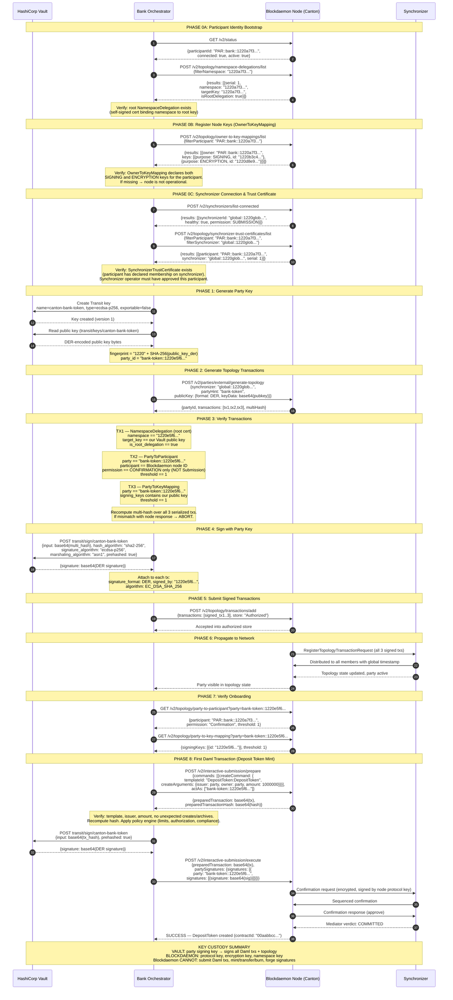

```mermaid
sequenceDiagram
    autonumber

    participant Vault as HashiCorp Vault
    participant App as Bank Orchestrator
    participant Node as Blockdaemon Node (Canton)
    participant Sync as Synchronizer

    Note over Vault,Sync: PHASE 0A: Participant Identity Bootstrap

    App->>Node: GET /v2/status
    Node-->>App: {participantId: "PAR::bank::1220a7f3...",<br/>connected: true, active: true}

    App->>Node: POST /v2/topology/namespace-delegations/list<br/>{filterNamespace: "1220a7f3..."}
    Node-->>App: {results: [{serial: 1,<br/>namespace: "1220a7f3...",<br/>targetKey: "1220a7f3...",<br/>isRootDelegation: true}]}

    Note over App: Verify: root NamespaceDelegation exists<br/>(self-signed cert binding namespace to root key)

    Note over Vault,Sync: PHASE 0B: Register Node Keys (OwnerToKeyMapping)

    App->>Node: POST /v2/topology/owner-to-key-mappings/list<br/>{filterParticipant: "PAR::bank::1220a7f3..."}
    Node-->>App: {results: [{owner: "PAR::bank::1220a7f3...",<br/>keys: [{purpose: SIGNING, id: "1220b3c4..."},<br/>{purpose: ENCRYPTION, id: "1220d8e9..."}]}]}

    Note over App: Verify: OwnerToKeyMapping declares both<br/>SIGNING and ENCRYPTION keys for the participant.<br/>If missing → node is not operational.

    Note over Vault,Sync: PHASE 0C: Synchronizer Connection & Trust Certificate

    App->>Node: POST /v2/synchronizers/list-connected
    Node-->>App: {results: [{synchronizerId: "global::1220glob...",<br/>healthy: true, permission: SUBMISSION}]}

    App->>Node: POST /v2/topology/synchronizer-trust-certificates/list<br/>{filterParticipant: "PAR::bank::1220a7f3...",<br/>filterSynchronizer: "global::1220glob..."}
    Node-->>App: {results: [{participant: "PAR::bank::1220a7f3...",<br/>synchronizer: "global::1220glob...", serial: 1}]}

    Note over App: Verify: SynchronizerTrustCertificate exists<br/>(participant has declared membership on synchronizer).<br/>Synchronizer operator must have approved this participant.

    Note over Vault,Sync: PHASE 1: Generate Party Key

    App->>Vault: Create Transit key<br/>name=canton-bank-token, type=ecdsa-p256, exportable=false
    Vault-->>App: Key created (version 1)
    App->>Vault: Read public key (transit/keys/canton-bank-token)
    Vault-->>App: DER-encoded public key bytes

    Note over App: fingerprint = "1220" + SHA-256(public_key_der)<br/>party_id = "bank-token::1220e5f6..."

    Note over Vault,Sync: PHASE 2: Generate Topology Transactions

    App->>Node: POST /v2/parties/external/generate-topology<br/>{synchronizer: "global::1220glob...",<br/>partyHint: "bank-token",<br/>publicKey: {format: DER, keyData: base64(pubkey)}}

    Node-->>App: {partyId, transactions: [tx1,tx2,tx3], multiHash}

    Note over Vault,Sync: PHASE 3: Verify Transactions

    Note over App: TX1 — NamespaceDelegation (root cert)<br/>namespace == "1220e5f6..."<br/>target_key == our Vault public key<br/>is_root_delegation == true

    Note over App: TX2 — PartyToParticipant<br/>party == "bank-token::1220e5f6..."<br/>participant == Blockdaemon node ID<br/>permission == CONFIRMATION only (NOT Submission)<br/>threshold == 1

    Note over App: TX3 — PartyToKeyMapping<br/>party == "bank-token::1220e5f6..."<br/>signing_keys contains our public key<br/>threshold == 1

    Note over App: Recompute multi-hash over all 3 serialized txs.<br/>If mismatch with node response → ABORT.

    Note over Vault,Sync: PHASE 4: Sign with Party Key

    App->>Vault: POST transit/sign/canton-bank-token<br/>{input: base64(multi_hash), hash_algorithm: "sha2-256",<br/>signature_algorithm: "ecdsa-p256",<br/>marshaling_algorithm: "asn1", prehashed: true}
    Vault-->>App: {signature: base64(DER signature)}

    Note over App: Attach to each tx:<br/>signature_format: DER, signed_by: "1220e5f6...",<br/>algorithm: EC_DSA_SHA_256

    Note over Vault,Sync: PHASE 5: Submit Signed Transactions

    App->>Node: POST /v2/topology/transactions/add<br/>{transactions: [signed_tx1..3], store: "Authorized"}
    Node-->>App: Accepted into authorized store

    Note over Vault,Sync: PHASE 6: Propagate to Network

    Node->>Sync: RegisterTopologyTransactionRequest (all 3 signed txs)
    Sync->>Node: Distributed to all members with global timestamp
    Sync-->>Node: Topology state updated, party active
    Node-->>App: Party visible in topology state

    Note over Vault,Sync: PHASE 7: Verify Onboarding

    App->>Node: GET /v2/topology/party-to-participant?party=bank-token::1220e5f6...
    Node-->>App: {participant: "PAR::bank::1220a7f3...",<br/>permission: "Confirmation", threshold: 1}

    App->>Node: GET /v2/topology/party-to-key-mapping?party=bank-token::1220e5f6...
    Node-->>App: {signingKeys: [{id: "1220e5f6..."}], threshold: 1}

    Note over Vault,Sync: PHASE 8: First Daml Transaction (Deposit Token Mint)

    App->>Node: POST /v2/interactive-submission/prepare<br/>{commands: [{createCommand: {<br/>templateId: "DepositToken:DepositToken",<br/>createArguments: {issuer: party, owner: party, amount: 1000000}}}],<br/>actAs: ["bank-token::1220e5f6..."]}

    Node-->>App: {preparedTransaction: base64(tx),<br/>preparedTransactionHash: base64(hash)}

    Note over App: Verify: template, issuer, amount, no unexpected creates/archives.<br/>Recompute hash. Apply policy engine (limits, authorization, compliance).

    App->>Vault: POST transit/sign/canton-bank-token<br/>{input: base64(tx_hash), prehashed: true}
    Vault-->>App: {signature: base64(DER signature)}

    App->>Node: POST /v2/interactive-submission/execute<br/>{preparedTransaction: base64(tx),<br/>partySignatures: {signatures: [{<br/>party: "bank-token::1220e5f6...",<br/>signatures: [{signature: base64(sig)}]}]}}

    Node->>Sync: Confirmation request (encrypted, signed by node protocol key)
    Sync->>Node: Sequenced confirmation
    Node->>Sync: Confirmation response (approve)
    Sync-->>Node: Mediator verdict: COMMITTED
    Node-->>App: SUCCESS — DepositToken created (contractId: "00aabbcc...")

    Note over Vault,Sync: KEY CUSTODY SUMMARY<br/>VAULT: party signing key → signs all Daml txs + topology<br/>BLOCKDAEMON: protocol key, encryption key, namespace key<br/>Blockdaemon CANNOT: submit Daml txs, mint/transfer/burn, forge signatures
```
