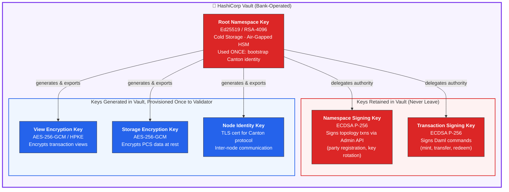
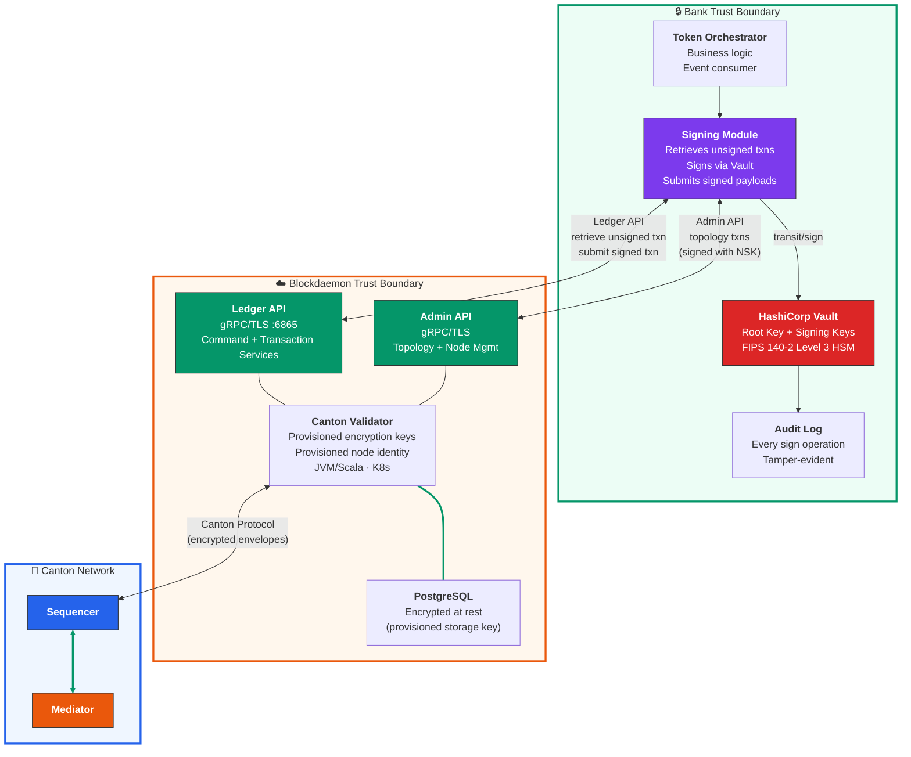
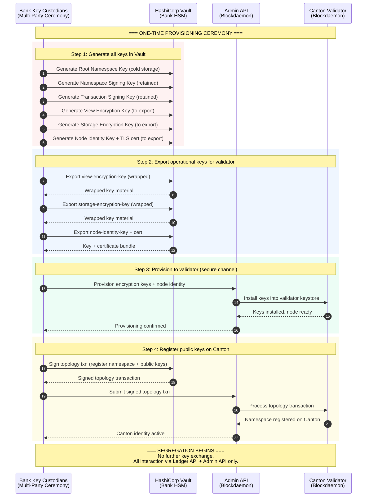
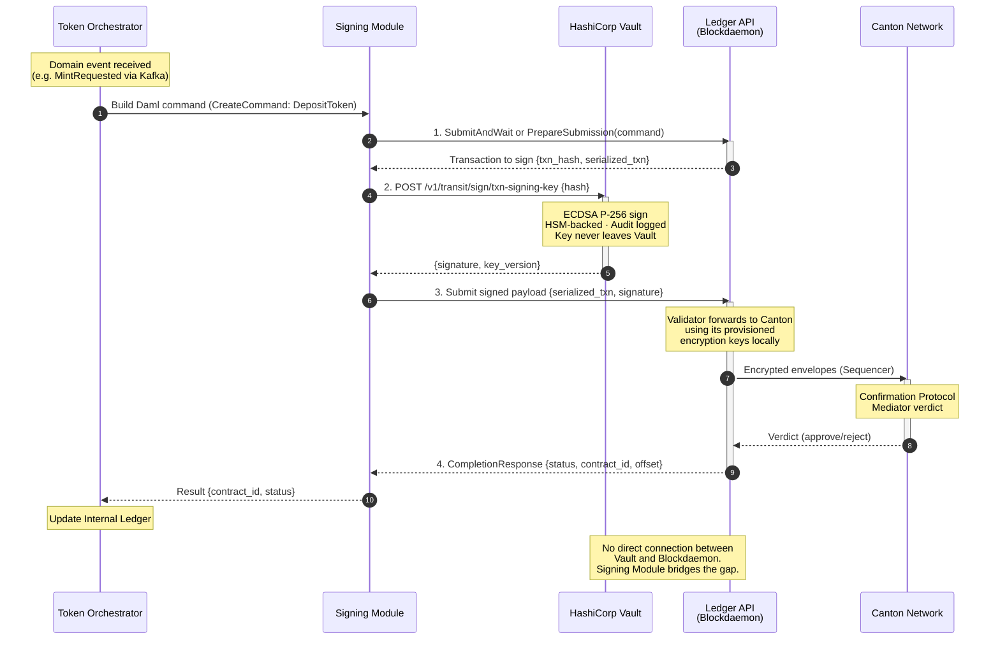
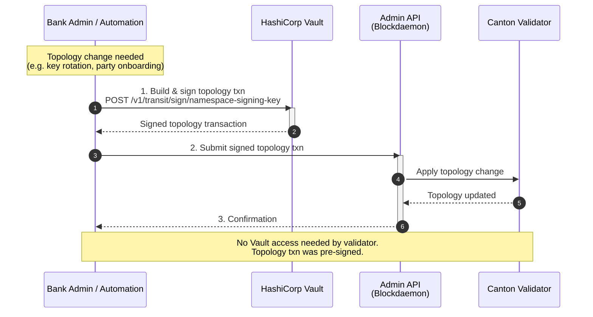
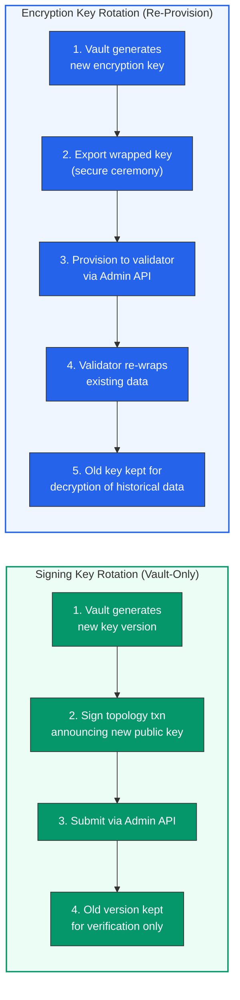
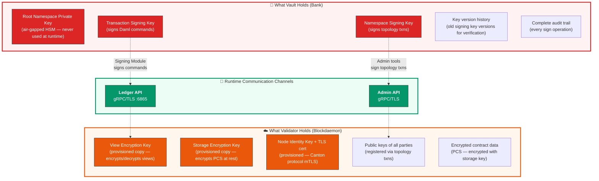
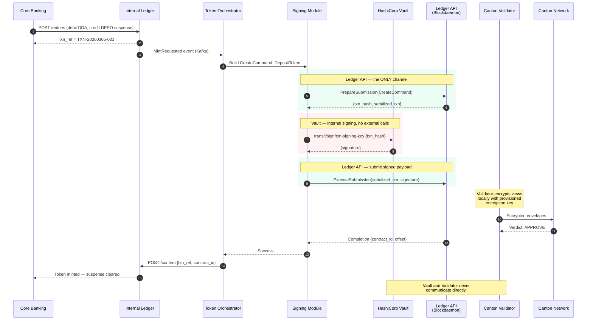

# Key Management Architecture: HashiCorp Vault & Blockdaemon

## Canton Network | Internal KMS (Vault) | Blockdaemon Node Services

**Version 2.0 | March 2026 | CONFIDENTIAL — Internal Use Only**

---

## 1. Overview

This document describes the interaction model between the bank's internal HashiCorp Vault (KMS) and Blockdaemon's managed Canton validator node. The core principle is **one-time key provisioning with full segregation**:

1. The bank holds the **root namespace key** in Vault — the apex of trust for its Canton identity
2. Operational keys (signing, encryption) are **generated in Vault and provisioned once** to the Canton validator during onboarding or key rotation
3. After provisioning, there is **zero runtime connectivity** between Vault and the Blockdaemon validator
4. All ongoing interaction between the bank and Blockdaemon is exclusively via **Ledger API** (transactions) and **Admin API** (topology & node management)
5. Transaction signing happens inside the bank's **Signing Module**, which retrieves unsigned transactions from the Ledger API, signs them locally using Vault, and submits signed payloads back through the Ledger API

---

## 2. Key Hierarchy & Ownership

### Key Ownership Matrix

| Key | Generated In | Resides In | Leaves Vault? | Purpose |
|---|---|---|---|---|
| **Root Namespace Key** | Vault (HSM) | Vault cold storage | Never | Bootstrap Canton identity; anchor of trust |
| **Namespace Signing Key** | Vault (Transit) | Vault only | Never | Sign topology txns submitted via Admin API |
| **Transaction Signing Key** | Vault (Transit) | Vault only | Never | Sign Daml commands submitted via Ledger API |
| **View Encryption Key** | Vault (Transit) | Validator (after one-time provisioning) | Once | Canton protocol view encryption/decryption |
| **Storage Encryption Key** | Vault (Transit) | Validator (after one-time provisioning) | Once | Encrypt PCS contract data at rest |
| **Node Identity Key** | Vault (PKI) | Validator (after one-time provisioning) | Once | mTLS for Canton inter-node protocol |

---

## 3. Segregation Model

After one-time key provisioning, the bank and Blockdaemon operate independently. No runtime KMS API calls. No gateway. The only channels are Ledger API and Admin API.

### Segregation Rules

| Aspect | Bank Side (Vault) | Blockdaemon Side (Validator) | Connection |
|---|---|---|---|
| **Signing Keys** | Retained forever — never exported | No access | None at runtime |
| **Encryption Keys** | Generated, then provisioned once | Holds provisioned copies | One-time transfer only |
| **Transaction Signing** | Signing Module signs locally via Vault | Receives pre-signed payloads | Ledger API |
| **Topology Changes** | Signs topology txns via Vault | Receives pre-signed topology txns | Admin API |
| **Runtime KMS Calls** | N/A | N/A | **None — fully segregated** |
| **Protocol Encryption** | N/A (delegated at provisioning) | Uses provisioned encryption keys locally | N/A |

---

## 4. One-Time Key Provisioning Ceremony

This is the only moment where key material crosses the trust boundary.

---

## 5. Transaction Signing Flow (Runtime)

After provisioning, the Signing Module is the only bank component that talks to Blockdaemon — exclusively via Ledger API. It retrieves unsigned transactions, signs them locally with Vault, and submits the signed payload back.

### Flow Summary

| Step | Direction | Channel | What Happens |
|---|---|---|---|
| **1** | Bank → Blockdaemon | Ledger API | Signing Module sends command; gets back unsigned txn hash |
| **2** | Bank Internal | Vault Transit API | Signing Module signs txn hash locally; key never leaves Vault |
| **3** | Bank → Blockdaemon | Ledger API | Signed payload submitted; validator encrypts locally with provisioned keys and forwards to Canton |
| **4** | Blockdaemon → Bank | Ledger API | Completion streamed back to Signing Module |

---

## 6. Topology Operations via Admin API

Topology changes (party registration, key rotation, delegation) are signed in Vault and submitted through the Admin API. The validator never needs to call back to Vault — it receives pre-signed topology transactions.

---

## 7. Key Rotation (Re-Provisioning)

Key rotation is the only time the one-time provisioning boundary is crossed again — and only for the encryption/node keys held by the validator. Signing keys rotate inside Vault without any interaction with Blockdaemon beyond a topology announcement.

### Rotation Policy

| Key | Rotation | Method | Crosses Boundary? |
|---|---|---|---|
| **Root Namespace Key** | Never (unless compromised) | Manual Shamir ceremony | No |
| **Namespace Signing Key** | 90 days | Vault auto-rotate → topology txn via Admin API | No (only public key announced) |
| **Transaction Signing Key** | 30 days | Vault auto-rotate → topology txn via Admin API | No (only public key announced) |
| **View Encryption Key** | 90 days | Vault generate → secure export → re-provision via Admin API | Yes (re-provisioning) |
| **Storage Encryption Key** | 180 days | Vault generate → secure export → re-provision via Admin API | Yes (re-provisioning) |
| **Node Identity Key** | Annual | Vault PKI → re-provision via Admin API | Yes (re-provisioning) |

---

## 8. What Each Side Holds at Runtime

---

## 9. End-to-End: Mint Token

Complete flow showing how the segregated model works in practice.

---

## 10. Communication Matrix

Summary of all runtime connections in the segregated model.

| From | To | Channel | Purpose | Frequency |
|---|---|---|---|---|
| Signing Module | Ledger API (BD) | gRPC/TLS | Submit commands, receive completions | Every transaction |
| Bank Admin | Admin API (BD) | gRPC/TLS | Topology txns, node config, key rotation announcements | Infrequent |
| Signing Module | Vault | HTTPS (internal) | Sign txn hashes | Every transaction |
| Bank Admin | Vault | HTTPS (internal) | Sign topology txns, generate keys | Infrequent |
| Validator | Canton Sequencer | Canton Protocol (gRPC) | Encrypted envelopes, consensus | Every transaction |
| **Validator** | **Vault** | **None** | **No runtime connectivity** | **Never** |

The last row is the defining characteristic of this architecture: **after provisioning, the validator operates autonomously with its provisioned keys and never calls back to Vault**.
