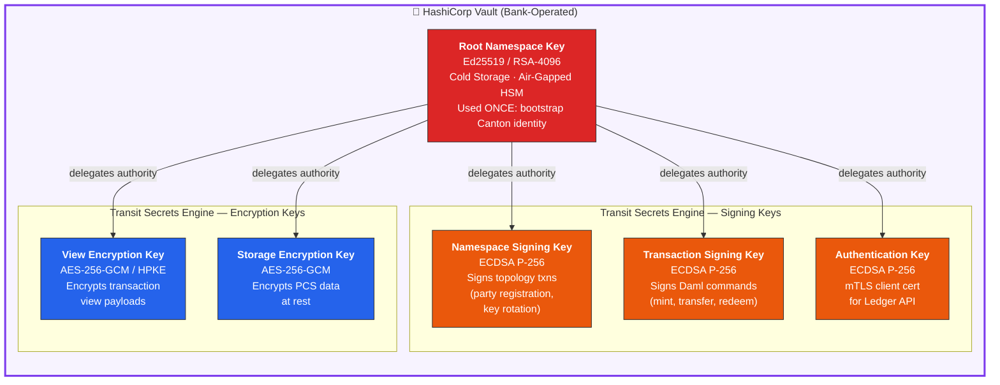
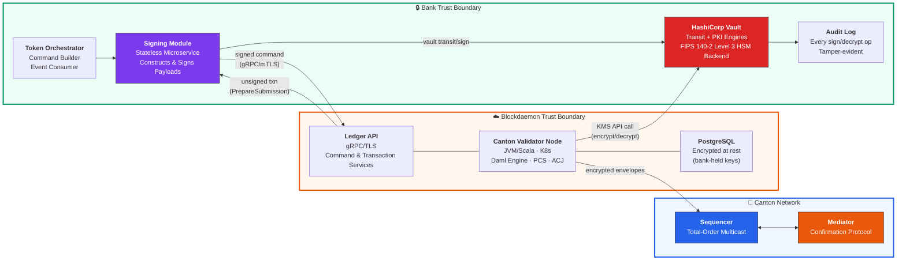
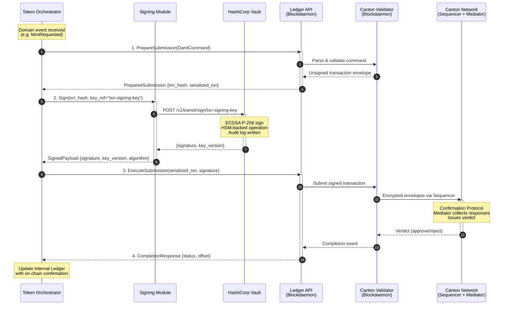
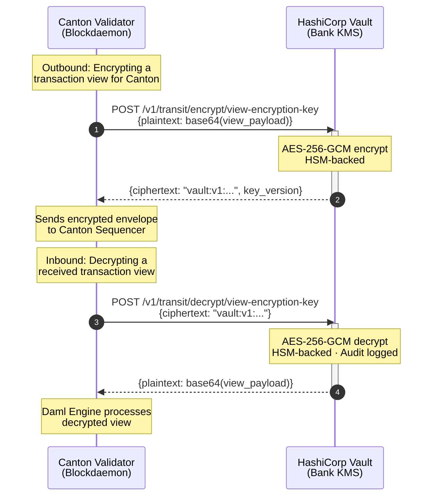
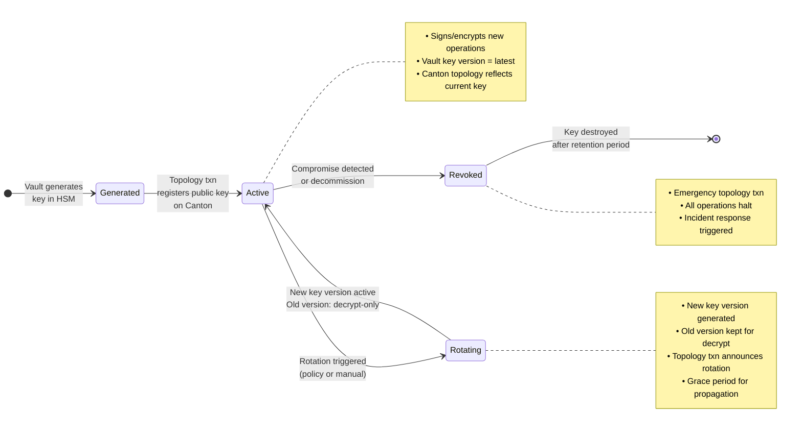
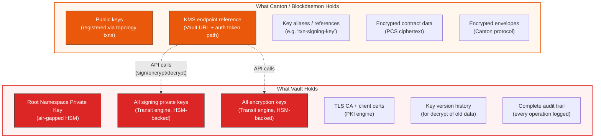
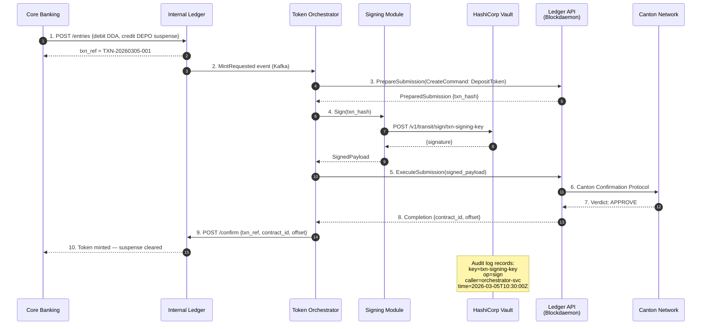
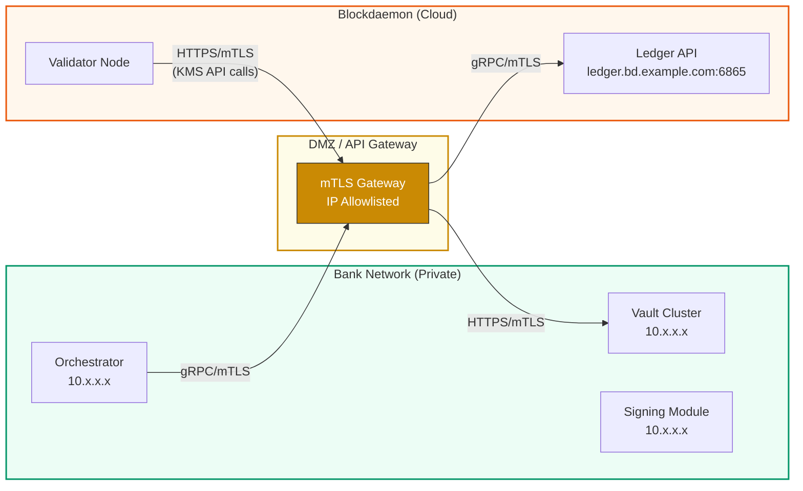

# Key Management Architecture: HashiCorp Vault & Blockdaemon

## Canton Network | Internal KMS (Vault) | Blockdaemon Node Services

**Version 1.0 | March 2026 | CONFIDENTIAL — Internal Use Only**

---

## 1. Overview

This document describes the interaction model between the bank's internal HashiCorp Vault (KMS) and Blockdaemon's Canton validator node infrastructure. The core principle is **key sovereignty**: the bank holds the root namespace key and all cryptographic material in Vault, while Canton (via Blockdaemon) holds only the operational references needed to invoke the Vault signing API. All transaction signing occurs internally — no private key material ever leaves the bank's trust boundary.

---

## 2. Key Hierarchy

The bank maintains a hierarchical key structure within Vault. The root namespace key is the apex of trust; all subordinate keys derive their authority from it.

### Key Roles

| Key | Purpose | Stored In | Used By | Rotation |
|---|---|---|---|---|
| **Root Namespace Key** | Bootstrap Canton identity; anchor of trust for the bank's namespace | Air-gapped HSM via Vault | Used once at onboarding, then cold storage | Manual ceremony (multi-custodian Shamir) |
| **Namespace Signing Key** | Sign topology transactions (party registration, key rotation, delegation) | Vault Transit Engine | Token Orchestrator | Automated (90-day), announced via topology txn |
| **Transaction Signing Key** | Sign Daml commands submitted to Ledger API | Vault Transit Engine | Token Orchestrator / Signing Module | Automated (30-day) |
| **Authentication Key** | mTLS client certificate for gRPC connection to Blockdaemon Ledger API | Vault PKI Engine | Token Orchestrator | Automated (24h short-lived certs) |
| **View Encryption Key** | Encrypt/decrypt Canton transaction views (privacy envelopes) | Vault Transit Engine | Blockdaemon Validator (via KMS API) | Automated (90-day) |
| **Storage Encryption Key** | Encrypt PCS contract data at rest in PostgreSQL | Vault Transit Engine | Blockdaemon Validator (via KMS API) | Automated (180-day) |

---

## 3. Trust Boundary Model

### What Each Boundary Controls

| Aspect | Bank Controls | Blockdaemon Controls | Canton Network |
|---|---|---|---|
| **Private Key Material** | All keys — Vault only | None — zero access | None |
| **Signing Operations** | Every sign op goes through Vault | Requests signing via KMS API | N/A |
| **Decryption** | All decrypt via Vault Transit | Requests decrypt via KMS API | N/A |
| **Validator Compute** | Defines config, monitors SLA | Operates JVM, K8s, PostgreSQL | N/A |
| **Consensus** | Participates via validator | Hosts the infrastructure | Sequencer + Mediator |
| **Contract Data** | Encrypted with bank keys | Stores ciphertext only | Sees encrypted envelopes only |

---

## 4. Transaction Signing Flow

This is the core interaction: a transaction is retrieved from the Blockdaemon node via Ledger API, signed internally using the Vault-backed Signing Module, and submitted back through Ledger API with the signed payload.

### Flow Summary

| Step | Action | Where | Detail |
|---|---|---|---|
| **1** | PrepareSubmission | Bank → Blockdaemon | Orchestrator sends Daml command; Ledger API returns unsigned txn hash |
| **2** | Sign | Bank Internal | Signing Module calls Vault Transit API; HSM signs txn hash with ECDSA P-256 |
| **3** | ExecuteSubmission | Bank → Blockdaemon | Signed payload submitted; validator forwards to Canton sequencer |
| **4** | Completion | Blockdaemon → Bank | Validator receives verdict; Ledger API streams completion to orchestrator |

---

## 5. Vault-to-Validator Crypto Operations

The Blockdaemon validator node must perform encryption/decryption for Canton protocol operations (view encryption, storage encryption). It does this by calling the bank's Vault API — it never holds key material.

---

## 6. Key Lifecycle Management

### Rotation Policy

| Key | Rotation Frequency | Method | Canton Impact |
|---|---|---|---|
| Root Namespace Key | Never (unless compromised) | Manual Shamir ceremony | Full re-onboarding required |
| Namespace Signing Key | 90 days | Vault auto-rotate + topology txn | Announced; grace period applies |
| Transaction Signing Key | 30 days | Vault auto-rotate + topology txn | Seamless; old version kept for verification |
| Authentication Key (mTLS) | 24 hours | Vault PKI auto-issue | Transparent; short-lived certs |
| View Encryption Key | 90 days | Vault auto-rotate | Old version kept for decryption of historical views |
| Storage Encryption Key | 180 days | Vault auto-rotate + re-wrap | Online re-encryption of PCS data |

---

## 7. What Canton (Blockdaemon) Holds vs. What Vault Holds

---

## 8. End-to-End: Mint Token with External Signing

Bringing it all together — a concrete example of minting a deposit token using the Vault-Blockdaemon architecture.

---

## 9. Network Connectivity

All traffic flows through an mTLS-terminating API gateway in the DMZ. The Vault cluster is never directly exposed to the internet. Blockdaemon's validator reaches Vault only through the gateway, and only for specific Transit API paths (`/v1/transit/sign/*`, `/v1/transit/encrypt/*`, `/v1/transit/decrypt/*`).
